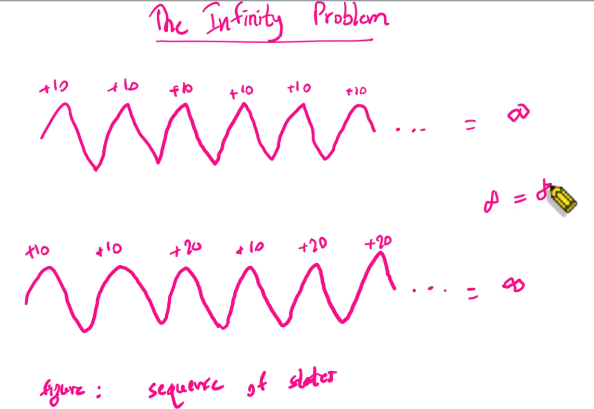

### psa summarized
- #### MDP ( Markov Decision Process )
    - python rl framework
    - model တွေက decision ချနိုင်ဖို့
        - partially random
        - partially control by agen
    - discrete time မှာ အလုပ်လုပ်, state, action , new_state, reward
    - markov properties --> future သည် history ကို မမှီခိုပဲနဲ့ current state နဲ့ သူ့ကြောင့်ဖြစ်တဲ့ action ကို ပဲ မှီခိုတယ်။
    - uncetrain environment မှာ plan ချဖို့ markov properties ရဲ့ အကူအညီနဲ့သွားမယ်။
    - finite MDP ( limited လုပ်ထားတဲ့ state နဲ့ action )
    - MDP ရဲ့ အရေးကြီး Components ၄ ခု 
        - 1.  S = state
        - 2.  A(S) = action , set of Actions
        - 3.  T = transition function model ( s, a , s' )
        s' ဆိုတာက လက်ရှိ state s ကို action တစ်ခုလုပ်လိုက်လို့ နောက်ထပ်ရလာတဲ့ probability of state ပါ။ 
        T ( s, a ,s' ) = P ( s' | s, a )
        - 4.  Reward function, 
                - state ကြောင့်ဖြစ်လာတဲ့ Reward = R(s), 
                - state နဲ့ action ကြောင့်ဖြစ်တဲ့ Reward = R(s,a), 
                - နောက်တော့ state, action, ရလာတဲ့ state ပါဝင်တဲ့ Reward = R(s,a,s')
    - positive reward, negative reward ပေးပြီး cumulative ဖြစ်လာမယ်။

- #### MDP ( S, T, A, R )
    - သူက environment တစ်ခုမှာ decision making လုပ်တဲ့ နည်းလမ်းတစ်ခုပဲ
    - သူ့မှာ Sequence ( အကျိုးဆက် ဖြစ်မယ်။ )
    - Stochastic ( Probability ရှိမယ်။ )
    - Goal Driven ဖြစ်မယ်။ ( reward တွေကြောင့် )
    - နောက် အပိုင်း ၄ ခုမှာ ပထမဆုံးကတော့ State , s ပေါ့။ ဥပမာ 4x5 grid world မှာ ဆို state 12 ခုရှိတယ်။ 
    - နောက် Action, A(s)
    - တတိယတခုက Transition , သူ့ကို Model လို့လဲခေါ်တယ်။ Transition Model ပေါ့။ T (s,a,s') = P(s'|a,s)
    - Reward Function , R(s), R(s,a), R(s,a,s')

- #### Policy
    - State ကနေပြီးတော့ action တစ်ခုကို သုံးရမယ်ဆိုရင် agent ကို ဘာလုပ်မလဲဆိုပြီးခိုင်းတာနဲ့ အတူတူပါပဲ။
    - တနည်းအားဖြင့် state ကနေ အကောင်းဆုံး Action တစ်ခုကို mapping လုပ်ပေးတာပဲ။ ( Structure )
    - MTP Policy ရဲ့ Goal သည် final state ကို ရောက်ရုံတင်မဟုတ်ပဲ Maximum Reward Long term ရဖို့ဖြစ်တယ်။ ( Goal )
    - နောက်သူ့ရဲ့ Environment သည် Stochastic ဖြစ်ပြီး probability တွေပဲဖြစ်တယ်။ ( Environment )
    - သူ့ရဲ့ Behavior ကတော့ state by state ( Auto ) သွားတာဖြစ်ပါတယ်။ ( Behavior )

- #### MDP Policy Breakdown
    - Uncertainty in outcomes, actions တွေက Probability တွေလေ၊ ဒါကြောင့် outcome မှာ မသေချာမှုရှိတာပေါ့။ 
    - sequence of actions မှာလဲ အဲ့လို မသေချာမှုရှိနိုင်တယ်။
    - ဒီ model သည် One Step Decision Model ဖြစ်ပါတယ်။ ( current state ပေါ်မူတည်ပြီး action ကို တွက်တာ )
    - Memory Less ( Markov Properties ) history အားလုံးကို လိုက်ကြည့်မနေဘဲ current state ကို ရောက်နေချိန်မှာ best actions ကို ဒီမှာပဲလုပ်မှာ။ လက်ရှိဘာလုပ်ရမလဲဆိုတာပဲ အာရုံစိုက်။ stochastic outcome မို့လို fixed plan လိုမဟုတ်ဘဲ policy နဲ့ပဲထိန်းတယ်။ မှားခဲ့ရင်လည်း current ရောက်နေတဲ့ နေရာကပဲဆက်တွက်ပြီး goal ကို ဆက်သွားတယ်။

- #### MDP Rewards
    - Immediate Rewards vs Delayed Rewards
    - Agent က Action ကို ချက်ချင်း change လုပ်လိုက်တာကြောင့် Immediate rewards ရသွားတယ်။ s' ရောက်သွားတယ်ပေါ့။ တကယ့် real world မှာ agent ရဲ့ လက်ရှိ လုပ်ဆောင်ချက်ဟာ မှန်နေတယ်/မှားနေတယ် ပြောလို့မရဘူး။ နောက်ပိုင်းမှာ ကြည့်ပြီး သိသာနိုင်တာပါ။
    - Agent သည် Delayed feedback ကနေ learning လုပ်ရမှာဖြစ်ပါတယ်၊
    - Temporal Credit Assignment ( value function, policy gradient, exp replay )

- #### Living Rewards vs Terminal Rewards
    - Living Rewards -> robot က stage 1 start နေရာကနေ stage 2 ကို သွားဖို့ reward = +2 ပေးလိုက်မယ်။ အဲ့ပမာဏ က များတယ်။ goal ရောက်တဲ့အချိန်မှာ reward = 1 ပဲရှိတာကိုး။ ဒါပေမဲ့လဲ reward များချင်တဲ့အတွက်ပေးလိုက်ရတာ။ အဲ့တော့ goal ( reward = 1 ), fail ( reward = -1 ) နေရာတွေကို ရှောင်သွားနိုင်တဲ့ case ရှိလာနိုင်တယ်။ ဒါကို Counter Intuitive Reset လို့ခေါ်တယ်။ reward က တိုးပြီးရင်းတိုးလာတာမို့လို့ goal ကျတော့် +1 ဆိုတော့ နည်းနေတယ် ဆိုတော့ မသွားချင်ဘူးပေါ့။ ဥပမာ first row, third column နေရာမှာဆိုရင် (3,3) ဖြစ်တယ်ဆိုတော့ goal နေရာ reward =1 ကို မသွားချင်ဘဲ reward = 3 နေရာကိုဘဲ သွားချင်နေမှာပေါ့။ အဲ့လိုပဲ second row, third column မှာဆိုလည်း နံရံကိုတိုက် ညာပြန်ရွှေ့ပြီး +2 reward ကို ထပ်ယူပြီး  အပေါ်ဘဲတက်ချင်နေမှာပဲ။ 
    - သဘောက agent သည် game ကို ပြီးအောင် မကစားဘဲ အမှတ်တွေပဲ ပတ်ယူနေသလို ဖြစ်နေနိုင်တယ်။ ဒါက Positive Living Rewards ပေါ့။
    - နောက်ထပ် အမြင်တခုက Negative Positive Rewards ဆက်တိုက် ရနေမယ်ဆို agent  ဟာ game ကို အမြန်ဆုံးပြီးအောင် ကစားပါလိမ့်မယ်။
    - Grid world  R(s) = +2
    - +2 ဆိုတော့ game ကို အဆုံးသတ်ရောက်အောင် မကစားတော့ပဲ reward တွေပဲပါတ်ယူနေမဲ့သဘောပေါ့။ 
    - Terminal Rewards ကတော့ goal နဲ့ success နေရာကကောင်တွေပါ။

- #### Large Negative Living Rewards
    - Grid world  R(s) = -2 or -0.04
    - agent ဟာ thrird row, forth column ရောက်နေပြီဆိုရင် နေရာတော်တော်များများကို explore လုပ်ပြီးသားလို့ပြောလို့ရတယ်။ အဲ့တော့ goal ကို ပြန်သွားဖို့ explore လုပ်ပြီးသားနေရာ ၃ ခုကို ဖြတ်သွားရမယ်။ အဲ့တော့ explore လုပ်ပြီးသားနေရာမို့ Large Negative Living Rewards ပေးရင် -2 x3 = -6 ရမယ်။ နောက်တော့ success မှာ reward = 1 ရမယ်ဆိုတော့ total -5 ရပါမယ်။
    - အဲ့လို မသွားဘဲ fail နေရာက ဖြတ်သွားမယ်ဆိုရင် -2 တခါရမယ်။ fail အတွက် -1 ရမယ်။ ပြီးရင် success အတွက် +1 ရမယ်။ total -2 ဖြစ်တယ်။ ဆိုတော့ agent က ဘာကို နားလည်သွားနိုင်လည်းဆိုတော့ failure is better than success! လိုထင်သွားလိမ်းမယ်။ ဒါသည် Large Negative Living Rewards ကြောင့် အမှားကို လက်ခံသွားတဲ့ သဘောပါ။ 
    - ဆိုတော့ Good Outcome ရဖို့ negative ရတာကို don't care လုပ်ပြီးသွားနိုင်တဲ့သဘောမျိုးပေါ့။
    - အဲ့လို မဟုတ်ဘဲ Small Negative Living Rewards = -0.04 ဆိုရင်ရော Large Positive ,Large Negative လိုမဟုတ်ပဲနဲ့ Optimize အဖြစ်ဆုံးအနေအထားကို ရမှာဖြစ်ပါတယ်။
    - ဒီသဘောတရားက Deep Learning ထဲက too positive ( overfit ), too negative ( underfit ), just right အနေအထားမျိုးနဲ့တူပါတယ်။
    - ဒါကြောင့် RL မှာ Reward ကို Design လုပ်တာက အတော်လေးကို အရေးကြီးပါတယ်။

- #### Optimal Policy
    - Grid world  R(s) = -0.04
    - reward တွေကို maximize လုပ်မယ်ဆိုတဲ့ strategy
    - E ( $r_t$ | $\pi$, $s_t$) ၊ ဒီနေရာမှာ $r_t$ ဆိုတာက လက်ရှိ state မှာရှိတဲ့ reward, $\pi$ က policy pi, $s_t$ က  state of current time step ပါ။ policy pi ကို သုံးပြီး အမြင့်ဆုံး current reward ရနိုင်မလဲလို့ ဆိုလိုတာပါ။ 
    - Optimal Polizy မှာ Infinite Horizon နဲ့ Finite Horizon နှစ်မျိုးရှိတယ်။ Infinite Horizon က Grid world example နဲ့ဆိုရင် ( Goal, Failure )Terminal state ကို Agent ရောက်သွားရင် ပြီးသွားတာပေါ့။  အဲ့တော့ Goal မဝင်သေးဘဲနဲ့ long term Optimal Strategy နဲ့ forever loop ပါတ်နေပြီး +2 reward တွေကို ယူနေလို့ရတယ်။ ( unlimited time , No Time Pressure)
    - Finite Horizon မှာကျတော့ Time Pressure ရှိမယ်။ သူက decision တွေကို အပြောင်းအလဲ ရှိပါတယ်။ chance က ကန့်သတ်ထားတဲ့ ရွေးချယ်စရာတွေရှိနေလိမ့်မယ်။ ( Time Pressure )

- #### Infinite vs Finite Policies
    - Infinite Policy အေးဆေးလုပ်။ conservative ဖြစ် ၊ safety 
    - Finite Policy အမြန်လုပ်ရမယ်။ aggresive ဖြစ် ၊ high risk ဖြစ်ပြီး high reward ဖြစ်တဲ့ strategy ကို ပိုပြီး သုံးလာမယ်ပေါ့။
    - Non Stationary Policy vs Stationary
    - Finite Policy မှာဆိုရင် Non Stationary Policy တစ်ခုရှိမယ်ဆိုရင် ဥပမာ step 100 ထားထားမယ်ဆိုရင် grid wrold က 4x3 ဆိုတော့ အေးအေးဆေးဆေး learning လုပ်လို့ရတယ်။ Infinite နဲ့ အတူတူဖြစ်တယ်လို့ ပြောလို့တောင်ရတယ်ပေါ့။ 2 or 3 ဆိုရင်တော့ အတော် ကန့်သတ်ထားလိုက်သလိုဖြစ်တော့ time constraint ဖြစ်လွန်းတာပေါ့။ 
    - Infinite မှာ ဆိုရင် policy ဟာ current state မှာ depend ဖြစ်နေတယ်။ $\pi$(s) = a ( ဒါကို stationary policy လို့ခေါ်တယ်။ )
    - Finite မှာ ဆိုရင် policy က $\pi$(s, t) = a ဖြစ်ပါတယ်။ ဒါကို non stationary policy လို့ခေါ်တယ်။ 
    - ဒါကို ပဲ Markov မှာ ကျတော်တို့ ရဲ့ Current state က ပဲ အရေးပါတယ်။ History က အရေးမပါဘူးလို့ ယူဆတာဖြစ်ပါတယ်။ 
    - Infinite case တွေက ( stationary case ) တွေက Mathematics အရ ပိုလွယ်တာပေါ့။

- #### Stationary Preferences
    - Stationary တွေက time မပါ။ Non Stationary တွေက time ပါတယ်။
    - Sequence A ရှိတယ်ဆိုပါစို့။ U($s_0$ --> $s_1$  --> $s_2$  --> $s_3$  --> $s_4$, ... )
    - Sequence B က  U($s_0$ --> $s_1$' --> $s_2$' --> $s_3$' --> $s_4$', ... )
    - Stationary Preference အနေနဲ့ Sequence A ကို ဦးစားပေးလိုက်မယ်ဆိုရင် Seq A > Seq B ပေါ့။ ပထမအကြိမ်မှာ Sequence A ကို ဦးစားပေးလိုက်တာပေါ့။ 
    - နောက်တကြိမ်လဲ ထပ်ပြီးတော့ Sequence A ကို ပဲ ရွေးအုံးမယ်ဆိုရင် ဒါကို Stationary Preference လို့ခေါ်ပါတယ်။ 
    - Infinite Horizon မှာ Stationary Preference ( Policy ) အနေနဲ့ policies တွေက tracking time pressure မရှိတဲ့ အတွက် ရိုးရိုးရှင်းရှင်းပဲသွားတယ်။ အမြဲတမ်းလည်း consistant ဖြစ်တယ်။ Math အရလည်း လွယ်တယ်။ Learning Algorithm တွေက ပိုပြီးတော့ stable ဖြစ်တယ်။ 
    - ဆန့်ကျင်ဘက်တွေးကြမယ်ဆိုရင်
    - Finite Horizon မှာကျတော့ policies တွေက time pressure လုပ်တာခံရပြီ။ same sitution ဖြစ်ပေမဲ့ မတူညီတဲ့ decision တွေ ရလာနိုင်ပါတယ်။ goal ကို ရောက်ဖို့ အရေးကြီးတာကိုး။ ဒါကြောင့် Mathematics အရလည်း ရှုပ်ထွေးပါတယ်။ 
    - Infinte မှာကျတော့ state တစ်ခုကိုပဲ focus လုပ်နေနိုင်ပေမဲ့ Finite မှာကျတော့ state and time limitation ရှိတယ်။ 
    - ဒါကြောင့် Infinite Horizon သည် Math အရ Analyzis လုပ်ဖို့ လွယ်ကူပြီး consistant decision making တွေကို ပေးနိုင်တယ်။
    - Finite Horizon ကျတော့ Time Pressure Dynamics ကို ဖန်တီးပြီးတော့ ကျတော်တို့ရဲ့ optimal behaviour တွေကို အလိုက်ပြောင်းစေနိုင်ပါတယ်။ dead line ကြောင့် မှားတာမျိုးလည်းရှိနိုင်တာပေါ့။ 

- #### Discount Factor
    - 
    - ပုံမှဆိုရင်တော့ sequence နှစ်ခုဟာ ဘယ်ဟာပိုကောင်းလဲဆိုရင် နှစ်ခုလုံး reward တိုးတာမို့ကောင်းပါတယ်။ ဒါပေမဲ့ infinity ထိ ဆိုတော့ အဓိတ်ပါယ်မရှိဘူးလေ။ ဆိုတော့ Discounting လုပ်ရမယ်။ 
    - Discounting factor garma သည် $0 < \gamma < 1$ ဖြစ်ပါတယ်။
    - ဆိုတော့ ပထမ Discount return equation က $$U(s_0, s_1, s_2, s_3, \dots) = \sum_{t=0}^{\infty} \gamma^t R(s_t), \quad 0 < \gamma < 1$$  ဖြစ်ပါတယ်။ ဆိုလိုတာက garma 0.9 ဆိုရင် current step သည် နောက်လာမည့် step ရဲ့ 90% လောက်ရှိနေမယ်လို့ဆိုလိုပါတယ်။ ပုံထဲက နောက် အောက်က Sequence အတွက် equation က $$U(s_0, s_1, s_2, s_3, \dots) = \sum_{t=0}^{\infty} \gamma^t R_{max}, \quad 0 < \gamma < 1$$ နောက်သူ့ရဲ့ equation တွေက $$\sum \gamma^t = \frac{1}{(1-\gamma)}, \quad U \le \frac{R_{\text{max}}}{1-\gamma}$$ ဖြစ်ပါတယ်။

- #### Discounted Rewards
    - Agent ဟာ environment မှာ သွားနေတော့ reward ရမယ်။ good decision ရဖို့ reward ကို maximize လုပ်ရမယ်ပေါ့။ အဲ့လိုဆိုပေမဲ့ future reward တွေ အကုန်လုံးက အတူတူပဲလို့တော့ ယူဆလို့မရဘူး။ အဲ့တော့ $\gamma$ factor ကို မိတ်ဆက်ခဲ့တယ်။ discount လုပ်ပေးမည့် factor ပေါ့။ 
    - အဲ့တော့ Total reward = $R_1 + R_2 + R_3 + ... $ ဖြစ်ပါတယ်။
    - အဲ့ကနေ Total reward = $R_1 + \gamma R_2 + \gamma R_3 + ... $ ဆိုတော့ gamma တန်ဖိုးအရ % တစ်ခုလောက် ဆုံးရှုံးမှာဖြစ်ပါတယ်။ ဒါသည် Discounting ဆိုတာပါပဲ။ 
    - ဒီနေရာမှာ infinite series --> game ( forever loop ) --> sum of rewards ဖြစ်ပါတယ်။ gamma တန်ဖိုးသည် 0 နဲ့ 1 ကြားရှိပြီး Geometric Series မို့လို့ $$R_{\text{max}} + \gamma R_{\text{max}} + \gamma^2 R_{\text{max}} + \dots = \frac{R_{\text{max}}}{1-\gamma}, \quad 0 \le \gamma < 1$$ ဖြစ်ပါတယ်။ 
    - ဒီမှာဆို နောက်ပိုင်း reward တွေက လျော့လျော့သွားမှာဆိုတော့ Agent သည် သူနဲ့အနီးဆုံးသော $R_{\text{max}}$ ကို ပဲ အာရုံစိုက်မှာဖြစ်ပြီး ကျန်တာကတော့ အနည်းငယ်ပဲဖြစ်ပါလိမ့်မယ်။
    - ပြန်ချုပ်ရရင် Infinite reward တွေရနိုင်တဲ့ အနေအထားမျိုးမှာ Disconuted Rewards ကို သုံးတယ်ဆိုတာပါပဲ။
