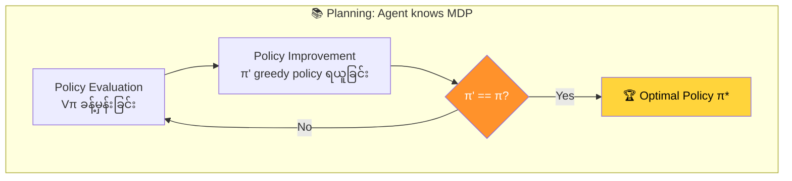
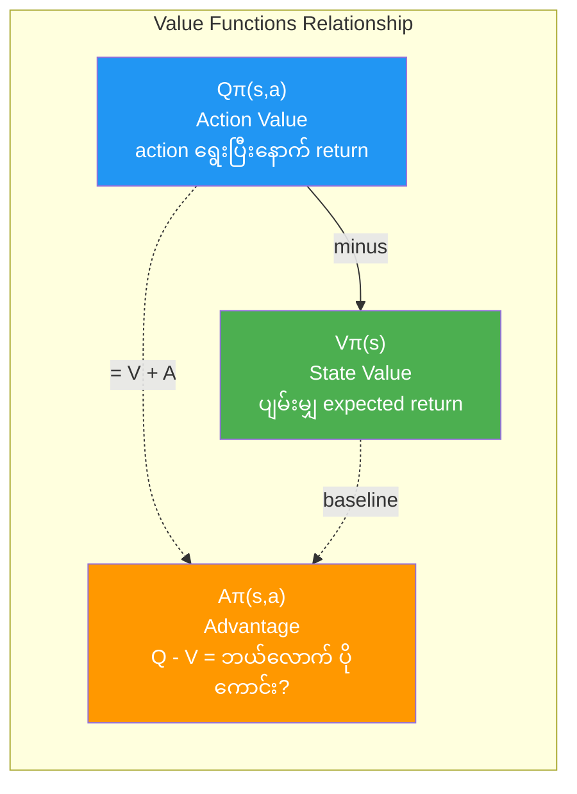
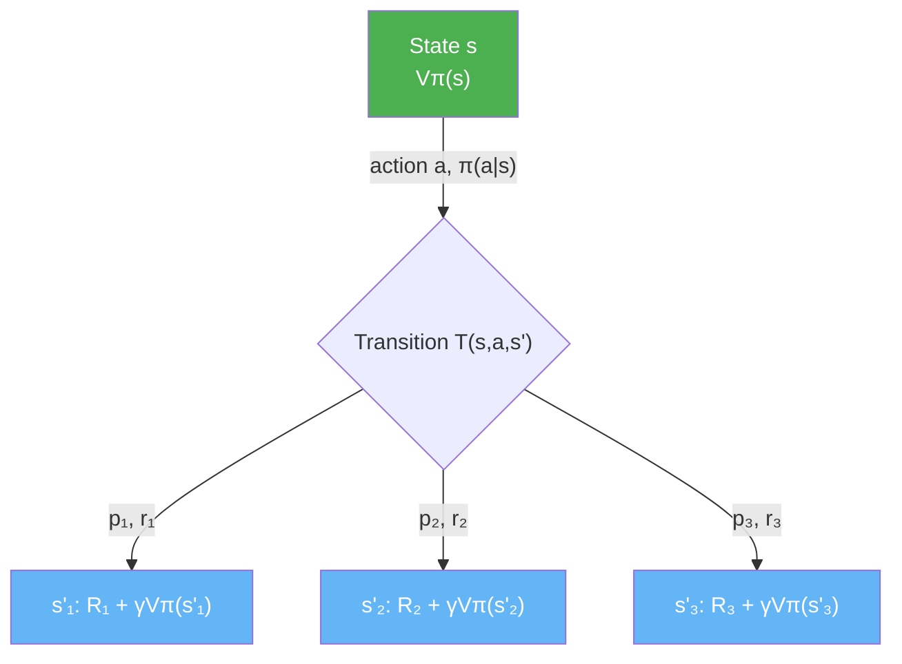
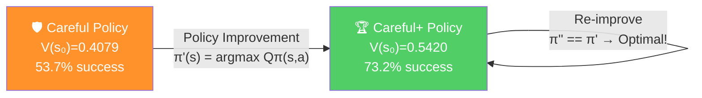
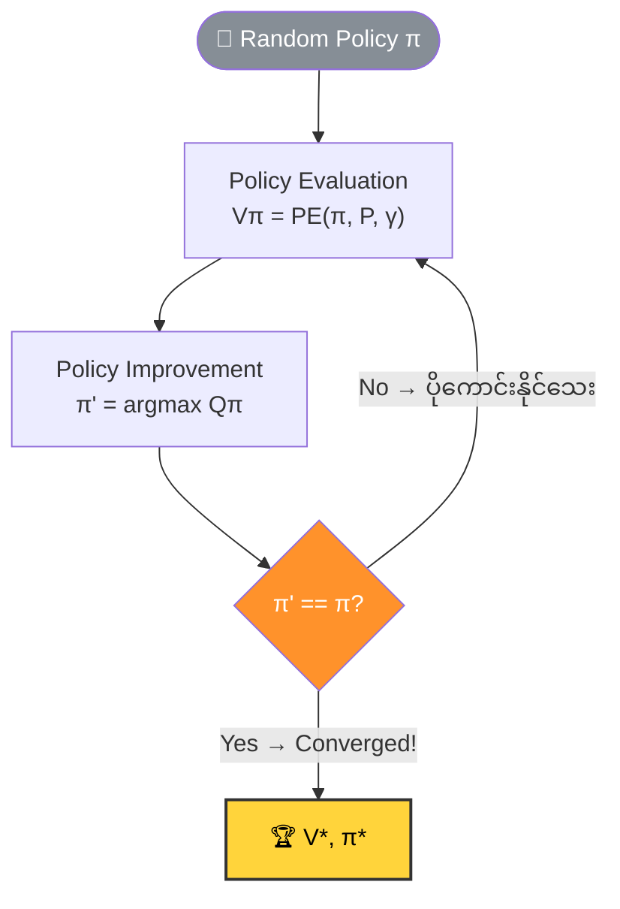
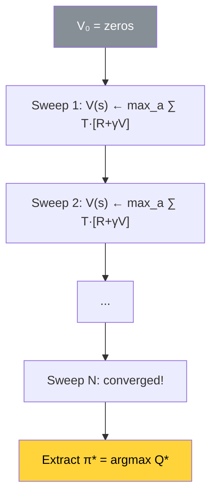
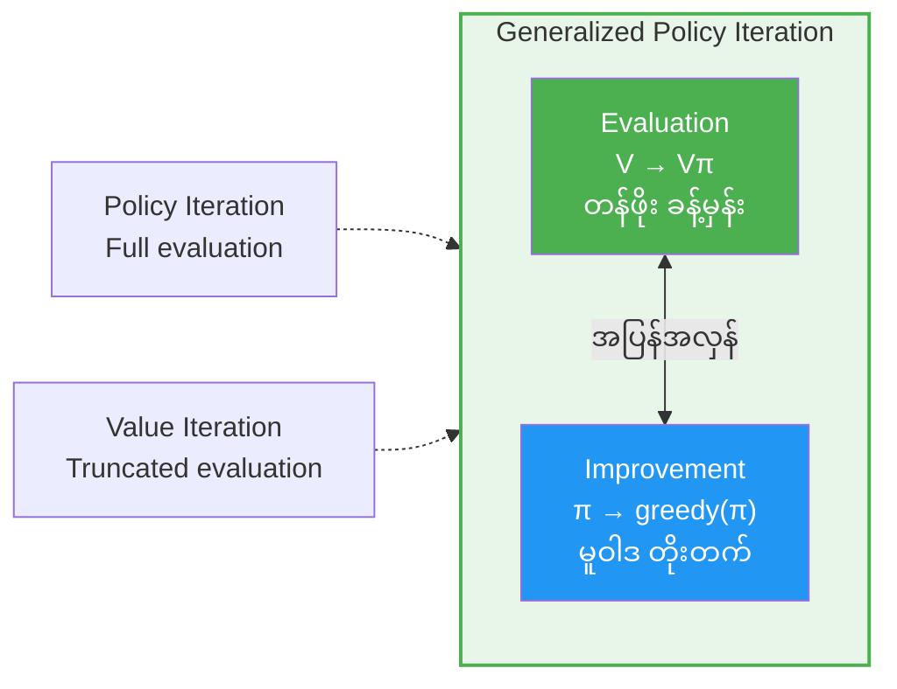
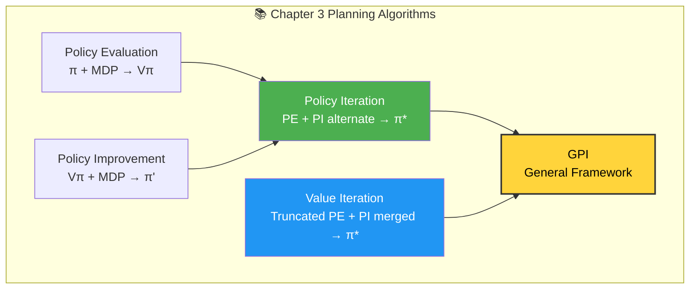

# Chapter 3: Balancing Immediate and Long-Term Goals - အကျဉ်းချုပ်

## 1. Chapter ရဲ့ ရည်ရွယ်ချက်

ဒီ Chapter မှာ **sequential feedback** ရဲ့ challenges ကို isolation ထဲမှာ လေ့လာပါတယ်။ Agent က MDP ရဲ့ dynamics (transition function, reward function) ကို **သိ**ထားပြီး optimal policy ကို ရှာဖွေပါတယ်။ ဒါကို **planning** လို့ ခေါ်ပါတယ်။



အဓိက algorithms (၃) ခု:
1. **Policy Evaluation** — Policy တစ်ခုရဲ့ value function ကို ခန့်မှန်းခြင်း
2. **Policy Iteration (PI)** — Policy evaluation + policy improvement ကို alternate လုပ်ပြီး optimal policy ရှာခြင်း
3. **Value Iteration (VI)** — Truncated policy evaluation + improvement ကို merge လုပ်ပြီး optimal policy ရှာခြင်း

---

## 2. Return (ပြန်ရတဲ့ စုစုပေါင်း Reward)

### Return ၏ အဓိပ္ပာယ်

Return $G_t$ ဆိုတာ time step $t$ ကနေ episode ပြီးဆုံးတဲ့အထိ ရတဲ့ (discounted) rewards ပေါင်းလဒ်ဖြစ်ပါတယ်:

$$G_t = R_{t+1} + \gamma R_{t+2} + \gamma^2 R_{t+3} + \cdots = \sum_{k=0}^{\infty} \gamma^k R_{t+k+1}$$

### Recursive Definition

$$G_t = R_{t+1} + \gamma G_{t+1}$$

ဒီ recursive form ဟာ RL algorithms အတော်များများရဲ့ အခြေခံဖြစ်ပါတယ်။

---

## 3. Policy (မူဝါဒ)

### Policy ဆိုတာဘာလဲ

Policy $\pi$ ဆိုတာ agent ရဲ့ behavior plan ဖြစ်ပါတယ်။ State တစ်ခုချင်းစီအတွက် ဘယ် action ယူရမလဲ ဆိုတာကို ညွှန်ပြပါတယ်။

| Policy အမျိုးအစား | ဖော်ပြချက် | Formula |
|---|---|---|
| **Deterministic** | State တစ်ခုချင်းအတွက် action တစ်ခုတည်း | $\pi(s) = a$ |
| **Stochastic** | State တစ်ခုချင်းအတွက် action probability distribution | $\pi(a|s) = P(a_t = a | s_t = s)$ |

### Policy ဥပမာများ (Frozen Lake)
- **Go-get-it policy** — Goal ဆီ တိုက်ရိုက်ထိုးသွားတဲ့ aggressive policy (3.4% success rate)
- **Careful policy** — Holes ကို ရှောင်ပြီး safe ရွေးချယ်တဲ့ policy (53.7% success rate)
- **Adversarial policy** — Goal ကို ရောက်နိုင်ခြေ 0% ဖြစ်အောင် ဖန်တီးထားတဲ့ policy

---

## 4. Value Functions (တန်ဖိုး Functions များ)

### State-Value Function $V^\pi(s)$

State $s$ ကနေ policy $\pi$ ကို follow ပြီး episode ပြီးဆုံးတဲ့အထိ ရနိုင်မယ့် expected return:

$$V^\pi(s) = \mathbb{E}_\pi[G_t | s_t = s]$$

- "ဒီ state ကနေ policy $\pi$ ကိုလိုက်ရင် ပျမ်းမျှ ဘယ်လောက် reward ရမလဲ?"

### Action-Value Function $Q^\pi(s, a)$

State $s$ မှာ action $a$ ယူပြီး ကျန်တာ policy $\pi$ follow လုပ်ရင် ရနိုင်မယ့် expected return:

$$Q^\pi(s, a) = \mathbb{E}_\pi[G_t | s_t = s, a_t = a]$$

- "ဒီ state မှာ ဒီ action ကို ရွေးပြီး ကျန်တာ policy follow ရင် ဘယ်လောက် reward ရမလဲ?"

### Action-Advantage Function $A^\pi(s, a)$

$$A^\pi(s, a) = Q^\pi(s, a) - V^\pi(s)$$

- "Default (V) ထက် action $a$ ကို ရွေးရင် ဘယ်လောက် ပိုကောင်းမလဲ?" ကို ပြပါတယ်။
- $A > 0$ ဆိုရင် default ထက် ကောင်းတယ်, $A < 0$ ဆိုရင် default ထက် ညံ့တယ်, $A = 0$ ဆိုရင် default နဲ့ တူတယ်။
### Value Functions အချင်းအနှိုင်းပုံ



> 💡 **အမှတ်ထားပါ:** အအားလုံး policy $\pi$ ကို follow လုပ်မှ တွက်ချက်များ ဖြစ်ပါတယ်။ $V^\pi$, $Q^\pi$, $A^\pi$ အားလုံး policy-dependent ဖြစ်ပါတယ်။
---

## 5. Optimality

### Optimal Policy $\pi^\ast$

$$V^\ast(s) = \max_\pi V^\pi(s), \quad \forall s \in S$$

- MDP တစ်ခုမှာ **optimal state-value function** $V^\ast$ က **တစ်ခုတည်း** ရှိပါတယ်။
- ဒါပေမယ့် **optimal policy** $\pi^\ast$ ကတော့ **တစ်ခုထက်ပိုနိုင်ပါတယ်** (Q-function မှာ equal values ရှိတဲ့ actions ရှိနိုင်လို့)။

### Bellman Equation

$$V^\pi(s) = \sum_a \pi(a|s) \sum_{s'} T(s,a,s') \left[ R(s,a,s') + \gamma V^\pi(s') \right]$$

ဒီ equation ဟာ state-value function ကို recursive form ဖြင့် ဖော်ပြပါတယ် — current state ရဲ့ value ကို immediate reward နဲ့ discounted next state value ပေါင်းထားတာပါ။



### Bellman Optimality Equation

$$V^\ast(s) = \max_a \sum_{s'} T(s,a,s') \left[ R(s,a,s') + \gamma V^\ast(s') \right]$$

$$Q^\ast(s,a) = \sum_{s'} T(s,a,s') \left[ R(s,a,s') + \gamma \max_{a'} Q^\ast(s', a') \right]$$

---

## 6. Policy Evaluation (PE): Policy ရဲ့ Value Function ခန့်မှန်းခြင်း

### Algorithm

Policy $\pi$ နဲ့ MDP $P$ ကို input ယူပြီး $V^\pi$ ကို estimate လုပ်ပါတယ်:

1. $V(s) = 0$ for all states (initialize)
2. State space ကို sweep (iterate) လုပ်ပြီး Bellman equation သုံး update:

$$V(s) \leftarrow \sum_{s', r} T(s, \pi(s), s') \left[ R + \gamma V(s') \right]$$

3. $V$ values ပြောင်းလဲမှု $\theta$ (threshold) ထက် ငယ်ရင် converged ဟု ယူဆ

### Python Implementation

```python
def policy_evaluation(pi, P, gamma=1.0, theta=1e-10):
    V = np.zeros(len(P))
    while True:
        prev_V = V.copy()
        for s in range(len(P)):
            V[s] = 0
            for prob, next_state, reward, done in P[s][pi(s)]:
                V[s] += prob * (reward + gamma * prev_V[next_state] * (not done))
        if np.max(np.abs(prev_V - V)) < theta:
            break
    return V
```

### ဥပမာ ရလဒ်များ (Frozen Lake)

| Policy | Start $V^\pi(s_0)$ | Success Rate | Convergence |
|---|---|---|---|
| Random | $0.0955$ | ~9.6% | 218 iterations |
| Go-get-it | $0.0342$ | ~3.4% | 66 iterations |
| Careful | $0.5370$ | ~53.7% | 546 iterations |
| **Careful+** (improved) | $0.5420$ | **~73.2%** | 574 iterations |
| **Optimal** $\pi^\ast$ | $0.5420$ | **~73.2%** | PI/VI converge |

---

## 7. Policy Improvement (PI): Value Function ကနေ Better Policy ရယူခြင်း

### ယုတ္တိ

State-value function $V^\pi$ ကနေ Q-function ကို compute လုပ်ပြီး greedy action ရွေးခြင်း:

$$\pi'(s) = \arg\max_a \sum_{s'} T(s, a, s') \left[ R(s, a, s') + \gamma V^\pi(s') \right]$$

### Python Implementation

```python
def policy_improvement(V, P, gamma=1.0):
    Q = np.zeros((len(P), len(P[0])))
    for s in range(len(P)):
        for a in range(len(P[s])):
            for prob, next_state, reward, done in P[s][a]:
                Q[s][a] += prob * (reward + gamma * V[next_state] * (not done))
    new_pi = lambda s: {s:a for s, a in enumerate(np.argmax(Q, axis=1))}[s]
    return new_pi
```

### ဥပမာ
- **Careful policy** ($V(s_0) = 0.4079$, 53.7%) $\xrightarrow{\text{improvement}}$ **Careful+** ($V(s_0) = 0.5420$, 73.2%)



> 💡 Careful+ ရဲ့ Q-function ကနေ greedy policy ယူရင် မူလ policy ရပြန်ရတဲ့အတွက် စစချင်းမှာပဲ optimal ဖြစ်သွား!

---

## 8. Policy Iteration: Evaluation + Improvement Alternative ပြုလုပ်ခြင်း

### Algorithm Flow



```
1. Random policy π ဖန်တီးပါ
2. Loop:
   a. V = PolicyEvaluation(π, P)    ← value function ခန့်မှန်း (converge ထိ)
   b. π' = PolicyImprovement(V, P)  ← greedy policy ထုတ်ယူ
   c. π' == π ဆိုရင် break          ← improvement မရှိတော့ = optimal
   d. π = π'
3. Return V*, π*
```

### Python Implementation

```python
def policy_iteration(P, gamma=1.0, theta=1e-10):
    random_actions = np.random.choice(tuple(P[0].keys()), len(P))
    pi = lambda s: {s:a for s, a in enumerate(random_actions)}[s]
    while True:
        old_pi = {s:pi(s) for s in range(len(P))}
        V = policy_evaluation(pi, P, gamma, theta)
        pi = policy_improvement(V, P, gamma)
        if old_pi == {s:pi(s) for s in range(len(P))}:
            break
    return V, pi
```

### Key Properties
- **Convergence guarantee** — ဘယ် policy ကနေစပဲစ (adversarial policy ပင်) optimal policy ကို converge ပါတယ်။ Local optima မှာ stuck ဖြစ်မသွားပါ။
- **Multiple optimal policies** — FL environment မှာ state 6 ကို Left/Right ဘယ်ဟာ ရွေးရွေး optimal ဖြစ်ပါတယ် (equal Q-values)။
- **Tie-breaking** — Q-function ties ကို randomly break မလုပ်ဖို့ သတိထားရပါတယ် (infinite loop ဖြစ်နိုင်)။

---

## 9. Value Iteration (VI): Greedily Greedifying Policies

### ယုတ္တိ

Policy evaluation က convergence ထိ run ရတာ slow ဖြစ်နိုင်ပါတယ်။ VI မှာ policy evaluation ကို **single state sweep** (1 iteration) ပဲ run ပြီး improvement လုပ်ပါတယ်:

$$V(s) \leftarrow \max_a \sum_{s'} T(s, a, s') \left[ R(s, a, s') + \gamma V(s') \right]$$



- **argmax** (PI အတွက်) အစား **max** (VI အတွက်) ကို တိုက်ရိုက် V ထဲ ထည့်ပါတယ်။
- Separate policy-improvement phase မလိုပါ — V-function converge ပြီးမှ argmax ယူပြီး optimal policy extract လုပ်ပါတယ်။

### Python Implementation

```python
def value_iteration(P, gamma=1.0, theta=1e-10):
    V = np.zeros(len(P))
    while True:
        Q = np.zeros((len(P), len(P[0])))
        for s in range(len(P)):
            for a in range(len(P[s])):
                for prob, next_state, reward, done in P[s][a]:
                    Q[s][a] += prob * (reward + gamma * V[next_state] * (not done))
        if np.max(np.abs(V - np.max(Q, axis=1))) < theta:
            break
        V = np.max(Q, axis=1)
    pi = lambda s: {s:a for s, a in enumerate(np.argmax(Q, axis=1))}[s]
    return V, pi
```

---

## 10. Policy Iteration vs Value Iteration

| Feature | Policy Iteration (PI) | Value Iteration (VI) |
|---|---|---|
| **Policy Evaluation** | Full convergence ထိ run | Single sweep (truncated) |
| **Policy Improvement** | Separate phase | V-function ထဲ built-in (max) |
| **Convergence** | Optimal policy ကို guaranteed | Optimal V-function ကို guaranteed |
| **Speed** | Policy evaluation slow ဖြစ်နိုင် | Typically faster |
| **Policy tracking** | Policy ကို explicitly track | V-function ကိုပဲ track; policy ကို အဆုံးမှ extract |

---

## 11. Generalized Policy Iteration (GPI)

PI နှင့် VI ဟာ **Generalized Policy Iteration (GPI)** ရဲ့ instances (၂) ခု ဖြစ်ပါတယ်:



$$\text{GPI: } \underbrace{V \xrightarrow{\text{evaluate}} V^\pi}_{\text{Value function ကို policy ဆီ ချဉ်းကပ်}} \quad \underbrace{\pi \xrightarrow{\text{improve}} \pi'}_{\text{Policy ကို value function သုံး improve}}$$

- GPI ရဲ့ general idea: **policy ကို value function estimates သုံးပြီး improve** လုပ်ပြီး **value function estimates ကို current policy ရဲ့ actual value ဆီ improve** လုပ်ပါတယ်။
- PI $\Rightarrow$ evaluation ကို fully converge ထိ run
- VI $\Rightarrow$ evaluation ကို single sweep ပဲ run
- ဒါပေမယ့် ဘယ်ပုံစံပဲ ဖြစ်ဖြစ် optimal policy ကို converge ပါတယ်။

---

## 12. Slippery Walk Environments

စာအုပ်ထဲမှာ Frozen Lake အပြင် **Slippery Walk Five (SWF)** နဲ့ **Slippery Walk Seven (SWS)** environments တွေကိုလည်း အသုံးပြုပါတယ်:

```
H(0) -- 1 -- 2 -- S(3) -- 4 -- 5 -- G(6)    (SWF: 7 states)
```

- Stochastic transitions ရှိပြီး value propagation ကို observe လုပ်ဖို့ သင့်တော်ပါတယ်။
- VI ကို "always-left" adversarial policy ကနေစပြီး optimal policy ရှာတာပြသပါတယ်။

```python
import numpy as np

# ၁။ ပတ်ဝန်းကျင် တည်ဆောက်ခြင်း (States: 0 1 2 3 4 5 6)
# H(0) - 1 - 2 - S(3) - 4 - 5 - G(6)
num_states = 7
actions = [0, 1] # 0: Left, 1: Right
gamma = 0.99     # Discount factor
threshold = 1e-6 # Convergence threshold

# Value table ကို zero နဲ့ စတင်မယ်
V = np.zeros(num_states)
# Goal (State 6) ရဲ့ value က အမြဲ 1 ဖြစ်မယ်လို့ ယူဆနိုင်တယ်
V[6] = 0 

def get_transitions(s, a):
    """ လမ်းချော်နိုင်ခြေ (Slippery nature) ကို သတ်မှတ်ခြင်း """
    # ညာဘက်သွားရင် ညာရောက်ဖို့ 80%, ဘယ်ရောက်သွားဖို့ 20% လို့ ဥပမာပေးထားပါတယ်
    if a == 1: # Right
        return [(0.8, s + 1 if s < 6 else 6), (0.2, s - 1 if s > 0 else 0)]
    else: # Left
        return [(0.8, s - 1 if s > 0 else 0), (0.2, s + 1 if s < 6 else 6)]

# ၂။ Value Iteration Main Loop
while True:
    delta = 0
    V_new = np.copy(V)
    
    for s in range(1, 6): # Hole (0) နဲ့ Goal (6) က Terminal states မို့လို့ ချန်ထားမယ်
        old_v = V[s]
        
        action_values = []
        for a in actions:
            v_a = 0
            for prob, next_s in get_transitions(s, a):
                reward = 1.0 if next_s == 6 else 0.0
                v_a += prob * (reward + gamma * V[next_s])
            action_values.append(v_a)
        
        # အကောင်းဆုံး action ရဲ့ value ကို ယူမယ် (Bellman Update)
        V_new[s] = max(action_values)
        delta = max(delta, abs(old_v - V_new[s]))
    
    V = V_new
    if delta < threshold: # တန်ဖိုးတွေ မပြောင်းလဲတော့ရင် ရပ်မယ်
        break

print("Optimal Value Function:", V)
```

---

## 13. နိဂုံးချုပ်

> Agent ရဲ့ ရည်ရွယ်ချက်ကတော့ **expected return ကို maximize** လုပ်ခြင်း ဖြစ်ပါတယ်။ ဒါအတွက် policies, value functions (V, Q, A) တွေကို အသုံးပြုပါတယ်။

### Chapter 3 Algorithms Summary



### Key Equations Summary

| Concept | Equation |
|---|---|
| Return | $G_t = \sum_{k=0}^{\infty} \gamma^k R_{t+k+1} = R_{t+1} + \gamma G_{t+1}$ |
| State-Value | $V^\pi(s) = \mathbb{E}_\pi[G_t \mid s_t = s]$ |
| Action-Value | $Q^\pi(s,a) = \mathbb{E}_\pi[G_t \mid s_t = s, a_t = a]$ |
| Advantage | $A^\pi(s,a) = Q^\pi(s,a) - V^\pi(s)$ |
| Bellman | $V^\pi(s) = \sum_a \pi(a|s) \sum_{s'} T(s,a,s')[R + \gamma V^\pi(s')]$ |
| Bellman Optimality | $V^\ast(s) = \max_a \sum_{s'} T(s,a,s')[R + \gamma V^\ast(s')]$ |
| PE Update | $V(s) \leftarrow \sum_{s'} T(s, \pi(s), s')[R + \gamma V(s')]$ |
| PI Improvement | $\pi'(s) = \arg\max_a Q^\pi(s,a)$ |
| VI Update | $V(s) \leftarrow \max_a \sum_{s'} T(s,a,s')[R + \gamma V(s')]$ |

အဓိက သိရမယ့်အချက်များ:

1. **Policy** — State-to-action mapping (deterministic/stochastic)
2. **Value Functions** — $V^\pi(s)$, $Q^\pi(s,a)$, $A^\pi(s,a)$ = expected return estimates
3. **Policy Evaluation** — Policy + MDP $\rightarrow$ value function estimate
4. **Policy Improvement** — Value function + MDP $\rightarrow$ greedy (improved) policy
5. **Policy Iteration** — Evaluation + Improvement alternate $\rightarrow$ optimal policy
6. **Value Iteration** — Truncated evaluation + improvement merged $\rightarrow$ optimal policy
7. **GPI** — PI နဲ့ VI ရဲ့ general framework

> **Chapter 3 vs Chapter 4:** Chapter 3 မှာ agent က MDP ကို **သိ**ပြီး planning လုပ်ပါတယ် (sequential feedback only)။ Chapter 4 မှာ agent က MDP ကို **မသိ**ဘဲ evaluative feedback ကနေ interact ပြီး သင်ယူပါမယ်။
