# Chapter 4: Balancing the Gathering and Use of Information - အကျဉ်းချုပ်

## 1. Chapter ရဲ့ ရည်ရွယ်ချက်

ဒီ Chapter မှာ **evaluative feedback** ရဲ့ challenges ကို isolation ထဲမှာ လေ့လာပါတယ်။ Agent က MDP ရဲ့ dynamics (transition function, reward function) ကို **မသိ**ဘဲ ကိုယ်ပိုင် experience ကနေ optimal action ကို ရှာဖွေရပါတယ်။ ဒါကို **trial-and-error learning** လို့ ခေါ်ပါတယ်။

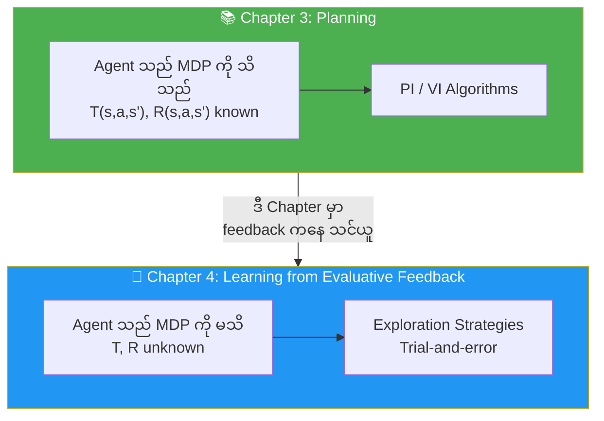

အဓိက အကြောင်းအရာများ:
1. **Evaluative feedback** ရဲ့ challenges နှင့် exploration-exploitation trade-off
2. **Multi-armed bandits (MABs)** — single-state, single-step environments
3. **Exploration strategies** — greedy, epsilon-greedy, decaying, optimistic, softmax, UCB, Thompson sampling

---

## 2. Evaluative Feedback ရဲ့ Challenge

### Planning vs Trial-and-Error Learning

| Feature | Chapter 3 (Planning) | Chapter 4 (Trial-and-Error) |
|---|---|---|
| **MDP knowledge** | Agent က T, R ကို သိသည် | Agent က T, R ကို မသိ |
| **Learning method** | Bellman equation ဖြင့် compute | Environment နှင့် interact ပြီး learn |
| **Feedback type** | Sequential | Evaluative (one-shot) |
| **Environment** | Frozen Lake (multi-state) | Multi-armed bandits (single-state) |

### Core Intuition

> Evaluative feedback (+1, +1.345, –100 ...) ရတဲ့အခါ agent က underlying MDP ကို မသိတဲ့အတွက် maximum reward ဘယ်လောက်ရနိုင်မလဲ ဆိုတာ မသိပါ။ "+1 ရတယ်... ဒါပေမယ့် +100 ရနိုင်တာလည်း ရှိနိုင်တယ်" ဆိုတဲ့ uncertainty ကြောင့် agent က **explore** လုပ်ဖို့ လိုပါတယ်။

$$\text{Exploration} \xrightarrow{\text{builds}} \text{Knowledge} \xrightarrow{\text{enables}} \text{Effective Exploitation}$$


---

## 3. Multi-Armed Bandits (MABs)

### MAB ဆိုတာဘာလဲ

Multi-armed bandit (MAB) ဆိုတာ RL problem ရဲ့ special case ဖြစ်ပြီး:
- **State space size = 1** (single non-terminal state)
- **Horizon = 1** (single time step per episode)
- **Actions = multiple** (many options, single choice)

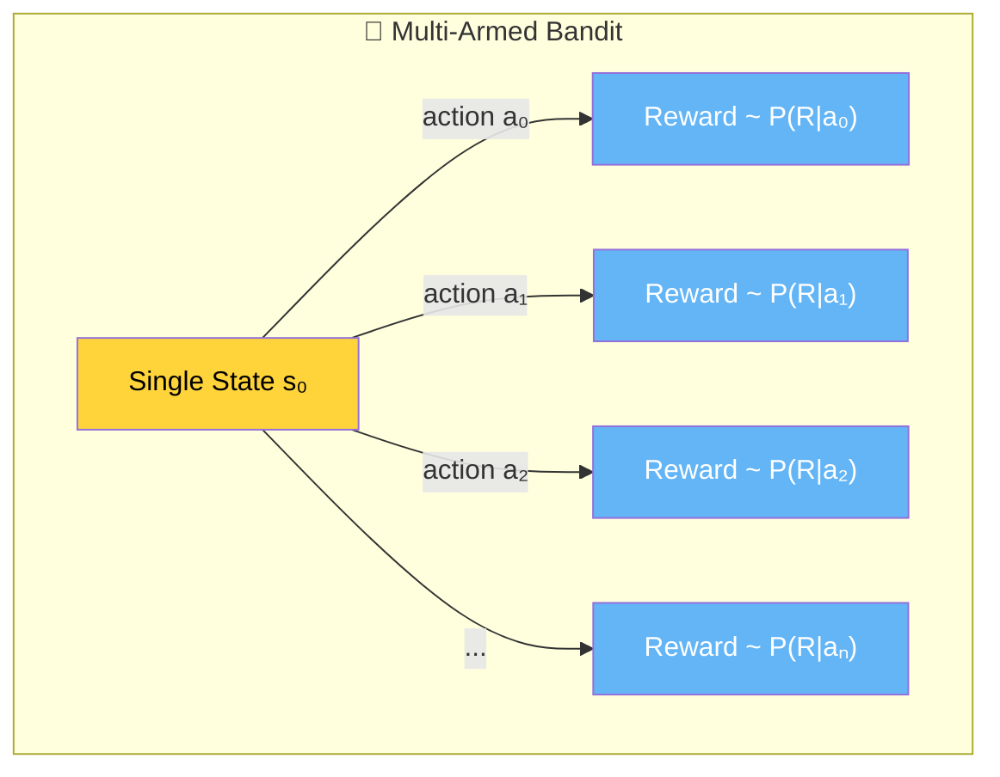

### MAB ၏ Math Formulation

$$Q^*(a) = \mathbb{E}[R | A = a]$$

$$V^* = \max_a Q^*(a)$$

$$a^* = \arg\max_a Q^*(a)$$

- $Q^*(a)$ — action $a$ ရဲ့ true expected reward
- $V^*$ — optimal value (best action ရဲ့ expected reward)
- $a^*$ — optimal action

### MAB Applications
- **Advertising** — ဘယ် ad ကို ပြမလဲ (click-through rate optimize)
- **Website design** — ဘယ် layout က donations/sales ပိုရမလဲ
- **Medical trials** — ဘယ်ဆေး က ပိုထိရောက်မလဲ
- **Recommender systems** — ဘယ် product ကို recommend လုပ်မလဲ

---

## 4. Regret: Exploration ရဲ့ Cost

### Total Regret

$$T_{\text{regret}} = \sum_{e=1}^{E} \left[ V^* - Q^*(a_e) \right]$$

- $V^*$ — optimal action ရဲ့ true expected reward
- $Q^*(a_e)$ — episode $e$ မှာ ရွေးလိုက်တဲ့ action ရဲ့ true expected reward
- Regret = optimal action နှင့် ကွာခြားချက်ပေါင်းလဒ်

> 💡 Regret ကို compute လုပ်ဖို့ MDP ကို သိဖို့ လိုပါတယ်။ Agent အတွက် မဟုတ်ဘဲ **strategies ကို compare** လုပ်ဖို့ အတွက်ပဲ သုံးပါတယ်။

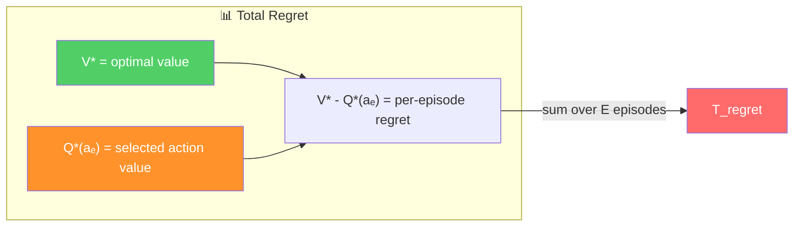

---

## 5. Q-Function Estimation in MABs

MAB environments မှာ Q-function estimation ရိုးရှင်းပါတယ် — per-action average reward ပဲ ဖြစ်ပါတယ်:

$$Q(a) = \frac{\text{Total reward from action } a}{\text{Number of times action } a \text{ selected}}$$

Incremental update form:

$$Q(a) \leftarrow Q(a) + \frac{1}{N(a)} \left[ R - Q(a) \right]$$

> 💡 **Strategy အားလုံးမှာ Q-function estimation တူတူပဲ ဖြစ်ပါတယ်**။ ကွာခြားချက်က Q-function estimates ကို **action selection** အတွက် ဘယ်လို သုံးသလဲ ဆိုတာပဲ ဖြစ်ပါတယ်။

---

## 6. Exploration Strategies

### Strategy များ၏ Classification

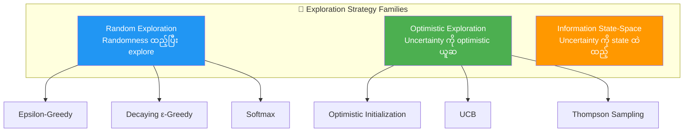

---

### 6.1 Pure Exploitation (Greedy Baseline)

အမြဲတမ်း estimated value အမြင့်ဆုံး action ကိုပဲ ရွေးခြင်း — exploration **လုံးဝမရှိ**။

$$a = \arg\max_a Q(a)$$

**ပြဿနာ:** Q-table ကို zero ဖြင့် initialize လုပ်ရင် ပထမဆုံး action မှာ stuck ဖြစ်သွားပါတယ်။

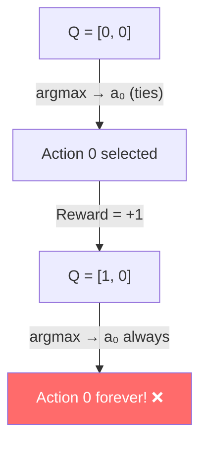

```python
def pure_exploitation(env, n_episodes=5000):
    Q = np.zeros((env.action_space.n))
    N = np.zeros((env.action_space.n))
    for e in range(n_episodes):
        action = np.argmax(Q)                    # Always greedy
        _, reward, _, _ = env.step(action)
        N[action] += 1
        Q[action] = Q[action] + (reward - Q[action]) / N[action]
    return Q
```

> 💡 Time horizon နည်းရင် (episode 1 ခုပဲ ကျန်ရင်) greedy strategy ကောင်းပါတယ်။ ဒါပေမယ့် long-term မှာ information gather မလုပ်ရင် suboptimal ဖြစ်ပါတယ်။

---

### 6.2 Pure Exploration (Random Baseline)

အမြဲတမ်း random action ရွေးခြင်း — exploitation **လုံးဝမရှိ**။

$$a = \text{random}(\{a_0, a_1, \ldots, a_{n-1}\})$$

```python
def pure_exploration(env, n_episodes=5000):
    Q = np.zeros((env.action_space.n))
    N = np.zeros((env.action_space.n))
    for e in range(n_episodes):
        action = np.random.randint(len(Q))       # Always random
        _, reward, _, _ = env.step(action)
        N[action] += 1
        Q[action] = Q[action] + (reward - Q[action]) / N[action]
    return Q
```

> 💡 **Exploitation** နည်းလမ်း တစ်ခုတည်းသာ ရှိသည် (best action ရွေးခြင်း)။ **Exploration** နည်းလမ်းကတော့ အများကြီး ရှိပါတယ် — random, count-based, variance-based, uncertainty-based ...

---

### 6.3 Epsilon-Greedy Strategy

Exploit most of the time, explore randomly with probability $\epsilon$:

$$a = \begin{cases} \arg\max_a Q(a) & \text{with probability } 1 - \epsilon \\ \text{random action} & \text{with probability } \epsilon \end{cases}$$

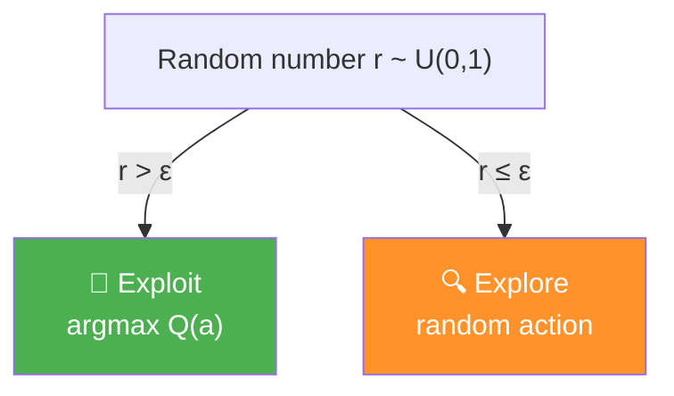

```python
def epsilon_greedy(env, epsilon=0.01, n_episodes=5000):
    Q = np.zeros((env.action_space.n))
    N = np.zeros((env.action_space.n))
    for e in range(n_episodes):
        if np.random.random() > epsilon:
            action = np.argmax(Q)                # Exploit
        else:
            action = np.random.randint(len(Q))   # Explore (includes greedy!)
        _, reward, _, _ = env.step(action)
        N[action] += 1
        Q[action] = Q[action] + (reward - Q[action]) / N[action]
    return Q
```

> 💡 **သတိထားရန်:** Exploration step မှာ greedy action ပါ ပါဝင်နိုင်ပါတယ်။ ε = 0.5, actions = 2 ဆိုရင် non-greedy action ရွေးဖို့ probability ≈ 25% ပဲ ဖြစ်ပါတယ်။

---

### 6.4 Decaying Epsilon-Greedy

Early episodes မှာ explore ပိုလုပ်ပြီး ကျန်တာမှာ exploit ပိုလုပ်ဖို့ epsilon ကို decay လုပ်ခြင်း။

#### Linearly Decaying

```python
def lin_dec_epsilon_greedy(env, init_epsilon=1.0, min_epsilon=0.01, 
                            decay_ratio=0.05, n_episodes=5000):
    Q = np.zeros((env.action_space.n))
    N = np.zeros((env.action_space.n))
    for e in range(n_episodes):
        decay_episodes = n_episodes * decay_ratio
        epsilon = 1 - e / decay_episodes
        epsilon *= init_epsilon - min_epsilon
        epsilon += min_epsilon
        epsilon = np.clip(epsilon, min_epsilon, init_epsilon)
        if np.random.random() > epsilon:
            action = np.argmax(Q)
        else:
            action = np.random.randint(len(Q))
        _, reward, _, _ = env.step(action)
        N[action] += 1
        Q[action] = Q[action] + (reward - Q[action]) / N[action]
    return Q
```

#### Exponentially Decaying

```python
def exp_dec_epsilon_greedy(env, init_epsilon=1.0, min_epsilon=0.01, 
                            decay_ratio=0.1, n_episodes=5000):
    Q = np.zeros((env.action_space.n))
    N = np.zeros((env.action_space.n))
    decay_episodes = int(n_episodes * decay_ratio)
    rem_episodes = n_episodes - decay_episodes
    epsilons = 0.01
    epsilons /= np.logspace(-2, 0, decay_episodes)
    epsilons *= init_epsilon - min_epsilon
    epsilons += min_epsilon
    epsilons = np.pad(epsilons, (0, rem_episodes), 'edge')
    for e in range(n_episodes):
        if np.random.random() > epsilons[e]:
            action = np.argmax(Q)
        else:
            action = np.random.randint(len(Q))
        _, reward, _, _ = env.step(action)
        N[action] += 1
        Q[action] = Q[action] + (reward - Q[action]) / N[action]
    return Q
```

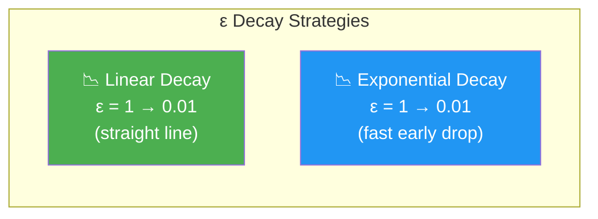

> 💡 **Key Idea:** Early episodes → value estimates မှန်ကန်ဖို့ explore ပိုလုပ်။ Later episodes → estimates ကောင်းလာပြီ ဖြစ်တဲ့အတွက် exploit ပိုလုပ်။

---

### 6.5 Optimistic Initialization

Q-function ကို **high value** ဖြင့် initialize လုပ်ပြီး greedy action ရွေးခြင်း။ Agent က "paradise မှာ ရှိတယ်" လို့ ယုံကြည်ပြီး explore လုပ်ပါတယ်။

$$Q(a) \leftarrow \text{optimistic\_estimate} \quad \forall a$$
$$N(a) \leftarrow \text{initial\_count} \quad \forall a$$

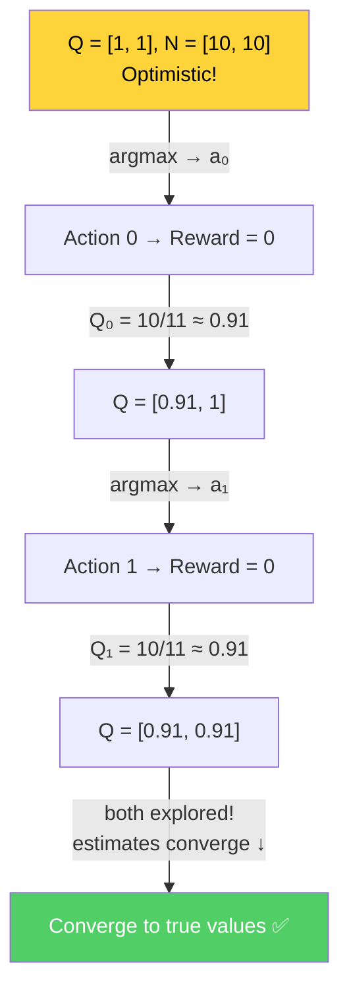

```python
def optimistic_initialization(env, optimistic_estimate=1.0, 
                               initial_count=100, n_episodes=5000):
    Q = np.full((env.action_space.n), optimistic_estimate, dtype=np.float64)
    N = np.full((env.action_space.n), initial_count, dtype=np.float64)
    for e in range(n_episodes):
        action = np.argmax(Q)                    # Always greedy!
        _, reward, _, _ = env.step(action)
        N[action] += 1
        Q[action] = Q[action] + (reward - Q[action]) / N[action]
    return Q
```

**Optimism in the face of uncertainty** — မသိတာကို အကောင်းဆုံးလို့ ယုံကြည်ခြင်း ဖြင့် explore လုပ်ပါတယ်။ Experience ရလာတာနဲ့ estimates ကျဆင်းပြီး true values ဆီ converge ပါတယ်။

**ပြဿနာများ:**
1. Maximum reward ကို ကြိုသိရန် လိုအပ်ခြင်း — optimistic value ကို environment ရဲ့ max reward ထက် များစွာ မြင့်ရင် converge ဖို့ ကြာပါတယ်
2. `initial_count` hyperparameter tuning လိုအပ်ခြင်း

---

### 6.6 Softmax Strategy

Q-value estimates ကို probability distribution အဖြစ် ပြောင်းပြီး action ရွေးခြင်း — higher estimated value ရှိတဲ့ actions ကို ပိုရွေးပါတယ်:

$$P(a) = \frac{e^{Q(a)/\tau}}{\sum_{a'} e^{Q(a')/\tau}}$$

| Temperature $\tau$ | Behavior |
|---|---|
| $\tau \to \infty$ | Uniform random (pure exploration) |
| $\tau \to 0$ | Greedy (pure exploitation) |
| Moderate $\tau$ | Balanced exploration-exploitation |

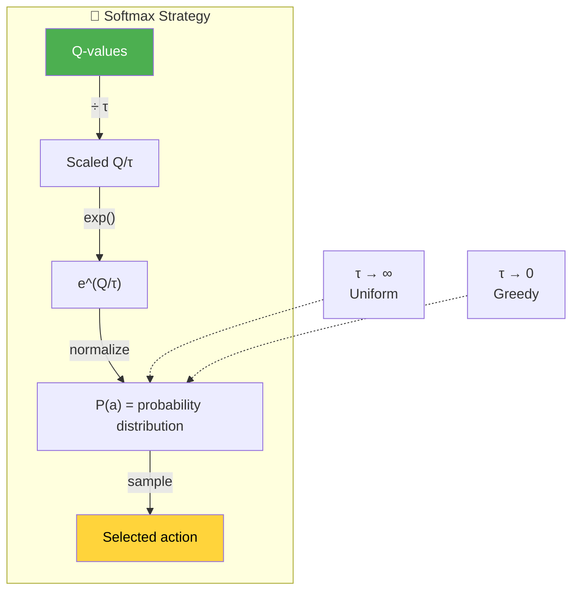

```python
def softmax(env, init_temp=1000.0, min_temp=0.01, 
            decay_ratio=0.04, n_episodes=5000):
    Q = np.zeros((env.action_space.n))
    N = np.zeros((env.action_space.n))
    for e in range(n_episodes):
        decay_episodes = n_episodes * decay_ratio
        temp = 1 - e / decay_episodes
        temp *= init_temp - min_temp
        temp += min_temp
        temp = np.clip(temp, min_temp, init_temp)
        
        scaled_Q = Q / temp
        norm_Q = scaled_Q - np.max(scaled_Q)     # Numeric stability
        exp_Q = np.exp(norm_Q)
        probs = exp_Q / np.sum(exp_Q)
        
        action = np.random.choice(np.arange(len(probs)), size=1, p=probs)[0]
        _, reward, _, _ = env.step(action)
        N[action] += 1
        Q[action] = Q[action] + (reward - Q[action]) / N[action]
    return Q
```

> 💡 Epsilon-greedy နှင့် **ကွာခြားချက်**: epsilon-greedy က explore လုပ်ရင် uniform random ပဲ ရွေးပါတယ်။ Softmax ကတော့ Q-value estimates ကို proportion လိုက်ပြီး action ရွေးပါတယ်။ Low-value actions ကို explore လုပ်ဖို့ chance နည်းပါတယ်။

---

### 6.7 Upper Confidence Bound (UCB)

Q-value estimate + **uncertainty bonus** ပေါင်းပြီး action ရွေးခြင်း — uncertain actions ကို explore ဖို့ encourage:

$$a_e = \arg\max_a \left[ Q(a) + U_e(a) \right]$$

$$U_e(a) = \sqrt{\frac{c \cdot \ln(e)}{N(a)}}$$

- $Q(a)$ — estimated value (exploitation term)
- $U_e(a)$ — uncertainty bonus (exploration term)
- $c$ — exploration scale hyperparameter
- $N(a)$ — action $a$ ကို select လုပ်ခဲ့တဲ့ အကြိမ်ရေ

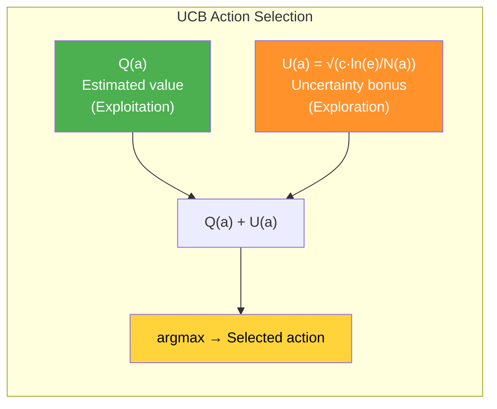

**UCB ၏ Intuition:**
- $N(a)$ **နည်းရင်** (action ကို နည်းနည်းပဲ try ခဲ့ရင်) → $U(a)$ **ကြီးပါတယ်** → explore ဖို့ encourage
- $N(a)$ **များရင်** (action ကို အများကြီး try ခဲ့ရင်) → $U(a)$ **ငယ်ပါတယ်** → exploit ဖို့ encourage
- Attempts ကွာျခားမှု (0 vs 100) ► early episodes မှာ bonus ပိုကြီး; (100 vs 200) ► later episodes မှာ bonus ငယ်လာ

```python
def upper_confidence_bound(env, c=2, n_episodes=5000):
    Q = np.zeros((env.action_space.n))
    N = np.zeros((env.action_space.n))
    for e in range(n_episodes):
        if e < len(Q):
            action = e                           # Try each action once first
        else:
            U = np.sqrt(c * np.log(e) / N)       # Uncertainty bonus
            action = np.argmax(Q + U)             # Value + exploration bonus
        _, reward, _, _ = env.step(action)
        N[action] += 1
        Q[action] = Q[action] + (reward - Q[action]) / N[action]
    return Q
```

> 💡 **Optimistic initialization vs UCB:** Optimistic initialization က blindly optimistic ဖြစ်ပြီး max reward ကို ကြိုသိဖို့ လိုပါတယ်။ UCB ကတော့ **realistic optimism** — uncertainty ကို statistical technique ဖြင့် measure ပြီး exploration bonus အဖြစ် ပေါင်းထည့်ပါတယ်။

---

### 6.8 Thompson Sampling

Bayesian approach — Q-value တစ်ခုချင်းစီကို **probability distribution** (Gaussian) အဖြစ် model လုပ်ပြီး sample ယူကာ action ရွေးခြင်း:

$$\tilde{Q}(a) \sim \mathcal{N}\left(Q(a), \frac{\alpha}{\sqrt{N(a)} + \beta}\right)$$

$$a = \arg\max_a \tilde{Q}(a)$$

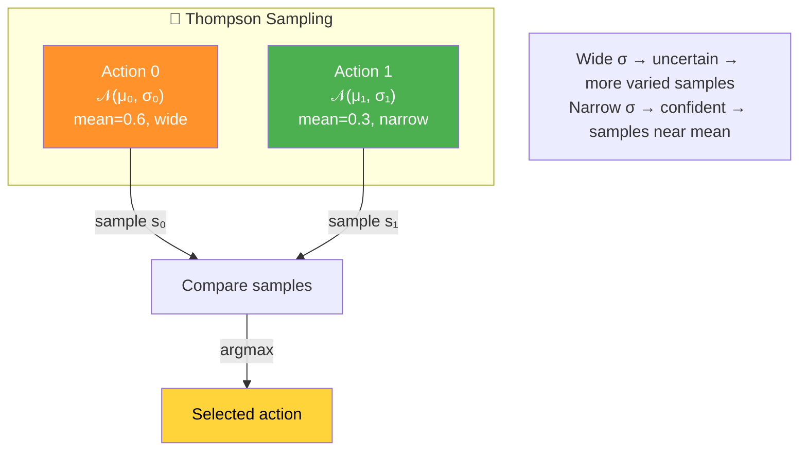

**Thompson Sampling ၏ Intuition:**
- **Uncertain action** (σ ကြီးသည်) → samples က varied ဖြစ်ပြီး highest sample ဖြစ်ဖို့ chance ရှိ → explore
- **Confident action** (σ ငယ်သည်) → samples က mean နားမှာ → mean ကြီးရင် exploit

```python
def thompson_sampling(env, alpha=1, beta=0, n_episodes=5000):
    Q = np.zeros((env.action_space.n))
    N = np.zeros((env.action_space.n))
    for e in range(n_episodes):
        samples = np.random.normal(
            loc=Q, 
            scale=alpha / (np.sqrt(N) + beta))   # Sample from Gaussians
        action = np.argmax(samples)               # Pick highest sample
        _, reward, _, _ = env.step(action)
        N[action] += 1
        Q[action] = Q[action] + (reward - Q[action]) / N[action]
    return Q
```

> 💡 **UCB** က **frequentist** approach (minimal assumptions)၊ **Thompson Sampling** က **Bayesian** approach (prior distributions အသုံးပြု)။ Beta distribution ကိုလည်း prior အဖြစ် အသုံးပြုနိုင်ပါတယ်။

---

## 7. Bandit Environments

### 7.1 Bandit Slippery Walk (BSW)

Chapter 3 ကနေ ပြန်လာတဲ့ environment — single-state, two-armed bandit:

```
H(0) -- S(1) -- G(2)
```

- Action 0 → reward +1 probability 0.2
- Action 1 → reward +1 probability 0.8
- Agent က ဒီ probabilities ကို မသိပါ

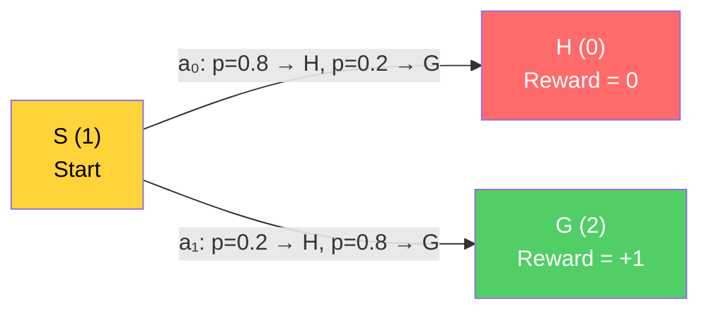

### 7.2 Two-Armed Bernoulli Bandits

$$R(a_0) \sim \text{Bernoulli}(\alpha) \quad (+1 \text{ with prob } \alpha, \text{ else } 0)$$
$$R(a_1) \sim \text{Bernoulli}(\beta) \quad (+1 \text{ with prob } \beta, \text{ else } 0)$$

- $\alpha$ နှင့် $\beta$ independent probabilities ဖြစ်ပါတယ် (BSW နှင့် ကွာပါတယ်)

### 7.3 10-Armed Gaussian Bandits

$$q^*(a_k) \sim \mathcal{N}(0, 1) \quad \text{for } k = 0, 1, \ldots, 9$$

$$R_e(a_k) \sim \mathcal{N}(q^*(a_k), 1)$$

- Arm တိုင်း reward ပေးပါတယ် (Bernoulli နှင့် ကွာပါတယ်)
- Reward က Gaussian distribution ကနေ sample ယူပါတယ်

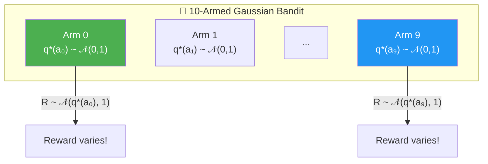

---

## 8. Experimental Results

### Two-Armed Bernoulli Bandits Results

| Strategy | Performance |
|---|---|
| **Optimistic 1.0, count=10** | Highest mean episode reward |
| **Exp ε-greedy 1.0** | Low total regret |
| **Softmax ∞** | Best across all experiments |
| *Pure exploitation* | *Linear total regret (bad!)* |
| *Pure exploration* | *Linear total regret (bad!)* |

### 10-Armed Gaussian Bandits Results

| Strategy | Performance |
|---|---|
| **UCB 0.2, 0.5** | Top performers, lowest regret |
| **Thompson 0.5** | Competitive with UCB |
| **Lin ε-greedy 1.0** | Best among simple strategies |
| **Softmax ∞** | Less effective in 10-arm setting |

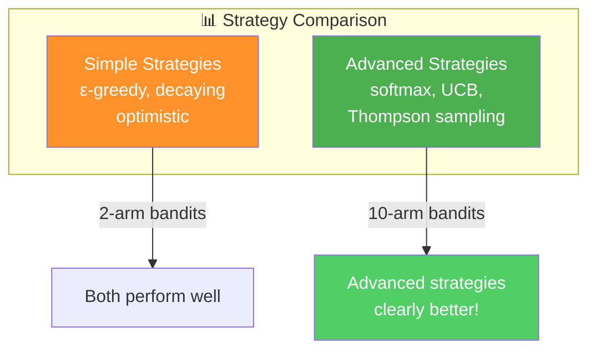

> 💡 **Key Finding:** Advanced strategies (UCB, Thompson) က environment complexity (more arms) တိုးလာတာနဲ့ simple strategies ထက် ပြတ်သားစွာ outperform လုပ်ပါတယ်။

---

## 9. Strategy Comparison Summary

| Strategy | Type | Explore | Exploit | Key Feature |
|---|---|---|---|---|
| **Pure Exploitation** | Baseline | ❌ | ✅ Always | First action မှာ stuck |
| **Pure Exploration** | Baseline | ✅ Always | ❌ | Q converges but never used |
| **ε-Greedy** | Random | ε prob | 1-ε prob | Simple, effective |
| **Decaying ε-Greedy** | Random | High→Low | Low→High | Time-aware exploration |
| **Optimistic Init** | Optimistic | Implicit | Greedy | Needs max reward knowledge |
| **Softmax** | Random | Proportional | Proportional | Q-value based preference |
| **UCB** | Optimistic | Uncertainty bonus | Q-value | Statistical uncertainty |
| **Thompson Sampling** | Bayesian | Distribution sampling | Mean value | Full posterior maintenance |

---

## 10. Key Equations Summary

| Concept | Equation |
|---|---|
| MAB Q-function | $Q^*(a) = \mathbb{E}[R \mid A = a]$ |
| Optimal value | $V^* = \max_a Q^*(a)$ |
| Q-update (incremental) | $Q(a) \leftarrow Q(a) + \frac{1}{N(a)}[R - Q(a)]$ |
| Total regret | $T = \sum_{e=1}^{E} [V^* - Q^*(a_e)]$ |
| ε-Greedy | $a = \arg\max Q$ w.p. $1 - \epsilon$; random w.p. $\epsilon$ |
| Softmax | $P(a) = \frac{e^{Q(a)/\tau}}{\sum_{a'} e^{Q(a')/\tau}}$ |
| UCB | $a = \arg\max_a \left[ Q(a) + \sqrt{\frac{c \ln e}{N(a)}} \right]$ |
| Thompson Sampling | $\tilde{Q}(a) \sim \mathcal{N}\left(Q(a), \frac{\alpha}{\sqrt{N(a)} + \beta}\right)$ |

---

## 11. နိဂုံးချုပ်

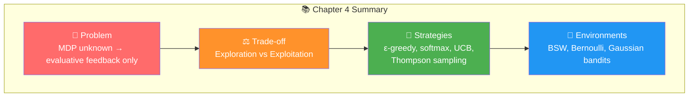

### အဓိက သိရမယ့်အချက်များ:

1. **Evaluative feedback** — Agent က MDP ကို မသိတဲ့အတွက် ကိုယ်ပိုင် experience ကနေ learn ရပါတယ်
2. **Exploration-exploitation trade-off** — Information gathering နှင့် reward maximization ကို balance လုပ်ရပါတယ်
3. **MABs** — Single-state environments ဖြစ်ပြီး evaluative feedback challenge ကို isolate လုပ်ပါတယ်
4. **Regret** — Exploration ရဲ့ cost ကို measure ပြီး strategies ကို compare လုပ်ပါတယ်
5. **Random strategies** — ε-greedy, decaying ε-greedy, softmax
6. **Optimistic strategies** — Optimistic initialization, UCB
7. **Bayesian strategies** — Thompson sampling
8. **Advanced strategies** (UCB, Thompson) က complex environments မှာ simple strategies ထက် ပိုကောင်းပါတယ်

> **Chapter 4 vs Chapter 5:** Chapter 4 မှာ evaluative feedback challenge ကို single-state (bandit) environments မှာ isolate ပြီး study လုပ်ခဲ့ပါတယ်။ Chapter 5 မှာ sequential + evaluative feedback ပေါင်းပြီး multi-state environments မှာ agents ရဲ့ behaviors ကို evaluate လုပ်ဖို့ သင်ယူပါမယ်။
