# Chapter 5: Evaluating Agents' Behaviors - အကျဉ်းချုပ်

## 1. Chapter ရဲ့ ရည်ရွယ်ချက်

ဒီ Chapter မှာ **sequential + evaluative** feedback နှစ်ခုလုံးကို တစ်ပြိုင်တည်း ကိုင်တွယ်ပြီး agent ရဲ့ policy ကို **evaluate** (prediction problem) လုပ်ဖို့ သင်ယူပါတယ်။ MDP ကို **မသိဘဲ** experience ကနေ state-value function $V^\pi(s)$ ကို estimate လုပ်ရပါတယ်။

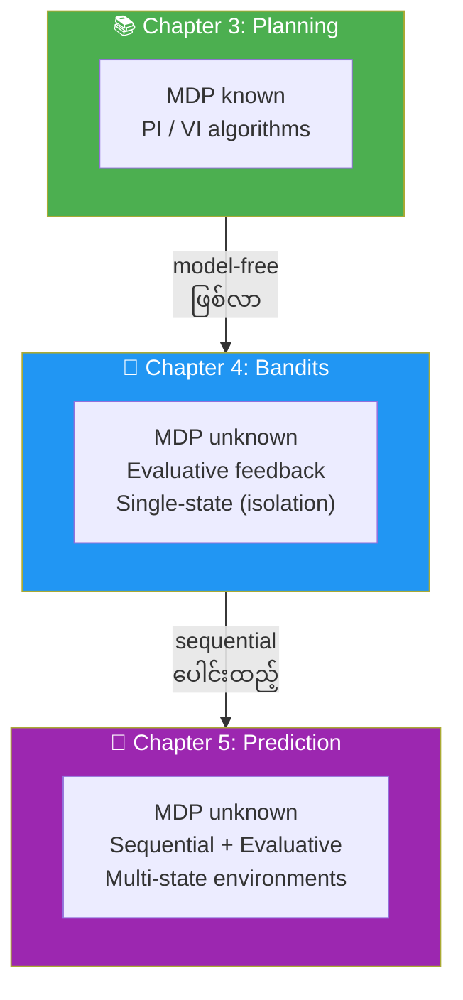

အဓိက အကြောင်းအရာများ:
1. **Reward vs Return vs Value function** ကွာခြားချက်
2. **Monte Carlo (MC) prediction** — episode ပြီးမှ update
3. **Temporal-Difference (TD) learning** — step တိုင်း update
4. **N-step TD** — MC နှင့် TD ကြားမှာ ရှိတဲ့ spectrum
5. **TD(λ)** — eligibility traces ဖြင့် MC နှင့် TD ကို unify

---

## 2. Reward, Return, Value Function ကွာခြားချက်

> 💡 RL agent က reward ကို maximize လုပ်နေတာ **မဟုတ်ပါ**! Value function ကို maximize လုပ်နေတာပါ။

| Concept | Definition | Intuition |
|---|---|---|
| **Reward** $R_{t+1}$ | One-step reward signal | Immediate satisfaction — candy ကို ယခု စား |
| **Return** $G_t$ | Total discounted rewards (single episode) | Episode တစ်ခုလုံးရဲ့ reward sum — ဒီနေ့ ရရှိတဲ့အကျိုး |
| **Value function** $V^\pi(s)$ | Expectation of returns | Returns ရဲ့ average  — **long-term expected outcome** |

$$G_t = R_{t+1} + \gamma R_{t+2} + \gamma^2 R_{t+3} + \cdots = \sum_{k=0}^{\infty} \gamma^k R_{t+k+1}$$

$$V^\pi(s) = \mathbb{E}_\pi[G_t \mid S_t = s]$$

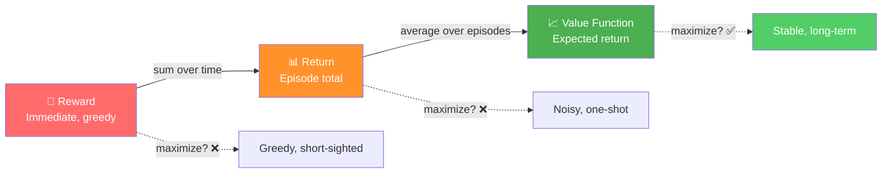

> 💡 **Life analogy:** Reward → ချက်ခြင်း ပျော်ရွှင်မှု (candy စား)။ Return → ဒီနေ့ ရရှိတဲ့ အကျိုးအပြည့် (candy စားပြီး ဝမ်းဗိုက်နာ)။ Value function → ရေရှည်မျှော်မှန်း ခံစားချက် (candy အစား ကျန်းမာရေး ရွေးပြီး long-term happiness)။

---

## 3. Random Walk (RW) Environment

Chapter 5 မှာ အသုံးပြုတဲ့ primary environment — five non-terminal states ရှိတဲ့ single-row grid world:

```
Terminal(0) -- State(1) -- State(2) -- State(3) -- State(4) -- State(5) -- Terminal(6)
    R=0                                                                        R=+1
```

- Agent က **left/right** ည 50% probability ဖြင့် move ပါတယ် (random walk)
- Policy evaluation ရဲ့ target: $V^\pi(s)$ ကို estimate လုပ်ခြင်း

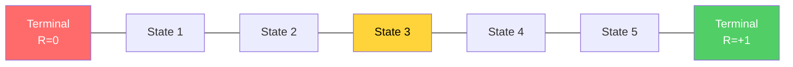

> 💡 RL framework (optimal control) ကို control မရနိုင်တဲ့ environment မှာ study လုပ်ပြီဆိုတော့ — deterministic transition + stochastic policy (50% left, 50% right) လို့ စဉ်းစားလို့ ရပါတယ်။ ရလဒ်တူပါတယ်။

---

## 4. Monte Carlo (MC) Prediction

### 4.1 MC ၏ Core Idea

Policy $\pi$ ကို run ပြီး episodes အများကြီးရဲ့ **actual returns** ကနေ average ယူပြီး $V^\pi(s)$ ကို estimate လုပ်ခြင်း — straightforward approach:

1. Policy $\pi$ ဖြင့် **full episode** (trajectory) generate
2. Trajectory ထဲက state တိုင်းအတွက် **return** $G_t$ ကို calculate
3. Returns ကို **average** ယူပြီး $V(s)$ ကို update

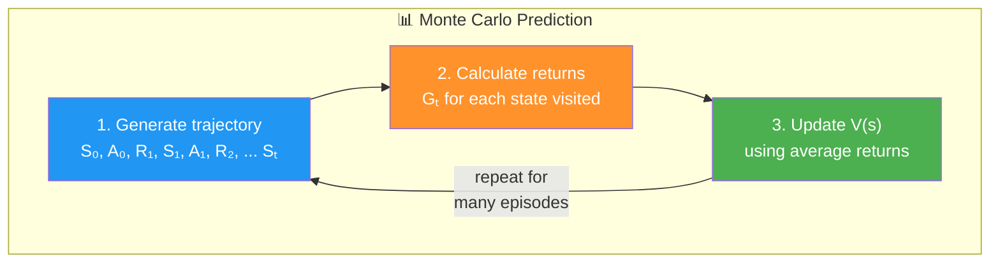

### 4.2 MC Math

$$V^\pi(s) = \mathbb{E}_\pi[G_t \mid S_t = s]$$

$$G_{t:T} = R_{t+1} + \gamma R_{t+2} + \gamma^2 R_{t+3} + \cdots + \gamma^{T-t-1} R_T$$

Incremental update form — episode ပြီးတိုင်း:

$$V(s) \leftarrow V(s) + \alpha \left[ G_{t:T} - V(s) \right]$$

- $G_{t:T}$ — state $s$ ကနေ episode အဆုံး $T$ ထိ **actual return** (MC target)
- $\alpha$ — learning rate
- $G_{t:T} - V(s)$ — **MC error** (actual return - current estimate)

> 💡 MC update ကို episode **အဆုံး** $T$ မှာပဲ လုပ်နိုင်ပါတယ် — $G_{t:T}$ ကို calculate ဖို့ full trajectory လိုအပ်ပါတယ်။

### 4.3 First-Visit vs Every-Visit MC

Episode တစ်ခုမှာ state $s$ ကို **multiple times** visit လုပ်နိုင်ပါတယ်:

| Method | Rule | IID? |
|---|---|---|
| **First-Visit MC (FVMC)** | State $s$ ရဲ့ **ပထမဆုံး** visit ကနေ return ကိုပဲ သုံး | ✅ IID samples |
| **Every-Visit MC (EVMC)** | State $s$ ရဲ့ visit **အားလုံး** ကနေ returns သုံး | ❌ Not IID, but still converges |

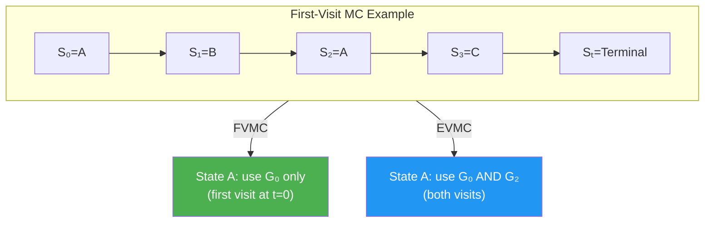

### 4.4 MC Python Code

```python
def generate_trajectory(pi, env, max_steps=20):
    done, trajectory = False, []
    while not done:
        state = env.reset()
        for t in count():
            action = pi(state)
            next_state, reward, done, _ = env.step(action)
            experience = (state, action, reward, next_state, done)
            trajectory.append(experience)
            if done:
                break
            if t >= max_steps - 1:
                trajectory = []
                break
            state = next_state
    return np.array(trajectory, np.object)

def mc_prediction(pi, env, gamma=1.0, init_alpha=0.5, min_alpha=0.01,
                  alpha_decay_ratio=0.3, n_episodes=500, 
                  max_steps=100, first_visit=True):
    nS = env.observation_space.n
    discounts = np.logspace(0, max_steps, num=max_steps, 
                            base=gamma, endpoint=False)
    alphas = decay_schedule(init_alpha, min_alpha, 
                            alpha_decay_ratio, n_episodes)
    V = np.zeros(nS)
    
    for e in tqdm(range(n_episodes), leave=False):
        trajectory = generate_trajectory(pi, env, max_steps)
        visited = np.zeros(nS, dtype=np.bool)
        for t, (state, _, reward, _, _) in enumerate(trajectory):
            if visited[state] and first_visit:
                continue
            visited[state] = True
            n_steps = len(trajectory[t:])
            G = np.sum(discounts[:n_steps] * trajectory[t:, 2])
            V[state] = V[state] + alphas[e] * (G - V[state])
    return V
```

### 4.5 MC ရဲ့ Properties

| Property | Description |
|---|---|
| **Unbiased** ✅ | Actual return $G_{t:T}$ ကို target အနေနဲ့ သုံး — true value ကို ထိမြန် |
| **High variance** ❌ | $G_{t:T}$ ထဲမှာ random events အများကြီး accumulate (actions, transitions, rewards) |
| **Sample inefficient** ❌ | Variance ကြီးတဲ့အတွက် data အများကြီး လိုအပ် |
| **Episode-end update** ❌ | Terminal state ရောက်မှ update လုပ်နိုင် |

---

## 5. Temporal-Difference (TD) Learning

### 5.1 TD ၏ Core Idea

MC ရဲ့ main drawback — episode ပြီးမှ update — ကို ဖြေရှင်းဖို့ **estimated return** ကို သုံး:

- MC: actual return $G_{t:T}$ ကို သုံး (episode ပြီးအောင် စောင့်)
- TD: **one-step reward** $R_{t+1}$ + **estimated return** $\gamma V(S_{t+1})$ ကို သုံး (step တိုင်း update)

$$\underbrace{R_{t+1} + \gamma V(S_{t+1})}_{\text{TD target}} \quad \text{vs} \quad \underbrace{G_{t:T}}_{\text{MC target}}$$

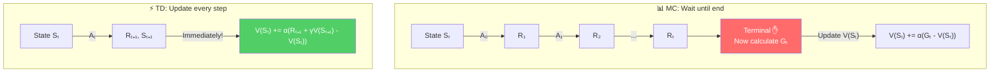

### 5.2 TD Math

State-value function ကို recursively ရေးနိုင်:

$$V^\pi(s) = \mathbb{E}_\pi[R_{t+1} + \gamma V^\pi(S_{t+1}) \mid S_t = s]$$

TD update (every time step):

$$V(S_t) \leftarrow V(S_t) + \alpha \left[ \underbrace{R_{t+1} + \gamma V(S_{t+1})}_{\text{TD target}} - V(S_t) \right]$$

**TD error** (**temporal-difference error**):

$$\delta_t = R_{t+1} + \gamma V(S_{t+1}) - V(S_t)$$

ဒါကြောင့်:

$$V(S_t) \leftarrow V(S_t) + \alpha \cdot \delta_t$$

> 💡 **Bootstrapping** — estimate ကနေ estimate ကို update လုပ်တာကို bootstrapping လို့ ခေါ်ပါတယ်။ $V(S_{t+1})$ ကိုယ်တိုင်က estimate ဖြစ်ပေမယ့် $R_{t+1}$ (real reward) က "reality ကို inject" လုပ်ပေးပါတယ်။

### 5.3 TD Python Code

```python
def td(pi, env, gamma=1.0, init_alpha=0.5, min_alpha=0.01,
       alpha_decay_ratio=0.3, n_episodes=500):
    nS = env.observation_space.n
    V = np.zeros(nS)
    alphas = decay_schedule(init_alpha, min_alpha, 
                            alpha_decay_ratio, n_episodes)
    
    for e in tqdm(range(n_episodes), leave=False):
        state, done = env.reset(), False
        while not done:
            action = pi(state)
            next_state, reward, done, _ = env.step(action)
            td_target = reward + gamma * V[next_state] * (not done)
            td_error = td_target - V[state]
            V[state] = V[state] + alphas[e] * td_error
            state = next_state
    return V
```

### 5.4 TD ရဲ့ Properties

| Property | Description |
|---|---|
| **Biased** ❌ | Estimated return သုံး — $V(S_{t+1})$ ကိုယ်တိုင်က estimate |
| **Low variance** ✅ | Single action, single transition, single reward ပဲ depend |
| **Sample efficient** ✅ | Variance နည်းတဲ့အတွက် data နည်းနဲ့လည်း learn နိုင် |
| **Per-step update** ✅ | Step တိုင်း update — episode ပြီးအောင် စောင့်စရာ မလို |

---

## 6. MC vs TD: Bias-Variance Trade-off

### Core Comparison

| Feature | MC | TD |
|---|---|---|
| **Target** | $G_{t:T}$ (actual return) | $R_{t+1} + \gamma V(S_{t+1})$ (estimated return) |
| **Bias** | Unbiased ✅ | Biased ❌ (bootstrapping) |
| **Variance** | High ❌ (many random events) | Low ✅ (single step) |
| **Update timing** | Episode end | Every step |
| **Bootstrapping** | No | Yes |
| **Need terminal state?** | Yes | No (continuing tasks OK) |

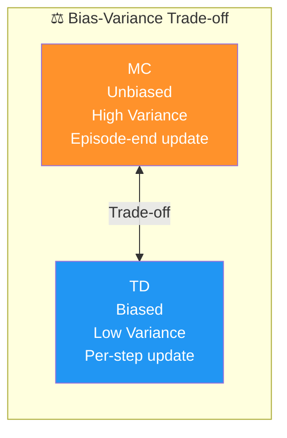

### MC Targets vs TD Targets (RW Environment)

**MC targets** — RW environment မှာ return က 0 (left terminal) ဒါမှမဟုတ် 1 (right terminal) ပဲ ဖြစ်နိုင် → **high variance** (0 နှင့် 1 ကြားမှာ ခုန်)

**TD targets** — $R_{t+1} + \gamma V(S_{t+1})$ → range ပိုသေးပေမယ့် $V(S_{t+1})$ estimate ကြောင့် **biased** (off-target)

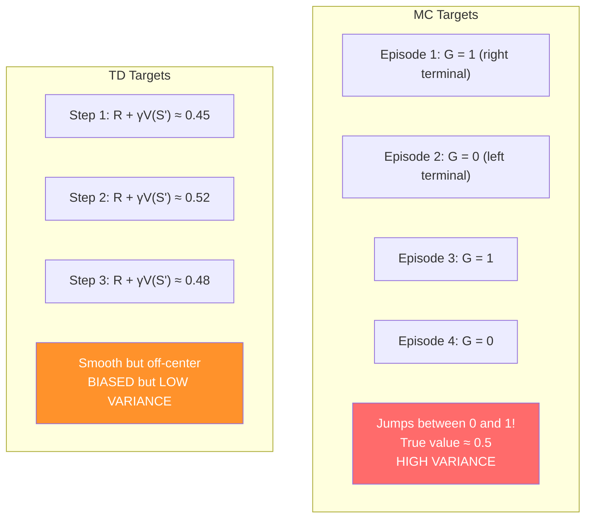

> 💡 MC estimates → **noisy but centered** (true value ပတ်လည် ခုန်)။ TD estimates → **smooth but off-target** (initially biased, slowly converge)။

---

## 7. N-step TD: MC နှင့် TD ကြားမှာ

### 7.1 Motivation

MC → infinite-step (episode ကုန်အောင်)
TD → 1-step (one interaction)
**N-step TD** → n steps interact ပြီးမှ bootstrap

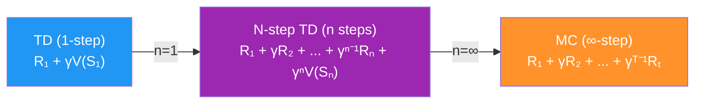

### 7.2 N-step TD Math

N-step return:

$$G_{t:t+n} = R_{t+1} + \gamma R_{t+2} + \cdots + \gamma^{n-1} R_{t+n} + \gamma^n V(S_{t+n})$$

N-step TD update:

$$V(S_t) \leftarrow V(S_t) + \alpha \left[ G_{t:t+n} - V(S_t) \right]$$

- $n = 1$ → TD (one-step bootstrapping)
- $n = \infty$ → MC (no bootstrapping, actual return)
- $1 < n < \infty$ → intermediate, often **best performance**

> 💡 **Extremist မဖြစ်ပါနဲ့!** Intermediate $n$ value က အများအားဖြင့် extremes (TD, MC) ထက် ပိုကောင်းပါတယ်။

### 7.3 N-step TD Python Code

```python
def ntd(pi, env, gamma=1.0, init_alpha=0.5, min_alpha=0.01,
        alpha_decay_ratio=0.5, n_step=3, n_episodes=500):
    nS = env.observation_space.n
    V = np.zeros(nS)
    alphas = decay_schedule(init_alpha, min_alpha, 
                            alpha_decay_ratio, n_episodes)
    discounts = np.logspace(0, n_step+1, num=n_step+1, 
                            base=gamma, endpoint=False)
    
    for e in tqdm(range(n_episodes), leave=False):
        state, done, path = env.reset(), False, []
        while not done or path is not None:
            path = path[1:]
            while not done and len(path) < n_step:
                action = pi(state)
                next_state, reward, done, _ = env.step(action)
                experience = (state, reward, next_state, done)
                path.append(experience)
                state = next_state
                if done:
                    break
            n = len(path)
            est_state = path[0][0]
            rewards = np.array(path)[:,1]
            partial_return = discounts[:n] * rewards
            bs_val = discounts[-1] * V[next_state] * (not done)
            ntd_target = np.sum(np.append(partial_return, bs_val))
            ntd_error = ntd_target - V[est_state]
            V[est_state] = V[est_state] + alphas[e] * ntd_error
            if len(path) == 1 and path[0][3]:
                path = None
    return V
```

---

## 8. Forward-View TD(λ): N-step အားလုံးကို ပေါင်းစပ်ခြင်း

### 8.1 Motivation

N-step TD မှာ $n$ ဘယ်လောက်ရွေးရမလဲ? → **အားလုံးကို weighted combination** ဖြင့် ပေါင်းသုံးလိုက်!

### 8.2 Lambda Return (λ-return)

$$G_t^\lambda = (1-\lambda) \sum_{n=1}^{T-t-1} \lambda^{n-1} G_{t:t+n} + \lambda^{T-t-1} G_{t:T}$$

$$V(S_t) \leftarrow V(S_t) + \alpha \left[ G_t^\lambda - V(S_t) \right]$$

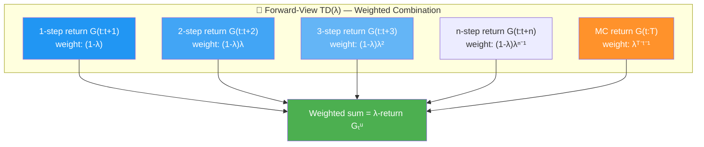

**λ ရဲ့ Special Cases:**
- $\lambda = 0$ → 1-step return ကိုပဲ သုံး → **TD(0)** = TD
- $\lambda = 1$ → MC return weight အကြီးဆုံး ဖြစ် → **TD(1)** ≈ MC
- $0 < \lambda < 1$ → **intermediate** — all n-step returns ကို ပေါင်းစပ်

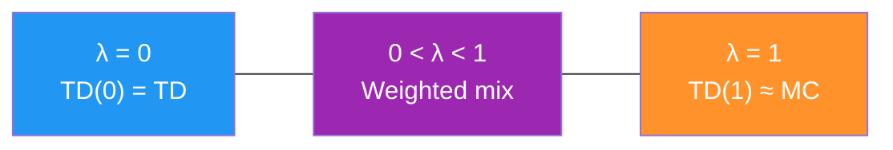

> 💡 Forward-view TD(λ) ရဲ့ **ပြဿနာ** — episode ပြီးမှ update လုပ်နိုင်ပါတယ် (MC လို ပဲ) — ဘာကြောင့်ဆို all n-step returns ကို calculate ဖို့ full trajectory လိုအပ်ပါတယ်။

---

## 9. Backward-View TD(λ): Eligibility Traces

### 9.1 Core Idea

Forward-view TD(λ) ရဲ့ episode-end update ပြဿနာကို ဖြေရှင်းဖို့ **eligibility traces** ကို အသုံးပြု — **every step** update လုပ်နိုင်!

**Eligibility trace** $E(s)$ = memory vector — recently visited states ကို track ပြီး "ဘယ် state က update ရဖို့ eligible ဖြစ်သလဲ" ဆုံးဖြတ်:

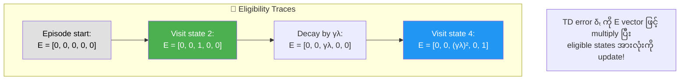

### 9.2 TD(λ) Math

Every episode start:

$$E(s) = 0 \quad \forall s$$

Every time step:

$$E(S_t) \leftarrow E(S_t) + 1$$

$$\delta_t = R_{t+1} + \gamma V(S_{t+1}) - V(S_t)$$

$$V \leftarrow V + \alpha \cdot \delta_t \cdot E$$

$$E \leftarrow \gamma \lambda \cdot E$$

- $E(S_t) + 1$ — state ကို visit လုပ်တိုင်း eligibility ကို increment
- $\delta_t \cdot E$ — TD error ကို **eligible states အားလုံး** ကို apply
- $\gamma \lambda \cdot E$ — traces ကို decay ပြီး recent states ကို ပိုများ credit ပေး

> 💡 **Core insight:** Recent states → high eligibility → more credit။ Old states → decayed eligibility → less credit။ ဒါက **temporal credit assignment** ပြဿနာကို ဖြေရှင်းပါတယ်။

### 9.3 TD(λ) Python Code

```python
def td_lambda(pi, env, gamma=1.0, init_alpha=0.5, min_alpha=0.01,
              alpha_decay_ratio=0.3, lambda_=0.3, n_episodes=500):
    nS = env.observation_space.n
    V = np.zeros(nS)
    E = np.zeros(nS)
    alphas = decay_schedule(init_alpha, min_alpha, 
                            alpha_decay_ratio, n_episodes)
    
    for e in tqdm(range(n_episodes), leave=False):
        E.fill(0)
        state, done = env.reset(), False
        while not done:
            action = pi(state)
            next_state, reward, done, _ = env.step(action)
            td_target = reward + gamma * V[next_state] * (not done)
            td_error = td_target - V[state]
            E[state] = E[state] + 1
            V = V + alphas[e] * td_error * E
            E = gamma * lambda_ * E
            state = next_state
    return V
```

### 9.4 TD(λ) ၏ Properties

| λ Value | Equivalent | Behavior |
|---|---|---|
| $\lambda = 0$ | TD(0) = TD | One-step update only; no trace propagation |
| $\lambda = 1$ | TD(1) ≈ MC | All visited states get equal credit (offline) |
| $0 < \lambda < 1$ | Mix | Recent states get more credit; exponential decay |

---

## 10. Algorithm Comparison Summary

### 10.1 Method Spectrum

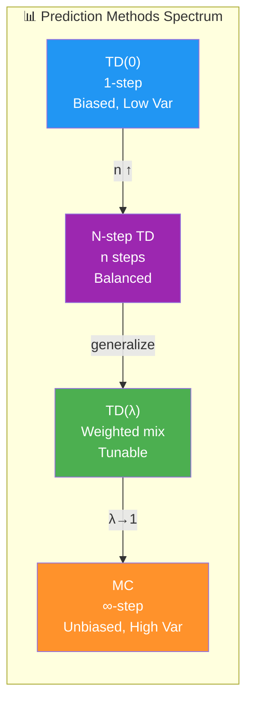

### 10.2 Feature Comparison Table

| Feature | MC | TD | N-step TD | TD(λ) |
|---|---|---|---|---|
| **Target** | $G_{t:T}$ | $R_{t+1} + \gamma V(S_{t+1})$ | $G_{t:t+n}$ | $G_t^\lambda$ (weighted) |
| **Bias** | Unbiased | Biased | Moderate | Tunable |
| **Variance** | High | Low | Moderate | Tunable |
| **Update timing** | Episode end | Every step | Every n steps | Every step (backward) |
| **Bootstrapping** | No | Yes | Partial | Tunable |
| **Visual trend** | Noisy, centered | Smooth, off-target | Noisy-ish, centered | Smooth-ish, fast |

### 10.3 Experimental Observations (RW & RNG Environments)

**MC estimates:**
- Running estimates → true value ပတ်လည် **noisy jumps** (high variance)
- Targets → exact 0 or 1 (RW environment) → massive spread

**TD estimates:**
- Running estimates → **smooth but off-center** (biased)
- Targets → narrow range, depend on $V(S_{t+1})$ estimate

**N-step TD estimates:**
- MC-like: **noisy and centered**

**TD(λ) estimates:**
- TD-like: **smooth**, but converges faster than TD

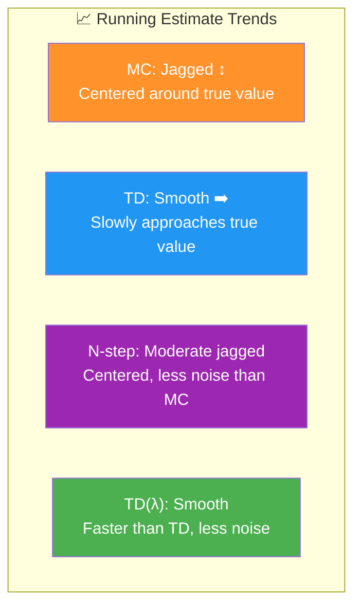

---

## 11. Key Equations Summary

| Concept | Equation |
|---|---|
| Return | $G_t = \sum_{k=0}^{\infty} \gamma^k R_{t+k+1}$ |
| State-value function | $V^\pi(s) = \mathbb{E}_\pi[G_t \mid S_t = s]$ |
| MC update | $V(S_t) \leftarrow V(S_t) + \alpha [G_{t:T} - V(S_t)]$ |
| TD target | $R_{t+1} + \gamma V(S_{t+1})$ |
| TD error | $\delta_t = R_{t+1} + \gamma V(S_{t+1}) - V(S_t)$ |
| TD update | $V(S_t) \leftarrow V(S_t) + \alpha \cdot \delta_t$ |
| N-step return | $G_{t:t+n} = \sum_{k=0}^{n-1} \gamma^k R_{t+k+1} + \gamma^n V(S_{t+n})$ |
| λ-return | $G_t^\lambda = (1-\lambda)\sum_{n=1}^{T-t-1}\lambda^{n-1}G_{t:t+n} + \lambda^{T-t-1}G_{t:T}$ |
| Eligibility trace | $E \leftarrow \gamma \lambda E; \quad E(S_t) \leftarrow E(S_t) + 1$ |
| TD(λ) update | $V \leftarrow V + \alpha \cdot \delta_t \cdot E$ |

---

## 12. Russell and Norvig's Gridworld (RNG) Environment

Chapter 5 မှာ RW အပြင် RNG environment ကိုလည်း test ပါတယ်:

```
 0    1    2    3(G +1)
 4    5   [W]   7(H -1)
 8(S) 9   10   11
```

- S = Start (state 8), G = Goal (+1), H = Hole (–1), W = Wall
- Transition: 80% success, 10% left-slip, 10% right-slip
- Living penalty: –0.04

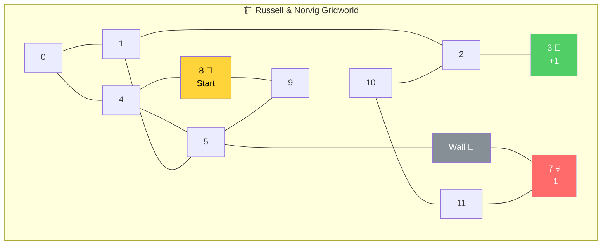

> 💡 RNG environment results: TD နှင့် TD(λ) → smoothest curves။ MC နှင့် n-step TD → most centered trends။ TD(λ) → TD ရဲ့ smoothness + MC ထက် faster convergence!

---

## 13. RL Terminology Recap

| Term | Meaning |
|---|---|
| **Incremental** | Estimates ကို iteratively improve (DP, bandits, RL) |
| **Sequential** | Multi-state environment (DP, RL — bandits မဟုတ်) |
| **Trial-and-error** | Environment interaction ကနေ learn (bandits, RL — DP မဟုတ်) |
| **Experience tuple** | $(S_t, A_t, R_{t+1}, S_{t+1})$ |
| **Trajectory** | Sequence of experience tuples (one episode) |
| **Bootstrapping** | Estimate ကနေ estimate ကို update (TD, DP) |
| **Prediction problem** | Policy ရဲ့ value function ကို estimate (this chapter) |
| **Control problem** | Optimal policy ကို ရှာ (next chapter) |

---

## 14. နိဂုံးချုပ်

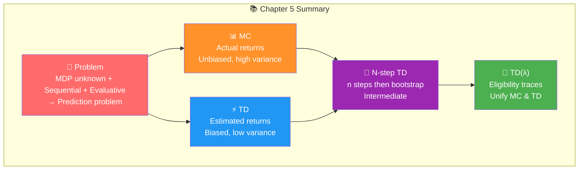

### အဓိက သိရမယ့်အချက်များ:

1. **MC prediction** — actual returns ကို average ယူပြီး $V^\pi(s)$ estimate; unbiased but high variance
2. **TD learning** — bootstrapping ဖြင့် step တိုင်း update; biased but low variance and sample efficient
3. **N-step TD** — MC နှင့် TD ကြားမှာ spectrum; intermediate $n$ က often best
4. **TD(λ)** — eligibility traces ဖြင့် all n-step returns ကို weighted combination; λ=0 → TD, λ=1 → MC
5. **Bias-variance trade-off** — MC (unbiased, high var) ↔ TD (biased, low var) ကို tuning ဖြင့် balance
6. **Prediction problem** — policy ရဲ့ value ကို estimate (control problem = next chapter)

> **Chapter 5 → Chapter 6:** Chapter 5 မှာ policy value ကို **estimate** (prediction) လုပ်တတ်ပြီ — Chapter 6 မှာ policy ကိုပဲ **improve** (control) လုပ်ဖို့ သင်ယူပါမယ်။ MC + TD methods ကို policy improvement နှင့် ပေါင်းပြီး optimal behavior ကို ရှာပါမယ်!

---

*Summary created from: Miguel Morales - Grokking Deep Reinforcement Learning (2020, Manning Publications) — Chapter 5*
