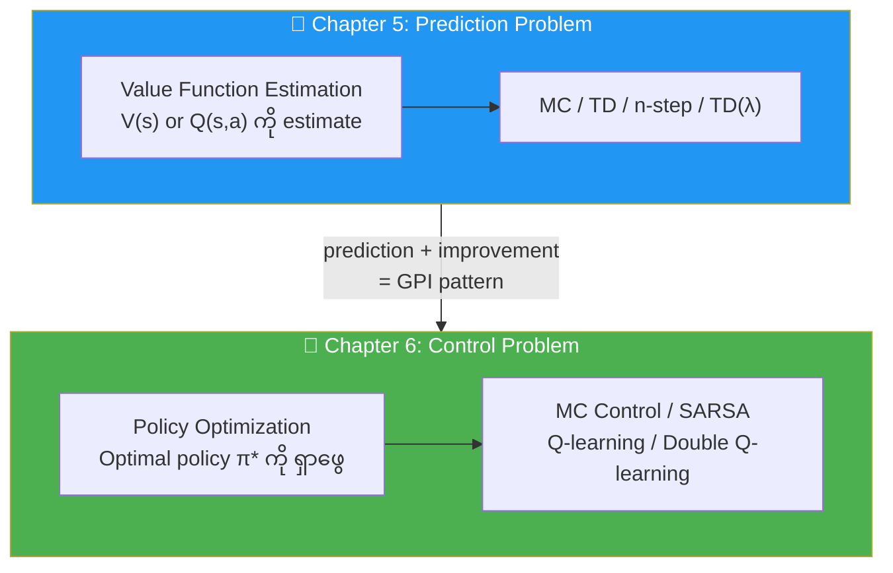
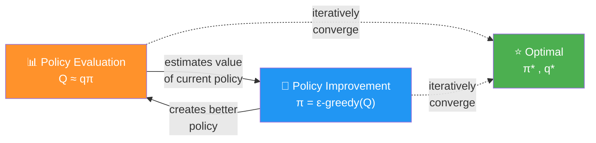
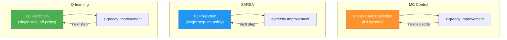
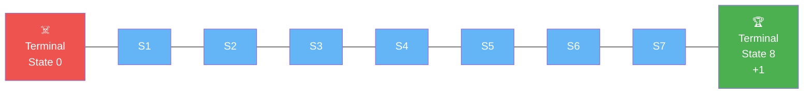
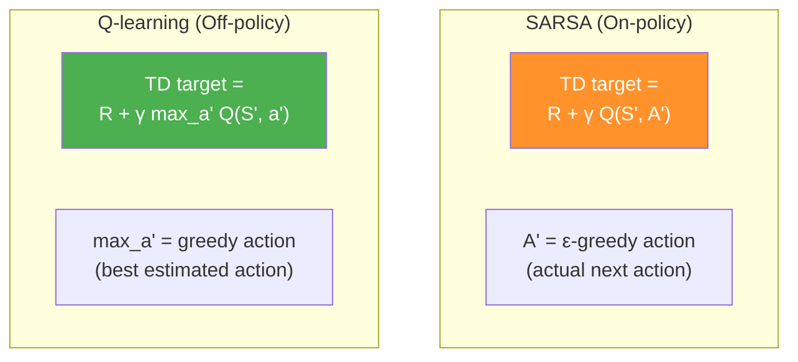
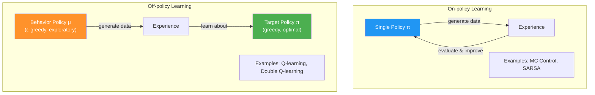
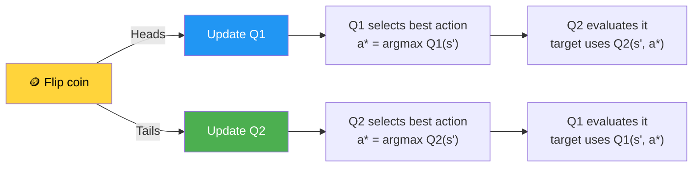
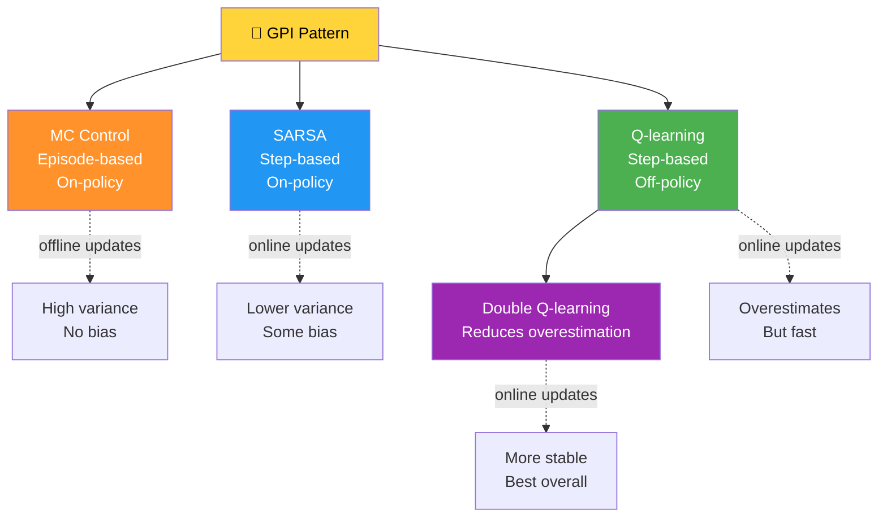

# Chapter 6: Improving Agents' Behaviors - အကျဉ်းချုပ်

## 1. Chapter ရဲ့ ရည်ရွယ်ချက်

ဒီ Chapter မှာ **control problem** ကို ဖြေရှင်းဖို့ agents တွေကို optimal policies ရှာဖွေနိုင်အောင် သင်ကြားပါတယ်။ Chapter 5 မှာ prediction problem (value function estimation) ကို ဖြေရှင်းခဲ့ပြီး, ဒီ Chapter မှာတော့ agent တွေက trial-and-error learning ဖြင့် arbitrary policies ကနေ optimal policies ဆီ ရောက်အောင် တတ်မြောက်ပါတယ်။
ကွန်ဖြူးရှပ်ရဲ့ စကား
```bash
"ပန်းတိုင်ကို မရောက်နိုင်တော့ဘူးဆိုတာ ထင်ရှားနေတဲ့အခါ၊ ပန်းတိုင်ကို မပြင်ပါနဲ့၊ လုပ်ဆောင်ရမယ့် အဆင့်တွေကိုပဲ ပြင်ဆင်ပါ"။
```



အဓိက အကြောင်းအရာများ:
1. **Generalized Policy Iteration (GPI)** pattern
2. **MC Control** — episode ပြီးမှ policy improve
3. **SARSA** — step တိုင်းမှာ on-policy improvement
4. **Q-learning** — off-policy optimal policy learning
5. **Double Q-learning** — maximization bias ဖြေရှင်းခြင်း

---

## 2. Prediction Problem vs Control Problem

### Terminology Clarification

| Term | Meaning |
|---|---|
| **Prediction Problem** | Policy ရဲ့ value function ကို estimate လုပ်ခြင်း |
| **Control Problem** | Optimal policy ကို ရှာဖွေခြင်း |
| **Policy Evaluation** | Prediction problem ကို solve လုပ်သော algorithms |
| **Policy Improvement** | Policy ကို greedier ဖြစ်အောင် improve လုပ်ခြင်း |

> 💡 Control problem ကို solve လုပ်ဖို့ policy evaluation + policy improvement ကို **combine** လုပ်ရပါတယ်။ Policy improvement တစ်ခုတည်း နဲ့မရပါ။

---

## 3. Generalized Policy Iteration (GPI)

### GPI Pattern

GPI ဆိုတာ policy evaluation နှင့် policy improvement ကို **အပြန်အလှန်** interact လုပ်ပြီး progressively optimal policy ဆီ ရွေ့သွားတဲ့ pattern ဖြစ်ပါတယ်။



### GPI ၏ အဓိက Insight

$$\text{Policy Evaluation} \xrightarrow{\text{makes V consistent with } \pi} \text{Policy Improvement} \xrightarrow{\text{makes } \pi \text{ greedy w.r.t. V}} \text{Better Policy}$$

- **Policy evaluation** — current policy ရဲ့ value function ကို accurate ဖြစ်အောင် estimate
- **Policy improvement** — estimated value function ကို အခြေခံ၍ policy ကို greedier ဖြစ်အောင် update
- ဒီ two processes ကို repeatedly alternate လုပ်ခြင်းဖြင့် optimal policy ဆီရောက်ပါတယ်

---

## 4. MC Control vs SARSA vs Q-learning Comparison

### Key Changes from Prediction to Control

Control problem ကို solve လုပ်ဖို့ changes ၂ ခု လိုပါတယ်:

1. **V(s) အစား Q(s,a) ကို estimate လုပ်ရမယ်** — V-function နဲ့ MDP မရှိဘဲ best action ဘယ်ဟာလဲ ဆိုတာ ဆုံးဖြတ်လို့မရပါ
2. **Exploration လုပ်ရမယ်** — greedy policy သာ follow ခဲ့ရင် better actions ကို discover မလုပ်နိုင်ပါ



### Algorithms Comparison Table

| Feature | MC Control | SARSA | Q-learning | Double Q-learning |
|---|---|---|---|---|
| **Policy Evaluation** | MC (full episode) | TD (one-step) | TD (one-step) | TD (one-step) |
| **Update Timing** | Episode ပြီးမှ | Step တိုင်း | Step တိုင်း | Step တိုင်း |
| **On/Off-policy** | On-policy | On-policy | Off-policy | Off-policy |
| **Bootstrapping** | No | Yes | Yes | Yes |
| **Overestimation** | Low | Low | High | Mitigated |

---

## 5. Slippery Walk Seven (SWS) Environment

ဒီ Chapter ရဲ့ experiments တွေအတွက် **Slippery Walk Seven (SWS)** environment ကို အသုံးပြုပါတယ်။



**SWS Environment Properties:**
- Non-terminal states: 7 (states 1-7)
- Terminal states: 0 (left) နှင့် 8 (right, reward +1)
- Actions: Left (0), Right (1)
- **Slippery**: 50% intended direction, 33% stay, 17% opposite direction
- Agent က state IDs နှင့် action numbers ကိုသာ မြင်ရပြီး environment ရဲ့ structure ကို မသိပါ

---

## 6. Monte Carlo Control

### Algorithm Overview

MC Control သည် MC prediction ကို policy evaluation အတွက် သုံးပြီး decaying ε-greedy ကို policy improvement အတွက် သုံးပါတယ်။ Episode တစ်ခုပြီးတိုင်း policy ကို improve လုပ်ပါတယ်။

### MC Control Update Rule

$$Q(s, a) \leftarrow Q(s, a) + \alpha \Big[ G_t - Q(s, a) \Big]$$

where $G_t = \sum_{k=0}^{T-t-1} \gamma^k R_{t+k+1}$ (full return from time step $t$)

### Key Components

```python
# Decay Schedule (exponential)
values = np.logspace(log_start, 0, decay_steps, base=log_base)[::-1]
values = (values - values.min()) / (values.max() - values.min())
values = (init_value - min_value) * values + min_value

# Epsilon-greedy action selection
select_action = lambda state, Q, epsilon: \
    np.argmax(Q[state]) if np.random.random() > epsilon \
    else np.random.randint(len(Q[state]))

# MC Control Update (inside episode loop)
G = np.sum(discounts[:n_steps] * trajectory[t:, 2])
Q[state][action] += alphas[e] * (G - Q[state][action])
```

> 💡 MC Control သည် episode ပြီးမှသာ update လုပ်နိုင်တဲ့အတွက် **offline (episode-to-episode)** method ဖြစ်ပါတယ်။ Variance မြင့်ပေမယ့် bias နည်းပါတယ်။

---

## 7. SARSA (State-Action-Reward-State-Action)

### Algorithm Overview

SARSA သည် TD prediction ကို policy evaluation အတွက် သုံးပြီး ε-greedy ကို improvement အတွက် သုံးပါတယ်။ **On-policy** method ဖြစ်ပြီး every step မှာ update လုပ်ပါတယ်။

### SARSA Update Rule

$$Q(S_t, A_t) \leftarrow Q(S_t, A_t) + \alpha \Big[ R_{t+1} + \gamma Q(S_{t+1}, A_{t+1}) - Q(S_t, A_t) \Big]$$

- $A_{t+1}$ — agent က **actually ယူမယ့်** action (ε-greedy ကနေ select)
- TD target: $R_{t+1} + \gamma Q(S_{t+1}, A_{t+1})$

### SARSA Implementation Key

```python
# SARSA: next action ကို ε-greedy နဲ့ select
action = select_action(state, Q, epsilons[e])
next_state, reward, done, _ = env.step(action)
next_action = select_action(next_state, Q, epsilons[e])

# TD target uses the ACTUAL next action
td_target = reward + gamma * Q[next_state][next_action] * (not done)
td_error = td_target - Q[state][action]
Q[state][action] += alphas[e] * td_error

state, action = next_state, next_action
```

> 💡 SARSA ရဲ့ name ရဲ့ origin — **(S**tate, **A**ction, **R**eward, next **S**tate, next **A**ction) — tuple ကိုအခြေခံထားပါတယ်။

---

## 8. Q-learning

### Algorithm Overview

Q-learning သည် **off-policy** method ဖြစ်ပြီး behavior policy (ε-greedy) နဲ့ target policy (greedy) ကို ခွဲထားပါတယ်။ Agent က randomly explore လုပ်နေလည်း optimal Q-function ကို approximate လုပ်နိုင်ပါတယ်။

### Q-learning Update Rule

$$Q(S_t, A_t) \leftarrow Q(S_t, A_t) + \alpha \Big[ R_{t+1} + \gamma \max_{a'} Q(S_{t+1}, a') - Q(S_t, A_t) \Big]$$

### SARSA vs Q-learning — Key Difference



| | SARSA | Q-learning |
|---|---|---|
| **Next action in target** | $Q(S_{t+1}, A_{t+1})$ — actually taken action | $\max_{a'} Q(S_{t+1}, a')$ — max over all actions |
| **Policy type** | On-policy | Off-policy |
| **Learning about** | Behavioral policy itself | Optimal policy (greedy) |

### Q-learning Implementation Key

```python
# Q-learning: action selection inside the step loop
action = select_action(state, Q, epsilons[e])
next_state, reward, done, _ = env.step(action)

# TD target uses MAX over next state (not actual next action!)
td_target = reward + gamma * Q[next_state].max() * (not done)
td_error = td_target - Q[state][action]
Q[state][action] += alphas[e] * td_error

state = next_state  # no need to track next_action
```

---

## 9. On-policy vs Off-policy Learning



### Convergence Requirements

**GLIE (Greedy in the Limit with Infinite Exploration):**

On-policy algorithms (MC control, SARSA) အတွက်:
1. State-action pairs အားလုံးကို infinitely often explore လုပ်ရမည်
2. Policy သည် greedy policy ဆီ converge ဖြစ်ရမည်

**Off-policy algorithms (Q-learning)** အတွက်:
- State-action pairs အားလုံးကို sufficiently update လုပ်ရမည် (condition 1 only)

**Stochastic Approximation Theory (learning rate requirements):**

$$\sum_{t=1}^{\infty} \alpha_t = \infty, \quad \sum_{t=1}^{\infty} \alpha_t^2 < \infty$$

> 💡 Practice မှာ small constant learning rate ကို common ဖြင့် သုံးပါတယ်။ Non-stationary environments အတွက်ပိုကောင်းပါတယ်။

---

## 10. Double Q-learning

### Maximization Bias Problem

Q-learning သည် value function ကို **overestimate** လုပ်တတ်ပါတယ်။ Max over **estimates** ကို **estimate of max** အဖြစ် သုံးခြင်းကြောင့် positive bias ဖြစ်ပါတယ်။

$$\max_a \hat{Q}(s, a) \geq \max_a Q^*(s, a)$$

> 💡 Estimates တွေမှာ bias ရှိတယ် (positive/negative)။ Max ယူခြင်းက always positive bias ကို favor လုပ်ပြီး compounding errors ဖြစ်ပါတယ်။

### Double Learning Solution

Q1 နဲ့ Q2 — two separate Q-functions ကို track လုပ်ပါတယ်:



### Double Q-learning Update Equations

If updating $Q_1$:

$$a^* = \arg\max_a Q_1(S_{t+1}, a)$$

$$Q_1(S_t, A_t) \leftarrow Q_1(S_t, A_t) + \alpha \Big[ R_{t+1} + \gamma Q_2(S_{t+1}, a^*) - Q_1(S_t, A_t) \Big]$$

If updating $Q_2$ (mirror):

$$a^* = \arg\max_a Q_2(S_{t+1}, a)$$

$$Q_2(S_t, A_t) \leftarrow Q_2(S_t, A_t) + \alpha \Big[ R_{t+1} + \gamma Q_1(S_{t+1}, a^*) - Q_2(S_t, A_t) \Big]$$

**Action selection:** $Q_1 + Q_2$ ရဲ့ average ကို သုံးပါတယ်:

$$\pi(s) = \arg\max_a \frac{Q_1(s, a) + Q_2(s, a)}{2}$$

---

## 11. Experimental Results (SWS Environment)

### Performance Comparison

| Metric | MC Control | SARSA | Q-learning | Double Q-learning |
|---|---|---|---|---|
| **Convergence speed** | Moderate | Moderate | Fast | Slightly slower than Q |
| **Variance** | High | Lower | Moderate | Low |
| **Overestimation** | Low | Low | High | Controlled |
| **Stability** | Moderate | Good | Jumpy | Best |
| **Optimal policy success** | Slow | Slow | Fast but overshoots | Fastest to 100% |

> 💡 **Double Q-learning** သည် Q-learning ထက် stable ဖြစ်ပြီး optimal policy ကို faster ရောက်ပါတယ်။ Overestimation ကို effectively mitigate လုပ်ပါတယ်။

---

## 12. Key Equations Summary

| Equation | Formula |
|---|---|
| **MC Return** | $G_t = \sum_{k=0}^{T-t-1} \gamma^k R_{t+k+1}$ |
| **MC Control Update** | $Q(s,a) \leftarrow Q(s,a) + \alpha [G_t - Q(s,a)]$ |
| **SARSA Update** | $Q(S_t,A_t) \leftarrow Q(S_t,A_t) + \alpha [R_{t+1} + \gamma Q(S_{t+1},A_{t+1}) - Q(S_t,A_t)]$ |
| **Q-learning Update** | $Q(S_t,A_t) \leftarrow Q(S_t,A_t) + \alpha [R_{t+1} + \gamma \max_{a'} Q(S_{t+1},a') - Q(S_t,A_t)]$ |
| **Double Q Update (Q1)** | $Q_1(S_t,A_t) \leftarrow Q_1 + \alpha [R_{t+1} + \gamma Q_2(S_{t+1}, \arg\max_a Q_1(S_{t+1},a)) - Q_1(S_t,A_t)]$ |
| **GLIE epsilon decay** | $\epsilon \to 0$ as $t \to \infty$ |
| **α requirements** | $\sum \alpha_t = \infty, \; \sum \alpha_t^2 < \infty$ |

---

## 13. နိဂုံးချုပ် (Conclusion)

ဒီ Chapter မှာ သင်ယူခဲ့တဲ့ အဓိက takeaways:

1. **GPI pattern** — policy evaluation + improvement ကို alternate လုပ်ခြင်းဖြင့် optimal policy ကိုရှာပါတယ်
2. **MC Control** — episode ပြီးမှ Q estimates update, high variance but unbiased
3. **SARSA** — on-policy TD method, step-by-step update, stable
4. **Q-learning** — off-policy TD method, learns optimal policy regardless of behavior policy
5. **Double Q-learning** — maximization bias ကို mitigate, more stable convergence
6. **On-policy vs Off-policy** — each has pros and cons; off-policy ကို bootstrapping + function approximation နဲ့ combine ရင် divergence ဖြစ်နိုင်


