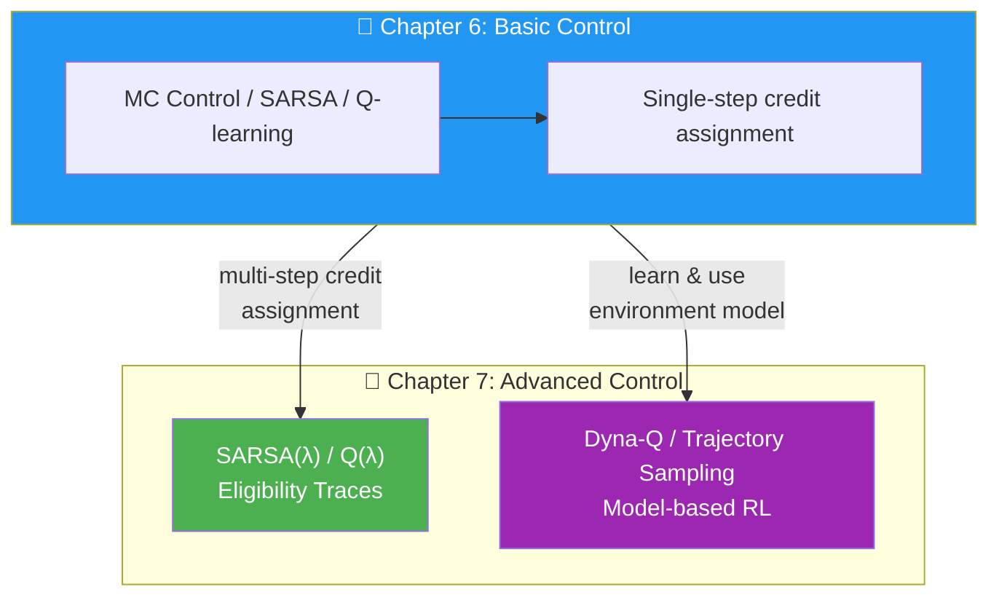
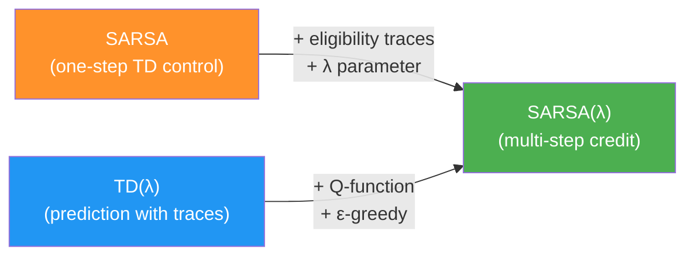
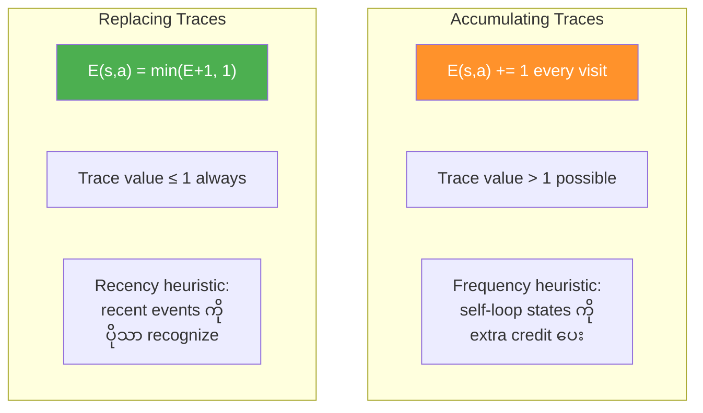
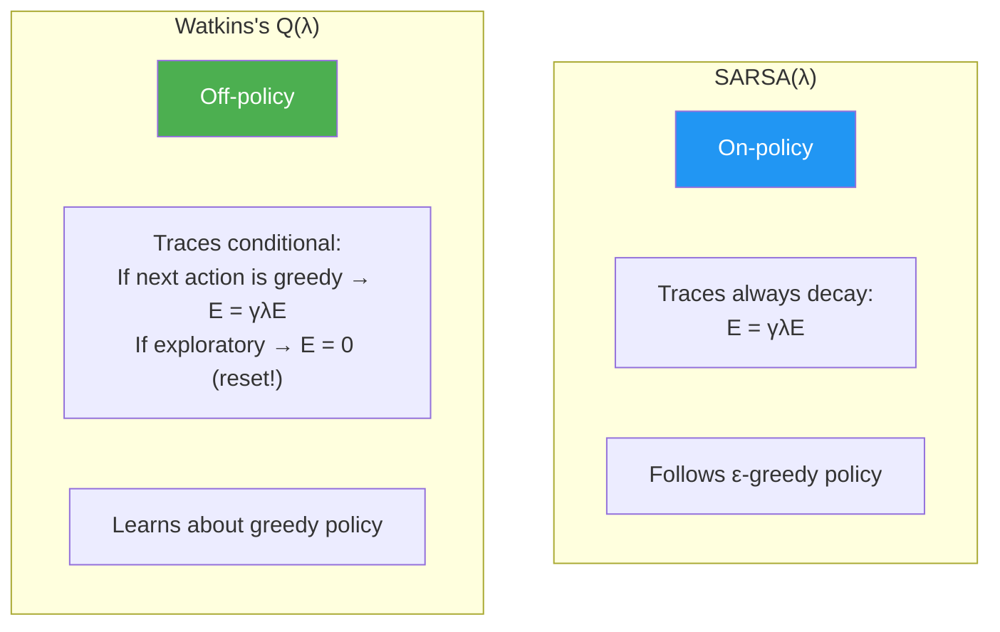
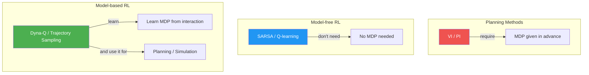
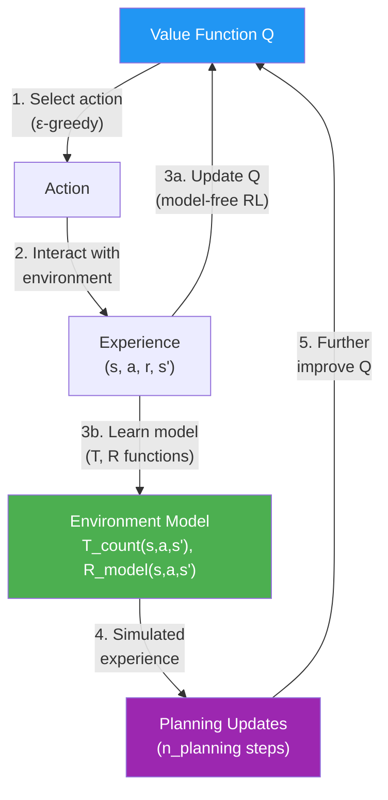
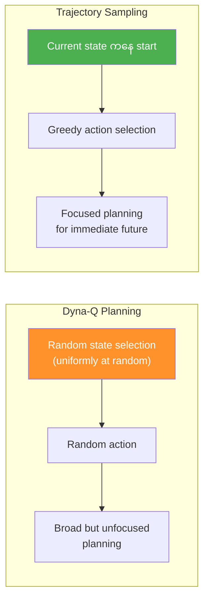
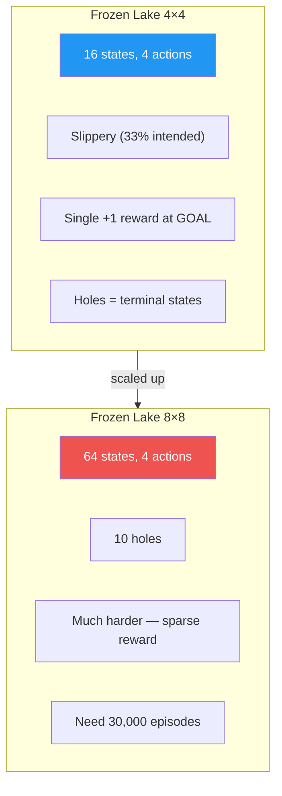
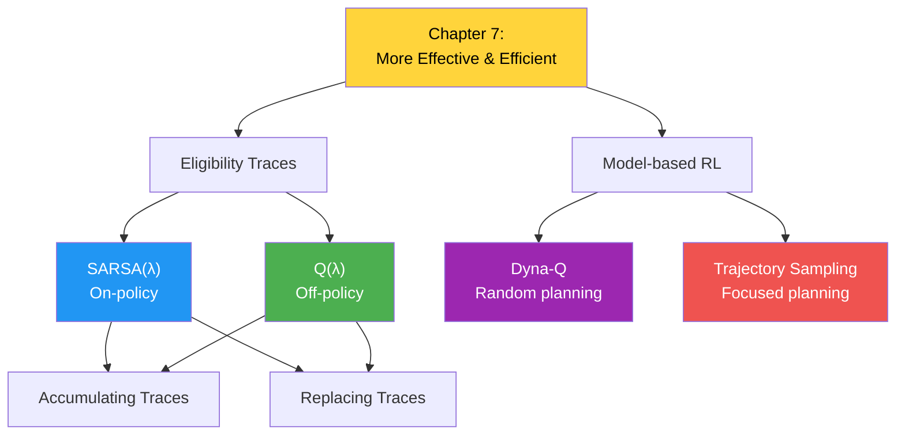

# Chapter 7: Achieving Goals More Effectively and Efficiently - အကျဉ်းချုပ်

## 1. Chapter ရဲ့ ရည်ရွယ်ချက်

ဒီ Chapter မှာ Chapter 6 ရဲ့ control methods တွေကို **ပိုမို effective** (ရလဒ်ပိုကောင်း) နှင့် **ပိုမို efficient** (data ပိုနည်းသုံး) ဖြစ်အောင် improve လုပ်ပါတယ်။ Eligibility traces ဖြင့် credit assignment ကို ပိုကောင်းအောင်လုပ်ပြီး model-based methods ဖြင့် sample efficiency ကို မြှင့်တင်ပါတယ်။



အဓိက အကြောင်းအရာများ:
1. **SARSA(λ)** — on-policy control with eligibility traces
2. **Watkins's Q(λ)** — off-policy control with eligibility traces
3. **Accumulating vs Replacing traces**
4. **Dyna-Q** — model-free + model-based RL ပေါင်းစပ်
5. **Trajectory Sampling** — smarter planning strategy

---

## 2. SARSA(λ) — Eligibility Traces for On-policy Control

### SARSA(λ) Overview

SARSA(λ) သည် SARSA + TD(λ) ကို ပေါင်းစပ်ထားပါတယ်။ Chapter 5 မှာ prediction အတွက် သင်ယူခဲ့တဲ့ eligibility traces ကို **control** (Q-function learning) အတွက် apply လုပ်ပါတယ်။



### SARSA(λ) Update Equations

**Eligibility Trace Update:**

$$E_t(s, a) = \begin{cases} E_{t-1}(s,a) + 1 & \text{if } s = S_t, a = A_t \\ \gamma \lambda \, E_{t-1}(s,a) & \text{otherwise} \end{cases}$$

**Q-function Update (all state-action pairs at once):**

$$Q(s, a) \leftarrow Q(s, a) + \alpha \, \delta_t \, E_t(s, a), \quad \forall s, a$$

where TD error: $\delta_t = R_{t+1} + \gamma Q(S_{t+1}, A_{t+1}) - Q(S_t, A_t)$

### SARSA(λ) Implementation Key

```python
# Initialize eligibility traces
E = np.zeros((nS, nA), dtype=np.float64)

# Inside episode loop
E.fill(0)  # reset traces every episode
while not done:
    next_action = select_action(next_state, Q, epsilons[e])
    td_target = reward + gamma * Q[next_state][next_action] * (not done)
    td_error = td_target - Q[state][action]
    
    E[state][action] += 1                    # increment trace
    if replacing_traces: E.clip(0, 1, out=E) # clip to 1 if replacing
    
    Q = Q + alphas[e] * td_error * E         # update ALL eligible pairs
    E = gamma * lambda_ * E                  # decay traces
```

---

## 3. Accumulating Traces vs Replacing Traces

### Key Difference



| Feature | Accumulating Traces | Replacing Traces |
|---|---|---|
| **Multiple visits** | Trace value increases > 1 | Trace value clipped to 1 |
| **Heuristic** | Frequency + Recency | Recency dominant |
| **Loop environments** | Frequently visited states ကို over-credit | More balanced credit |
| **When to use** | Frequency matters | When loops/repeated visits occur |

> 💡 Accumulating traces သည် frequency ကို emphasize လုပ်ပြီး replacing traces သည် recency ကို moderate ပြန်လုပ်ပါတယ်။ Loops ရှိတဲ့ environments မှာ replacing traces ကပိုကောင်းတတ်ပါတယ်။

---

## 4. Watkins's Q(λ) — Off-policy Control with Traces

### Q(λ) Overview

Q(λ) သည် Q-learning + eligibility traces ကို ပေါင်းစပ်ထားပါတယ်။ Off-policy method ဖြစ်တဲ့အတွက် trace management ကို **careful** ဖြစ်ရပါတယ်။

### Key Difference from SARSA(λ)



### Q(λ) Trace Reset Logic

$$E_t = \begin{cases} \gamma \lambda \, E_{t-1} & \text{if } A_{t+1} = \arg\max_a Q(S_{t+1}, a) \\ 0 & \text{otherwise (exploratory action)} \end{cases}$$

> 💡 Exploratory action ယူတဲ့အခါ traces ကို **reset** လုပ်ပါတယ်။ ဘာကြောင့်ဆိုတော့ off-policy learning မှာ greedy policy ကို learn နေတာဖြစ်ပြီး exploratory action ယူပြီးရင် greedy trajectory ကနေ ထွက်သွားတာမို့ traces ရဲ့ validity ကျသွားပါတယ်။

### Q(λ) Implementation Key

```python
# Q(λ): conditional trace update
if replacing_traces: E[state].fill(0)  # zero out all actions of current state
E[state][action] += 1
Q = Q + alphas[e] * td_error * E

# Check if next action is greedy
next_action_is_greedy = (Q[next_state][next_action] == Q[next_state].max())
if next_action_is_greedy:
    E = gamma * lambda_ * E   # normal decay
else:
    E.fill(0)                  # reset all traces!
```

---

## 5. Model-based Reinforcement Learning

### Planning vs Model-free vs Model-based



| Method Type | MDP Required? | MDP Learned? | Sample Efficiency |
|---|---|---|---|
| **Planning** (VI, PI) | Yes (given) | No | N/A (computes directly) |
| **Model-free** (SARSA, Q) | No | No | Low (only real experience) |
| **Model-based** (Dyna-Q) | No | Yes (learns from data) | High (real + simulated) |

---

## 6. Dyna-Q

### Dyna-Q Architecture

Dyna-Q သည် Q-learning + model learning + planning ကို ပေါင်းစပ်ထားပါတယ်။ Real experience ကနေ Q-function ကို update လုပ်ရုံသာမက environment model ကိုလည်း learn ပြီး simulated experience ကနေလည်း Q-function ကို ထပ်မံ update လုပ်ပါတယ်။



### Dyna-Q Model Learning

**Transition function** ကို count-based approach ဖြင့် learn:

$$\hat{T}(s'|s, a) = \frac{\text{count}(s, a, s')}{\sum_{s''} \text{count}(s, a, s'')}$$

**Reward function** ကို incremental mean ဖြင့် learn:

$$\hat{R}(s, a, s') \leftarrow \hat{R}(s, a, s') + \frac{r - \hat{R}(s, a, s')}{\text{count}(s, a, s')}$$

### Dyna-Q Planning Phase

```python
# Planning: sample from learned model
for _ in range(n_planning):
    if Q.sum() == 0: break
    # Sample previously visited state
    visited_states = np.where(np.sum(T_count, axis=(1,2)) > 0)[0]
    state = np.random.choice(visited_states)
    # Sample previously taken action
    actions_taken = np.where(np.sum(T_count[state], axis=1) > 0)[0]
    action = np.random.choice(actions_taken)
    # Sample next state from learned model
    probs = T_count[state][action] / T_count[state][action].sum()
    next_state = np.random.choice(np.arange(nS), size=1, p=probs)[0]
    reward = R_model[state][action][next_state]
    # Q-learning update with simulated experience
    td_target = reward + gamma * Q[next_state].max()
    Q[state][action] += alphas[e] * (td_target - Q[state][action])
```

> 💡 Dyna-Q သည် state-action pairs ကို **uniformly at random** sample ပါတယ်။ ဒါက effective ပေမယ့် optimal sampling strategy မဟုတ်ပါ။

---

## 7. Trajectory Sampling

### Trajectory Sampling vs Dyna-Q

Trajectory Sampling သည် Dyna-Q ရဲ့ improved version ဖြစ်ပြီး **immediate future** အတွက် plan ပါတယ်။ Random state ကို sample လုပ်မည့်အစား current greedy trajectory ကို sample ပါတယ်။



| Feature | Dyna-Q | Trajectory Sampling |
|---|---|---|
| **State sampling** | Uniformly random from visited | Follow greedy trajectory from current |
| **Action sampling** | Random from taken actions | Greedy w.r.t. current Q |
| **Planning focus** | Broad, unfocused | Immediate future, focused |
| **Reward encounter** | Proportional to MDP | More frequent (goal-directed) |

### Trajectory Sampling Planning Phase

```python
for _ in range(max_trajectory_depth):
    if Q.sum() == 0: break
    action = Q[state].argmax()                    # greedy action
    if not T_count[state][action].sum(): break    # no experience for this
    probs = T_count[state][action] / T_count[state][action].sum()
    next_state = np.random.choice(np.arange(nS), size=1, p=probs)[0]
    reward = R_model[state][action][next_state]
    td_target = reward + gamma * Q[next_state].max()
    Q[state][action] += alphas[e] * (td_target - Q[state][action])
    state = next_state  # follow the trajectory!
```

---

## 8. Frozen Lake Environments

### Test Environments

ဒီ Chapter မှာ SWS အပြင် **Frozen Lake (FL)** နှင့် **Frozen Lake 8×8 (FL8×8)** environments ကိုလည်း test ပါတယ်။



### Environment Hyperparameters

| Environment | Episodes | γ | Alpha decay | Epsilon decay |
|---|---|---|---|---|
| SWS | 3,000 | 1.0 | 0.5→0.01 (50%) | 1.0→0.1 (90%) |
| FL 4×4 | 10,000 | 0.99 | 0.5→0.01 (50%) | 1.0→0.1 (90%) |
| FL 8×8 | 30,000 | 0.99 | 0.5→0.01 (50%) | 1.0→0.1 (90%) |

---

## 9. Experimental Results

### Key Findings

| Method | SWS | FL 4×4 | FL 8×8 | Sample Efficiency |
|---|---|---|---|---|
| **SARSA(λ)** | OK | Slow | ❌ Too slow | Low |
| **Q(λ)** | Good | Good | ✅ Converges | Medium-High |
| **Dyna-Q** | Good | Fast | ✅ Fast but spiky | High |
| **Trajectory Sampling** | Good | Fast | ✅ Fast & stable | Highest |

> 💡 **Model-based methods** (Dyna-Q, Trajectory Sampling) သည် model-free methods ထက် sample efficient ပိုဖြစ်ပါတယ်။ Dyna-Q မှာ initial error spike ရှိနိုင်ပေမယ့် trajectory sampling မှာ ပိုမို stable ဖြစ်ပါတယ်။

---

## 10. Key Equations Summary

| Equation | Formula |
|---|---|
| **SARSA(λ) trace** | $E_t(s,a) = \gamma \lambda E_{t-1}(s,a) + \mathbb{1}[s=S_t, a=A_t]$ |
| **SARSA(λ) Q update** | $Q(s,a) \leftarrow Q(s,a) + \alpha \delta_t E_t(s,a)$ |
| **SARSA(λ) TD error** | $\delta_t = R_{t+1} + \gamma Q(S_{t+1}, A_{t+1}) - Q(S_t, A_t)$ |
| **Q(λ) trace (greedy)** | $E_t = \gamma \lambda E_{t-1}$ |
| **Q(λ) trace (exploratory)** | $E_t = 0$ (reset all) |
| **Dyna-Q transition model** | $\hat{T}(s'\|s,a) = \frac{\text{count}(s,a,s')}{\sum_{s''}\text{count}(s,a,s'')}$ |
| **Dyna-Q reward model** | $\hat{R}(s,a,s') \leftarrow \hat{R} + \frac{r - \hat{R}}{\text{count}(s,a,s')}$ |

---

## 11. နိဂုံးချုပ် (Conclusion)

ဒီ Chapter မှာ သင်ယူခဲ့တဲ့ အဓိက takeaways:

1. **SARSA(λ)** — eligibility traces ဖြင့် on-policy control, λ parameter ဖြင့် credit assignment depth ကို control
2. **Q(λ)** — off-policy λ-return method, exploratory action ယူရင် traces reset
3. **Accumulating vs Replacing traces** — frequency vs recency trade-off
4. **Dyna-Q** — model-free RL + model learning + planning ပေါင်းစပ်, sample efficiency boost
5. **Trajectory Sampling** — greedy trajectory ဖြင့် focused planning, Dyna-Q ထက် stable
6. **Model-based RL** — experience samples ကို အကျိုးရှိဆုံး အသုံးချနိုင်, complex environments မှာ ပိုအရေးကြီး



> 💡 ဒီ Chapter ပြီးနောက် tabular RL (discrete states/actions) ကနေ **deep RL** (continuous/high-dimensional states) ဆီ ကူးပြောင်းပါမယ်။ Chapter 8 ကနေစပြီး function approximation (neural networks) ကို introduce လုပ်ပါမယ်။
