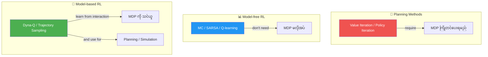
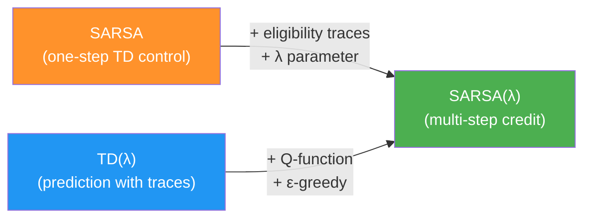
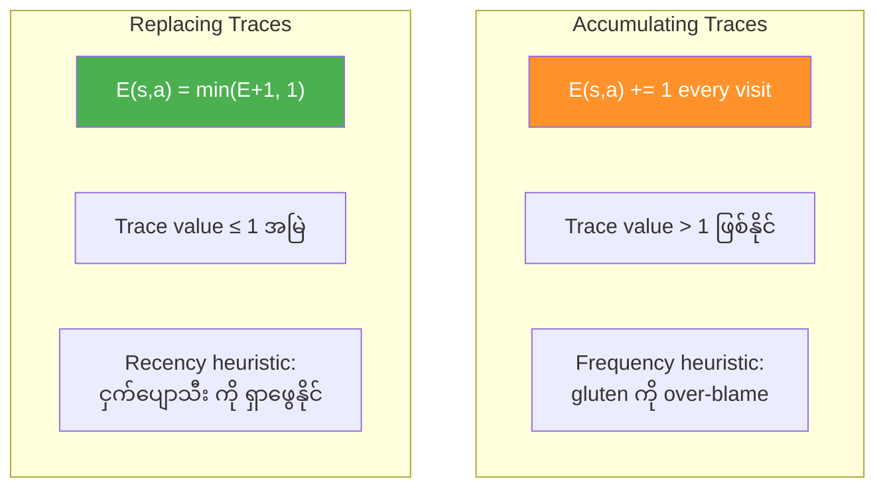
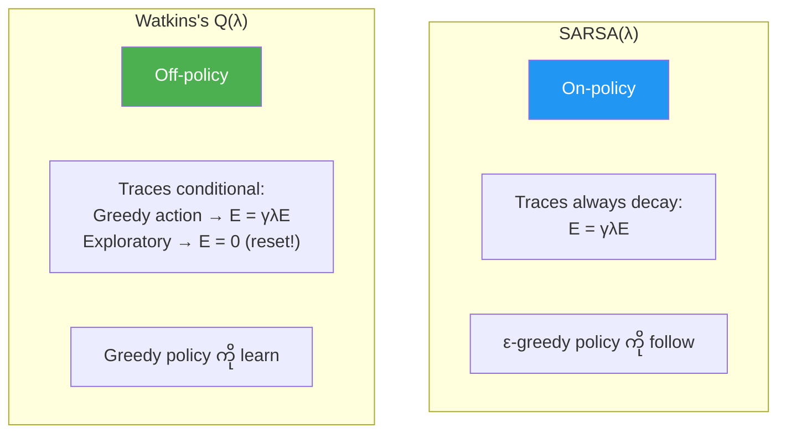
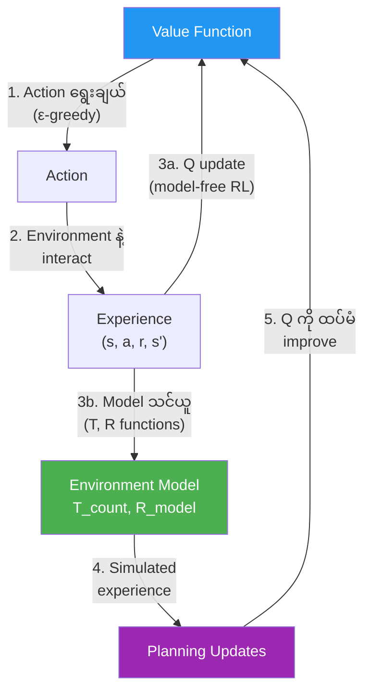
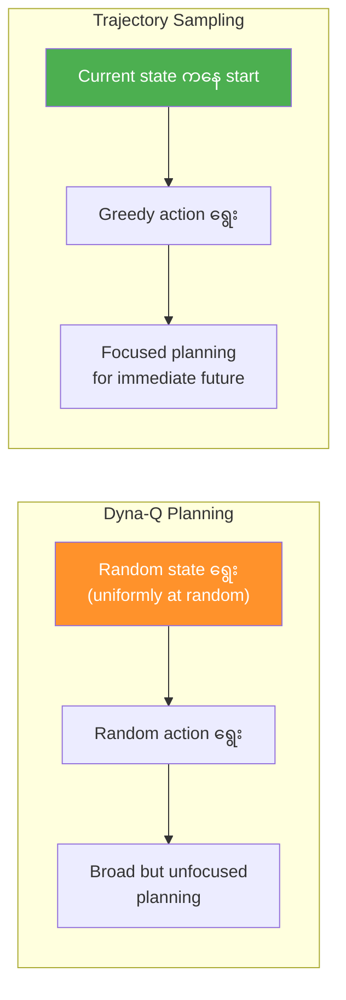
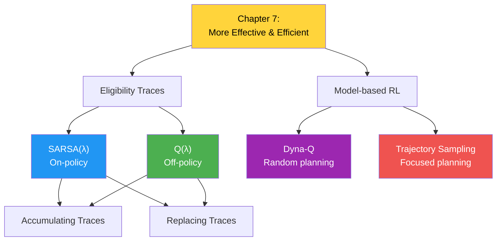

# အခန်း ၇ — ပန်းတိုင်များကို ပိုမိုထိရောက်စွာ နှင့် ပိုမိုအကျိုးရှိစွာ ရရှိခြင်း (Achieving Goals More Effectively and Efficiently)

> *"Efficiency ဆိုတာ အမှန်ကန်ဆုံးနည်းလမ်းနဲ့ လုပ်ဆောင်ခြင်းဖြစ်ပြီး、Effectiveness ဆိုတာ အမှန်ကန်ဆုံးအရာကို လုပ်ဆောင်ခြင်းဖြစ်တယ်။"*
> — Peter Drucker (ခေတ်သစ် management ၏ ဖခင်)

## ဒီအခန်းမှာ သင်ယူရမည့်အချက်များ

- Reinforcement learning agent များကို ခက်ခဲတဲ့ environments များမှာ optimal performance ဆီ ရောက်ရှိရာတွင် **ပိုမိုထိရောက်စွာ (more effective)** ဖြစ်အောင် လုပ်နည်းကို သင်ယူရမည်။
- Agent များက experience data ကို အကျိုးရှိဆုံး အသုံးချပြီး ပန်းတိုင်များကို **ပိုမိုအကျိုးရှိစွာ (more efficient)** ရရှိအောင် လုပ်နည်းကို သင်ယူရမည်။
- ယခင် chapters များမှ agent များကို improve လုပ်ပြီး data ကို အများဆုံး အသုံးချကာ performance ကို ပိုမြန်ဆန်စွာ optimize လုပ်ရမည်။

---

## ၇.၁ — နိဒါန်း

ဒီအခန်းမှာ ယခင်အခန်းက agent များကို improvement လုပ်ပါတယ်။ Improvement line ၂ ခု ရှိပါတယ်:

### ပထမ improvement line — λ-return ဖြင့် ပိုခိုင်မာတဲ့ target များသုံးခြင်း

Chapter 5 မှာ သင်ယူခဲ့တဲ့ **λ-return** ကို generalized policy iteration (GPI) pattern ရဲ့ policy evaluation လိုအပ်ချက်များအတွက် အသုံးပြုပါတယ်။ On-policy နှင့် off-policy methods နှစ်မျိုးလုံးအတွက် λ-return ကို explore လုပ်ပါတယ်။ **Eligibility traces** ဖြင့် λ-return ကို အသုံးပြုခြင်းဖြင့် credit ကို မှန်ကန်တဲ့ state-action pairs များဆီ ပိုမြန်ဆန်စွာ ပြန့်ပွားစေပြီး value-function estimates များ actual values များနဲ့ ပိုမြန်နီးကပ်လာစေပါတယ်။

### ဒုတိယ improvement line — Environment model ကို သင်ယူခြင်း

Experience samples များကို အသုံးပြုပြီး environment ရဲ့ model (MDP) ကို သင်ယူတဲ့ algorithms များကို explore လုပ်ပါတယ်။ ဒီနည်းဖြင့် data ကို အများဆုံး exploit လုပ်ပြီး model မသင်ယူတဲ့ methods များထက် optimal policy ဆီ ပိုမြန်ရောက်တတ်ပါတယ်။ ဒီ algorithms group ကို **model-based reinforcement learning** လို့ ခေါ်ပါတယ်။

> 💡 ဒီ improvement lines ၂ ခုကို သီးခြားစီ explore လုပ်ပေမယ့်、ပေါင်းစပ်ခြင်းကို တားမြစ်တာ မရှိပါ။ Chapter ပြီးရင် ပေါင်းစပ်ကြည့်သင့်ပါတယ်။

---

### RL အသုံးအနှုန်း — Planning vs. Model-free RL vs. Model-based RL

| Method Type | ရှင်းလင်းချက် | ဥပမာ |
|---|---|---|
| **Planning** | Environment ရဲ့ model (MDP) ကို **လိုအပ်**ပြီး policy ထုတ်ပေးတယ်။ State-space planning (state space ထဲ search) ဒါမှမဟုတ် plan-space planning (plan အားလုံး space ထဲ search) ဖြစ်နိုင်တယ်။ | Value Iteration, Policy Iteration |
| **Model-free RL** | Environment model **မလိုအပ်ဘဲ** policy ထုတ်ပေးနိုင်တယ်။ MDP/map/model မသုံးဘဲ trial-and-error learning ဖြင့် policies ရရှိတယ်။ | MC, SARSA, Q-learning |
| **Model-based RL** | Model ကို **ကြိုတင်မလိုအပ်**ပေမယ့်、interaction ဖြင့် **သင်ယူ**ပြီး အသုံးပြုတယ်။ | Dyna-Q, Trajectory Sampling |



---

## ၇.၂ — ပိုခိုင်မာသော Target များဖြင့် Policy များကို Improve လုပ်ခြင်း

ဒီ section မှာ policy-evaluation methods များတွင် ပိုခိုင်မာတဲ့ targets သုံးခြင်းကို ဆွေးနွေးပါတယ်။ Chapter 5 မှာ MC approach, TD approach, နှင့် λ-return ကို သုံးတဲ့ targets အမျိုးမျိုးကို အသုံးပြု၍ value functions estimate လုပ်တဲ့ policy-evaluation methods များကို explore လုပ်ခဲ့ပါတယ်။

TD(λ) သည် policy evaluation အတွက် λ-return ကို အသုံးပြုတဲ့ prediction method ဖြစ်ပါတယ်။ Control problem ကို ဖြေရှင်းရာတွင်、action-value functions estimate လုပ်ရန် policy-evaluation method နှင့် exploration ခွင့်ပြုတဲ့ policy-improvement method လိုအပ်ပါတယ်။ ဒီ section မှာ SARSA နှင့် Q-learning နှင့်ဆင်တူပြီး λ-return ကို အသုံးပြုတဲ့ control methods များကို ဆွေးနွေးပါတယ်။

---

### နမူနာ Environment — Slippery Walk Seven (SWS)

ဒီအခန်းရဲ့ algorithms များကို မိတ်ဆက်ရာတွင် ယခင်အခန်းက **Slippery Walk Seven (SWS)** environment ကို ပဲ အသုံးပြုပါတယ်။ Chapter အဆုံးမှာ ပိုခက်ခဲတဲ့ environments များတွင် test ပါမယ်။

```
[☠️ State 0] — [S1] — [S2] — [S3] — [S4] — [S5] — [S6] — [S7] — [🏆 State 8, +1]
```

SWS ၏ properties:
- Non-terminal states ၇ ခု (states 1–7)
- Terminal states: State 0 (reward = 0) နှင့် State 8 (reward = +1)
- Actions: Left (0), Right (1)
- **Slippery** (ချော်တတ်): 50% intended, 33.3% stay, 16.7% opposite

> Agent က transition probabilities ကို access မရပါ။ Environment ၏ dynamics ကို agent မသိပါ။

---

## ၇.၃ — SARSA(λ): Multi-step Estimates အပေါ် အခြေခံ၍ Step တိုင်းပြီးနောက် Policy ကို Improve လုပ်ခြင်း

### SARSA(λ) ဆိုတာ ဘာလဲ

SARSA(λ) သည် မူလ SARSA agent ကို ရိုးရိုးတန်းတန်း improve လုပ်ထားတာပါ။ SARSA နှင့် SARSA(λ) ၏ အဓိက ကွာခြားချက်ကတော့ **one-step bootstrapping target (TD target)** အစား **λ-return** ကို အသုံးပြုခြင်း ဖြစ်ပါတယ်။ ဒါပါပဲ! Basics ကို ကောင်းကောင်း သင်ယူထားခြင်းဖြင့် ပိုရှုပ်ထွေးတဲ့ concepts တွေက ပိုလွယ်ကူသွားတာ မြင်ရမလား?

Chapter 5 မှာ မိတ်ဆက်ခဲ့တဲ့ **eligibility traces** concept ကို ပိုနက်နဲစွာ ဆွေးနွေးပါမယ်။ Chapter 5 မှာ introduce လုပ်ခဲ့တဲ့ eligibility trace အမျိုးအစားကို **accumulating trace** လို့ ခေါ်ပါတယ်။ ဒါပေမယ့် state ဒါမှမဟုတ် state-action pairs များ reward အတွက် တာဝန်ရှိမရှိ trace လုပ်နိုင်တဲ့ နည်းလမ်း အမျိုးမျိုးရှိပါတယ်။

ဒီ section မှာ accumulating trace ကို control problem ဖြေရှင်းရန် adapt လုပ်ပြီး **replacing trace** ဆိုတဲ့ trace အမျိုးအစား အသစ်ကိုလည်း explore လုပ်ပါတယ်။ နှစ်မျိုးလုံးကို SARSA(λ) agent မှာ အသုံးပြုပါတယ်။



---

### သမိုင်းအကျဉ်း — SARSA နှင့် SARSA(λ) ၏ မိတ်ဆက်

1994 ခုနှစ်တွင် **Gavin Rummery** နှင့် **Mahesan Niranjan** တို့က "Online Q-Learning Using Connectionist Systems" ဆိုတဲ့ paper တစ်ပုဒ်ထုတ်ဝေခဲ့ပြီး "Modified Connectionist Q-Learning" လို့ အမည်ပေးခဲ့ပါတယ်။ 1996 ခုနှစ်တွင် **Singh** နှင့် **Sutton** တို့က ဒီ algorithm ကို **SARSA** လို့ အမည်ပြောင်းခဲ့ပါတယ် — algorithm က အသုံးပြုတဲ့ quintuple $(S_t, A_t, R_{t+1}, S_{t+1}, A_{t+1})$ ကြောင့်ဖြစ်ပါတယ်။

ပျော်စရာကတော့ 1995 ခုနှစ် PhD thesis "Problem Solving with Reinforcement Learning" မှာ Gavin က Sutton ကို "Modified Q-Learning" အမည်ကို ဆက်သုံးနေတဲ့အတွက် တောင်းပန်ခဲ့ပါတယ်။ နောက်ဆုံးမှာ SARSA ဆိုတဲ့ အမည်ပဲ RL community မှာ ကျန်ရှိခဲ့ပါတယ်။ Gavin ရဲ့ thesis ကလည်း SARSA(λ) ကို introduce လုပ်ခဲ့ပါတယ်။

PhD ပြီးလို့ Gavin က **Tomb Raider** game series ကို ဖန်တီးတဲ့ company မှာ programmer/lead programmer အဖြစ် အောင်မြင်စွာ အလုပ်လုပ်ခဲ့ပါတယ်။ Mahesan ကတော့ academic career ကို ဆက်လက်လျှောက်လှမ်းခဲ့ပါတယ်။

---

### Control Problem အတွက် Accumulating Trace ကို Adapt လုပ်ခြင်း

Accumulating trace ကို control problem ဖြေရှင်းရန် adapt လုပ်ရာတွင် လိုအပ်တဲ့ ပြောင်းလဲမှု တစ်ခုတည်းကတော့ —visited **states** အစား visited **state-action pairs** ကို track လုပ်ရမယ်ဆိုတာပါ။ Eligibility **vector** (states track လုပ်) အစား eligibility **matrix** (state-action pairs track လုပ်) ကို အသုံးပြုပါတယ်။

### Replacing Trace Mechanism

Replacing trace mechanism ကလည်း ရိုးရိုးတန်းတန်းပါပဲ။ Eligibility traces ကို **maximum value 1** ထိသာ clip လုပ်ခြင်းပါ — boundlessly accumulate လုပ်မည့်အစား traces ကို 1 ထိသာ grow ခွင့်ပြုပါတယ်။ ဒီ strategy ရဲ့ အားသာချက်ကတော့ agent က loop ထဲ ပိတ်မိနေရင်တောင် traces က proportion ပြင်ပကို grow မသွားခြင်း ဖြစ်ပါတယ်။ Replacing trace strategy မှာ state-action pair ကို visit လုပ်တဲ့အခါ trace ကို 1 သို့ set ပြီး、λ value အပေါ် အခြေခံ၍ decay ဖြစ်ပါတယ်။

---

### သမိုင်းအကျဉ်း — Eligibility Trace Mechanism ၏ မိတ်ဆက်

Eligibility trace mechanism ၏ ယေဘုယျ idea ကို **A. Harry Klopf** က 1972 ခုနှစ် paper "Brain Function and Adaptive Systems—A Heterostatic Theory" မှာ ဖော်ပြခဲ့ပါတယ်။ Synapses များ reinforcing events ပြီးနောက် changes များ ခံယူရန် "eligible" ဖြစ်လာမယ်ဟု ယူဆခဲ့ပါတယ်။

RL context မှာတော့ **Richard Sutton** ၏ 1984 PhD thesis က eligibility traces mechanism ကို introduce လုပ်ခဲ့ပါတယ် — **conventional accumulating trace** ဖြစ်ပါတယ်။

**Replacing trace** ကိုတော့ **Satinder Singh** နှင့် **Richard Sutton** တို့က 1996 ခုနှစ် paper "Reinforcement Learning with Replacing Eligibility Traces" မှာ introduce လုပ်ခဲ့ပါတယ်။ သူတို့ တွေ့ရှိချက်များ:

1. Replacing trace က accumulating trace ထက် **ပိုမြန်ပြီး ပိုယုံကြည်ရ** တဲ့ learning ပေးတယ်
2. Accumulating trace က **biased** ဖြစ်ပြီး replacing trace က **unbiased** ဖြစ်တယ်
3. TD(1) with replacing traces ≈ **first-visit MC** ၊ TD(1) with accumulating traces ≈ **every-visit MC**
4. Offline version of replace-trace TD(1) = first-visit MC (identical!)

---

## ၇.၄ — Accumulating Traces vs. Replacing Traces (Frequency နှင့် Recency Heuristics)

### Accumulating Trace ၏ Frequency + Recency Heuristic

Accumulating trace သည် **frequency heuristic** နှင့် **recency heuristic** ကို ပေါင်းစပ်ထားပါတယ်။ Agent က state-action pair တစ်ခုကို try ဖြစ်တဲ့အခါ trace ကို 1 ထပ်ပေါင်းပါတယ်။ Environment မှာ loop ရှိပြီး agent က state-action pair တစ်ခုတည်းကို အကြိမ်ကြိမ် try ဖြစ်ရင်ရော? ဒီ state-action pair ကို future rewards အတွက် **ပိုတာဝန်ရှိ** အောင် လုပ်သင့်သလား、ဒါမဟုတ် **ရိုးရိုးတာဝန်ရှိ** ရုံလောက်ပဲ ဖြစ်သင့်သလား?

- **Accumulating traces** — trace values 1 ထက် ကြီးခွင့်ပြုတယ်
- **Replacing traces** — trace values 1 ထက် ကြီးခွင့်မပြုဘူး

### SWS Environment တွင် Accumulating Traces ၏ ဥပမာ

$\gamma = 0.9$, $\lambda = 0.5$, TD error $= 1$, $\alpha = 0.1$ ဖြင့်:

Agent ၏ trajectory ကို ကြည့်ကြမယ်:

1. Agent က action ယူပြီး state-action pair ရဲ့ trace ကို 1 သို့ set
2. နောက် step တိုင်းမှာ trace ကို $\gamma \lambda = 0.9 \times 0.5 = 0.45$ ဖြင့် decay
3. Same state ကို ပြန်ရောက်ရင် trace ကို **+1 ထပ်ပေါင်း** (accumulating) — trace value > 1 ဖြစ်နိုင်
4. Episode အဆုံးမှာ reward တွေ့ရင် Q-function ကို traces ဖြင့် update

**Accumulating trace ဖြင့် Q update:**

$$Q(s,a) \leftarrow Q(s,a) + \alpha \times \delta_t \times E_t(s,a)$$

Trace values: $0.0041, 0.00911, 0.0203, 0.045, 0.1$ (trace ကြီးလေ Q update ပိုများလေ)

### SWS Environment တွင် Replacing Traces ၏ ဥပမာ

Replacing traces မှာတော့ same state ကို ပြန်ရောက်ရင် trace ကို 1 သို့ **replace** လုပ်ပါတယ် (accumulate မလုပ်)။ Same state ရဲ့ တခြား actions ကို **0 သို့ reset** လုပ်ပြီး current action ကို 1 သို့ set ပါတယ်။

**ရလဒ် ကွာခြားချက်:**

| Feature | Accumulating Traces | Replacing Traces |
|---|---|---|
| **Multiple visits** | Trace value > 1 ဖြစ်နိုင် | Trace value ≤ 1 အမြဲ |
| **Heuristic** | Frequency + Recency | Recency dominant |
| **Loop environments** | Frequent states ကို over-credit | ပိုမျှတဲ့ credit |
| **ဘယ်အခါ သုံးရမလဲ** | Frequency အရေးကြီးရင် | Loops/repeated visits ရှိရင် |

---

### Eligibility Trace Update Equations

**Accumulating Trace:**

$$E_t(s, a) = \gamma \lambda \, E_{t-1}(s, a) + \mathbb{1}[s = S_t, a = A_t]$$

state-action pair $(S_t, A_t)$ ကို visit လုပ်ရင် trace ကို 1 ထပ်ပေါင်း၊ မဟုတ်ရင် decay ပဲ ဖြစ်

**Replacing Trace:**

$$E_t(s, a) = \begin{cases} 1 & \text{if } s = S_t, a = A_t \\ 0 & \text{if } s = S_t, a \neq A_t \\ \gamma \lambda \, E_{t-1}(s,a) & \text{otherwise} \end{cases}$$

Visit လုပ်ရင် trace ကို 1 သို့ set (accumulate မလုပ်)、same state ရဲ့ တခြား actions ကို 0 သို့ reset

**Q-function Update (state-action pairs အားလုံး တစ်ပြိုင်နက်):**

$$Q(s, a) \leftarrow Q(s, a) + \alpha \, \delta_t \, E_t(s, a), \quad \forall s, a$$

TD error: $\delta_t = R_{t+1} + \gamma Q(S_{t+1}, A_{t+1}) - Q(S_t, A_t)$

> 💡 Q-table တစ်ခုလုံးကို update လုပ်နေပေမယ့်、E matrix မှာ eligible pairs တွေကသာ 0 ထက်ကြီးတဲ့ values ရှိပါတယ်။ ကျန်တာတွေက 0 ဖြစ်တဲ့အတွက် update effect မရှိပါ။

---

### Python Code — SARSA(λ) Agent (1/2)

```python
def sarsa_lambda(env,
                 gamma=1.0,
                 init_alpha=0.5,
                 min_alpha=0.01,
                 alpha_decay_ratio=0.5,
                 init_epsilon=1.0,
                 min_epsilon=0.1,
                 epsilon_decay_ratio=0.9,
                 lambda_=0.5,              # λ hyperparameter
                 replacing_traces=True,     # replacing/accumulating traces ရွေးချယ်
                 n_episodes=3000):
    nS, nA = env.observation_space.n, env.action_space.n
    pi_track = []
    Q = np.zeros((nS, nA), dtype=np.float64)           # Q-function initialize
    Q_track = np.zeros((n_episodes, nS, nA), dtype=np.float64)
    E = np.zeros((nS, nA), dtype=np.float64)            # Eligibility traces matrix
    
    # ε-greedy action selection function
    select_action = lambda state, Q, epsilon: \
        np.argmax(Q[state]) \
        if np.random.random() > epsilon \
        else np.random.randint(len(Q[state]))
    
    # Alpha နှင့် epsilon decay schedules
    alphas = decay_schedule(
        init_alpha, min_alpha, 
        alpha_decay_ratio, n_episodes)
    epsilons = decay_schedule(
        init_epsilon, min_epsilon, 
        epsilon_decay_ratio, n_episodes)
    
    for e in tqdm(range(n_episodes), leave=False):
        # ⬇️ ဆက်လက် 2/2 မှာ...
```

**Code ရှင်းလင်းချက်:**
1. SARSA(λ) agent သည် SARSA + TD(λ) methods ရဲ့ ပေါင်းစပ်ချက်ဖြစ်ပါတယ်
2. `lambda_` — Python မှာ `lambda` က reserved word ဖြစ်တဲ့အတွက် `_` ထည့်ထားတယ်
3. `replacing_traces` — True ဆိုရင် replacing traces, False ဆိုရင် accumulating traces သုံးမယ်
4. `E` matrix — state-action pairs အားလုံး၏ eligibility ကို track လုပ်ပါတယ်

---

### Python Code — SARSA(λ) Agent (2/2)

```python
    for e in tqdm(range(n_episodes), leave=False):
        E.fill(0)  # Episode အသစ်တိုင်းတွင် eligibility traces အားလုံးကို 0 သို့ reset
        state, done = env.reset(), False
        action = select_action(state, Q, epsilons[e])  # ပထမ action ရွေးချယ်
        
        while not done:
            next_state, reward, done, _ = env.step(action)
            
            # Next action ရွေးချယ် (SARSA-style: on-policy)
            next_action = select_action(next_state, Q, epsilons[e])
            
            # TD target နှင့် TD error တွက်ချက်
            td_target = reward + gamma * Q[next_state][next_action] * (not done)
            td_error = td_target - Q[state][action]
            
            # Eligibility trace update
            E[state][action] = E[state][action] + 1     # current pair ၏ trace ကို increment
            if replacing_traces: E.clip(0, 1, out=E)     # replacing ဆိုရင် 1 ထိသာ clip
            
            # Q-function update — eligible pairs အားလုံးကို တစ်ပြိုင်နက် update!
            Q = Q + alphas[e] * td_error * E
            
            # Traces decay
            E = gamma * lambda_ * E
            
            # Variables update
            state, action = next_state, next_action
        
        Q_track[e] = Q
        pi_track.append(np.argmax(Q, axis=1))
    
    V = np.max(Q, axis=1)
    pi = lambda s: {s:a for s, a in enumerate(np.argmax(Q, axis=1))}[s]
    return Q, V, pi, Q_track, pi_track
```

**Code ရှင်းလင်းချက်:**
1. Episode အသစ်တိုင်းတွင် `E.fill(0)` ဖြင့် traces ကို reset
2. ပထမ action ကို interaction loop မတိုင်ခင် select (SARSA pattern)
3. `next_action` ကို ε-greedy ဖြင့် select — ဒါက SARSA ရဲ့ on-policy characteristic
4. `E[state][action] += 1` — current state-action pair ကို eligible အဖြစ် mark
5. `Q = Q + alphas[e] * td_error * E` — **key line!** Q-table တစ်ခုလုံးကို update ပေမယ့် E=0 ဖြစ်တဲ့ pairs တွေကို effect မရှိ
6. `E = gamma * lambda_ * E` — traces အားလုံးကို decay

---

## ၇.၅ — Miguel ၏ Analogy — Accumulating နှင့် Replacing Traces၊ Gluten-free နှင့် Banana-free Diet

> Miguel ၏ သမီးက ညတိုင်း အိပ်မပျော်ဘဲ ငိုနေပါတယ်။ Miguel နှင့် ဇနီးက "credit assignment" လုပ်ဖို့ ဆုံးဖြတ်ခဲ့ပါတယ် — ဘာက ညအိပ်ပျက်ခြင်းကို ဖြစ်စေသလဲ?
>
> သမီးက တစ်နေ့တာလုံး **gluten ပါတဲ့ carbs** (cereal, pasta, crackers, bread) ကို အကြိမ်ကြိမ် စားပြီး、အိပ်ချိန်နီးမှာ **ငှက်ပျောသီး** ကို snack အဖြစ် စားပါတယ်။
>
> Miguel ၏ ဦးနှောက်ထဲက **"accumulating trace"** က gluten ကို ညွှန်ပြခဲ့တယ် — "ဟုတ်ပါပြီ! Gluten ကို တစ်နေ့လုံး အကြိမ်ကြိမ် စားတဲ့အတွက် frequency အရ gluten ကပဲ တာဝန်ရှိတယ်!" Gluten ကို ဖယ်ရှားခဲ့ပေမယ့် ပြဿနာက **အပြည့်အဝ ပျောက်မသွား**ပါ။
>
> နောက်ဆုံးမှာ ဇနီးက ငယ်စဉ်က ညဘက် **ငှက်ပျောသီး** စားရင် ပြဿနာရှိခဲ့ကြောင်း သတိရခဲ့ပါတယ်။ ငှက်ပျောသီးကို ဖယ်ရှားတာနဲ့ ပြဿနာ **အပြည့်အဝ ပျောက်သွား**ပါတယ်!
>
> **"Replacing trace"** ကို သုံးခဲ့ရင်、gluten ကို အကြိမ်ကြိမ် စားခဲ့ပေမယ့် conservative amount ထက် blame မပိုပေးခဲ့ဘူးမလား。ငှက်ပျောသီး၏ **recency** (အိပ်ချိန်နီးနီးမှာ စားခြင်း) ကို ပိုကောင်းစွာ ရှာဖွေနိုင်ခဲ့မလား?

**သင်ခန်းစာ:**

- **Accumulating traces** — frequency ကို exaggerate လုပ်တတ်ပြီး frequent events ကို over-blame
- **Replacing traces** — frequent events ကို moderate blame ပေးပြီး rare but recent events ကို surface ပေးတတ်



> 💡 ကိရိယာတွေကို သိထားပြီး ပထမဆုံး ကြည့်ရှုမှုဖြင့် dismiss မလုပ်ပါနဲ့။ ရနိုင်တဲ့ options တွေကို ပြနေတာ ဖြစ်ပြီး、မှန်ကန်တဲ့ ကိရိယာကို ရွေးသုံးတာက သင့်ရဲ့ တာဝန်ပါ။

---

## ၇.၆ — Watkins's Q(λ): Behavior မှ Learning ကို ပြန်ခွဲခြင်း (Off-policy Control with Traces)

### Q(λ) ဆိုတာ ဘာလဲ

λ algorithms ၏ **off-policy control** version ရှိပါတယ်။ Q(λ) သည် Q-learning ကို λ-return ဖြင့် extend လုပ်ထားတာဖြစ်ပြီး GPI pattern ရဲ့ policy-evaluation requirements အတွက် off-policy control TD target (next state မှာ max action ယူတဲ့) ကို λ-return ဖြင့် အစားထိုးပါတယ်။

Q-learning ကို eligibility traces နှင့် extend လုပ်ရန် နည်းလမ်း ၂ မျိုးရှိပေမယ့်、ဒီမှာ original version ဖြစ်တဲ့ **Watkins's Q(λ)** ကိုသာ introduce လုပ်ပါတယ်။

### SARSA(λ) နှင့် Q(λ) ၏ Key Difference



**Q(λ) ၏ အဓိက ကွာခြားချက်:** Off-policy method ဖြစ်တဲ့အတွက် eligibility traces ကို **attention ဖြင့်** manage လုပ်ရပါတယ်။ Greedy policy ကို learn နေတာဖြစ်ပေမယ့် exploratory policy ကို follow နေတဲ့အတွက်:

- **Next action က greedy ဖြစ်ရင်** → traces ကို ပုံမှန်အတိုင်း decay: $E = \gamma \lambda E$
- **Next action က exploratory ဖြစ်ရင်** → traces **အားလုံးကို reset**: $E = 0$

---

### သမိုင်းအကျဉ်း — Q-learning နှင့် Q(λ) ၏ မိတ်ဆက်

1989 ခုနှစ်တွင် **Chris Watkins** က PhD thesis "Learning from Delayed Rewards" မှာ Q-learning နှင့် Q(λ) methods ကို introduce လုပ်ခဲ့ပါတယ်။ RL ၏ current theory ဖွံ့ဖြိုးရေးအတွက် foundational ဖြစ်ခဲ့ပါတယ်။

Q-learning သည် ယနေ့တိုင် **အရေပန်းအဆုံး** RL algorithms ထဲ ပါဝင်ပါတယ် — ရိုးရှင်းပြီး အလုပ်ကောင်းကောင်းဖြစ်ပါတယ်။ Q(λ) ကို **Watkins's Q(λ)** လို့ ခေါ်ပါတယ်၊ ဘာကြောင့်ဆိုသော Jing Peng နှင့် Ronald Williams ၏ version (**Peng's Q(λ)**) ကလည်း ရှိတဲ့အတွက်ဖြစ်ပါတယ်။

1992 ခုနှစ်တွင် Chris နှင့် **Peter Dayan** တို့က Q-learning convergence theorem ကို prove လုပ်ခဲ့ပါတယ် — state-action pairs အားလုံးကို repeatedly sample လုပ်ပြီး discretely represent လုပ်ထားရင် Q-learning သည် probability 1 ဖြင့် optimal action-value function ဆီ converge ဖြစ်ကြောင်း ပြခဲ့ပါတယ်။

Peter Dayan ကတော့ Geoff Hinton ရဲ့ lab မှာ postdoc လုပ်ခဲ့ပြီး、DeepMind co-founder **Demis Hassabis** ရဲ့ postdoc advisor ဖြစ်ခဲ့ပါတယ်။ 2018 ကတည်းက **Fellow of the Royal Society** ဖြစ်ပါတယ်။

---

### Q(λ) Trace Reset Logic

$$E_t = \begin{cases} \gamma \lambda \, E_{t-1} & \text{if } A_{t+1} = \arg\max_a Q(S_{t+1}, a) \text{ (greedy action)} \\ 0 & \text{otherwise (exploratory action)} \end{cases}$$

> 💡 **ဘာကြောင့် exploratory action ယူရင် traces ကို reset လုပ်ရသလဲ?** Off-policy learning မှာ greedy policy ကို learn နေတာဖြစ်ပြီး、exploratory action ယူလိုက်ရင် greedy trajectory ကနေ ထွက်သွားတာမို့ ယခင် trace ထားခဲ့တဲ့ state-action pairs ရဲ့ eligibility (validity) ကျသွားပါတယ်။ Greedy policy ရဲ့ trajectory မဟုတ်တော့တဲ့ experience ကိုသုံးပြီး greedy policy ကို update လုပ်ရင် ညံ့နိုင်ပါတယ်။

---

### Python Code — Watkins's Q(λ) Agent (1/3)

```python
def q_lambda(env,
             gamma=1.0,
             init_alpha=0.5,
             min_alpha=0.01,
             alpha_decay_ratio=0.5,
             init_epsilon=1.0,
             min_epsilon=0.1,
             epsilon_decay_ratio=0.9,
             lambda_=0.5,
             replacing_traces=True,
             n_episodes=3000):
    nS, nA = env.observation_space.n, env.action_space.n
    pi_track = []
    Q = np.zeros((nS, nA), dtype=np.float64)            # Q-table
    Q_track = np.zeros((n_episodes, nS, nA), dtype=np.float64)
    E = np.zeros((nS, nA), dtype=np.float64)             # Eligibility traces matrix
    
    select_action = lambda state, Q, epsilon: \
        np.argmax(Q[state]) \
        if np.random.random() > epsilon \
        else np.random.randint(len(Q[state]))
    
    alphas = decay_schedule(
        init_alpha, min_alpha, 
        alpha_decay_ratio, n_episodes)
    epsilons = decay_schedule(
        init_epsilon, min_epsilon, 
        epsilon_decay_ratio, n_episodes)
    
    for e in tqdm(range(n_episodes), leave=False):
        # ⬇️ ဆက်လက် 2/3 မှာ...
```

**Code ရှင်းလင်းချက်:**
1. Q(λ) agent သည် Q-learning + TD(λ) methods ရဲ့ ပေါင်းစပ်ချက်
2. Structure က SARSA(λ) နှင့် အတော်ဆင်တူ — ကွာခြားချက်က trace management logic

---

### Python Code — Watkins's Q(λ) Agent (2/3)

```python
    for e in tqdm(range(n_episodes), leave=False):
        E.fill(0)                                        # Traces reset
        state, done = env.reset(), False
        action = select_action(state, Q, epsilons[e])    # ပထမ action select
        
        while not done:
            next_state, reward, done, _ = env.step(action)
            
            # SARSA-style: next action ကို ε-greedy ဖြင့် select
            next_action = select_action(next_state, Q, epsilons[e])
            
            # Next action က greedy ဖြစ်မဖြစ် စစ်ဆေး
            next_action_is_greedy = \
                Q[next_state][next_action] == Q[next_state].max()
            
            # TD target — Q-learning style (max သုံး, off-policy!)
            td_target = reward + gamma * Q[next_state].max() * (not done)
            td_error = td_target - Q[state][action]
            
            # ⬇️ ဆက်လက် 3/3 မှာ...
```

**Code ရှင်းလင်းချက်:**
1. Q-learning ကလိုပဲ action ကို ကြိုတင် select ပါတယ် — ဒါပေမယ့် SARSA မှာ ဟုတ်ပြီး Q-learning မှာ ဒီလို ကြိုမ select ခဲ့ဘူး။ **ဘာကြောင့်?** Next action က greedy ဖြစ်မဖြစ် စစ်ဖို့ လိုတဲ့အတွက်ဖြစ်ပါတယ်!
2. `next_action_is_greedy` — next action က greedy policy ကနေ ဖြစ်သလား စစ်ဆေး
3. TD target က Q-learning style — `max` သုံးတယ် (off-policy)

---

### Python Code — Watkins's Q(λ) Agent (3/3)

```python
            td_error = td_target - Q[state][action]
            
            # Replacing trace approach: current state ရဲ့ actions အားလုံးကို 0 သို့ reset
            # ပြီးမှ current action ကို increment
            if replacing_traces: E[state].fill(0)
            E[state][action] = E[state][action] + 1
            
            # Q-function update — eligible pairs အားလုံး
            Q = Q + alphas[e] * td_error * E
            
            # Conditional trace decay — KEY DIFFERENCE!
            if next_action_is_greedy:
                E = gamma * lambda_ * E     # Greedy action: ပုံမှန် decay
            else:
                E.fill(0)                    # Exploratory action: traces အားလုံး reset!
            
            state, action = next_state, next_action
        
        Q_track[e] = Q
        pi_track.append(np.argmax(Q, axis=1))
    
    V = np.max(Q, axis=1)
    pi = lambda s: {s:a for s, a in enumerate(np.argmax(Q, axis=1))}[s]
    return Q, V, pi, Q_track, pi_track
```

**Code ရှင်းလင်းချက်:**
1. **Replacing traces approach** — current state ရဲ့ action values အားလုံးကို zero-out ပြီးမှ current action ကို increment
2. `Q = Q + alphas[e] * td_error * E` — eligibility trace matrix ကို error နှင့် learning rate ဖြင့် multiply ပြီး Q-table တစ်ခုလုံးကို shift — visited states အားလုံးဆီ signal drop
3. **Critical line:** next action က greedy ဖြစ်ရင် traces ကို ပုံမှန် decay、exploratory action ဆိုရင် **traces အားလုံးကို zero**! Greedy policy ကို learn မနေတော့ဘဲ stray ဖြစ်သွားတဲ့အတွက်
4. Step အဆုံးမှာ state, action ကို update

---

## ၇.၇ — Interact, Learn, နှင့် Plan လုပ်တဲ့ Agent များ (Model-based RL)

### Planning Methods vs. Model-free RL: ဘာက ပိုကောင်းလဲ?

Chapter 3 မှာ **Value Iteration (VI)** နှင့် **Policy Iteration (PI)** ဆိုတဲ့ planning algorithms တွေကို ဆွေးနွေးခဲ့ပါတယ်။ ဒါတွေက environment ရဲ့ model (MDP) ကို လိုအပ်ပြီး optimal policies ကို offline calculate လုပ်ပေးတယ်။ ယခင်အခန်းမှာတော့ model-free RL methods (SARSA, Q-learning) ကို present လုပ်ပြီး planning methods ထက် improve ဖြစ်တယ်ဆိုသလို ဖော်ပြခဲ့ပါတယ်။ ဒါပေမယ့် အမှန်တကယ် ပိုကောင်းသလား?

**Model-free RL ၏ advantage:** MDP မလိုအပ်ခြင်း။ Go game ($10^{170}$ possible states) ဒါမှမဟုတ် StarCraft II ($10^{1685}$ states) ကို MDP ဖြင့် represent လုပ်ဖို့ စဉ်းစားကြည့်ပါ! MDP ကြိုတင်မလိုတာ practical benefit ဖြစ်ပါတယ်။

**ဒါပေမယ့်...** MDP ကို ကြိုတင်မလိုတာကောင်းပေမယ့်、environment နှင့် interact လုပ်ရင်း model ကို **သင်ယူ**လိုက်ရင်ရော? လူသားတွေ ဒီလို လုပ်လေ့ရှိတယ် — နေရာအသစ်ကို လည်ပတ်ရင်း ဦးနှောက်ထဲ map ရေးဆွဲပြီး coffee shop တွေ့ရင် ပြန်လာနိုင်တယ်။ RL agents တွေလည်း ဒီလို လုပ်နိုင်သလား?

ဒီ section မှာ environment နှင့် interact လုပ်ပြီး (model-free methods ကဲ့သို့) environment models (MDPs) ကိုလည်း interaction ကနေ **သင်ယူ**တဲ့ agents တွေကို explore လုပ်ပါတယ်။ Maps/models သင်ယူခြင်းဖြင့် agents တွေက optimal policies learn ရာတွင် experience samples ပိုနည်းလိုတတ်ပါတယ်။ ဒီ methods တွေကို **model-based reinforcement learning** လို့ ခေါ်ပါတယ်။



---

### RL အသုံးအနှုန်း — Sampling Models vs. Distributional Models

| Model Type | ရှင်းလင်းချက် |
|---|---|
| **Sampling models** | Environment က probabilities ပေါ်မူတည်ပြီး transition **sample တစ်ခုတည်း** ထုတ်ပေးတဲ့ models။ Model ကနေ transition ကို sample ယူတာ။ |
| **Distributional models** | Transition နှင့် reward functions ရဲ့ **probability distribution** တစ်ခုလုံးကို ထုတ်ပေးတဲ့ models။ |

---

## ၇.၈ — Dyna-Q: Sample Models ကို သင်ယူခြင်း

### Dyna-Q Architecture

Planning နှင့် model-free methods ကို ပေါင်းစပ်တဲ့ အထင်ရှားဆုံး architecture တစ်ခုကို **Dyna-Q** လို့ ခေါ်ပါတယ်။ Dyna-Q သည် model-free RL method (Q-learning) နှင့် planning method (value iteration နှင့်ဆင်တူ) ကို interleave လုပ်ပြီး、environment ကနေ sample ယူတဲ့ experiences ရော learned model ကနေ sample ယူတဲ့ experiences ရော နှစ်မျိုးလုံးဖြင့် action-value function ကို improve လုပ်ပါတယ်။

Dyna-Q မှာ **transition function** နှင့် **reward function** ကို three-dimensional tensors (state, action, next_state ဖြင့် index) အဖြစ် track ပါတယ်:

- **Transition tensor** — $(s, a, s')$ triplet ကို ဘယ်နှစ်ကြိမ်တွေ့ခဲ့သလဲ count
- **Reward tensor** — $(s, a, s')$ triplet ၏ average reward hold

---

### သမိုင်းအကျဉ်း — Dyna-Q ၏ မိတ်ဆက်

Model-based RL ideas ကို researchers များစွာ credit ပေးထားပေမယ့်、Dyna architecture ၏ foundation ဖြစ်တဲ့ papers ၃ ခု ရှိပါတယ်:

1. **1981** — Richard Sutton & Andrew Barto: "An Adaptive Network that Constructs and Uses an Internal Model of Its World"
2. **1990** — Richard Sutton: "Integrated Architectures for Learning, Planning, and Reacting Based on Approximating Dynamic Programming"
3. **1991** — Richard Sutton: "Dyna, an Integrated Architecture for Learning, Planning, and Reacting" — Dyna-Q agent ကို introduce လုပ်ခဲ့

---

### Dyna-Q Model Learning Equations

**Transition function** ကို count-based approach ဖြင့် learn:

$$\hat{T}(s'|s, a) = \frac{\text{count}(s, a, s')}{\sum_{s''} \text{count}(s, a, s'')}$$

> $(s, a, s')$ triplet ကို ဘယ်နှစ်ကြိမ် တွေ့ခဲ့လဲ ရေတွက်ပြီး probability ကို estimate

**Reward function** ကို incremental mean ဖြင့် learn:

$$\hat{R}(s, a, s') \leftarrow \hat{R}(s, a, s') + \frac{r - \hat{R}(s, a, s')}{\text{count}(s, a, s')}$$

> Experience sample အသစ်ရတိုင်း reward estimate ကို incremental mean ဖြင့် update

---

### Python Code — Dyna-Q Agent (1/3)

```python
def dyna_q(env,
           gamma=1.0,
           init_alpha=0.5,
           min_alpha=0.01,
           alpha_decay_ratio=0.5,
           init_epsilon=1.0,
           min_epsilon=0.1,
           epsilon_decay_ratio=0.9,
           n_planning=3,                # Planning phase ရဲ့ update အရေအတွက်
           n_episodes=3000):
    nS, nA = env.observation_space.n, env.action_space.n
    pi_track = []
    Q = np.zeros((nS, nA), dtype=np.float64)              # Q-function
    Q_track = np.zeros((n_episodes, nS, nA), dtype=np.float64)
    T_count = np.zeros((nS, nA, nS), dtype=np.int)        # Transition count tensor
    R_model = np.zeros((nS, nA, nS), dtype=np.float64)    # Reward model tensor
    
    select_action = lambda state, Q, epsilon: \
        np.argmax(Q[state]) \
        if np.random.random() > epsilon \
        else np.random.randint(len(Q[state]))
    
    alphas = decay_schedule(
        init_alpha, min_alpha, 
        alpha_decay_ratio, n_episodes)
    epsilons = decay_schedule(
        init_epsilon, min_epsilon, 
        epsilon_decay_ratio, n_episodes)
    
    for e in tqdm(range(n_episodes), leave=False):
        # ⬇️ ဆက်လက် 2/3 မှာ...
```

**Code ရှင်းလင်းချက်:**
1. Dyna-Q သည် Q-learning agent နှင့် ဆင်တူပေမယ့်、environment model ကို သင်ယူပြီး ဒီ model ကို estimates improve ရာတွင် အသုံးပြုပါတယ်
2. `n_planning` — learned model ကနေ ဘယ်နှစ်ကြိမ် planning update လုပ်မယ်ဆိုတာ
3. `T_count` — transition function track ($3$D tensor: state × action × next\_state)
4. `R_model` — reward signal track ($3$D tensor)
5. ကျန်တာ Q-learning agent နှင့် အတူတူပါပဲ

---

### Python Code — Dyna-Q Agent (2/3)

```python
    for e in tqdm(range(n_episodes), leave=False):
        state, done = env.reset(), False
        while not done:
            action = select_action(state, Q, epsilons[e])
            next_state, reward, done, _ = env.step(action)
            
            # === Model Learning Phase ===
            # Transition count increment
            T_count[state][action][next_state] += 1
            
            # Reward model: incremental mean
            r_diff = reward - R_model[state][action][next_state]
            R_model[state][action][next_state] += \
                (r_diff / T_count[state][action][next_state])
            
            # === Model-free RL Phase (Q-learning) ===
            td_target = reward + gamma * Q[next_state].max() * (not done)
            td_error = td_target - Q[state][action]
            Q[state][action] = Q[state][action] + alphas[e] * td_error
            
            # next_state ကို backup (planning loop ပြီးရင် restore လုပ်ဖို့)
            backup_next_state = next_state
            
            # === Planning Phase ===
            for _ in range(n_planning):
                # ⬇️ ဆက်လက် 3/3 မှာ...
```

**Code ရှင်းလင်းချက်:**
1. Episode loop ထဲမှာ environment နှင့ interact ဖြစ်ပြီး experience tuple ရယူ
2. **Model learning:** `T_count` ကို increment ပြီး `R_model` ကို incremental mean ဖြင့် update — ဒါက model ကို သင်ယူနေတာ!
3. **Model-free RL:** Q-learning style TD target (max သုံး, off-policy) ဖြင့် Q-function update
4. `backup_next_state` — planning loop ထဲမှာ state variable ပြောင်းသွားမှာဖြစ်တဲ့အတွက် backup

---

### Python Code — Dyna-Q Agent (3/3)

```python
            # === Planning Phase ===
            for _ in range(n_planning):
                if Q.sum() == 0: break     # Q-function မှာ update မရှိသေးရင် plan မလုပ်
                
                # ယခင် visit လုပ်ခဲ့ဖူးတဲ့ state ကို uniformly at random sample
                visited_states = np.where(
                    np.sum(T_count, axis=(1, 2)) > 0)[0]
                state = np.random.choice(visited_states)
                
                # ဒီ state မှာ ယခင် ယူခဲ့ဖူးတဲ့ action ကို random sample
                actions_taken = np.where(
                    np.sum(T_count[state], axis=1) > 0)[0]
                action = np.random.choice(actions_taken)
                
                # Learned model ကနေ next state ကို sample
                probs = T_count[state][action] / T_count[state][action].sum()
                next_state = np.random.choice(
                    np.arange(nS), size=1, p=probs)[0]
                reward = R_model[state][action][next_state]
                
                # Simulated experience ဖြင့် Q-function update!
                td_target = reward + gamma * Q[next_state].max()
                td_error = td_target - Q[state][action]
                Q[state][action] = Q[state][action] + alphas[e] * td_error
            
            state = backup_next_state     # Planning loop ပြီးရင် real next state ပြန်ယူ
        
        Q_track[e] = Q
        pi_track.append(np.argmax(Q, axis=1))
    
    V = np.max(Q, axis=1)
    pi = lambda s: {s:a for s, a in enumerate(np.argmax(Q, axis=1))}[s]
    return Q, V, pi, Q_track, pi_track
```

**Code ရှင်းလင်းချက်:**
1. Q-function မှာ update တစ်ခုမှ မရှိသေးရင် planning ပဏာမ မထိမစားပါ
2. **State sampling:** visit လုပ်ခဲ့ဖူးတဲ့ states များထဲကနေ **uniformly at random** ရွေး — ဒါက Dyna-Q ရဲ့ planning strategy
3. **Action sampling:** ဒီ state မှာ ယူခဲ့ဖူးတဲ့ actions ထဲကနေ **random** ရွေး
4. **Model-based next state:** count matrix ကနေ probabilities တွက်ပြီး next state ကို sample
5. **Simulated Q update:** Real experience ကဲ့သို့ Q-function ကို update — ဒါက "planning" ဖြစ်တာ!
6. Planning loop ပြီးရင် `state = backup_next_state` ဖြင့် real interaction ကို ဆက်လက်

> 💡 Dyna-Q သည် state-action pairs ကို **uniformly at random** sample ပါတယ်။ Effective ပေမယ့် optimal sampling strategy မဟုတ်ပါ။ ပိုကောင်းတဲ့ strategy ရှိပါသေးသလား?

---

### Model Learning ၏ တိုးတက်မှု

Dyna-Q က episode တိုင်းမှာ environment model ကို တဖြည်းဖြည်း improve ပါတယ်:

- **Episode 1 ပြီးနောက်:** Model မှာ obvious issues ရှိပါတယ်။ Episode တစ်ခုတည်းနဲ့ model ကို ယုံကြည်ရင် bias ရှိနိုင်ပါတယ်
- **Episodes 10 ပြီးနောက်:** Model ပုံသဏ္ဍာန် ဖြစ်လာပါတယ်
- **Episodes 100 ပြီးနောက်:** Transition probabilities များက real MDP နှင့ နီးကပ်လာပါတယ်
- **Episodes 1000+ ပြီးနောက်:** MDP ကို correctly describe လုပ်ပါတယ်

> ဥပမာ — State 7 ကနေ right action ယူရင် state 8 ကို ~50% probability ဖြင့်、state 7 မှာ ~30% ကျန်、state 6 ကို ~20% ဖြင့် ရောက်ရမှာ ဖြစ်ပြီး、learned model က ဒါကို correctly reflect လုပ်ပါတယ်။

---

## ၇.၉ — Trajectory Sampling: အနာဂတ်အတွက် Plan ချခြင်း

### Dyna-Q ၏ ကန့်သတ်ချက်

Dyna-Q မှာ planning phase တွင် visited state-action pairs ကနေ **uniformly at random** sample လုပ်ပါတယ်။ ဒါပေမယ့် ဒါက intuitively မှန်ကန်သလား? Random state ကို sample ပြီး plan လုပ်နေတာကို!

ပိုကောင်းတဲ့ approach ရှိခဲ့ရင်ရော? Current episode မှာ encounter ရနိုင်ချေရှိတဲ့ state ကို prioritize ပြီး plan ချရင် ပိုကောင်းမှာ မဟုတ်လား?

**Analogy ဖြင့် စဉ်းစားကြည့်ပါ:**
- သင်ဟာ software engineer ဆိုပါစို့
- **Dyna-Q approach:** Random career change (medicine ကို ပြောင်း) ကို plan ချမယ်
- **Trajectory sampling approach:** ဒီအပတ် programming book ဖတ်ခြင်း、side project လုပ်ခြင်းကို plan ချမယ်

**Immediate future ကို plan ချတာက smarter approach ဖြစ်ပါတယ်!**

### Trajectory Sampling ဆိုတာ ဘာလဲ

Trajectory sampling သည် model-based RL method ဖြစ်ပြီး Dyna-Q ၏ improved version ဖြစ်ပါတယ်။ Dyna-Q က learned MDP ကို uniformly at random sample ပေမယ့်、trajectory sampling က **immediate future** မှာ encounter ရနိုင်တဲ့ trajectories (transitions နှင့် rewards) ကို sample ပါတယ်။ သင့်ရဲ့ အပတ်ကို plan ချနေတာ ဖြစ်ပြီး、ဘဝထဲ random time ကို plan ချနေတာ မဟုတ်ပါ။

Traditional trajectory sampling approach ကတော့ initial state ကနေ terminal state ထိ on-policy trajectory ဖြင့် sample လုပ်ခြင်းဖြစ်ပါတယ်။ ဒါပေမယ့် ကန့်သတ် မထားသင့်ပါ — experiment လုပ်ကြည့်သင့်ပါတယ်။

> Miguel ရဲ့ implementation မှာ initial state အစား **current state** ကနေ start ပြီး、preset step အရေအတွက်အတွင်း **current estimates အပေါ် greedy policy** ဖြင့် sample ပါတယ်။ Trajectory ကို sample နေသရွေ့ trajectory sampling လို့ ခေါ်နိုင်ပါတယ်။



| Feature | Dyna-Q | Trajectory Sampling |
|---|---|---|
| **State sampling** | Visited states ထဲက uniformly random | Current state ကနေ greedy trajectory follow |
| **Action sampling** | Taken actions ထဲက random | Current Q value အပေါ် greedy |
| **Planning focus** | Broad, unfocused | Immediate future, focused |
| **Reward encounter** | MDP probabilities အတိုင်း | ပိုများ (goal-directed) |

---

### Python Code — Trajectory Sampling Agent (1/3)

```python
def trajectory_sampling(env,
                        gamma=1.0,
                        init_alpha=0.5,
                        min_alpha=0.01,
                        alpha_decay_ratio=0.5,
                        init_epsilon=1.0,
                        min_epsilon=0.1,
                        epsilon_decay_ratio=0.9,
                        max_trajectory_depth=100,   # Trajectory length ကန့်သတ်
                        n_episodes=3000):
    nS, nA = env.observation_space.n, env.action_space.n
    pi_track = []
    Q = np.zeros((nS, nA), dtype=np.float64)
    Q_track = np.zeros((n_episodes, nS, nA), dtype=np.float64)
    T_count = np.zeros((nS, nA, nS), dtype=np.int)         # Transition model
    R_model = np.zeros((nS, nA, nS), dtype=np.float64)     # Reward model
    
    select_action = lambda state, Q, epsilon: \
        np.argmax(Q[state]) \
        if np.random.random() > epsilon \
        else np.random.randint(len(Q[state]))
    
    alphas = decay_schedule(
        init_alpha, min_alpha, 
        alpha_decay_ratio, n_episodes)
    epsilons = decay_schedule(
        init_epsilon, min_epsilon, 
        epsilon_decay_ratio, n_episodes)
    
    for e in tqdm(range(n_episodes), leave=False):
        # ⬇️ ဆက်လက် 2/3 မှာ...
```

**Code ရှင်းလင်းချက်:**
1. Dyna-Q နှင့ အများစုက တူပါတယ် — ကွာခြားချက်အနည်းငယ်
2. `n_planning` အစား `max_trajectory_depth` ကို သုံးပါတယ် — trajectory length ကို ကန့်သတ်ဖို့
3. Model variables (T\_count, R\_model) တွေက Dyna-Q နှင့ အတူတူ

---

### Python Code — Trajectory Sampling Agent (2/3)

```python
    for e in tqdm(range(n_episodes), leave=False):
        state, done = env.reset(), False
        while not done:
            action = select_action(state, Q, epsilons[e])
            next_state, reward, done, _ = env.step(action)
            
            # === Model Learning (Dyna-Q နှင့ အတူတူ) ===
            T_count[state][action][next_state] += 1
            r_diff = reward - R_model[state][action][next_state]
            R_model[state][action][next_state] += \
                (r_diff / T_count[state][action][next_state])
            
            # === Model-free RL Phase ===
            td_target = reward + gamma * Q[next_state].max() * (not done)
            td_error = td_target - Q[state][action]
            Q[state][action] = Q[state][action] + alphas[e] * td_error
            
            backup_next_state = next_state
            
            # === Trajectory Sampling Planning Phase ===
            for _ in range(max_trajectory_depth):
                # ⬇️ ဆက်လက် 3/3 မှာ...
```

**Code ရှင်းလင်းချက်:**
- Real interaction, model learning, model-free update parts တွေအားလုံး Dyna-Q နှင့ အတူတူ
- ကွာခြားချက်က planning loop ထဲ ဖြစ်ပါတယ်

---

### Python Code — Trajectory Sampling Agent (3/3)

```python
            # === Trajectory Sampling Planning Phase ===
            for _ in range(max_trajectory_depth):
                if Q.sum() == 0: break
                
                # Greedy action selection (Dyna-Q ကလို random မဟုတ်!)
                action = Q[state].argmax()
                
                # ဒီ transition ကို experience မရှိသေးရင် break
                if not T_count[state][action].sum(): break
                
                # Model ကနေ next state sample
                probs = T_count[state][action] / T_count[state][action].sum()
                next_state = np.random.choice(
                    np.arange(nS), size=1, p=probs)[0]
                reward = R_model[state][action][next_state]
                
                # Q-function update (simulated experience ဖြင့်)
                td_target = reward + gamma * Q[next_state].max()
                td_error = td_target - Q[state][action]
                Q[state][action] = Q[state][action] + alphas[e] * td_error
                
                # Trajectory ကို follow! (Dyna-Q မှာ ဒီ line မရှိ)
                state = next_state
            
            state = backup_next_state     # Planning ပြီးရင် real state ပြန်ယူ
        
        Q_track[e] = Q
        pi_track.append(np.argmax(Q, axis=1))
    
    V = np.max(Q, axis=1)
    pi = lambda s: {s:a for s, a in enumerate(np.argmax(Q, axis=1))}[s]
    return Q, V, pi, Q_track, pi_track
```

**Code ရှင်းလင်းချက် — Dyna-Q နှင့ ကွာခြားချက်များ:**

1. **`action = Q[state].argmax()`** — Greedy action ယူတယ် (Dyna-Q: random action)
2. **`if not T_count[state][action].sum(): break`** — ဒီ transition ကို experience မရှိသေးရင် plan ချရင် mess ဖြစ်မယ်ဘဲ break
3. **`state = next_state`** — Trajectory ကို follow! Planning loop ထဲမှာ state ကို update ပြီး greedy trajectory ကို ဆက်လိုက်
4. Planning loop ပြီးမှ `state = backup_next_state` ဖြင့် real interaction ပြန်ဆက်

> 💡 **Key Insight:** Dyna-Q က states ကိုရော actions ကိုရော uniformly at random sample ပေမယ့်、trajectory sampling က **greedy trajectory** ကို follow ပါတယ်။ SWS environment မှာ goal state (state 8) ဆီ skew ဖြစ်ပြီး non-zero rewards ကို model ကနေ ပိုများများ encounter ဖြစ်ပါတယ်။

---

### Dyna-Q vs. Trajectory Sampling: Sampling Strategy ကွာခြားချက်

**Dyna-Q:**
- States ကိုရော actions ကိုရော uniformly at random sample
- Goal state ရဲ့ reward ကို MDP probabilities အတိုင်း encounter

**Trajectory Sampling:**
- Greedy trajectory follow ပြီး goal-directed states ကို ပိုများများ sample
- SWS မှာ right action ကို left action ထက် ပိုများများ sample
- State 7 (goal ၏ ဘယ်ဘက်) ကနေ action ယူရင် goal state ကို **ပိုများများ land** ပြီး non-zero rewards ကို **ပိုများများ experience**

---

## ၇.၁၀ — Frozen Lake Environment

### Frozen Lake (FL) 4×4

Chapter 2 မှာ develop လုပ်ခဲ့တဲ့ **Frozen Lake (FL)** environment ကို ပြန်သုံးပါတယ်။ FL သည် simple grid-world environment ဖြစ်ပြီး discrete state and action spaces ရှိပါတယ် — **16 states**, **4 actions**。

**ပန်းတိုင်:** Start location (state 0) ကနေ goal location (state 15) ဆီ holes တွေ avoid ပြီး ရောက်ရှိခြင်း။ ရေခဲပြင်ပေါ် ခြေချော်တတ်တဲ့ surface ဖြစ်ပါတယ်!

```
 S   .   .   .
 .   H   .   H
 .   .   .   H
 H   .   .   G
```

| Feature | တန်ဖိုး |
|---|---|
| **States** | 16 (4×4 grid, state 0 = top-left, state 15 = bottom-right) |
| **Actions** | 4 (Up, Down, Left, Right) |
| **Initial state** | State 0 (START) |
| **Terminal states** | States 5, 7, 11, 12 (Holes) နှင့် State 15 (GOAL) |
| **Rewards** | State 15 ရောက်ရင် +1, ကျန်တာ 0 |
| **Slippery** | 33.3% intended, ကျန် 66.7% orthogonal directions |

> Agent က +1 transition ကို ရှာဖွေဖို့ ကြိုးစားမယ်、ဒါက holes avoid ခြင်းကို entail ပါတယ်။ Actions ရဲ့ stochastic effects ကြောင့် agent က ရည်ရွယ်ထားသလို ၃ ပုံ ၁ ပုံသာ ရွှေ့နိုင်ပါတယ်။

---

### FL Environment Hyperparameters

FL environment သည် SWS ထက် ပိုခက်ခဲပါတယ်။ အရေးကြီးဆုံး ပြောင်းလဲမှုက **episode အရေအတွက်ကို 3,000 ကနေ 10,000 သို့ တိုးခြင်း**ပါ။ ဒါဖြင့် alpha နှင့် epsilon decay schedules ကလည်း automatically adjust ဖြစ်ပါတယ်:

- **Alpha:** 0.5 ကနေ 0.01 ဆီ 50% episodes (5,000) အတွင်း decay
- **Epsilon:** 1.0 ကနေ 0.1 ဆီ 90% episodes (9,000) အတွင်း decay
- **Gamma:** 0.99 (discounting)
- **Time limit:** OpenAI Gym wrapper ဖြင့် episode ကို 100 steps ထိ ကန့်သတ်

> ⚠️ **အရေးကြီးချက်:** Gamma နှင့် time wrapper ၏ ဆုံးဖြတ်ချက်များက optimal policy နှင့ value function ကို ပြောင်းလဲစေပါတယ်။ FL environment notebook တွင် gamma ကို different values (1, 0.5, 0) ဖြင့် experiment လုပ်ကြည့်ပြီး time wrapper ကို `env = env.unwrapped` ဖြင့် ဖယ်ရှားကြည့်ပါ။

---

### Frozen Lake 8×8 (FL8×8)

ပိုခက်ခဲတဲ့ environment ဖြင့် test ကြည့်ကြမယ်!

FL8×8 သည် 8×8 grid world ဖြစ်ပြီး FL နှင့ properties ဆင်တူပါတယ်:

```
 S   .   .   .   .   .   .   .
 .   .   .   .   .   .   .   .
 .   .   .   H   .   .   .   .
 .   .   .   .   .   H   .   .
 .   .   .   H   .   .   .   .
 .   H   H   .   .   H   .   .
 .   H   .   .   H   .   H   .
 .   .   .   H   .   .   .   G
```

| Feature | တန်ဖိုး |
|---|---|
| **States** | 64 (8×8 grid) |
| **Initial state** | State 0 (top-left) |
| **Goal state** | State 63 (bottom-right) |
| **Holes** | States 19, 29, 35, 41, 42, 46, 49, 52, 54, 59 (စုစုပေါင်း **10 holes!**) |
| **Slippery** | 33.3% intended |
| **Time limit** | 200 steps |

### FL8×8 Hyperparameters

FL8×8 သည် ဒီစာအုပ်မှာ အခက်ခဲဆုံး discrete environment ဖြစ်ပါတယ်:

- **64 states** — အကြီးဆုံး state space
- **Single non-zero reward** — agent က GOAL ကို ပထမဆုံးအကြိမ် randomly ရောက်မှ reward ရမယ်
- **Episode count:** **30,000** episodes (SWS: 3,000, FL: 10,000)
- **Lambda:** 0.5 (trajectory ၏ ထက်ဝက်ခန့် propagate)
- **Alpha decay:** 0.5 → 0.01 (15,000 episodes အတွင်း)
- **Epsilon decay:** 1.0 → 0.1 (27,000 episodes အတွင်း)

> 💡 **SARSA/Q-learning (vanilla versions)** သည် reward ကို ပထမဆုံး ရချိန်မှာ GOAL ရဲ့ **previous state** ကိုသာ update ပါတယ် (one-step back)။ ဒီ value ကို ထပ်ဆင့် propagate ရန် ဒုတိယ-to-final state ကို randomly ပြန်ရောက်ရပါမယ်။ **SARSA(λ)** နှင့် **Q(λ)** ဆိုရင်တော့ propagation depth က lambda value ပေါ် မူတည် — λ=0.5 ဆိုရင် trajectory ၏ ထက်ဝက်ခန့် propagate ပါတယ်။

| Environment | Episodes | γ | Alpha decay | Epsilon decay |
|---|---|---|---|---|
| **SWS** | 3,000 | 1.0 | 0.5→0.01 (50%) | 1.0→0.1 (90%) |
| **FL 4×4** | 10,000 | 0.99 | 0.5→0.01 (50%) | 1.0→0.1 (90%) |
| **FL 8×8** | 30,000 | 0.99 | 0.5→0.01 (50%) | 1.0→0.1 (90%) |

---

## ၇.၁၁ — Experimental Results

### FL 4×4 ရလဒ်များ

**State-value function estimation:**
1. **SARSA(λ):** Optimal state-value function ကို estimate ရာတွင် struggle ဖြစ် — on-policy algorithm ဖြစ်တဲ့အတွက် ခက်ခဲ
2. **Q(λ):** Off-policy ဖြစ်တဲ့အတွက် estimates များက optimal values ဆီ ရွှေ့ရာတွင် SARSA(λ) ထက် ပိုကောင်း။ SARSA(λ) က episodes ပိုရရင် converge ဖြစ်ပါလိမ့်မယ်
3. **Dyna-Q:** Q(λ) ထက် ပိုမြန်ပေမယ့် training အစောပိုင်းမှာ **large error spike** ရှိ — early model incorrect ဖြစ်ပြီး random states sample တဲ့အတွက်
4. **Trajectory Sampling:** Greedy trajectory sampling ဖြင့် encounter ရနိုင်ချေတဲ့ states ကို sample → **ပိုမို stable** estimates

**Success rate နှင့ policy performance:**
- SARSA(λ) မှလွဲ၍ algorithms အားလုံး optimal policy ၏ success rate ရရှိ
- Model-based methods ပိုမြန်ရောက်ပေမယ့် differ ခြင်း မများ
- Model-based methods ၂ ခုလုံးမှာ initial error spike ရှိ — trajectory sampling ပိုစောစောတည်ငြိမ်

### FL 8×8 ရလဒ်များ

FL8×8 မှာ trends တွေ ပိုထင်ရှားလာပါတယ်:

1. **SARSA(λ):** Estimates **optimal values နဲ့ နီးကပ်မှု မရှိ**　 — on-policy algorithm ဖြင့ ခက်ခဲလွန်း
2. **Q(λ):** Estimates များ optimal values reflect ဖြစ် (time limit caveat ရှိ)
3. **Dyna-Q:** Model-based advantage ကြီးမား — reward ပထမဆုံးရရင် planning phase က values ကို **အမြန်ဆုံး propagate**
4. **Trajectory Sampling:** Estimates များ optimal values ကို track ပြီး **spike မရှိ ပိုမို stable curve** ပေး

**Error Analysis:**
- Dyna-Q ၏ estimated expected return error ကြီးမား (unstable)
- Trajectory sampling နှင့ Q(λ) agents ပိုမို stable
- Dyna-Q ၏ action-value function error **အနိမ့်ဆုံး** — uniformly random sampling ကြောင့် state-action pairs အားလုံးကို update ရ
- Trajectory sampling (greedy only) ကတော့ အချို့ states များကို update မရ (greedy trajectory ပေါ် မရှိ)

### Results Summary Table

| Method | SWS | FL 4×4 | FL 8×8 | Sample Efficiency |
|---|---|---|---|---|
| **SARSA(λ)** | OK | Slow | ❌ Too slow | Low |
| **Q(λ)** | Good | Good | ✅ Converges | Medium-High |
| **Dyna-Q** | Good | Fast | ✅ Fast but spiky | High |
| **Trajectory Sampling** | Good | Fast | ✅ Fast & stable | Highest |

> 💡 **Model-based methods** (Dyna-Q, Trajectory Sampling) သည် model-free methods ထက် **sample efficient** ပိုဖြစ်ပါတယ်။ Dyna-Q မှာ initial error spike ရှိနိုင်ပေမယ့် trajectory sampling မှာ ပိုမို stable ဖြစ်ပါတယ်။

---

## ၇.၁၂ — Key Equations Summary

| Equation | Formula |
|---|---|
| **SARSA(λ) trace** | $E_t(s,a) = \gamma \lambda E_{t-1}(s,a) + \mathbb{1}[s=S_t, a=A_t]$ |
| **SARSA(λ) Q update** | $Q(s,a) \leftarrow Q(s,a) + \alpha \delta_t E_t(s,a)$ |
| **SARSA(λ) TD error** | $\delta_t = R_{t+1} + \gamma Q(S_{t+1}, A_{t+1}) - Q(S_t, A_t)$ |
| **Q(λ) trace (greedy)** | $E_t = \gamma \lambda E_{t-1}$ |
| **Q(λ) trace (exploratory)** | $E_t = 0$ (reset all) |
| **Dyna-Q transition model** | $\hat{T}(s'\|s,a) = \frac{\text{count}(s,a,s')}{\sum_{s''}\text{count}(s,a,s'')}$ |
| **Dyna-Q reward model** | $\hat{R}(s,a,s') \leftarrow \hat{R} + \frac{r - \hat{R}}{\text{count}(s,a,s')}$ |

---

## ၇.၁၃ — နိဂုံးချုပ် (Summary)

ဒီအခန်းမှာ RL ကို **ပိုမိုထိရောက်** (effective) ရော **ပိုမိုအကျိုးရှိ** (efficient) ရော ဖြစ်အောင် သင်ယူခဲ့ပါတယ်:

### Effective ဆိုတာ:
ဒီအခန်းရဲ့ agents တွေက interaction **ကန့်သတ်ထားတဲ့ episodes** အတွင်းမှာ environment ကို solve နိုင်ခြင်း ဖြစ်ပါတယ်။ Vanilla SARSA, Q-learning, Monte Carlo control တို့ FL8×8 ကို 30,000 episodes ဖြင့် solve ရာတွင် ပြဿနာရှိပါလိမ့်မယ်။

### Efficient ဆိုတာ:
**Data-efficient** — data တူတူနဲ့ ပိုများများ လုပ်ဆောင်နိုင်ခြင်း:

- **SARSA(λ) နှင့် Q(λ):** Vanilla counterparts ထက် rewards ကို value-function estimates ဆီ **ပိုမြန်ဆန်စွာ propagate** နိုင်။ λ parameter ကို adjust ပြီး episode တစ်ခုလုံးကို credit assign နိုင် (λ=1 အကောင်းဆုံး မဟုတ်ပေမယ့် option ရှိ)
- **Dyna-Q နှင့် trajectory sampling:** Samples ကို model သင်ယူရန် အသုံးပြု။ Agent က samples 1M ခု state s' ကို 100% land ဖြစ်ရင် ဒီ information ကို value functions/policies improve ရာတွင် ဘာကြောင့် မသုံးရမလဲ?

### Advanced Model-based Deep RL:
Experience samples စုဆောင်းရခက်တဲ့ domains (robotics, high-speed simulation မရှိ, hardware ကြီးမားတဲ့ resources) မှာ model-based methods အလွန်အရေးကြီးပါတယ်။

### ရှေ့ဆက်ရမည့် လမ်း:
ဒီစာအုပ်၏ ကျန် chapters တွေမှာ **non-linear function approximation** (neural networks) ကို RL နှင့ ပေါင်းစပ်ခြင်းကို ဆွေးနွေးပါမယ်။ ယခုထိ သင်ယူခဲ့တဲ့ အရာအားလုံးက ဆက်လက်သက်ဆိုင်ပါတယ် — ကွာခြားချက်ကတော့ vectors/matrices အစား **supervised learning** နှင့ **function approximation** ကို အသုံးပြုခြင်း ဖြစ်ပါတယ်။ DRL မှာ agents တွေက **sequential** (one-shot မဟုတ်), **evaluative** (supervised မဟုတ်), **sampled** (exhaustive မဟုတ်) feedback ကို handle ရပါတယ်။ "Sampled" part ကို ဒီအချိန်ထိ မထိခဲ့ဘူး — agents တွေ states/state-action pairs အားလုံးကို visit လုပ်နိုင်ခဲ့တယ်။ Chapter 8 ကနေစပြီး **exhaustively sample မလုပ်နိုင်**တဲ့ problems ကို အာရုံစိုက်ပါမယ်။



ဒီအခန်းပြီးနောက်:

- ✅ RL agents ကို ပန်းတိုင်ရောက်ရာတွင် **ပိုထိရောက်အောင်** develop လုပ်တတ်ပြီ
- ✅ RL agents ကို **sample efficient** ဖြစ်အောင် လုပ်တတ်ပြီ
- ✅ **Sequential ရော evaluative ရော** ဖြစ်တဲ့ feedback ကို handle လုပ်တတ်ပြီ

> 💡 Chapter 8 ကနေ tabular RL (discrete states/actions) ကနေ **deep RL** (continuous/high-dimensional states) ဆီ ကူးပြောင်းပြီး function approximation (neural networks) ကို introduce လုပ်ပါမယ်။
