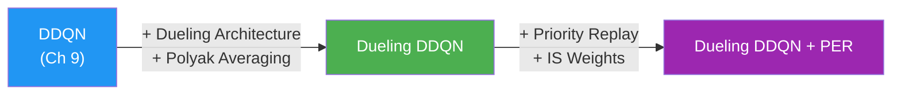
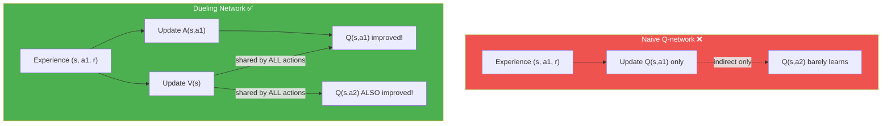
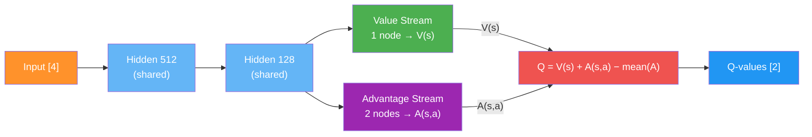
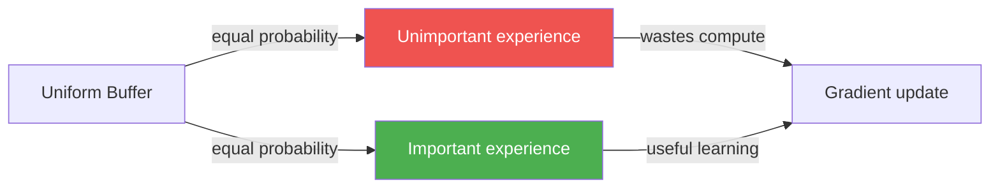
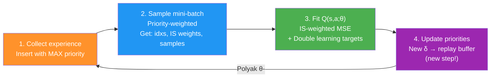
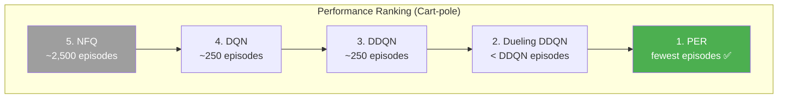
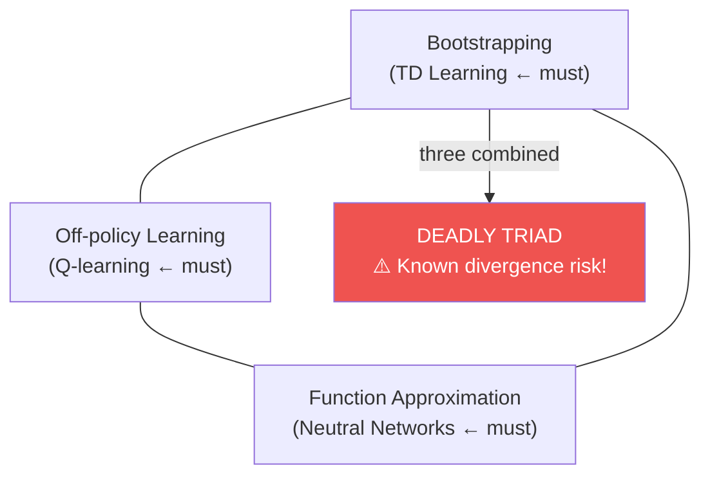
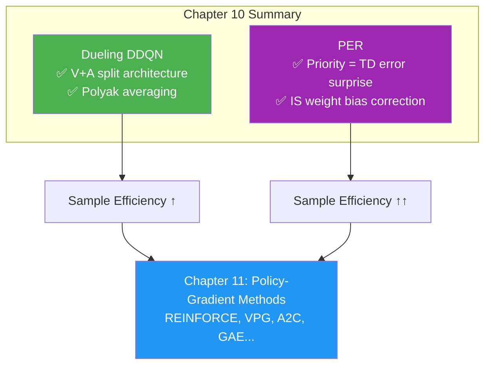

# Chapter 10: Sample-Efficient Value-Based Methods - အကျဉ်းချုပ်

## 1. Chapter ရဲ့ ရည်ရွယ်ချက်

Chapter 9 မှာ DQN/DDQN ဖြင့် stability ကို ဖြေရှင်းခဲ့ပါတယ်။ ဒီ Chapter မှာ **sample efficiency** ကို focus ပြုလုပ်ပြီး episodes နည်းနည်းဖြင့် ပိုကောင်းသော policy ကို learn ဖို့ techniques ၂ ခုကို introduce ပြုလုပ်ပါတယ်:

1. **Dueling DDQN** — Q-function ကို V(s) + A(s,a) ဟု split ပြုလုပ်သော RL-aware architecture
2. **Prioritized Experience Replay (PER)** — Surprising experiences ကို more frequently sample ပြုလုပ်ခြင်း



| Algorithm | Main Focus |
|---|---|
| **NFQ (Ch 8)** | Deep RL first attempt |
| **DQN (Ch 9)** | Stability (target net + replay) |
| **DDQN (Ch 9)** | Reduce overestimation bias |
| **Dueling DDQN (Ch 10)** | Sample efficiency via architecture |
| **PER (Ch 10)** | Sample efficiency via smarter replay |

---

## 2. Dueling DDQN: RL-Aware Architecture

### Value Functions ၏ Relationship

Q-function ကို V(s) နှင့် A(s,a) ဖြင့် decompose ပြုလုပ်နိုင်ပါတယ်:

$$Q(s, a) = V(s) + A(s, a)$$

$$A^\pi(s, a) = Q^\pi(s, a) - V^\pi(s)$$

$$\mathbb{E}_{a \sim \pi}\left[A^\pi(s, a)\right] = 0$$

| Function | Meaning | Output Size |
|---|---|---|
| **$V(s)$** | State ၏ overall goodness | scalar (1 value) |
| **$A(s,a)$** | Action $a$ က default ထက် မည်မျှ ပိုကောင်း | per-action (n_actions values) |
| **$Q(s,a)$** | State $s$ မှ action $a$ ၏ expected return | per-action (n_actions values) |

### Insight: V(s) သည် All Actions ဖြင့် Shared



**Cart-pole ဥပမာ:**

```
State: pole almost vertical → V(s) HIGH, A(left) ≈ A(right) ≈ 0
→ Q(left) ≈ Q(right) HIGH (both fine!)

State: pole falling right  → V(s) LOW, A(right) >> A(left)
→ Q(right) high (save it!), Q(left) << 0 (bad!)
```

> 💡 V(s) update တစ်ခုဖြင့် actions **အားလုံး** ဆီ information ပြန့်နှံ့ → per-sample ရရှိသော information တိုးမြှင့် → **sample efficiency ↑**

### Dueling Architecture



### Aggregation Equation

**Naïve (don't use):**
$$Q(s, a; \theta, \alpha, \beta) = V(s; \theta, \beta) + A(s, a; \theta, \alpha)$$

Problem: V와 A ကို Q မှ uniquely recover မရ → identifiability issue!

**Practical approach (mean subtraction):**

$$Q(s, a; \theta, \alpha, \beta) = V(s; \theta, \beta) + \left(A(s, a; \theta, \alpha) - \frac{1}{|\mathcal{A}|}\sum_{a'} A(s, a'; \theta, \alpha)\right)$$

Mean subtraction ဖြင့် V/A ကို constantly shifted ဖြစ်စေပြီး optimization ကို stabilize ပြုလုပ်ပါတယ်!

### FCDuelingQ Implementation

```python
class FCDuelingQ(nn.Module):
    def __init__(self, input_dim, output_dim, 
                 hidden_dims=(32, 32), activation_fc=F.relu):
        super(FCDuelingQ, self).__init__()
        self.activation_fc = activation_fc
        self.input_layer = nn.Linear(input_dim, hidden_dims[0])
        self.hidden_layers = nn.ModuleList()
        for i in range(len(hidden_dims) - 1):
            self.hidden_layers.append(
                nn.Linear(hidden_dims[i], hidden_dims[i+1]))
        # Two output heads (dueling)
        self.value_output = nn.Linear(hidden_dims[-1], 1)            # V(s): 1 node
        self.advantage_output = nn.Linear(hidden_dims[-1], output_dim)  # A(s,a): N nodes

    def forward(self, state):
        x = self._format(state)
        x = self.activation_fc(self.input_layer(x))
        for hidden_layer in self.hidden_layers:
            x = self.activation_fc(hidden_layer(x))
        a = self.advantage_output(x)   # [batch, n_actions]
        v = self.value_output(x)       # [batch, 1]
        v = v.expand_as(a)             # broadcast to match A shape
        q = v + a - a.mean(1, keepdim=True).expand_as(a)  # Q = V + A - mean(A)
        return q
```

> 💡 Cart-pole architecture: `4 → 512 → 128 → {V: 1, A: 2}` → final Q output: 2 values

---

## 3. Polyak Averaging

### Hard Update vs Polyak Averaging

| Method | Formula | Behavior |
|---|---|---|
| **Hard Update (DQN)** | $\theta^- \leftarrow \theta$ (every C steps) | Sudden full copy, then frozen |
| **Polyak Averaging** | $\theta^- \leftarrow (1-\tau)\theta^- + \tau\theta$ (every step) | Smooth continuous lag |

$$\theta^- \leftarrow (1 - \tau)\theta^- + \tau\theta \quad (\tau = 0.1)$$

- $\tau = 0.1$ → 10% online + 90% target mix every step
- Stable, gradual update → no sudden loss landscape shift
- $\tau = 1.0$ → hard copy (equivalent to DQN)

```python
def update_network(self, tau=None):
    tau = self.tau if tau is None else tau
    for target, online in zip(self.target_model.parameters(),
                               self.online_model.parameters()):
        target.data.copy_((1.0 - tau) * target.data + tau * online.data)
```

---

## 4. Dueling DDQN Summary

| Component | DDQN | Dueling DDQN |
|---|---|---|
| **Network** | FCQ (Q-only) | **FCDuelingQ (V + A streams)** |
| **Target update** | Hard copy every 15 steps | **Polyak averaging τ=0.1 every step** |
| **Double learning** | ✅ | ✅ |
| **Optimizer** | RMSprop lr=0.0007 | RMSprop lr=0.0007 |
| **Replay buffer** | 50k, uniform | 50k, uniform |

**Performance vs DDQN:**
- Episodes: similar
- Training bounds: **narrower** (more stable)
- Cart position variance: **lower** (better "tie-breaking" in near-equal states)

> 💡 History: Ziyu Wang (2015, Oxford PhD → DeepMind) "Dueling Network Architectures for Deep Reinforcement Learning" — RL ကို RL-specific architecture ဖြင့် custom design ပြုလုပ်သော ပထမဆုံး paper!

---

## 5. Prioritized Experience Replay (PER)

### Uniform Sampling ၏ ပြဿနာ



Uniform sampling → unimportant experiences ကို equally sample → resources waste!

### TD Error ကို Surprise Measure အဖြစ်သုံးခြင်း

$$\delta_i = \left| Q(s_i, a_i; \theta) - y_i \right| \quad \text{(absolute TD error)}$$

- **High $|\delta|$** → expectation နှင့် reality ကြီးစွာ ကွာ → high surprise → more to learn!
- **Low $|\delta|$** → agent already knew this → less informative

### Stochastic Prioritization

**Method 1: Proportional Prioritization**

$$p_i = |\delta_i| + \varepsilon \quad (\varepsilon \approx 0.01)$$

$\varepsilon$ ≠ 0 ဆိုသောကြောင့် zero-TD-error experiences ကိုလည်း replay chance ပေးပါတယ်!

**Method 2: Rank-based Prioritization**

$$p_i = \frac{1}{\text{rank}(i)} \quad \text{(sort by } |\delta| \text{ descending, rank 1 = highest)}$$

**Priority → Probability (both methods):**

$$P(i) = \frac{p_i^\alpha}{\sum_k p_k^\alpha}$$

| α value | Behavior |
|---|---|
| **$\alpha = 0$** | Uniform sampling |
| **$\alpha = 1$** | Full priority sampling |
| **$\alpha = 0.6$** | Blended (used in practice) ✅ |

| Method | Outlier sensitivity | Speed |
|---|---|---|
| **Proportional** | Sensitive | Faster |
| **Rank-based** | Robust | Slower (needs sort) |

---

## 6. Importance Sampling Weights

### Bias Problem

Priority distribution $P(i) \neq U(D)$ ဖြင့် sample → **biased gradient estimates!**

RL update expectation သည် true data distribution မှ ဖြစ်ရပါမည် — PER ဖြင့် ဒါကို violate ပြုလုပ်ပါတယ်!

### IS Weight Formula

$$w_i = \left(\frac{1}{N \cdot P(i)}\right)^\beta$$

$$\tilde{w}_i = \frac{w_i}{\max_j w_j}$$

| β value | Behavior |
|---|---|
| **$\beta = 0$** | No correction (pure PER) |
| **$\beta = 1$** | Full correction (unbiased) |
| **Annealing: 0.1 → 1.0** | Gradually correct as training progresses ✅ |

**β Annealing:** Training ၏ ပထမပိုင်း → exploration dominant → bias correction မလိုသေး. Later → exploitation → full correction လိုအပ်.

### PER Loss Function

$$\mathcal{L}(\theta) = \frac{1}{N}\sum_i \tilde{w}_i \cdot \delta_i^2 \cdot \frac{1}{2}$$

```python
# Without PER
value_loss = td_error.pow(2).mul(0.5).mean()

# With PER (IS-weighted)
value_loss = (weights * td_error).pow(2).mul(0.5).mean()
```

---

## 7. PrioritizedReplayBuffer Implementation

```python
class PrioritizedReplayBuffer:
    def store(self, sample):
        # New experience → maximum priority (guarantee at least one replay)
        priority = self.memory[:self.n_entries, 0].max() if self.n_entries > 0 else 1.0
        self.memory[self.next_index, 0] = priority       # store td_error
        self.memory[self.next_index, 1] = np.array(sample)  # store sample
        self.n_entries = min(self.n_entries + 1, self.max_samples)
        self.next_index = (self.next_index + 1) % self.max_samples

    def update(self, idxs, td_errors):
        # Update TD errors after each training step
        self.memory[idxs, 0] = np.abs(td_errors)
        if self.rank_based:
            sorted_arg = self.memory[:self.n_entries, 0].argsort()[::-1]
            self.memory[:self.n_entries] = self.memory[sorted_arg]

    def sample(self, batch_size=None):
        self._update_beta()  # anneal β toward 1.0
        entries = self.memory[:self.n_entries]
        # Calculate probabilities
        if self.rank_based:
            priorities = 1 / (np.arange(self.n_entries) + 1)
        else:
            priorities = entries[:, 0] + EPS
        scaled = priorities ** self.alpha
        probs = scaled / scaled.sum()
        # IS weights
        weights = (self.n_entries * probs) ** (-self.beta)
        norm_weights = weights / weights.max()
        # Sample
        idxs = np.random.choice(self.n_entries, batch_size, replace=False, p=probs)
        return np.vstack(idxs), np.vstack(norm_weights[idxs]), samples_stacks
```

**Key design decisions:**
1. `store`: new experience → **max priority** → at least once replay guarantee
2. `update`: training 후 TD errors update → future sampling 에 반영
3. `sample`: β anneal + IS weight normalize → max weight = 1

---

## 8. PER Full Algorithm

### 4 Steps (Dueling DDQN ၏ 3 steps + 1 new step)



### Hyperparameters

| Parameter | Dueling DDQN | PER (Dueling DDQN + PER) |
|---|---|---|
| Architecture | 4 → 512 → 128 → {V:1, A:2} | Same |
| Target update | Polyak τ=0.1 every step | Same |
| Buffer size | 50,000 | **10,000** (smaller!) |
| Priority α | — | 0.6 |
| IS β initial | — | 0.1 |
| β anneal rate | — | 0.99992 (~30k steps) |
| Min samples | 320 | 320 |
| Batch size | 64 | 64 |

---

## 9. Performance Comparison (All 5 Algorithms)

| Algorithm | Episodes to solve | Sample efficiency | Stability |
|---|---|---|---|
| **NFQ** | ~2,500 | Low | Noisy |
| **DQN** | ~250 | 10× NFQ | Medium |
| **DDQN** | ~250 | ~DQN | Better |
| **Dueling DDQN** | slightly < DDQN | ↑ | Best among 4 |
| **PER** | **fewest** | **Highest** | Very tight bounds |

> ⚠️ PER ၏ implementation slowness: Array sorting O(N log N) ကြောင့်ဖြစ်ပါတယ်! SumTree data structure ဖြင့် O(log N) ဖြစ်အောင် optimize ပြုလုပ်နိုင်ပါတယ် (algorithmic issue မဟုတ်—implementation issue)



---

## 10. Value-Based Methods ၏ Limitations

### Hyperparameter Sensitivity
Value-based methods တွေသည် hyperparameters ကို sensitive ဖြစ်ပါတယ်! Bad hyperparameter space ကို good space ထက် ပိုများ meet ဖြစ်ပါတယ်!

### The Deadly Triad



Target networks + Replay buffers + Double learning ဖြင့် mitigate ပြုလုပ်နိုင်ပေမယ့် **fundamental divergence risk မဖယ်ရှားနိုင်** — open research problem!

---

## 11. Key Equations Summary

| Equation | Formula |
|---|---|
| **Q decomposition** | $Q(s,a) = V(s) + A(s,a)$ |
| **Advantage** | $A^\pi(s,a) = Q^\pi(s,a) - V^\pi(s)$ |
| **Dueling aggregation** | $Q = V(s) + \left(A(s,a) - \frac{1}{\|\mathcal{A}\|}\sum_{a'} A(s,a')\right)$ |
| **Polyak averaging** | $\theta^- \leftarrow (1-\tau)\theta^- + \tau\theta$ |
| **TD priority** | $p_i = \|\delta_i\| + \varepsilon$ (proportional) |
| **Rank priority** | $p_i = 1/\text{rank}(i)$ (rank-based) |
| **Priority → Probability** | $P(i) = p_i^\alpha / \sum_k p_k^\alpha$ |
| **IS weight** | $w_i = (N \cdot P(i))^{-\beta}$ / $\max_j w_j$ |
| **PER loss** | $\mathcal{L} = \frac{1}{N}\sum_i \tilde{w}_i \cdot \delta_i^2 / 2$ |

---

## 12. နိဂုံးချုပ် (Conclusion)

ဒီ Chapter မှာ သင်ယူခဲ့တဲ့ အဓိက takeaways:

1. **Value function decomposition**: $Q = V + A$ → architecture ကို RL-aware ဖြစ်အောင် design
2. **Dueling architecture**: V stream + A stream → single experience ဖြင့် all Q-values improve
3. **Polyak averaging**: Target network ကို smooth, continuous ဖြင့် update → stability ↑
4. **PER**: TD error = surprise → important experiences ကို more frequently replay
5. **IS weights**: Priority sampling ၏ bias ကို β annealing ဖြင့် correct
6. **Deadly triad**: Bootstrapping + off-policy + function approximation → theoretical divergence risk



> 💡 History notes: Ziyu Wang (2015, Oxford PhD) → Dueling architecture | Tom Schaul (2015, DeepMind) → PER | Both released same year, often combined as "Rainbow DQN" components!
