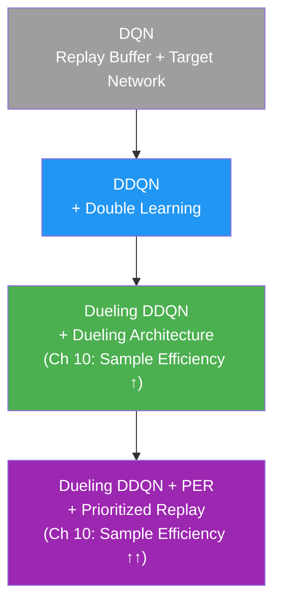
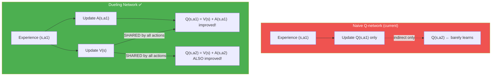
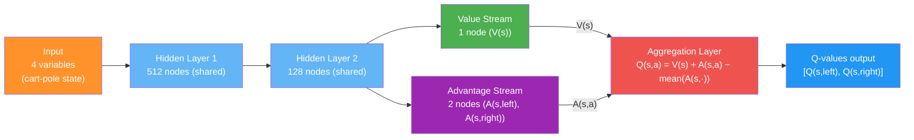
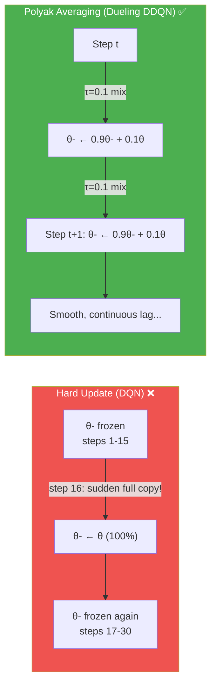
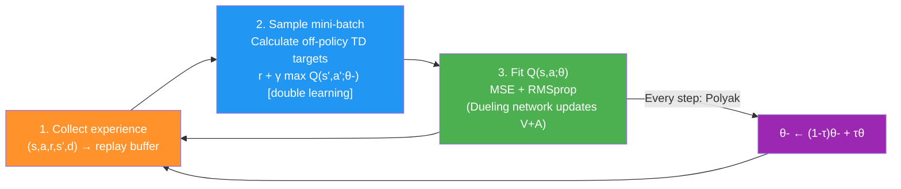
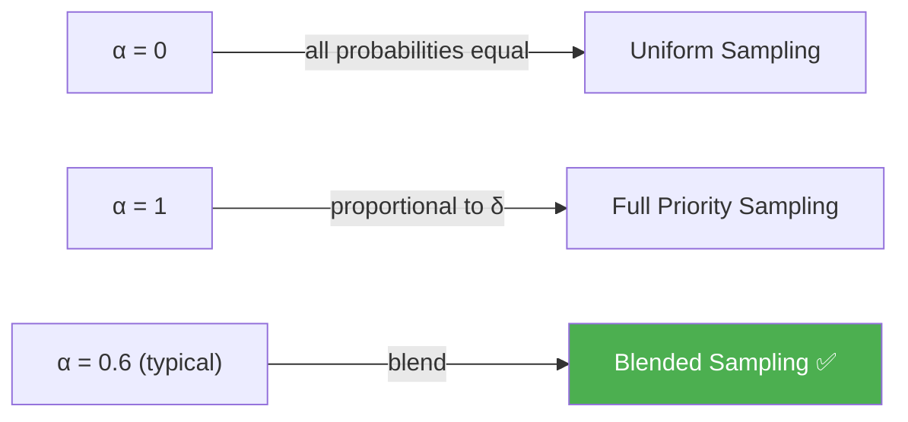
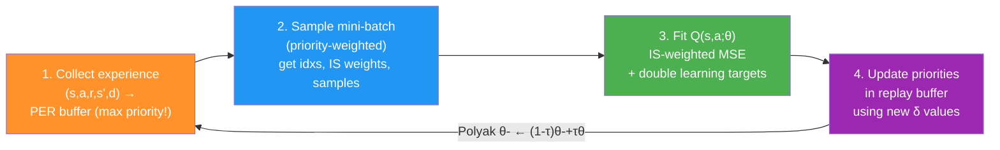
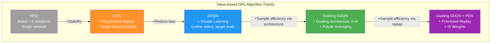
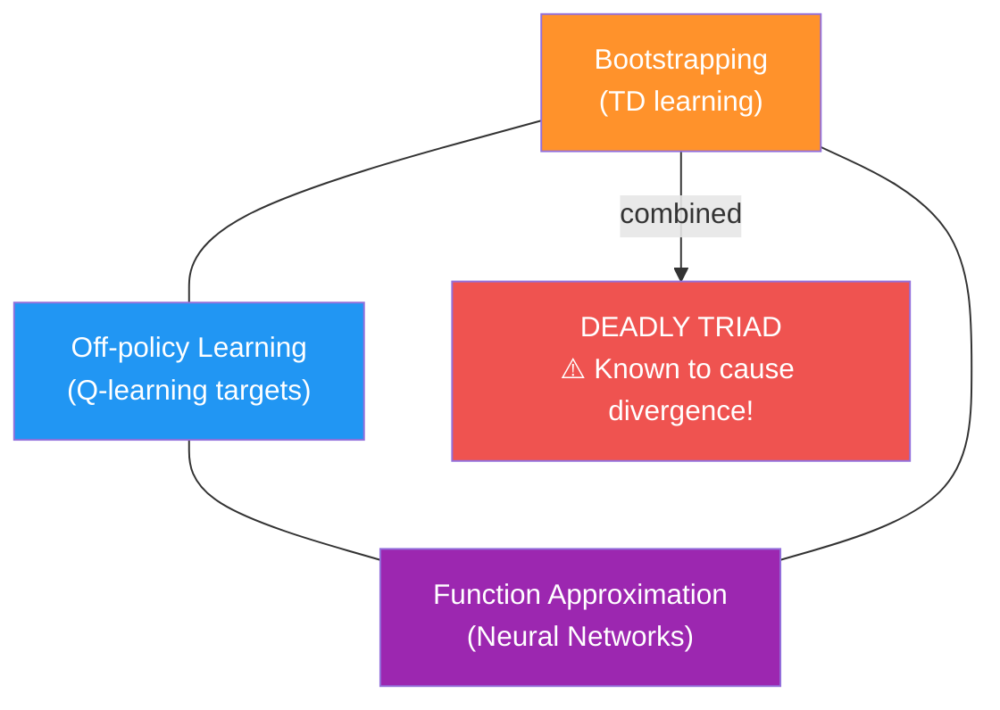
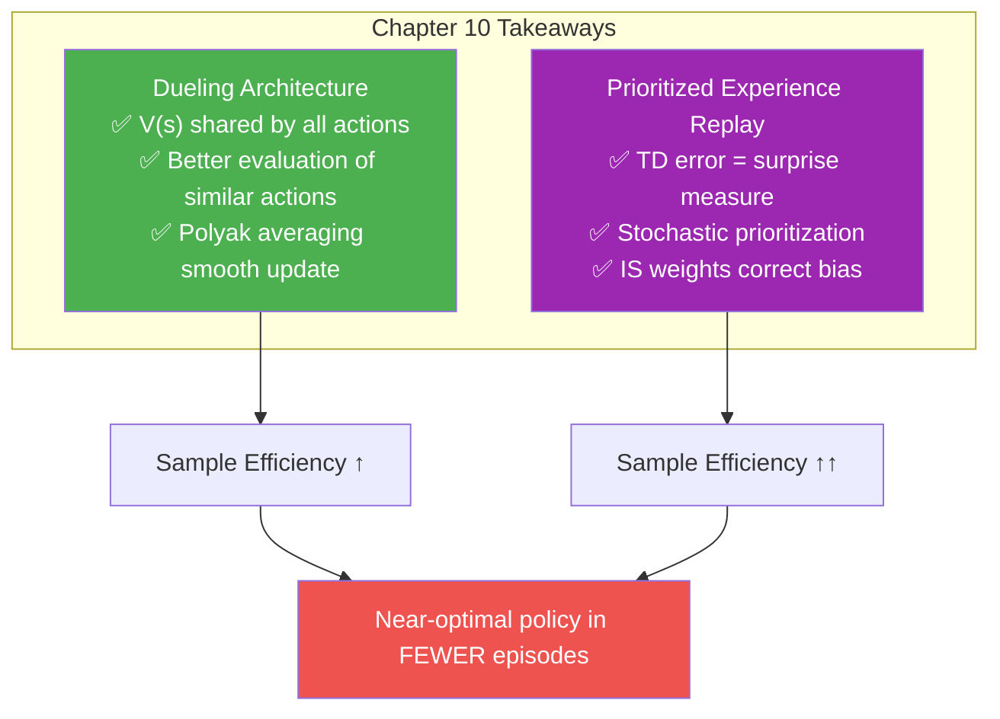

# အခန်း ၁၀ — Sample-Efficient Value-Based Methods (နမူနာ ထိရောက်မှုမြင့် Value-based နည်းလမ်းများ)

> *"ဉာဏ်ရည်ဉာဏ်သွေးသည် မျိုးစိတ်တစ်ခုချင်းစီ ၎င်းတို့ရှင်သန်ရန်လိုသောများကို မည်မျှ ထိရောက်လာသည်ကို အခြေခံ၍ ဆုံးဖြတ်သည်"*
> — Charles Darwin
> (English naturalist, geologist, and biologist; ကမ္ဘာ့ evolution science ၏ ကြီးမားသောပံ့ပိုးသူ)

## ဒီအခန်းမှာ သင်ယူရမည့်အချက်များ

- Value-based deep RL methods ၏ nuances ကို exploit ပြုလုပ်သော deep neural network architecture ကို implement ပြုလုပ်မည်
- Experiences ကို မည်မျှ surprising ဖြစ်သည်ကိုအခြေမူ၍ prioritize ပြုလုပ်သော replay buffer ကို ဖန်တီးမည်
- ယခင် value-based DRL agents အားလုံးထက် episodes နည်းနည်းဖြင့် near-optimal policy ကို train ပြုလုပ်နိုင်သော agent ကို build မည်

---

## ၁၀.၁ — အကျဉ်းချုပ်: ဒီနေ့ ဘာထပ် ဆောင်ရွက်မည်လဲ

ကျွန်ုပ်တို့သည် ယခင် chapters တွင်:

| Algorithm | Focus |
|---|---|
| **NFQ (Ch 8)** | RL + Neural Networks ၏ ပထမဆုံး attempt |
| **DQN (Ch 9)** | Experience Replay + Target Network → stability |
| **DDQN (Ch 9)** | Double learning → overestimation bias ↓ |
| **Dueling DDQN (Ch 10)** | RL-aware architecture → sample efficiency ↑ |
| **PER (Ch 10)** | Prioritized replay → sample efficiency ↑↑ |

ဒီ chapter ၏ improvements တွေသည် stability အတွက် မဟုတ်ဘဲ **sample efficiency** ကို focus ပြုလုပ်ပါတယ်:
1. **Dueling DDQN** — Q-function ကို V(s) + A(s,a) ဟု split ပြုလုပ်သော architecture
2. **PER (Prioritized Experience Replay)** — Surprising experiences ကို more frequently sample ပြုလုပ်ခြင်း



---

## ၁၀.၂ — Dueling DDQN: RL-Aware Neural Network Architecture

### ၁၀.၂.၁ — RL သည် Supervised Learning မဟုတ်ပါ

Chapter 9 တွင် RL ကို supervised learning ဆင်တူအောင် ပြုလုပ်ရန် effort ပေးခဲ့ပါတယ်:
- Experience replay → data IID ဖြစ်ပုံပေါ်
- Target networks → targets static ဖြစ်ပုံပေါ်

ဒါသည် training ကို stabilize ပြုစေပါတယ်—ဒါပေမယ့် RL problems ၏ nuances ကို ignore ပြုလုပ်ခြင်းသည် optimal approach မဟုတ်ပါ!

**RL ၏ ကိုယ်ပိုင် nuances တစ်ခုမှာ:** Value functions တစ်ခုနှင့် တစ်ခုကြား relationship ဖြစ်ပါတယ်:

- **State-value function $V(s)$** — State တစ်ခု၏ overall goodness
- **Action-value function $Q(s,a)$** — State မှ action တစ်ခုကို ယူပြီး policy ကို follow ဆက်ပါက expected return
- **Action-advantage function $A(s,a)$** — Policy ၏ default action နှင့် ယှဉ်လျှင် action $a$ က မည်မျှ ပိုကောင်းသည်

**Value functions ၏ Formal Definitions:**

$$Q^\pi(s, a) = \mathbb{E}\left[\sum_{t=0}^\infty \gamma^t R_{t+1} \mid S_0=s, A_0=a, \pi\right]$$

$$V^\pi(s) = \mathbb{E}\left[\sum_{t=0}^\infty \gamma^t R_{t+1} \mid S_0=s, \pi\right]$$

$$A^\pi(s, a) = Q^\pi(s, a) - V^\pi(s)$$

**Key relationship:**

$$Q(s, a) = V(s) + A(s, a)$$

$$\mathbb{E}_{a \sim \pi}\left[A^\pi(s, a)\right] = 0$$

> 💡 Policy ၏ default action ကို average ပြုလုပ်ပါက zero advantage — ဘာကြောင့်ဆိုသော default action ကနေ advantage မရှိရ!

---

### ₁₀.₂.₂ — Value Functions ၏ Relationship ကို Exploit ပြုလုပ်ခြင်း

**ယခု RA architecture (naive):**

```
Experience (s,a,r,s',d) → Q(s,a) update
                        → Only Q(s,a) learns from this sample!
                        → Q(s,a2), Q(s,a3) unchanged!
```

**ထပ်တိုး insight:** $V(s)$ သည် state $s$ ၌ actions **အားလုံး**ကို share ပြုသော component ဖြစ်ပါတယ်!

```
Experience (s,a1,r,s',d) → V(s) + A(s,a1) update
                         → V(s) changes → Q(s,a1) AND Q(s,a2) BOTH improve!
```

**Cart-pole ဥပမာ:**

```
State: [0.02, -0.01, -0.02, -0.04] ← pole almost vertical, cart near center
V(s) = HIGH value (good state!)
A(s, left)  = -small  (doesn't matter much which direction)
A(s, right) = +small  (doesn't matter much which direction)
Q(s, left)  = V(s) + A(s, left)  ≈ high
Q(s, right) = V(s) + A(s, right) ≈ high (similar!)

State: [-0.16, -1.97, 0.24, 3.01] ← pole falling right!
V(s) = LOW value (bad state!)
A(s, left)  = -large  (going left = BAD, pole falls more!)
A(s, right) = +large  (pushing right = GOOD, counter the fall!)
Q(s, left)  = V(s) + A(s, left)  << 0
Q(s, right) = V(s) + A(s, right) > 0
```



**Key insight — "Taking the worst action in a good state could be better than taking the best action in a bad state":**

> RL ၌ states ၏ values သည် actions ၏ values ကို directly affect ပါတယ်! V(s) ကို accurately estimate ပြုနိုင်ခြင်းသည် all actions ကအတွက် equally important ဖြစ်ပါတယ်!

**History:**

**0001 A Bit of History:**
Dueling network architecture ကို 2015 ခုနှစ်တွင် **Ziyu Wang** က University of Oxford PhD student ဘဝတွင် "Dueling Network Architectures for Deep Reinforcement Learning" paper တွင် introduce ပြုလုပ်ခဲ့ပါတယ်! ဒါသည် value-based deep RL methods အတွက် **custom neural network architecture** ကိုအထူး design ပြုလုပ်သော ပထမဆုံး paper ဖြစ်ပါတယ်! Ziyu သည် ယခု Google DeepMind research scientist ဖြစ်ပါတယ်!

---

### ₁₀.₂.₃ — Dueling Network Architecture

**Architecture ၏ structure:**



**Notation:**
- $\theta$ = shared layers ၏ weights
- $\alpha$ = action-advantage stream ၏ weights
- $\beta$ = state-value stream ၏ weights

### ₁₀.₂.₄ — Aggregation Equation

**Naïve approach (don't use):**

$$Q(s, a; \theta, \alpha, \beta) = V(s; \theta, \beta) + A(s, a; \theta, \alpha)$$

**ဘာကြောင့် naïve approach ၌ problem ရှိသလဲ?**
$Q(s,a)$ မှ $V(s)$ နှင့် $A(s,a)$ ကို **uniquely recover မရ**ပါ!

> e.g. V(s)=+10, A(s,a)=-5 → Q=5
> V(s)=+20, A(s,a)=-15 → Q=5 (same Q, different V and A!)

**Practical approach (used in code):**

$$Q(s, a; \theta, \alpha, \beta) = V(s; \theta, \beta) + \left(A(s, a; \theta, \alpha) - \frac{1}{|\mathcal{A}|}\sum_{a'} A(s, a'; \theta, \alpha)\right)$$

**Mean ကို subtract ပြုလုပ်ခြင်း၏ effects:**
- V(s) နှင့် A(s,a) ကို constant ဖြင့် off-center ဖြစ်စေပြီး **true meaning ကို lose** ပြုလုပ်
- ဒါပေမယ့် **optimization ကို stabilize** ပြုလုပ်
- Q-function ၏ **rank** ကိုတော့ မပြောင်းလဲ (same ordering of actions)

---

### Python Code — FCDuelingQ Network

```python
import torch
import torch.nn as nn
import torch.nn.functional as F

class FCDuelingQ(nn.Module):
    def __init__(self, 
                 input_dim,           # State variables count (cart-pole: 4)
                 output_dim,          # Actions count (cart-pole: 2)
                 hidden_dims=(32, 32),        # Hidden layer sizes
                 activation_fc=F.relu):       # Activation function
        super(FCDuelingQ, self).__init__()
        self.activation_fc = activation_fc
        
        # Shared input layer
        self.input_layer = nn.Linear(input_dim, hidden_dims[0])
        
        # Shared hidden layers
        self.hidden_layers = nn.ModuleList()
        for i in range(len(hidden_dims) - 1):
            hidden_layer = nn.Linear(hidden_dims[i], hidden_dims[i+1])
            self.hidden_layers.append(hidden_layer)
        
        # TWO separate output heads (dueling!)
        self.value_output = nn.Linear(hidden_dims[-1], 1)          # V(s): single node
        self.advantage_output = nn.Linear(hidden_dims[-1], output_dim)  # A(s,a): n_actions nodes
    
    def _format(self, state):
        x = state
        if not isinstance(x, torch.Tensor):
            x = torch.tensor(x, device=self.device, dtype=torch.float32)
            x = x.unsqueeze(0)
        return x
    
    def forward(self, state):
        x = self._format(state)
        
        # === Shared layers ===
        x = self.activation_fc(self.input_layer(x))
        for hidden_layer in self.hidden_layers:
            x = self.activation_fc(hidden_layer(x))
        
        # === Two separate streams ===
        a = self.advantage_output(x)   # A(s,a): shape [batch, n_actions]
        v = self.value_output(x)       # V(s):   shape [batch, 1]
        v = v.expand_as(a)             # expand V to match A's shape
        
        # === Aggregation: Q = V + A - mean(A) ===
        q = v + a - a.mean(1, keepdim=True).expand_as(a)
        return q  # shape [batch, n_actions]
```

**Code ရှင်းလင်းချက်:**
1. **Input + hidden layers (shared)** — state features ကို extract ပြုသော common representation
2. `value_output` — **1 node** output → $V(s)$
3. `advantage_output` — **n_actions nodes** output → $A(s, a_1), A(s, a_2), ...$
4. `v.expand_as(a)` — V (shape [batch,1]) ကို A (shape [batch,n_actions]) shape ဖြစ်အောင် broadcast
5. `a.mean(1, keepdim=True)` — actions dimension ဖြင့် mean → shape [batch, 1]
6. `v + a - mean(a)` — **Aggregation formula** ← dueling network ၏ core!

> 💡 **Cart-pole architecture:** 4 → 512 → 128 → {V: 1 node, A: 2 nodes} → Q: 2 nodes
>
> FCQ (old): `output_layer = nn.Linear(128, 2)`
> FCDuelingQ (new): `value_output = nn.Linear(128, 1)` + `advantage_output = nn.Linear(128, 2)`

---

### ₁₀.₂.₅ — Polyak Averaging: Target Network Update ကို Smooth ပြုလုပ်ခြင်း

**ယခင် Hard update (DQN/DDQN):**

$$\theta^- \leftarrow \theta \quad \text{(every C steps, sudden full copy)}$$

**Problems:**
- C steps ကြာချိန်တွင် progressively stale estimates
- Update ဖြစ်ချိန်တွင် sudden large change → loss landscape ကြီးမားစွာ shift

**Polyak Averaging (smooth alternative):**

$$\theta^- \leftarrow (1 - \tau) \theta^- + \tau \theta \quad \text{(every step!)}$$

- $\tau = 0.1$ → 10% online + 90% target weights ကို mix in every step
- Target သည် always lag ပေမယ့် **smooth, continuous** ဖြင့် update
- Hard update ၏ "too conservative + too aggressive" problem ကို ရှောင်ရှား



---

### Python Code — Polyak Averaging Update

```python
class DuelingDDQN:
    def __init__(self, ..., tau=0.1):
        self.tau = tau  # mix-in ratio (0.1 = 10% online per step)
        # ... (other init code)
    
    def update_network(self, tau=None):
        """Polyak averaging: θ- ← (1-τ)θ- + τθ (every step!)"""
        tau = self.tau if tau is None else tau
        
        for target, online in zip(
                self.target_model.parameters(),
                self.online_model.parameters()):
            
            # Mix target and online weights
            target_ratio = (1.0 - tau) * target.data    # (1-τ) × θ-
            online_ratio = tau * online.data             # τ × θ
            mixed_weights = target_ratio + online_ratio  # combine
            
            target.data.copy_(mixed_weights)  # update θ-
```

**Code ရှင်းလင်းချက်:**
1. `tau` — online weights ၏ mix-in ratio (`tau=1.0` → full copy = hard update)
2. `(1.0 - tau) * target.data` — target network ၏ existing weights ကို (1-τ) fraction ဖြင့် keep
3. `tau * online.data` — online network weights ကို τ fraction ဖြင့် mix in
4. `target.data.copy_()` — in-place copy → no new Tensors ဖန်တီးဘဲ update

> 💡 `tau=None` fallback ကတော့ caller က override ပြုလုပ်လိုလျှင် ပြုလုပ်နိုင်သည် ဟုဆိုလိုပါတယ်!

---

### ₁₀.₂.₆ — Dueling DDQN Algorithm Full Summary

**Dueling DDQN = DDQN + Dueling Architecture + Polyak Averaging**

| Component | DDQN | Dueling DDQN |
|---|---|---|
| **Network** | FCQ (Q-only) | **FCDuelingQ (V + A streams)** |
| **Architecture** | 4 → 512 → 128 → 2 | 4 → 512 → 128 → {V:1, A:2} → 2 |
| **Target update** | Hard copy every 15 steps | **Polyak averaging τ=0.1 every step** |
| **Double learning** | ✅ | ✅ |
| **Replay buffer** | 50k, uniform | 50k, uniform |
| **Optimizer** | RMSprop, lr=0.0007 | RMSprop, lr=0.0007 |
| **Loss** | Huber/MSE (grad clip inf) | Huber/MSE (grad clip inf) |
| **Exploration** | Exp decay ε (1.0→0.3) | Exp decay ε (1.0→0.3) |

**Algorithm Steps (same 3 steps as DDQN):**



**Performance:**
- Dueling DDQN ≈ DDQN (similar episodes) ← cart-pole simple outcome
- Dueling DDQN **narrower training bounds** ← more stable
- Dueling DDQN **lower cart displacement** ← better action evaluation in "tied" states
- Dueling DDQN slightly **slower** (Polyak every step + dueling network overhead)

---

## ₁₀.₃ — PER: Meaningful Experiences ကို Prioritize ပြုလုပ်ခြင်း

### ₁₀.₃.₁ — Uniform Sampling ၏ ပြဿနာ

DQN/DDQN ၌ replay buffer မှ uniform random sampling ပြုလုပ်ပါတယ်—mathematically sound ပေမယ့် **intuitively suboptimal** ဖြစ်ပါတယ်!

> Uniform sampling → unimportant experiences ကိုလည်း equally learn → resources waste!

**မှားသော approach ၁:** High reward experiences ကိုသာ replay
**မှားသော approach ၂:** Highest absolute reward experiences ကို replay

**Miguel ၏ ထိုကဲ့သို့ experiment မှ သင်ခန်းစာ:**

> ငါ့သမီးကို chocolate တွေချဲ့ပေးရင်းနှင့် ချူပ်ဝိုင်းမိတာလိုပဲ — high reward experiences ကိုသာ replay ပြုလုပ်ရင် agent တွေ overfit ဖြစ်ပြီး diverse experiences မှ learn လုပ်ဖို့ fail ပြုလုပ်ပါတယ်! Agents (and humans) need mundane, bad, AND good experiences to learn well!

**မှန်ကန်သော approach:** မည်သည့် experiences က **ဆေးမြင်မထားသော / unexpected** ဖြစ်ပါသလဲ?

---

### ₁₀.₃.₂ — TD Error ကို Priority Measure အဖြစ်သုံးခြင်း

**"Surprise" ၏ RL measure = Absolute TD error!**

$$\delta_t = \left| Q(s_t, a_t; \theta) - y_t \right| = \left| Q(s_t, a_t; \theta) - \left( r_{t+1} + \gamma \max_{a'} Q(s_{t+1}, a'; \theta^-) \right) \right|$$

- **Current estimate $Q(s,a;\theta)$** = Agent's current belief ← expectation
- **Target $y$** = New estimate (reality check)
- **$|\delta|$** = မည်မျှ wrong were we? → learning opportunity ၏ measure!

**Priorities ← TD errors ← Probabilities:**

```
High |δ| → High surprise → High priority → Sampled more often → Learn more
Low  |δ| → Low surprise  → Low priority  → Sampled less often → Learn less
```

**History:**

**0001 A Bit of History:**
"Prioritized Experience Replay" paper ကို 2015 ခုနှစ်တွင် Google DeepMind academic group မှ **Tom Schaul** (main author) က dueling architecture paper နှင့် တစ်ပြိုင်နက် publish ပြုလုပ်ခဲ့ပါတယ်! Tom သည် Technical University of Munich မှ PhD (2011)၊ NYU postdoc ၂ နှစ်၊ ထို့နောက် DeepMind Technologies ကို join ပြုသည် (Google ကဝယ်ယူမည့် ၆ လ မတိုင်မီ)! Tom သည် PyBrain (early ML framework for Python) နှင့် PyVGDL (video game description language) ၏ core developer ဖြစ်ပါတယ်!

---

### ₁₀.₃.₃ — Priorities မှ Probabilities ဆီ

**TD errors တစ်ခုတည်း မပြည့်စုံ — ဘာကြောင့်ဆိုသော:**
1. TD error = 0 ဖြစ်ပါက experience ကို never replay ဖြစ်မည်
2. Function approximators ၌ errors slowly shrink → small subset ကိုသာ concentrate update
3. TD errors noisy ဖြစ်ပါတယ် (stochastic environments + noisy networks)

**Solution: Stochastic prioritization** — greedy မဟုတ်ဘဲ probabilistic ဖြင့် sample ပြုလုပ်!

**Three-tier structure:**

$$\text{TD error} \xrightarrow{\text{+ε}} \text{priority } p_i \xrightarrow{\text{÷ sum, × α}} \text{probability } P(i) \xrightarrow{\text{sample}} \text{experience}$$

---

### ₁₀.₃.₄ — Proportional Prioritization

**Step 1: Priority Calculation:**

$$p_i = |\delta_i| + \varepsilon$$

- $|\delta_i|$ = absolute TD error of experience $i$
- $\varepsilon$ = small constant (e.g., 0.01) → zero TD error experience ကိုလည်း replay chance ပေး

**Step 2: Probabilities from Priorities:**

$$P(i) = \frac{p_i^\alpha}{\sum_k p_k^\alpha}$$

- $\alpha$ = prioritization degree (hyperparameter, 0 ≤ α ≤ 1)
  - $\alpha = 0$ → uniform sampling (all equal)
  - $\alpha = 1$ → pure priority sampling (proportional to TD error)
  - Typical: $\alpha = 0.6$



---

### ₁₀.₃.₅ — Rank-based Prioritization (Alternative)

**Proportional approach ၏ issue:** Outlier experiences (noise ကြောင့် huge TD error) ကို overly sample ပြုလုပ်မည်!

**Alternative: Rank-based prioritization:**

1. Experiences ကို absolute TD error ဖြင့် sort (descending)
2. Rank ကို assign: highest TD error = rank 1

$$p_i = \frac{1}{\text{rank}(i)}$$

$$P(i) = \frac{p_i^\alpha}{\sum_k p_k^\alpha} \quad \text{(same α formula)}$$

**Comparison:**

| Method | Outlier sensitivity | Implementation |
|---|---|---|
| **Proportional** | Sensitive to outliers | Simpler, use +ε |
| **Rank-based** | Robust to outliers | Needs sorting (slower) |

> 💡 PER paper implementation မှာ proportional approach ကို preferred ဖြစ်ပြီး ε=0.01, α=0.6 ႏွင့် ပေါင်းစပ်သုံးပါတယ်!

---

### ₁₀.₃.₆ — Prioritization Bias နှင့် Importance Sampling

**ပြဿနာ:** Priority distribution ဖြင့် sample ပြုလုပ်ခြင်းသည် **biased gradient estimates** ကို ဖြစ်ပေါ်စေပါတယ်!

RL Q-function update ၏ expectation သည် **true data-generating distribution** မှ ဖြစ်ရပါမည်:

$$\nabla_\theta \mathbb{E}_{(s,a,r,s') \sim U(D)} \left[\mathcal{L}(\theta)\right]$$

ဒါပေမယ့် PER သည် priority distribution $P(i) \neq U(D)$ ဖြင့် sample ပြုလုပ်ပါတယ် → **biased updates!**

**Solution: Weighted Importance Sampling (IS weights):**

$$w_i = \left(\frac{1}{N \cdot P(i)}\right)^\beta$$

$$\tilde{w}_i = \frac{w_i}{\max_j w_j}$$

- $N$ = replay buffer size
- $\beta$ = correction degree (0 = no correction, 1 = full correction)
- Normalize by max weight → largest weight = 1, all others < 1
- Training start: $\beta$ low (less correction), anneal toward 1 (full correction near convergence)

**IS weights ၏ role:**
$$\text{Corrected TD error} = \tilde{w}_i \cdot \delta_i$$

→ High priority samples (sampled too often) ← small weight → downscale gradient
→ Low priority samples (sampled too rarely) ← large weight → upscale gradient
→ Net effect: updates behave as if sampled uniformly!

**Full gradient update (Dueling DDQN + PER):**

$$\theta \leftarrow \theta + \alpha \sum_{i} \tilde{w}_i \delta_i \nabla_\theta Q(s_i, a_i; \theta)$$

where $(s_i, a_i, r_i, s'_i) \sim P(\cdot)$ (priority distribution)

---

### Python Code — Prioritized Replay Buffer (Part 1/2)

```python
import numpy as np

EPS = 1e-6  # small constant to avoid zero priority

class PrioritizedReplayBuffer:
    def __init__(self, max_samples=10000, batch_size=64,
                 rank_based=False, alpha=0.6,
                 beta0=0.1, beta_rate=0.99992):
        
        self.max_samples = max_samples
        self.batch_size = batch_size
        self.rank_based = rank_based  # True=rank, False=proportional
        self.alpha = alpha             # Priority blend (0=uniform, 1=full priority)
        self.beta = beta0              # IS correction (anneals toward 1.0)
        self.beta_rate = beta_rate     # Anneal rate per step
        
        self.next_index = 0
        self.n_entries = 0
        
        # Storage: each row = [td_error, sample_array]
        self.td_error_index = 0
        self.sample_index = 1
        self.memory = np.empty(shape=(max_samples, 2), dtype=np.ndarray)
    
    def _update_beta(self):
        """Beta ကို anneal ပြုလုပ်ခြင်း (0.1 → 1.0 gradually)"""
        self.beta = min(1.0, self.beta / self.beta_rate)
    
    def store(self, sample):
        """Experience တစ်ခုကို maximum priority ဖြင့် insert ပြုလုပ်ခြင်း"""
        # New experiences always get maximum priority (guarantees replay at least once)
        priority = 1.0
        if self.n_entries > 0:
            priority = self.memory[:self.n_entries, self.td_error_index].max()
        
        # Store priority + experience
        self.memory[self.next_index, self.td_error_index] = priority
        self.memory[self.next_index, self.sample_index] = np.array(sample)
        
        # Update counters (circular buffer)
        self.n_entries = min(self.n_entries + 1, self.max_samples)
        self.next_index += 1
        self.next_index = self.next_index % self.max_samples
    
    def update(self, idxs, td_errors):
        """Replayed experiences ၏ TD errors ကို update ပြုလုပ်ခြင်း"""
        self.memory[idxs, self.td_error_index] = np.abs(td_errors)
        
        if self.rank_based:
            # Sort by TD error descending (for rank-based priorities)
            sorted_arg = self.memory[:self.n_entries, 
                                     self.td_error_index].argsort()[::-1]
            self.memory[:self.n_entries] = self.memory[sorted_arg]
```

**Code ရှင်းလင်းချက် (store):**
1. New experience → maximum priority assign → buffer ၌ **at least once replay** ကို guarantee
2. `n_entries` → buffer size cap (max_samples)
3. `next_index % max_samples` → circular buffer (oldest evicted)

**Code ရှင်းလင်းချက် (update):**
1. Replayed experiences ၏ TD errors ကို absolute value ဖြင့် update
2. Rank-based ဆိုရင် sort ပြုလုပ် → O(N log N) operation (expensive!)

---

### Python Code — Prioritized Replay Buffer (Part 2/2)

```python
    def sample(self, batch_size=None):
        """Priority-based probability ဖြင့် mini-batch sample ပြုလုပ်ခြင်း"""
        batch_size = self.batch_size if batch_size is None else batch_size
        
        # Beta annealing (bias correction increases over time)
        self._update_beta()
        
        entries = self.memory[:self.n_entries]
        
        # === Step 1: Calculate priorities ===
        if self.rank_based:
            # Rank-based: priority = 1/rank
            priorities = 1 / (np.arange(self.n_entries) + 1)  # [1, 1/2, 1/3, ...]
        else:
            # Proportional: priority = |δ| + ε
            priorities = entries[:, self.td_error_index] + EPS
        
        # === Step 2: Probabilities from priorities ===
        scaled_priorities = priorities ** self.alpha    # blend: 0=uniform, 1=full priority
        pri_sum = np.sum(scaled_priorities)
        probs = np.array(scaled_priorities / pri_sum, dtype=np.float64)  # normalize
        
        # === Step 3: Importance-sampling weights ===
        weights = (self.n_entries * probs) ** (-self.beta)  # (N·P(i))^{-β}
        normalized_weights = weights / weights.max()          # max weight = 1
        
        # === Step 4: Sample indices using priorities ===
        idxs = np.random.choice(self.n_entries, batch_size, replace=False, p=probs)
        
        # === Step 5: Extract experiences ===
        samples = np.array([entries[idx] for idx in idxs])
        samples_stacks = [np.vstack(batch_type) for batch_type in 
                          np.vstack(samples[:, self.sample_index]).T]
        
        idxs_stack = np.vstack(idxs)
        weights_stack = np.vstack(normalized_weights[idxs])
        
        return idxs_stack, weights_stack, samples_stacks
```

**Code ရှင်းလင်းချက်:**
1. `_update_beta()` — β ကို anneal → training ကြာလာလျှင် bias correction ပိုကြီး
2. Rank-based: `1/(rank+1)` → sorted array ဖြစ်တဲ့အတွက် index = rank-1
3. `priorities ** alpha` → blend uniform ↔ priority
4. `(N·P(i))^{-β}` — IS weight formula
5. `weights / weights.max()` — normalize so max weight = 1
6. `np.random.choice(..., p=probs)` — priority-weighted sampling

---

### Python Code — PER Agent (optimize_model)

```python
class PER:
    def optimize_model(self, experiences):
        # Unpack experiences (now includes idxs and IS weights!)
        idxs, weights, (states, actions, rewards, 
                        next_states, is_terminals) = experiences
        batch_size = len(is_terminals)
        
        # === DDQN double learning targets ===
        argmax_a_q_sp = self.online_model(next_states).max(1)[1]  # online → SELECT
        q_sp = self.target_model(next_states).detach()             # target → EVALUATE
        max_a_q_sp = q_sp[np.arange(batch_size), argmax_a_q_sp]
        max_a_q_sp = max_a_q_sp.unsqueeze(1)
        max_a_q_sp *= (1 - is_terminals)
        target_q_sa = rewards + (self.gamma * max_a_q_sp)
        
        # === Current Q-values ===
        q_sa = self.online_model(states).gather(1, actions)
        
        # === TD errors ===
        td_error = q_sa - target_q_sa
        
        # === PER: IS-weighted loss ===
        # Without PER: value_loss = td_error.pow(2).mul(0.5).mean()
        # With PER:    multiply by IS weights to correct bias!
        value_loss = (weights * td_error).pow(2).mul(0.5).mean()
        
        # === Optimize ===
        self.optimizer.zero_grad()
        value_loss.backward()
        torch.nn.utils.clip_grad_norm_(
            self.online_model.parameters(), 
            self.max_gradient_norm)
        self.optimizer.step()
        
        # === Update priorities in replay buffer ===
        priorities = np.abs(td_error.detach().cpu().numpy())
        self.replay_buffer.update(idxs, priorities)  # ← new step!
```

**Code ရှင်းလင်းချက်:**
1. `idxs, weights, samples` — PER buffer ၏ 3-tuple return
2. DDQN double learning targets (same as DDQN)
3. **`(weights * td_error).pow(2).mul(0.5).mean()`** ← IS weight-corrected loss (key PER change!)
4. `self.replay_buffer.update(idxs, priorities)` ← **replay buffer ၌ priorities update** (new step!)

> ⚠️ **PER ၌ ONLY change:** Loss function ၌ IS weights multiply + replay buffer priorities update!

---

### ₁₀.₃.₇ — PER Training Loop

```python
class PER:
    def train(self, ...):
        for episode in range(1, max_episodes + 1):
            state = env.reset()
            
            for step in count():
                # === Step 1: Interact ===
                state, is_terminal = self.interaction_step(state, env)
                
                # === Step 2: Sample from prioritized buffer ===
                if len(self.replay_buffer) > min_samples:
                    experiences = self.replay_buffer.sample()
                    idxs, weights, samples = experiences
                    
                    # Load samples to device (GPU if available)
                    experiences = self.online_model.load(samples)
                    
                    # Reassemble with indices and weights
                    experiences = (idxs, weights) + (experiences,)
                    
                    # === Step 3: Optimize with IS-weighted loss ===
                    self.optimize_model(experiences)
                
                # === Polyak averaging target update ===
                if np.sum(self.episode_timestep) % self.update_target_every_steps == 0:
                    self.update_network()
                
                if is_terminal:
                    break
```

**Code ရှင်းလင်းချက်:**
1. `self.replay_buffer.sample()` → `(idxs, weights, samples)` 3-tuple return
2. `self.online_model.load(samples)` → GPU ပေါ်သို့ transfer
3. `(idxs, weights) + (experiences,)` → optimize_model ကို expected format ဖြင့် pass
4. `self.replay_buffer.update(idxs, priorities)` → optimize_model ထဲ call ပြုထားပြီး

---

## ₁₀.₄ — Complete PER Algorithm

**Dueling DDQN + PER ၏ hyperparameters:**

| Component | Value |
|---|---|
| **Architecture** | Dueling: 4 → 512 → 128 → {V:1, A:2} → 2 |
| **Optimizer** | RMSprop, lr=0.0007 |
| **Loss** | Huber (MSE, clip_norm=∞) |
| **Exploration** | Exp decay ε (1.0 → 0.3, ~20k steps) |
| **Target update** | Polyak averaging, τ=0.1, every step |
| **Replay buffer size** | max 10,000 (smaller than DDQN's 50k!) |
| **Min samples** | 320 |
| **Batch size** | 64 |
| **Priority α** | 0.6 (blend uniform + priority) |
| **IS β initial** | 0.1 (low correction at start) |
| **β anneal rate** | 0.99992 (fully annealed ~30k steps) |

**4 Main Steps:**



---

## ₁₀.₅ — Algorithm Comparison: Full Picture



**Performance Summary (Cart-pole):**

| Algorithm | Episodes | Steps | Training time |
|---|---|---|---|
| **NFQ** | ~2,500 | ~250,000 | ~80 sec |
| **DQN** | ~250 | ~50,000 | ~5 min |
| **DDQN** | ~250 | ~50,000 | ~5 min |
| **Dueling DDQN** | slightly < DDQN | slightly < DDQN | ~5.5 min |
| **PER** | **fewest** | **fewest** | slower (impl. overhead) |

> ⚠️ **PER ၏ slowness:** Array sorting (O(N log N) per update) ကြောင့်ဖြစ်ပါတယ်! High-quality implementations (SumTree data structure) ဖြင့် O(log N) ဖြစ်အောင် fix ပြုလုပ်နိုင်ပါတယ်!

---

## ₁₀.₆ — Key Equations Summary

| Equation | Formula |
|---|---|
| **Q decomposition** | $Q(s,a) = V(s) + A(s,a)$ |
| **Advantage definition** | $A^\pi(s,a) = Q^\pi(s,a) - V^\pi(s)$ |
| **Dueling aggregation** | $Q(s,a;\theta,\alpha,\beta) = V(s;\theta,\beta) + \left(A(s,a;\theta,\alpha) - \frac{1}{\|\mathcal{A}\|}\sum_{a'} A(s,a')\right)$ |
| **Polyak averaging** | $\theta^- \leftarrow (1-\tau)\theta^- + \tau\theta$ |
| **TD Priority** | $p_i = \|\delta_i\| + \varepsilon$ (proportional) |
| **Rank priority** | $p_i = 1/\text{rank}(i)$ (rank-based) |
| **Priority → Probability** | $P(i) = p_i^\alpha / \sum_k p_k^\alpha$ |
| **IS weight** | $w_i = (N \cdot P(i))^{-\beta}$ |
| **Normalized IS weight** | $\tilde{w}_i = w_i / \max_j w_j$ |
| **PER loss** | $\mathcal{L} = \frac{1}{N}\sum_i \tilde{w}_i \cdot \delta_i^2 / 2$ |

---

## ₁₀.₇ — Value-based Methods ၏ Limitations

Value-based methods တွေသည် powerful ဖြစ်ပေမယ့် **cons** တစ်ချို့ ရှိကြောင်း သိထားဖို့ လိုပါတယ်:

**1. Hyperparameter Sensitivity**
Value-based methods တွေသည် hyperparameters ကို **sensitive** ဖြစ်ပါတယ်! ကောင်းတဲ့ hyperparameter values ထက် မကောင်းတဲ့ values ကို ပိုလျှင်တွေ့ရသည်ဟု ဆိုနိုင်ပါတယ်!

**2. Markovian Assumption**
Value-based methods တွေ environment ကို **Markovian** ဟုယူဆပါတယ် — states သည် agent ၌ လိုအပ်သောသတင်းအချက်အလတ်အားလုံးပါဝင်ပါသည်ဟု ယူဆပါတယ်! Non-Markovian environments ၌ performance ကျဆင်းနိုင်ပါတယ်!

**3. The Deadly Triad**



Target networks + Replay buffers + Double learning ဖြင့် practical ဖြစ်အောင် mitigate ပြုလုပ်နိုင်ပေမယ့် **fundamental divergence risk** ကို eliminate ပြုလုပ်မရပါ — research ဆက်လက်ဖြေရှင်းနေဆဲဖြစ်ပါတယ်!

**Practical advice:**
- Target networks ✅
- Replay buffers ✅
- Double learning ✅
- Sufficiently small learning rate (but not too small) ✅
- A little bit of patience ✅ 😄

---

## ₁₀.₈ — နိဂုံးချုပ်

ဒီ chapter မှာ value-based DRL methods ၏ **sample efficiency** ကို improve ပြုလုပ်သော ၂ နည်းကို learn ပြုလုပ်ခဲ့ပါတယ်:

**Technique 1 — Dueling Network Architecture:**
- $Q(s,a) = V(s) + A(s,a)$ ကို explicitly model ပြုလုပ်
- Experience တစ်ခုသည် $V(s)$ ကို update ဖြတ်ပြီး **all actions** ဆီ improve
- Polyak averaging ဖြင့် smooth target updates

**Technique 2 — Prioritized Experience Replay (PER):**
- TD error ကို "surprise measure" အဖြစ်သုံး
- Surprise/unexpected experiences ကို more frequently replay
- IS weights ဖြင့် bias correction



**By now, you can:**
- RL problems ကို continuous state spaces ဖြင့် solve ပြုလုပ်နိုင်
- Value-based DRL agents ကို stabilize ပြုနိုင် (Ch 9)
- Value-based DRL agents ကို more sample efficient ဖြစ်အောင် ပြုနိုင် (Ch 10)

> 💡 **Chapter 11 Preview:** Value-based methods ကနေ **Policy-gradient methods** ဆီ ကူးပြောင်းမည်!
> REINFORCE, VPG, A3C, GAE, A2C — directly policy ကို optimize ပြုလုပ်သော algorithms!
> Value-based strengths: discrete actions, sample efficiency
> Policy-gradient strengths: continuous actions, stochastic policies, no Markovian assumption required!
