# Chapter 11: Policy-Gradient and Actor-Critic Methods - အကျဉ်းချုပ်

## 1. Chapter ရဲ့ ရည်ရွယ်ချက်

Value-based methods (Ch 8–10) သည် value functions ကို learn ပြီး policy ကို derive ပြုလုပ်ပါတယ်။ ဒီ Chapter မှာ policy ကို directly optimize ပြုလုပ်သော **policy-gradient methods** နှင့် policy + value function ကို both learn ပြုသော **actor-critic methods** ကို explore ပြုပါတယ်။

```mermaid
graph LR
    VB["Value-Based<br/>(Ch 8-10)<br/>Q → policy (indirect)"] -->|"opposite side"| PG["Policy-Gradient<br/>REINFORCE, VPG<br/>maximize J(θ) directly"]
    PG -->|"+ value baseline"| AC["Actor-Critic<br/>A3C, GAE, A2C<br/>policy + value (bootstrapping)"]
    
    style VB fill:#9E9E9E,color:#fff
    style PG fill:#ff922b,color:#fff
    style AC fill:#4CAF50,color:#fff
```



| Method | Learns | Goal |
|---|---|---|
| **Value-based** | Value functions only | Minimize value error |
| **Policy-gradient** | Policy only | Maximize $J(\theta)$ |
| **Actor-critic** | Policy + Value (bootstrapping) | Maximize return w/ critic |

**This chapter covers 5 algorithms:**

| Algorithm | Key Feature |
|---|---|
| **REINFORCE** | MC returns, simplest PG |
| **VPG** | MC advantage baseline, entropy reg |
| **A3C** | N-step + parallel workers (async) |
| **GAE** | Exponentially weighted advantage |
| **A2C** | Sync A3C, single network, GPU-friendly |

---

## 2. Policy-Gradient ၏ Advantages

### value-based vs policy-based objectives

**Value-based objective:**
$$\min_\theta \; \mathbb{E}\left[(Q^\pi(s,a) - Q(s,a;\theta))^2\right]$$

**Policy-based objective (true RL goal!):**
$$\max_\theta \; J(\theta) = \mathbb{E}_{s_0}\left[V^{\pi_\theta}(s_0)\right]$$

### Advantages of policy-gradient methods

```mermaid
graph TD
    ADV["Policy-Gradient Advantages"] --> A1["Continuous action spaces<br/>No argmax over actions needed"]
    ADV --> A2["Stochastic policies<br/>Exploration embedded in π"]
    ADV --> A3["Partial observability<br/>Probabilistic actions handle aliased states"]
    ADV --> A4["Better convergence<br/>Smooth gradient → local optimum guarantee"]
    ADV --> A5["Policy easier to represent<br/>than precise value functions"]
    
    style ADV fill:#2196F3,color:#fff
```



**Discrete vs continuous action spaces:**

| Type | Value-based | Policy-based |
|---|---|---|
| **Discrete** | ✅ argmax is feasible | ✅ |
| **Continuous** | ❌ argmax over ∞ actions | ✅ output μ, σ directly |
| **Stochastic optimal** | ❌ must force exploration | ✅ learn π(a\|s) naturally |

---

## 3. Policy Gradient Theorem

### Core equation

$$\nabla_\theta J(\theta) = \mathbb{E}_{\tau \sim \pi_\theta}\left[\sum_{t=0}^{T-1} \nabla_\theta \log \pi(A_t|S_t;\theta) \cdot G_t\right]$$

- $\tau$ = full trajectory $(S_0, A_0, R_1, \ldots)$
- $G_t$ = discounted return from step $t$
- No transition dynamics needed! Only $\pi$ parameters.

**Reward-to-go (variance reducer):**

$$G_t = \sum_{t'=t}^{T-1} \gamma^{t'-t} R_{t'+1}$$

> 💡 Past rewards cannot be affected by current action → use only future rewards → lower variance!

---

## 4. REINFORCE

### Algorithm

1. Collect full episode → $(s_0, a_0, r_1, \ldots, s_T)$
2. Calculate $G_t$ for each step
3. Gradient ascent: $\theta \leftarrow \theta + \alpha \sum_t \gamma^t G_t \nabla_\theta \log\pi(A_t|S_t;\theta)$


### FCDAP: Policy Network

```python
class FCDAP(nn.Module):
    """Fully Connected Discrete-Action Policy"""
    def __init__(self, input_dim, output_dim,
                 hidden_dims=(32,32), activation_fc=F.relu):
        # ... standard FC layers ...
        self.output_layer = nn.Linear(hidden_dims[-1], output_dim)  # logits output

    def forward(self, state):
        # ... pass through layers ...
        return self.output_layer(x)  # raw logits (not probs!)

    def full_pass(self, state):
        logits = self.forward(state)
        dist = torch.distributions.Categorical(logits=logits)
        action = dist.sample()
        logpa = dist.log_prob(action).unsqueeze(-1)   # log π(a|s)
        entropy = dist.entropy().unsqueeze(-1)         # H[π(·|s)]
        is_exploratory = action != np.argmax(logits.detach().numpy())
        return action.item(), is_exploratory.item(), logpa, entropy

    def select_action(self, state):       # for inference: sample
        ...
    def select_greedy_action(self, state): # for evaluation: argmax
        ...
```

### REINFORCE: optimize_model

```python
def optimize_model(self):
    T = len(self.rewards)
    discounts = np.logspace(0, T, num=T, base=self.gamma, endpoint=False)
    returns = np.array([
        np.sum(discounts[:T-t] * self.rewards[t:]) for t in range(T)])
    
    policy_loss = -(discounts * returns * self.logpas).mean()  # gradient ascent!
    self.policy_optimizer.zero_grad()
    policy_loss.backward()
    self.policy_optimizer.step()
```

> ⚠️ **REINFORCE ၏ limitation:** High variance — full MC returns accumulate randomness from transitions + stochastic policy!

> 💡 History: Ronald J. Williams (1992) "Simple Statistical Gradient-Following Algorithms for Connectionist Reinforcement Learning" — coauthored backprop paper with Hinton (1986)!

---

## 5. VPG (Vanilla Policy Gradient / REINFORCE with Baseline)

### Variance reduction: Advantage function

$$\hat{A}_t = G_t - V(S_t;\phi)$$

Better-than-average actions → positive score → increase probability
Worse-than-average actions → negative score → decrease probability

### Entropy regularization

$$H[\pi(\cdot|s)] = -\sum_a \pi(a|s)\log\pi(a|s)$$

- High entropy = uniform distribution (max exploration)
- Zero entropy = deterministic (no exploration)
- Add $-\beta_e H[\pi]$ to loss → encourages diverse actions

### VPG losses

$$\mathcal{L}_\pi = -\frac{1}{T}\sum_t \gamma^t \hat{A}_t \log\pi(A_t|S_t;\theta) - \beta_e H[\pi(\cdot|S_t;\theta)]$$

$$\mathcal{L}_V = \frac{1}{T}\sum_t (G_t - V(S_t;\phi))^2$$

### FCV: Value Network

```python
class FCV(nn.Module):
    """State-value function network: state → V(s) scalar"""
    def __init__(self, input_dim, hidden_dims=(32,32), ...):
        # ...
        self.output_layer = nn.Linear(hidden_dims[-1], 1)  # single node!
    def forward(self, state):
        # ... pass through layers ...
        return self.output_layer(x)  # V(s) scalar
```

### VPG: optimize_model

```python
def optimize_model(self):
    discounts = np.logspace(0, T, num=T, base=self.gamma, endpoint=False)
    returns = np.array([np.sum(discounts[:T-t] * self.rewards[t:]) for t in range(T)])
    
    value_error = returns - self.values         # Ât = Gt - V(st)
    
    # Policy gradient with advantage + entropy
    policy_loss = -(discounts * value_error.detach() * self.logpas).mean()
    entropy_loss = -self.entropies.mean()
    loss = policy_loss + self.entropy_loss_weight * entropy_loss
    
    self.policy_optimizer.zero_grad()
    loss.backward()
    torch.nn.utils.clip_grad_norm_(self.policy_model.parameters(), max_norm)
    self.policy_optimizer.step()
    
    # Separate value function update
    value_loss = value_error.pow(2).mul(0.5).mean()
    self.value_optimizer.zero_grad()
    value_loss.backward()
    self.value_optimizer.step()
```

| REINFORCE → VPG difference | Detail |
|---|---|
| **Score** | $G_t$ → $G_t - V(S_t)$ (centered!) |
| **Networks** | 1 (policy) → 2 (policy + value) |
| **Entropy** | None → $-\beta_e H[\pi]$ added |
| **Actor-critic?** | ❌ No bootstrapping → NOT actor-critic |

---

## 6. A3C: Asynchronous Advantage Actor-Critic

### Motivation: Correlated data problem

On-policy methods cannot reuse old data (replay buffer = off-policy only).
**Solution:** Multiple workers running environments in parallel → diverse, decorrelated data!


### N-step bootstrapping (makes it actor-critic!)

$$G_t^{(n)} = R_{t+1} + \gamma R_{t+2} + \ldots + \gamma^{n-1}R_{t+n} + \gamma^n V(S_{t+n};\phi)$$

$$\hat{A}_t^{(n)} = G_t^{(n)} - V(S_t;\phi)$$

VPG = MC returns (no bootstrapping) → policy-gradient
A3C = n-step + bootstrap → **actor-critic** ✅

### A3C Worker Logic

```python
def work(self, rank):
    local_policy_model = self.policy_model_fn(nS, nA)
    local_policy_model.load_state_dict(self.shared_policy_model.state_dict())
    local_value_model = self.value_model_fn(nS)
    local_value_model.load_state_dict(self.shared_value_model.state_dict())
    
    while not self.get_out_signal:
        state, is_terminal = env.reset(), False
        logpas, entropies, rewards, values = [], [], [], []
        for step in count(start=1):
            state, reward, is_terminal, ... = self.interaction_step(...)
            if is_terminal or step - n_steps_start == self.max_n_steps:
                next_value = 0 if is_failure else local_value_model(state).detach().item()
                rewards.append(next_value)  # bootstrapped value appended!
                self.optimize_model(logpas, entropies, rewards, values,
                                    local_policy_model, local_value_model)
                logpas, entropies, rewards, values = [], [], [], []
            if is_terminal: break
```

### Hogwild! Gradient Copy

```python
# Copy local gradients to shared global model (no locks!)
for param, shared_param in zip(
        local_policy_model.parameters(),
        self.shared_policy_model.parameters()):
    if shared_param.grad is None:
        shared_param._grad = param.grad  # copy!
self.shared_policy_optimizer.step()
# Immediately reload updated global → local
local_policy_model.load_state_dict(self.shared_policy_model.state_dict())
```

> 💡 History: Vlad Mnih et al. (2016) "Asynchronous Methods for Deep Reinforcement Learning" — same author as DQN (2013/2015). A3C directed research toward actor-critic methods!

---

## 7. GAE: Generalized Advantage Estimation

### Multiple policy gradient estimators

| Estimator $\Psi_t$ | Variance | Bias |
|---|---|---|
| Full return $G_0$ | Highest | None |
| Reward-to-go $G_t$ | High | None |
| Advantage $G_t - V(S_t)$ (VPG) | Medium | Low |
| N-step advantage (A3C) | Lower | Some |
| TD residual $\delta_t$ (1-step) | Lowest | Highest |

### GAE formula

**TD residual:**

$$\delta_t = R_{t+1} + \gamma V(S_{t+1};\phi) - V(S_t;\phi)$$

**GAE (λ-weighted mix of all n-step advantages):**

$$\hat{A}_t^{\text{GAE}(\lambda)} = \sum_{l=0}^{\infty} (\gamma\lambda)^l \delta_{t+l}$$

| λ value | Behavior |
|---|---|
| **λ = 0** | 1-step TD (high bias, low variance) |
| **λ = 1** | MC advantage (low bias, high variance) |
| **0 < λ < 1** | Tunable tradeoff ✅ (typical: 0.95) |

### GAE Implementation

```python
# TD residuals: δt = Rt+1 + γV(St+1) - V(St)
advs = rewards[:-1] + self.gamma * np_values[1:] - np_values[:-1]

# GAE: exponentially weighted sum of TD residuals
tau_discounts = np.logspace(0, T-1, num=T-1,
                             base=self.gamma * self.tau, endpoint=False)
gaes = np.array([
    np.sum(tau_discounts[:T-1-t] * advs[t:]) for t in range(T-1)])

# Use GAE as policy gradient score
policy_loss = -(discounts[:-1] * gaes.detach() * logpas).mean()
```

> 💡 History: John Schulman et al. (2015) "High-dimensional Continuous Control Using GAE" — also inventor of TRPO and PPO. MIT Technology Review "Innovators Under 35" (2018)!

---

## 8. A2C: Synchronous Advantage Actor-Critic

### A3C → A2C: Remove async, keep parallel workers


| Aspect | A3C | A2C |
|---|---|---|
| Workers | Actor-learners | Actor-environments |
| Network | Per-worker local copies | **Single shared network** |
| Update | Async Hogwild! | **Synchronous batch** |
| Hardware | CPU-friendly | **GPU-friendly** |
| Loss | Separate π + V | **Single combined loss** |

### FCAC: Shared Actor-Critic Network

```python
class FCAC(nn.Module):
    """Single network with policy + value outputs (like Dueling DQN!)"""
    def __init__(self, input_dim, output_dim, hidden_dims=(32,32), ...):
        # shared hidden layers
        self.value_output_layer = nn.Linear(hidden_dims[-1], 1)           # V(s)
        self.policy_output_layer = nn.Linear(hidden_dims[-1], output_dim) # logits

    def forward(self, state):
        # ... shared layers ...
        return self.policy_output_layer(x), self.value_output_layer(x)  # TUPLE!

    def full_pass(self, state):
        logits, value = self.forward(state)
        dist = torch.distributions.Categorical(logits=logits)
        action = dist.sample()
        return action, is_exploratory, logpa, entropy, value  # value included!
```

### MultiprocessEnv

```python
class MultiprocessEnv:
    def __init__(self, make_env_fn, make_env_kargs, seed, n_workers):
        self.pipes = [mp.Pipe() for rank in range(n_workers)]
        self.workers = [mp.Process(target=self.work,
                                   args=(rank, self.pipes[rank][1]))
                        for rank in range(n_workers)]
        [w.start() for w in self.workers]

    def work(self, rank, worker_end):
        env = self.make_env_fn(**self.make_env_kargs, seed=self.seed + rank)
        while True:
            cmd, kwargs = worker_end.recv()
            if cmd == 'reset': worker_end.send(env.reset(**kwargs))
            elif cmd == 'step': worker_end.send(env.step(**kwargs))
            else: env.close(); break

    def step(self, actions):
        # Broadcast to all workers
        [self.send_msg(('step',{'action':actions[r]}), r) for r in range(self.n_workers)]
        # Collect + stack results
        results = [parent_end.recv() for parent_end, _ in self.pipes]
        return [np.vstack(block) for block in np.array(results).T]
```

### A2C Combined Loss

```python
def optimize_model(self):
    # ... calculate returns, gaes per worker ...
    value_loss = value_error.pow(2).mul(0.5).mean()
    policy_loss = -(discounted_gaes.detach() * logpas).mean()
    entropy_loss = -entropies.mean()
    
    loss = (self.policy_loss_weight * policy_loss +    # 1.0
            self.value_loss_weight * value_loss +       # 0.6
            self.entropy_loss_weight * entropy_loss)    # 0.001
    
    self.ac_optimizer.zero_grad()
    loss.backward()
    torch.nn.utils.clip_grad_norm_(self.ac_model.parameters(), max_norm)
    self.ac_optimizer.step()
```

---

## 9. Hyperparameters Summary

| Parameter | REINFORCE | VPG | A3C | GAE | A2C |
|---|---|---|---|---|---|
| **Policy net** | 4-128-64-2 | 4-128-64-2 | 4-128-64-2 | 4-128-64-2 | 4-256-128-2 (shared) |
| **Value net** | — | 4-256-128-1 | 4-256-128-1 | 4-256-128-1 | 4-256-128-1 (shared) |
| **Policy lr** | Adam 0.0007 | Adam 0.0007 | Adam 0.0007 | Adam 0.0007 | Adam 0.002 |
| **Value lr** | — | RMSprop 0.001 | RMSprop 0.001 | RMSprop 0.001 | (shared) |
| **Bootstrap** | ❌ | ❌ | ✅ n=50 | ✅ n-step | ✅ n=10 |
| **Workers** | 1 | 1 | 8 | 8 | 8 |
| **τ (lambda)** | — | — | — | 0.95 | 0.95 |
| **Entropy wt** | 0 | 0.001 | 0.001 | 0.001 | 0.001 |
| **Grad clip** | None | 1.0 | 1.0 | 1.0 | 1.0 |
| **Actor-critic?** | ❌ | ❌ | ✅ | ✅ | ✅ |

---

## 10. Performance Comparison (CartPole-v1)

| Algorithm | Sample Efficiency | Wall-clock Time | Notes |
|---|---|---|---|
| **REINFORCE** | Very low | Fast | Too noisy for practical use |
| **VPG** | **Best (single worker)** | Medium | Advantage baseline helps |
| **A3C** | Lower per-sample | **~10 seconds** | 8 workers → real-time fast! |
| **GAE** | Similar to A3C | **~10 seconds** | Better advantage estimation |
| **A2C** | Similar to A3C | **~10 seconds** | Simpler, GPU-friendly |

> 💡 VPG paradox: fewest episodes to solve but slower wall-clock. Parallel methods use more compute → faster real-time convergence despite needing more data overall!

---

## 11. Key Equations Summary

| Equation | Formula |
|---|---|
| **Policy objective** | $J(\theta) = \mathbb{E}_{\tau \sim \pi_\theta}[G(\tau)]$ |
| **Policy gradient** | $\nabla_\theta J = \mathbb{E}\left[\sum_t \gamma^t G_t \nabla_\theta \log\pi(A_t|S_t;\theta)\right]$ |
| **Reward-to-go** | $G_t = \sum_{t'=t}^{T-1} \gamma^{t'-t} R_{t'+1}$ |
| **REINFORCE loss** | $\mathcal{L} = -\frac{1}{T}\sum_t \gamma^t G_t \log\pi(A_t|S_t;\theta)$ |
| **Advantage** | $\hat{A}_t = G_t - V(S_t;\phi)$ |
| **Entropy** | $H[\pi(\cdot|s)] = -\sum_a \pi(a|s)\log\pi(a|s)$ |
| **VPG policy loss** | $\mathcal{L}_\pi = -\frac{1}{T}\sum_t \gamma^t \hat{A}_t \log\pi(A_t|S_t) - \beta_e H[\pi]$ |
| **N-step return** | $G_t^{(n)} = \sum_{l=0}^{n-1}\gamma^l R_{t+l+1} + \gamma^n V(S_{t+n})$ |
| **TD residual** | $\delta_t = R_{t+1} + \gamma V(S_{t+1}) - V(S_t)$ |
| **GAE** | $\hat{A}_t^{\text{GAE}(\lambda)} = \sum_{l=0}^{\infty}(\gamma\lambda)^l\delta_{t+l}$ |
| **A2C loss** | $\mathcal{L} = w_\pi\mathcal{L}_\pi + w_V\mathcal{L}_V + w_H\mathcal{L}_H$ |

---

## 12. Algorithm Evolution Diagram


---

## 13. နိဂုံးချုပ် (Conclusion)

ဒီ Chapter မှာ သင်ယူခဲ့တဲ့ အဓိက takeaways:

1. **Policy-gradient methods** — directly J(θ) maximize ← true RL objective, no value function needed
2. **REINFORCE** — simplest policy-gradient, high variance, MC returns
3. **VPG** — advantage baseline $\hat{A}_t = G_t - V(S_t)$ + entropy reg → variance ↓, NOT actor-critic
4. **A3C** — bootstrapping + parallel workers = actor-critic, Hogwild! async updates
5. **GAE** — $\lambda$-return analog for advantages → tunable bias-variance tradeoff
6. **A2C** — synchronous A3C, single shared network, combined loss, GPU-friendly

```mermaid
graph TD
    subgraph CH11["Chapter 11 Summary"]
        PGM["Policy-Gradient Methods<br/>✅ True RL objective<br/>✅ Continuous actions<br/>✅ Stochastic policies"]
        ACM["Actor-Critic Methods<br/>✅ Bootstrap + workers (A3C/A2C)<br/>✅ GAE advantage estimation<br/>✅ Fast wall-clock time"]
    end
    
    PGM --> CH12["Chapter 12: Advanced Actor-Critic<br/>DDPG, TD3, SAC, PPO<br/>(continuous action spaces)"]
    ACM --> CH12
    
    style PGM fill:#ff922b,color:#fff
    style ACM fill:#4CAF50,color:#fff
    style CH12 fill:#9C27B0,color:#fff
```



> 💡 VPG/A2C frameworks are the foundation for cutting-edge algorithms! PPO (next chapter) is still state-of-the-art for many tasks as of 2024.
