# အခန်း ၁၁ — Policy-Gradient နှင့် Actor-Critic Methods

> *"ဆိုးကျိုးများသည် ကောင်းကျိုးထက် ကျော်လွန်ပါ၏။ ဂုဏ်ရှိုးတိုင်း၊ နှလုံးနှမ်းငြိုနိုင်တိုင်း၊ ဆုံးရှုံးမှုတိုင်းတွင် — ပြန်ညီပြောင်းလဲနိုင်ရန်၊ ပိုကောင်းအောင် ဖြည့်ဆည်းနိုင်ရာ ၎င်း၏ ကိုယ်ပိုင် seed နှင့် ကိုယ်ပိုင် သင်ခန်းစာ ရှိသည်"*
> — Malcolm X
> (American Muslim minister and human rights activist)

## ဒီအခန်းမှာ သင်ယူရမည့်အချက်များ

- Value functions မလိုဘဲ directly performance ကို optimize ပြုလုပ်နိုင်သော deep RL methods family ကို learn ပြုလုပ်မည်
- ဒီ algorithms ကို ပိုကောင်းအောင် value function ကို မည်သို့ utilize ပြုလုပ်ကြောင်း learn မည်
- Multiple processes ကို တစ်ပြိုင်နက် အသုံးပြုပြီး fast learning ဖြစ်αοthον deep RL algorithms ကို implement မည်

---

## ၁၁.၁ — Chapter Overview: Policy မှ Policy + Value Function ဆီ

ယခင် chapters (8–10) တွင် **value-based methods** ကိုသာ explore ပြုခဲ့ပါတယ်:
- Value function V(s) နှင့် Q(s,a) ကို learn → policy ကို derive
- Main goal: value function minimize loss

ဒီ Chapter မှာ **spectrum ၏ opposite side** ကို explore ပြုပါတယ်:

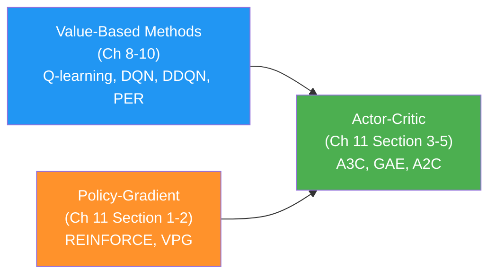

| Category | Learns | Objective |
|---|---|---|
| **Value-based** | Value functions only | Minimize value error |
| **Policy-gradient** | Policy only | Maximize expected return |
| **Actor-critic** | Policy + Value function | Maximize return (with critic baseline) |

**ဒီ Chapter ၌ algorithms ၅ ခု:**

| Algorithm | Full Name | Type |
|---|---|---|
| **REINFORCE** | Williams 1992 | Policy-gradient (MC) |
| **VPG** | Vanilla Policy Gradient | Policy-gradient + baseline |
| **A3C** | Async Advantage Actor-Critic | Actor-critic (parallel) |
| **GAE** | Generalized Advantage Estimation | Advantage estimator for AC |
| **A2C** | Advantage Actor-Critic | Actor-critic (synchronous) |

---

## ၁၁.၂ — Policy-Gradient Methods ၏ ကနဦး မိတ်ဆက်

### ၁၁.၂.၁ — Value-Based vs Policy-Based Objectives

**Value-based methods ၏ objective:**

$$\min_\theta \; \mathbb{E}\left[(Q^\pi(s,a) - Q(s,a;\theta))^2\right] \quad \text{(minimize prediction error)}$$

**Policy-based methods ၏ objective:**

$$\max_\theta \; J(\theta) = \max_\theta \; \mathbb{E}_{s_0}\left[V^\pi(s_0)\right] \quad \text{(maximize expected return!)}$$

> 💡 Policy-based methods သည် **directly RL ၏ true objective** ကို optimize ပြုလုပ်ပါတယ်! Value functions ကနေ policy ကို indirectly derive မပြုဘဲ!

### ၁၁.၂.၂ — Policy-Gradient Methods ၏ Advantages

**1. Continuous Action Spaces ကို handle နိုင်:**

Value-based methods ၌ Q-values ကို maximize ပြုဖို့ `max` operator ရှိပါတယ် — continuous action spaces ၌ `argmax` ကို compute ပြုနိုင်ဖို့ **infeasible** ဖြစ်ပါတယ်! Policy-based methods သည် ဤ limitation မရှိပါ!

**2. Stochastic Policies ကို directly learn နိုင်:**

```
Value-based: Q(s, a1)=5.2, Q(s, a2)=5.1 → always pick a1 (deterministic, forced)
Policy-based: π(a1|s)=0.6, π(a2|s)=0.4  → stochastic! naturally explore!
```

**3. Partially Observable Environments ၌ ပိုကောင်း:**

Agent သည် states ကို fully observe မပြုနိုင်လျှင် → **stochastic policy** ကို learn ပြုခြင်းသည် optimal! Markov assumption ကဲ့သို့ strict dependency မလိုပါ!

**Foggy Lake ဥပမာ:**

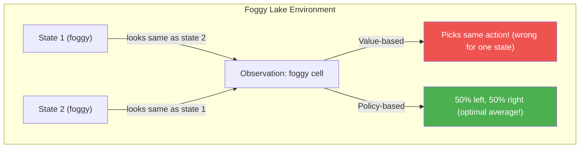

**4. Better Convergence Properties:**

Value-based methods ၌ Q-value space ၌ tiny change → action space ၌ huge change (oscillations!)

Policy-based methods ၌ parameters change smoothly → action probabilities change smoothly → gradient ကို follow ပြုလျှင် **local optimum convergence guaranteed!**

**5. Policy Representation ပိုလွယ်ကူ:**

All state values ကို accurately estimate မပြုဘဲ "ဘယ် direction သာ?" ကိုသာ learn ပြုနိုင်ပါတယ်!

---

### ၁၁.၂.၃ — Methods ၏ RL Terminology

| Term | Definition |
|---|---|
| **Value-based** | Value functions only learn (Q-learning, DQN, etc.) |
| **Policy-based** | Policy optimize algorithms — black-box methods ပါဝင် (genetic algorithms etc.) |
| **Policy-gradient** | Parameterized policy gradient ကို solve ပြုသော methods (REINFORCE, VPG, etc.) |
| **Actor-critic** | Policy (actor) + value function (critic using bootstrapping) ကို both learn |

> ⚠️ **Actor-critic ၏ debate:** Rich Sutton — bootstrapping သုံးလျှင်သာ "actor-critic" ဟု ခေါ်ရ! VPG ၌ value function ကို MC returns ဖြင့် learn ပြုတာကြောင့် **not actor-critic**! A3C ၌ bootstrapping သုံးသောကြောင့် **actor-critic**!

---

## ₁₁.₃ — Policy Gradient ၏ Mathematics

### ₁₁.₃.₁ — Policy Gradient Theorem

**Objective:**

$$J(\theta) = \mathbb{E}_{\tau \sim \pi_\theta}\left[G(\tau)\right] = \mathbb{E}_{\tau \sim \pi_\theta}\left[\sum_{t=0}^{T-1} \gamma^t R_{t+1}\right]$$

where $\tau = (S_0, A_0, R_1, S_1, A_1, \ldots, S_{T-1}, A_{T-1}, R_T)$ is a full trajectory.

**Policy Gradient:**

**Score function gradient estimator identity:**

$$\nabla_\theta \log P(\tau;\theta) = \sum_{t=0}^{T-1} \nabla_\theta \log \pi(A_t | S_t; \theta)$$

After substituting and simplifying (transition probabilities ကို drop ပြုနိုင်!):

$$\nabla_\theta J(\theta) = \mathbb{E}_{\tau \sim \pi_\theta}\left[\sum_{t=0}^{T-1} \nabla_\theta \log \pi(A_t|S_t;\theta) \cdot G_t\right]$$

> 💡 **Key insight:** Gradient တွင် environment's transition function မပါဝင်တော့ပါ! Policy parameters ဖြင့်သာ compute ပြုနိုင်ပါတယ်!

**RP Meaning:**
- High $G_t$ experience ←Increase probability of those actions
- Low (or negative) $G_t$ ← Decrease probability

### ₁₁.₃.₂ — Variance Reduction: Reward-to-Go

$$\nabla_\theta J(\theta) \approx \sum_{t=0}^{T-1} \nabla_\theta \log \pi(A_t|S_t;\theta) \cdot \underbrace{\sum_{t'=t}^{T-1} \gamma^{t'-t} R_{t'+1}}_{G_t \text{ (reward-to-go from step t)}}$$

**ဘာကြောင့် reward-to-go သုံးရသလဲ?** Current action သည် past rewards ကို affect မပြုနိုင်! Uses only future rewards → less noise → lower variance!

---

## ₁₁.₄ — REINFORCE: Outcome-based Policy Learning

### ₁₁.₄.₁ — REINFORCE Overview

**History:**

**0001 A Bit of History:**
**Ronald J. Williams** သည် 1992 ခုနှစ်တွင် "Simple Statistical Gradient-Following Algorithms for Connectionist Reinforcement Learning" paper တွင် REINFORCE algorithms family ကို introduce ပြုခဲ့ပါတယ်! 1986 ခုနှစ်တွင် Geoffrey Hinton နှင့် "Learning representations by back-propagating errors" paper ကို coauthor ပြုခဲ့ပြီး ANN research ကို growing ဖြစ်စေခဲ့ပါတယ်!

**Algorithm ရိုးရှင်းမှု:**
1. Episode တစ်ခု collect ပြုလုပ်
2. Full discounted return $G_t$ ကို each step အတွက် calculate ပြုလုပ်
3. $$\theta \leftarrow \theta + \alpha \sum_t \gamma^t G_t \nabla_\theta \log \pi(A_t|S_t;\theta)$$

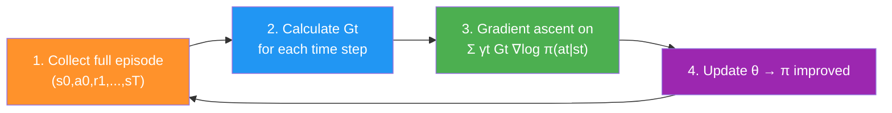

### ₁₁.₄.₂ — FCDAP: Fully Connected Discrete Action Policy

```python
import torch
import torch.nn as nn
import torch.nn.functional as F
import numpy as np

class FCDAP(nn.Module):
    """Fully Connected Discrete-Action Policy
    
    Input: state → Output: logits (preferences over actions)
    Action probabilities = softmax(logits)
    """
    def __init__(self, 
                 input_dim,           # State variables count
                 output_dim,          # Number of actions
                 hidden_dims=(32, 32),
                 activation_fc=F.relu):
        super(FCDAP, self).__init__()
        self.activation_fc = activation_fc
        
        self.input_layer = nn.Linear(input_dim, hidden_dims[0])
        self.hidden_layers = nn.ModuleList()
        for i in range(len(hidden_dims) - 1):
            self.hidden_layers.append(
                nn.Linear(hidden_dims[i], hidden_dims[i+1]))
        self.output_layer = nn.Linear(hidden_dims[-1], output_dim)
    
    def _format(self, state):
        x = state
        if not isinstance(x, torch.Tensor):
            x = torch.tensor(x, dtype=torch.float32)
            x = x.unsqueeze(0)
        return x
    
    def forward(self, state):
        """Returns logits (raw preferences, before softmax)"""
        x = self._format(state)
        x = self.activation_fc(self.input_layer(x))
        for hidden_layer in self.hidden_layers:
            x = self.activation_fc(hidden_layer(x))
        return self.output_layer(x)  # logits (not probabilities!)
    
    def full_pass(self, state):
        """Training time: returns action + log_prob + entropy"""
        logits = self.forward(state)
        
        # Categorical distribution from logits
        dist = torch.distributions.Categorical(logits=logits)
        action = dist.sample()                          # sample action
        logpa = dist.log_prob(action).unsqueeze(-1)    # log P(action)
        entropy = dist.entropy().unsqueeze(-1)          # H[π(·|s)]
        
        # Is this action greedy or exploratory?
        is_exploratory = action != np.argmax(logits.detach().numpy())
        
        return action.item(), is_exploratory.item(), logpa, entropy
    
    def select_action(self, state):
        """Inference: sample from stochastic policy"""
        logits = self.forward(state)
        dist = torch.distributions.Categorical(logits=logits)
        return dist.sample().item()
    
    def select_greedy_action(self, state):
        """Evaluation: pick highest probability action"""
        logits = self.forward(state)
        return np.argmax(logits.detach().numpy())
```

**Code ရှင်းလင်းချက်:**
- `forward()` → **logits** return ပြုတယ် (raw scores, not probabilities)
- `Categorical(logits=logits)` → PyTorch ၌ logits → softmax probabilities internally
- `dist.log_prob(action)` = $\log \pi(a|s;\theta)$ — gradient ကို flow ပြုလုပ်
- `dist.entropy()` = $H[\pi(\cdot|s)]$ = $-\sum_a \pi(a|s) \log \pi(a|s)$ — exploration encourage
- `full_pass()` → training time (all info needed)
- `select_action()` → inference time (sample from π)
- `select_greedy_action()` → evaluation mode (argmax)

---

### ₁₁.₄.₃ — REINFORCE Implementation

```python
class REINFORCE:
    def interaction_step(self, state, env):
        # Get action + training variables from policy
        action, is_exploratory, logpa, _ = self.policy_model.full_pass(state)
        new_state, reward, is_terminal, _ = env.step(action)
        
        # Store log prob and reward for this step
        self.logpas.append(logpa)
        self.rewards.append(reward)
        
        return new_state, is_terminal
    
    def optimize_model(self):
        T = len(self.rewards)
        
        # Step 1: Calculate discounts [γ^0, γ^1, γ^2, ..., γ^(T-1)]
        discounts = np.logspace(0, T, num=T, base=self.gamma, endpoint=False)
        
        # Step 2: Returns Gt for each time step t (reward-to-go)
        returns = np.array([
            np.sum(discounts[:T-t] * self.rewards[t:])
            for t in range(T)
        ])
        
        # Step 3: Policy loss = -E[γt * Gt * log π(at|st)]
        # Negative because PyTorch does gradient descent, we want ascent!
        policy_loss = -(discounts * returns * self.logpas).mean()
        
        # Step 4: Gradient ascent on policy
        self.policy_optimizer.zero_grad()
        policy_loss.backward()
        self.policy_optimizer.step()
    
    def train(self, ..., max_episodes, ...):
        for episode in range(1, max_episodes + 1):
            state = env.reset()
            self.logpas, self.rewards = [], []  # reset per episode
            
            for step in count():
                state, is_terminal = self.interaction_step(state, env)
                if is_terminal:
                    break
            
            # Train ONCE per full episode (Monte Carlo!)
            self.optimize_model()
```

**Code ရှင်းလင်းချက်:**
1. `np.logspace(0, T, base=gamma)` → `[1, γ, γ², ..., γ^(T-1)]` ← per-step discounts
2. **Returns loop:** `t=0` → sum all rewards; `t=1` → sum from reward[1]; ... (reward-to-go)
3. `-(discounts * returns * logpas).mean()` → negative = gradient **ascent** (maximize J)
4. `discounts * returns` → mathematically correct discounted policy gradient
5. Full episode collect → optimize once (Monte Carlo style)

> ⚠️ **REINFORCE ၏ limitation:** High variance! Full Monte Carlo returns = accumulated randomness from initial state + transitions + stochastic policy → signal noisy!

---

## ₁₁.₅ — VPG: Vanilla Policy Gradient (REINFORCE with Baseline)

### ₁₁.₅.₁ — Variance Problem ၏ Solution

**Problem:** All rewards positive ဖြစ်ပါသော environments (e.g., cart-pole) ၌ REINFORCE သည် "okay" actions နှင့် "best" actions ကို separate ပြုဖို့ ခက်ပါတယ်!

**Solution:** **Advantage function** ကိုသုံး — average-than ပိုကောင်းသော actions ↑, worse-than-average ↓

$$\hat{A}_t = G_t - V(S_t; \phi) \approx A^\pi(S_t, A_t)$$

$$\nabla_\theta J(\theta) \approx \sum_t \gamma^t \hat{A}_t \nabla_\theta \log\pi(A_t|S_t;\theta)$$

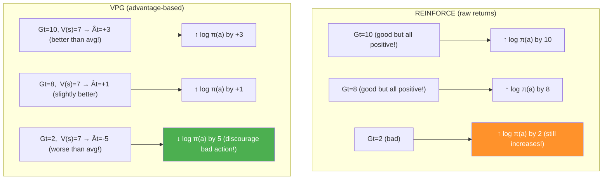

### ₁₁.₅.₂ — Entropy Regularization

**Entropy** = Policy distribution ၏ "randomness" measure:

$$H[\pi(\cdot|s)] = -\sum_a \pi(a|s) \log \pi(a|s)$$

- Uniform distribution → High entropy (max exploration)
- Deterministic policy → Zero entropy (no exploration)

**Cart-pole (2 actions) ၌ entropy range:** $0 \leq H \leq \ln(2) \approx 0.693$

**Loss function (VPG):**

$$\mathcal{L}_\text{policy}(\theta) = -\frac{1}{T}\sum_t \gamma^t \hat{A}_t \log\pi(A_t|S_t;\theta) - \beta_e H[\pi(\cdot|S_t;\theta)]$$

$$\mathcal{L}_\text{value}(\phi) = \frac{1}{T}\sum_t (G_t - V(S_t;\phi))^2$$

- $\beta_e$ = entropy weight (e.g., 0.001) → exploration encourage
- Negative entropy term → loss minimize ↔ entropy maximize → exploration maintain

### ₁₁.₅.₃ — FCV: State-Value Network

```python
class FCV(nn.Module):
    """Fully Connected Value Function Network
    
    Input: state → Output: V(s) (single scalar)
    """
    def __init__(self, input_dim, hidden_dims=(32, 32), activation_fc=F.relu):
        super(FCV, self).__init__()
        self.activation_fc = activation_fc
        
        self.input_layer = nn.Linear(input_dim, hidden_dims[0])
        self.hidden_layers = nn.ModuleList()
        for i in range(len(hidden_dims) - 1):
            self.hidden_layers.append(
                nn.Linear(hidden_dims[i], hidden_dims[i+1]))
        
        # Single output node → V(s)
        self.output_layer = nn.Linear(hidden_dims[-1], 1)
    
    def forward(self, state):
        x = state
        if not isinstance(x, torch.Tensor):
            x = torch.tensor(x, dtype=torch.float32)
            x = x.unsqueeze(0)
        x = self.activation_fc(self.input_layer(x))
        for hidden_layer in self.hidden_layers:
            x = self.activation_fc(hidden_layer(x))
        return self.output_layer(x)  # scalar V(s)
```

**Core difference from Q-network:** output_layer = `Linear(hidden[-1], 1)` — single node = V(s)!

### ₁₁.₅.₄ — VPG Implementation

```python
class VPG:
    def optimize_model(self):
        T = len(self.rewards)
        
        # Discounts and returns (same as REINFORCE)
        discounts = np.logspace(0, T, num=T, base=self.gamma, endpoint=False)
        returns = np.array([
            np.sum(discounts[:T-t] * self.rewards[t:]) for t in range(T)])
        
        # === Advantage estimate ===
        value_error = returns - self.values  # Ât = Gt - V(st)
        
        # === Policy loss (advantage-weighted, entropy-regularized) ===
        policy_loss = -(discounts * value_error.detach() * self.logpas).mean()
        entropy_loss = -self.entropies.mean()
        loss = policy_loss + self.entropy_loss_weight * entropy_loss
        
        # === Optimize policy ===
        self.policy_optimizer.zero_grad()
        loss.backward()
        torch.nn.utils.clip_grad_norm_(
            self.policy_model.parameters(), 
            self.policy_model_max_grad_norm)  # gradient clipping
        self.policy_optimizer.step()
        
        # === Optimize value function (separately!) ===
        value_loss = value_error.pow(2).mul(0.5).mean()  # MSE
        self.value_optimizer.zero_grad()
        value_loss.backward()
        torch.nn.utils.clip_grad_norm_(
            self.value_model.parameters(), 
            self.value_model_max_grad_norm)
        self.value_optimizer.step()
```

**Code ရှင်းလင်းချက်:**
1. `value_error = returns - values` → advantage estimate $\hat{A}_t = G_t - V(S_t;\phi)$
2. `.detach()` → value_error ကနေ gradients ကို policy network ၏ backward pass ၌ flow မပြုဘဲ!
3. `entropy_loss_weight * entropy_loss` → exploration balance
4. **Two separate optimizers** → policy network + value network ကို independently update

> 💡 VPG ৌ value function သည် **baseline** (variance reducer) သာဖြစ်ပြီး **critic** မဟုတ်ပါ! Bootstrapping မသုံးတဲ့ကြောင့်! Full MC returns ကို guidance အဖြစ်သုံးပါတယ်!

---

## ₁₁.₆ — A3C: Asynchronous Advantage Actor-Critic

### ₁₁.₆.₁ — Motivation: Correlated Data Problem

**On-policy methods (REINFORCE, VPG) ၏ problem:**
- Sequential experience: $s_t → s_{t+1}$ highly correlated
- Value-based methods ၌ Replay Buffer သုံး → **off-policy only!**
- On-policy methods → each optimization step requires **fresh data** (cannot reuse old policy data!)

**Solution: Multiple parallel workers!**

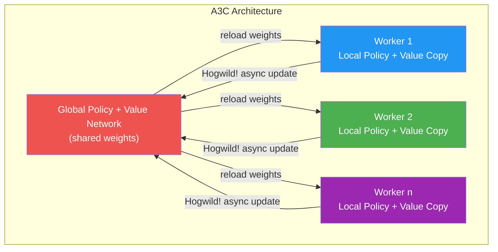

**Benefits of multiple workers:**
1. **Decorrelate data** — worker တစ်ခုချင်း different environments ၌ → diverse experience
2. **Reduce variance** — more diverse mini-batches
3. **Real parallelism** — CPU cores ကို fully utilize (GPU bottleneck bypass!)

**History:**

**0001 A Bit of History:**
**Vlad Mnih et al.** သည် 2016 ခုနှစ်တွင် "Asynchronous Methods for Deep Reinforcement Learning" paper တွင် A3C ကို introduce ပြုလုပ်ခဲ့ပါတယ်! Vlad သည် DQN paper ကိုလည်း (2013, 2015) author ဖြစ်ပါတယ်! DQN ကို value-based DRL ၏ explosive growth ဖြစ်ပေါ်ပေးခဲ့ပြီး A3C ကို actor-critic methods ၏ research focus ကို directed ပြုလုပ်ပေးခဲ့ပါတယ်!

### ₁₁.₆.₂ — N-Step Bootstrapping (Actor-Critic ဖြစ်သောအကြောင်း)

**VPG:** Full Monte Carlo returns (unbiased, high variance)
**A3C:** N-step returns with bootstrapping (lower variance, some bias)

$$G_t^{(n)} = R_{t+1} + \gamma R_{t+2} + \ldots + \gamma^{n-1} R_{t+n} + \gamma^n V(S_{t+n};\phi)$$

$$\hat{A}_t^{(n)} = G_t^{(n)} - V(S_t;\phi)$$

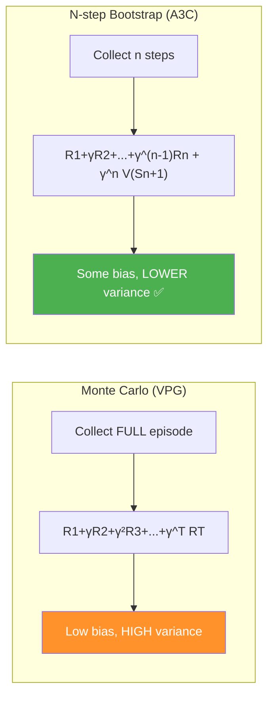

> 💡 **Value function ကို n-step target update ဖြစ်သောကြောင့် A3C = Actor-Critic!** VPG တွင် ဤ bootstrapping မရှိ→ policy-gradient only!

### ₁₁.₆.₃ — A3C Worker Logic

```python
import torch.multiprocessing as mp

class A3C:
    def work(self, rank):
        # === Worker setup ===
        local_seed = self.seed + rank   # unique seed per worker for diversity!
        env = self.make_env_fn(**self.make_env_kargs, seed=local_seed)
        torch.manual_seed(local_seed)
        
        # === Create LOCAL copies of networks ===
        local_policy_model = self.policy_model_fn(nS, nA)
        local_policy_model.load_state_dict(
            self.shared_policy_model.state_dict())   # sync with global!
        
        local_value_model = self.value_model_fn(nS)
        local_value_model.load_state_dict(
            self.shared_value_model.state_dict())    # sync with global!
        
        while not self.get_out_signal:
            state, is_terminal = env.reset(), False
            logpas, entropies, rewards, values = [], [], [], []
            n_steps_start = 0
            
            for step in count(start=1):
                # Interact with environment using LOCAL model
                state, reward, is_terminal, is_truncated, \
                    is_exploratory = self.interaction_step(
                        state, env, local_policy_model,
                        local_value_model, logpas, entropies, rewards, values)
                
                # Train every max_n_steps OR at terminal state
                if is_terminal or step - n_steps_start == self.max_n_steps:
                    is_failure = is_terminal and not is_truncated
                    
                    # Bootstrap: if NOT failure, use V(next_state) as final reward
                    next_value = 0 if is_failure else \
                        local_value_model(state).detach().item()
                    
                    # Append bootstrapped value to rewards (clever trick!)
                    rewards.append(next_value)
                    
                    # Optimize GLOBAL model using local gradients (Hogwild!)
                    self.optimize_model(
                        logpas, entropies, rewards, values,
                        local_policy_model, local_value_model)
                    
                    # Reset batch variables
                    logpas, entropies, rewards, values = [], [], [], []
                    n_steps_start = step
                
                if is_terminal:
                    break
```

**Code ရှင်းလင်းချက်:**
1. **Local copies** — each worker ၌ own network copy → simultaneous computation
2. `load_state_dict(shared_model.state_dict())` → global ↔ local sync
3. `rewards.append(next_value)` — **clever trick**: last reward slot ကို bootstrap value ဖြင့် fill → optimization code ကို VPG နှင့် similar ဖြစ်အောင်!
4. `optimize_model(...)` → local gradients → **Hogwild! style** → global network update

### ₁₁.₆.₄ — A3C Optimization (Gradient to Global)

```python
class A3C:
    def optimize_model(self, logpas, entropies, rewards, values,
                       local_policy_model, local_value_model):
        T = len(rewards)
        discounts = np.logspace(0, T, num=T, base=self.gamma, endpoint=False)
        
        # N-step returns (rewards[-1] is the bootstrap value!)
        returns = np.array([
            np.sum(discounts[:T-t] * rewards[t:]) for t in range(T)])
        
        # Remove bootstrap value from end, format tensors
        discounts = torch.FloatTensor(discounts[:-1]).unsqueeze(1)
        returns = torch.FloatTensor(returns[:-1]).unsqueeze(1)
        
        value_error = returns - values
        
        # Policy loss
        policy_loss = -(discounts * value_error.detach() * logpas).mean()
        entropy_loss = -entropies.mean()
        loss = policy_loss + self.entropy_loss_weight * entropy_loss
        
        # === ZERO shared optimizer → backward → clip ===
        self.shared_policy_optimizer.zero_grad()
        loss.backward()
        torch.nn.utils.clip_grad_norm_(
            local_policy_model.parameters(), 
            self.policy_model_max_grad_norm)
        
        # === Copy LOCAL gradients → SHARED model (Hogwild!) ===
        for param, shared_param in zip(
                local_policy_model.parameters(),
                self.shared_policy_model.parameters()):
            if shared_param.grad is None:
                shared_param._grad = param.grad  # copy gradient!
        
        # === Step SHARED optimizer ===
        self.shared_policy_optimizer.step()
        
        # === Reload shared weights to local ===
        local_policy_model.load_state_dict(
            self.shared_policy_model.state_dict())
        
        # Value function (same pattern)
        value_loss = value_error.pow(2).mul(0.5).mean()
        self.shared_value_optimizer.zero_grad()
        value_loss.backward()
        torch.nn.utils.clip_grad_norm_(
            local_value_model.parameters(),
            self.value_model_max_grad_norm)
        for param, shared_param in zip(
                local_value_model.parameters(),
                self.shared_value_model.parameters()):
            if shared_param.grad is None:
                shared_param._grad = param.grad
        self.shared_value_optimizer.step()
        local_value_model.load_state_dict(
            self.shared_value_model.state_dict())
```

**Hogwild! Pattern (lock-free async update):**

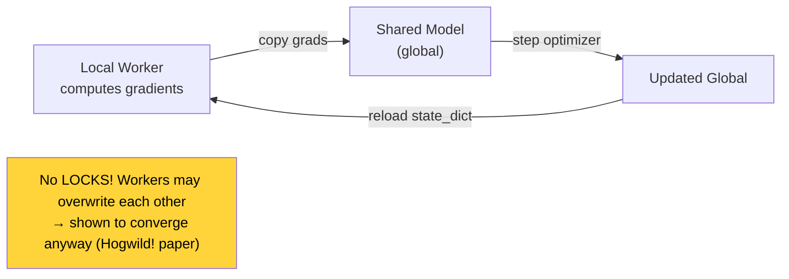

### ₁₁.₆.₅ — SharedAdam Optimizer

```python
class SharedAdam(torch.optim.Adam):
    """Adam optimizer with shared memory for multi-process training"""
    def __init__(self, params, lr=1e-3, ...):
        super(SharedAdam, self).__init__(params, lr=lr, ...)
        
        # Share internal state across processes!
        for group in self.param_groups:
            for p in group['params']:
                state = self.state[p]
                state['step'] = 0
                state['shared_step'] = torch.zeros(1).share_memory_()     # shared!
                state['exp_avg'] = torch.zeros_like(p.data).share_memory_()  # shared!
                state['exp_avg_sq'] = torch.zeros_like(p.data).share_memory_()  # shared!
    
    def step(self, closure=None):
        for group in self.param_groups:
            for p in group['params']:
                if p.grad is None: continue
                # Sync step counter from shared memory
                self.state[p]['steps'] = self.state[p]['shared_step'].item()
                self.state[p]['shared_step'] += 1
        super().step(closure)
```

**ဘာကြောင့် SharedAdam လိုသလဲ?** Process tween memory sharing — `share_memory_()` ← PyTorch ၌ optimizer state ကို inter-process accessible ဖြစ်အောင် ပြုလုပ်ပါတယ်!

---

## ₁₁.₇ — GAE: Generalized Advantage Estimation

### ₁₁.₇.₁ — N-step Returns ၏ Bias-Variance Tradeoff

Chapter 5 တွင် learn ပြုခဲ့သော $\lambda$-returns ကဲ့သို့ **advantages ကိုလည်း mix ပြုလုပ်နိုင်ပါတယ်!**

**Policy gradient estimators ၏ မတူညီသော options:**

| Estimator $\Psi_t$ | Variance | Bias |
|---|---|---|
| $G_0$ (full return from step 0) | Highest | None |
| $G_t$ (reward-to-go) | High | None |
| $G_t - V(S_t)$ (advantage, VPG) | Medium | Low |
| $G_t^{(n)} - V(S_t)$ (n-step advantage, A3C) | Lower | Some |
| $Q(S_t,A_t)$ (action-value) | Low | Some |
| $R_{t+1} + \gamma V(S_{t+1}) - V(S_t)$ (TD residual = 1-step) | Lowest | Highest |

**History:**

**0001 A Bit of History:**
**John Schulman et al.** သည် 2015 ခုနှစ်တွင် "High-dimensional Continuous Control Using Generalized Advantage Estimation" paper တွင် GAE ကို introduce ပြုလုပ်ခဲ့ပါတယ်! John သည် OpenAI research scientist ဖြစ်ပြီး GAE, TRPO, PPO (next chapter) ၏ lead inventor ဖြစ်ပါတယ်! 2018 ခုနှစ်တွင် MIT Technology Review ၏ "Innovators Under 35" ၌ ပါဝင်ခဲ့ပါတယ်!

### ₁₁.₇.₂ — GAE Formula

**1-step TD advantage (δt):**

$$\delta_t = R_{t+1} + \gamma V(S_{t+1};\phi) - V(S_t;\phi)$$

**N-step advantages as combinations of δt:**

$$\hat{A}_t^{(1)} = \delta_t$$

$$\hat{A}_t^{(2)} = \delta_t + \gamma \delta_{t+1}$$

$$\hat{A}_t^{(n)} = \sum_{l=0}^{n-1} \gamma^l \delta_{t+l}$$

**GAE — exponentially weighted mixture of all n-step advantages:**

$$\hat{A}_t^{\text{GAE}(\lambda)} = \sum_{l=0}^{\infty} (\gamma\lambda)^l \delta_{t+l}$$

| λ value | Behavior |
|---|---|
| **λ = 0** | 1-step TD advantage (highest bias, lowest variance) |
| **λ = 1** | Monte Carlo advantage, infinite-step (lowest bias, highest variance) |
| **λ ∈ (0,1)** | Exponential mix → **tunable bias-variance tradeoff** ✅ |

### ₁₁.₇.₃ — GAE Implementation

```python
class GAE:
    def optimize_model(self, logpas, entropies, rewards, values,
                       local_policy_model, local_value_model):
        T = len(rewards)
        discounts = np.logspace(0, T, num=T, base=self.gamma, endpoint=False)
        
        # N-step returns (with bootstrap value appended)
        returns = np.array([
            np.sum(discounts[:T-t] * rewards[t:]) for t in range(T)])
        
        # State values as numpy array
        np_values = values.view(-1).data.numpy()
        
        # tau_discounts: (γλ)^0, (γλ)^1, ..., (γλ)^(T-2)
        tau_discounts = np.logspace(0, T-1, num=T-1, 
                                    base=self.gamma * self.tau,   # τ ≡ λ here
                                    endpoint=False)
        
        # TD residuals: δt = Rt+1 + γV(St+1) - V(St)
        advs = rewards[:-1] + self.gamma * np_values[1:] - np_values[:-1]
        
        # GAE: Σ (γλ)^l * δ_{t+l}
        gaes = np.array([
            np.sum(tau_discounts[:T-1-t] * advs[t:]) 
            for t in range(T-1)
        ])
        
        # Policy loss using GAE
        policy_loss = -(discounts[:-1] * gaes.detach() * logpas).mean()
        entropy_loss = -entropies.mean()
        loss = policy_loss + self.entropy_loss_weight * entropy_loss
        
        # Value loss using returns (could also use GAE as target)
        value_error = returns[:-1] - values
        value_loss = value_error.pow(2).mul(0.5).mean()
        
        # ... optimize both networks ...
```

**Code ရှင်းလင်းချက်:**
1. `advs = rewards[:-1] + gamma * np_values[1:] - np_values[:-1]` → each timestep ၏ TD error $\delta_t$
2. `tau_discounts[:T-1-t] * advs[t:]` → GAE sum for step t
3. `gaes` = GAE-weighted advantages → policy gradient score အဖြစ်သုံး
4. `tau` ≡ λ (book တွင် notation interchangeable!)

---

## ₁₁.₈ — A2C: Synchronous Advantage Actor-Critic

### ₁₁.₈.₁ — A3C ၏ Asynchrony Problem

**A3C ၏ real performance driver:** Multiple workers == decorrelated data

**A3C ၏ Hogwild! issue:** Workers overwrite each other → chaotic, hard to tune

**A2C ₁ insight:** Workers ကို agent ၌ မထားဘဲ → **environment ၌ place ပြုလုပ်!**

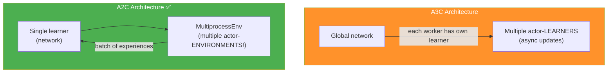

**A2C advantages over A3C:**
1. **Single network** → GPU-friendly batched forward passes!
2. **Deterministic, reproducible** training
3. **Simpler code** (no shared optimizer needed)
4. Performance **comparable** to A3C

### ₁₁.₈.₂ — FCAC: Weight-Sharing Actor-Critic Network

VPG ၌ policy network + value network = **separate**!
A2C ₁ → Single shared network ← outputs both policy logits + value!

```python
class FCAC(nn.Module):
    """Fully Connected Actor-Critic (shared weights)
    
    Similar to Dueling DDQN architecture!
    Output: policy logits (n_actions) + state value (1)
    """
    def __init__(self, input_dim, output_dim,
                 hidden_dims=(32, 32), activation_fc=F.relu):
        super(FCAC, self).__init__()
        self.activation_fc = activation_fc
        
        self.input_layer = nn.Linear(input_dim, hidden_dims[0])
        self.hidden_layers = nn.ModuleList()
        for i in range(len(hidden_dims) - 1):
            self.hidden_layers.append(
                nn.Linear(hidden_dims[i], hidden_dims[i+1]))
        
        # TWO output heads (like Dueling DDQN!)
        self.value_output_layer = nn.Linear(hidden_dims[-1], 1)           # V(s)
        self.policy_output_layer = nn.Linear(hidden_dims[-1], output_dim) # π(a|s) logits
    
    def forward(self, state):
        x = state
        if not isinstance(x, torch.Tensor):
            x = torch.tensor(x, dtype=torch.float32)
            if len(x.size()) == 1:
                x = x.unsqueeze(0)
        x = self.activation_fc(self.input_layer(x))
        for hidden_layer in self.hidden_layers:
            x = self.activation_fc(hidden_layer(x))
        # Return BOTH policy logits AND value!
        return self.policy_output_layer(x), self.value_output_layer(x)
    
    def full_pass(self, state):
        """Get action + logpa + entropy + value (for training)"""
        logits, value = self.forward(state)
        dist = torch.distributions.Categorical(logits=logits)
        action = dist.sample()
        logpa = dist.log_prob(action).unsqueeze(-1)
        entropy = dist.entropy().unsqueeze(-1)
        action = action.item() if len(action) == 1 else action.data.numpy()
        is_exploratory = action != np.argmax(
            logits.detach().numpy(), axis=int(len(state) != 1))
        return action, is_exploratory, logpa, entropy, value
    
    def select_action(self, state):
        logits, _ = self.forward(state)
        dist = torch.distributions.Categorical(logits=logits)
        action = dist.sample()
        return action.item() if len(action) == 1 else action.data.numpy()
```

**Core difference from VPG:** `forward()` returns **tuple** `(policy_logits, value)` — two heads, one pass!

### ₁₁.₈.₃ — MultiprocessEnv Wrapper

```python
import multiprocessing as mp

class MultiprocessEnv:
    def __init__(self, make_env_fn, make_env_kargs, seed, n_workers):
        self.n_workers = n_workers
        # Create communication pipes: parent ↔ each worker
        self.pipes = [mp.Pipe() for rank in range(n_workers)]
        # Create worker processes
        self.workers = [
            mp.Process(target=self.work, args=(rank, self.pipes[rank][1]))
            for rank in range(n_workers)]
        [w.start() for w in self.workers]  # start all workers!
    
    def work(self, rank, worker_end):
        """Worker process: listen for commands, execute env calls"""
        env = self.make_env_fn(**self.make_env_kargs, seed=self.seed + rank)
        while True:
            cmd, kwargs = worker_end.recv()  # wait for command
            if cmd == 'reset':
                worker_end.send(env.reset(**kwargs))
            elif cmd == 'step':
                worker_end.send(env.step(**kwargs))
            elif cmd == '_past_limit':
                worker_end.send(env._elapsed_steps >= env._max_episode_steps)
            else:  # 'close'
                env.close(); break
    
    def step(self, actions):
        """Broadcast actions to all workers, collect results"""
        assert len(actions) == self.n_workers
        
        # Send actions to all workers simultaneously
        for rank in range(self.n_workers):
            self.send_msg(('step', {'action': actions[rank]}), rank)
        
        # Collect results from all workers
        results = []
        for rank in range(self.n_workers):
            parent_end, _ = self.pipes[rank]
            o, r, d, _ = parent_end.recv()
            if d:  # auto-reset on done!
                self.send_msg(('reset', {}), rank)
                o = parent_end.recv()
            results.append((o, np.array(r, dtype=np.float),
                           np.array(d, dtype=np.float), _))
        
        # Stack: [n_workers, obs_dim], [n_workers], [n_workers], [n_workers]
        return [np.vstack(block) for block in np.array(results).T]
```

**Key points:**
1. `mp.Pipe()` → bidirectional communication channel parent ↔ worker
2. `mp.Process(target=self.work, ...)` → separate OS process (true parallelism!)
3. `[w.start() for w in self.workers]` → workers ကို immediately start
4. `step(actions)` → broadcast to ALL workers → collect ALL results → stack as batches
5. Auto-reset on `done` → single step call returns next episode's initial state

### ₁₁.₈.₄ — A2C Training + Optimization

```python
class A2C:
    def train(self, make_envs_fn, make_env_fn, make_env_kargs, ...):
        # Create vectorized environment (n_workers parallel envs)
        envs = make_envs_fn(make_env_fn, make_env_kargs, self.seed, self.n_workers)
        
        # SINGLE actor-critic network (not per-worker!)
        self.ac_model = self.ac_model_fn(nS, nA)
        self.ac_optimizer = self.ac_optimizer_fn(self.ac_model, self.ac_optimizer_lr)
        
        states = envs.reset()  # returns [n_workers, obs_dim] batch!
        
        for step in count(start=1):
            states, is_terminals = self.interaction_step(states, envs)
            
            if is_terminals.sum() or step - n_steps_start == self.max_n_steps:
                # Bootstrap: get V(next_state) for non-terminal states
                next_values = self.ac_model.evaluate_state(states).detach().numpy()
                next_values *= (1 - is_failure)  # 0 for failures
                
                self.rewards.append(next_values)
                self.values.append(torch.Tensor(next_values))
                
                self.optimize_model()  # batch update!
                
                self.logpas, self.entropies = [], []
                self.rewards, self.values = [], []
                n_steps_start = step
    
    def optimize_model(self):
        T = len(self.rewards)
        discounts = np.logspace(0, T, num=T, base=self.gamma, endpoint=False)
        
        # Returns: [n_workers, T] matrix
        returns = np.array([
            [np.sum(discounts[:T-t] * rewards[t:, w]) for t in range(T)]
            for w in range(self.n_workers)
        ])
        
        np_values = values.data.numpy()
        tau_discounts = np.logspace(0, T-1, num=T-1,
                                    base=self.gamma * self.tau, endpoint=False)
        advs = rewards[:-1] + self.gamma * np_values[1:] - np_values[:-1]
        
        # GAEs: [n_workers, T-1] matrix
        gaes = np.array([
            [np.sum(tau_discounts[:T-1-t] * advs[t:, w]) for t in range(T-1)]
            for w in range(self.n_workers)
        ])
        discounted_gaes = discounts[:-1] * gaes
        
        # Combined loss (single network!)
        value_error = returns - values
        value_loss = value_error.pow(2).mul(0.5).mean()
        policy_loss = -(discounted_gaes.detach() * logpas).mean()
        entropy_loss = -entropies.mean()
        
        loss = (self.policy_loss_weight * policy_loss + 
                self.value_loss_weight * value_loss + 
                self.entropy_loss_weight * entropy_loss)
        
        # Single optimizer (shared network)
        self.ac_optimizer.zero_grad()
        loss.backward()
        torch.nn.utils.clip_grad_norm_(self.ac_model.parameters(), 
                                        self.ac_model_max_grad_norm)
        self.ac_optimizer.step()
```

**A2C vs A3C Key differences:**

| Aspect | A3C | A2C |
|---|---|---|
| **Workers** | Multiple actor-learners | Multiple actor-environments |
| **Network** | Per-worker local copies | Single shared network |
| **Update style** | Hogwild! async | Synchronous batched |
| **Hardware** | CPU-friendly | GPU-friendly! |
| **Loss** | Separate policy + value | **Combined single loss** |
| **Optimizer** | SharedAdam | Standard Adam |

---

## ₁₁.₉ — Hyperparameters Summary

**Algorithm configurations used in CartPole-v1:**

| Parameter | REINFORCE | VPG | A3C | GAE | A2C |
|---|---|---|---|---|---|
| **Policy network** | 4-128-64-2 | 4-128-64-2 | 4-128-64-2 | 4-128-64-2 | 4-256-128-2 (shared) |
| **Value network** | — | 4-256-128-1 | 4-256-128-1 | 4-256-128-1 | 4-256-128-1 (shared) |
| **Policy optimizer** | Adam lr=0.0007 | Adam lr=0.0007 | Adam lr=0.0007 | Adam lr=0.0007 | Adam lr=0.002 |
| **Value optimizer** | — | RMSprop lr=0.001 | RMSprop lr=0.001 | RMSprop lr=0.001 | (shared) |
| **Bootstrapping** | ❌ MC | ❌ MC | ✅ n=50 steps | ✅ n-step | ✅ n=10 steps |
| **Entropy weight** | 0 | 0.001 | 0.001 | 0.001 | 0.001 |
| **Workers** | 1 | 1 | 8 | 8 | 8 |
| **τ (GAE lambda)** | — | — | — | 0.95 | 0.95 |
| **Loss weights** | — | — | — | — | π:1.0, V:0.6, H:0.001 |
| **Grad clip norm** | None | 1.0 | 1.0 | 1.0 | 1.0 |

---

## ₁₁.₁₀ — Performance Comparison

**CartPole-v1 ၌ results:**

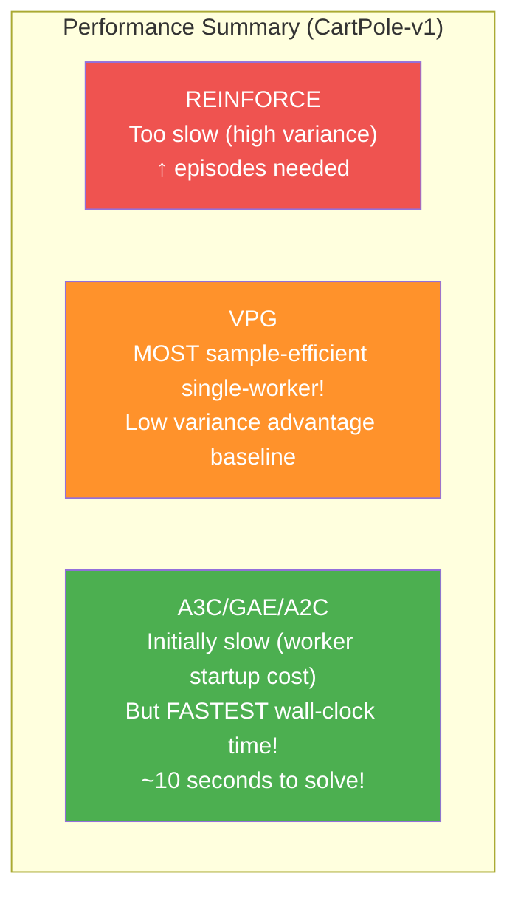

| Metric | REINFORCE | VPG | A3C/A2C |
|---|---|---|---|
| **Sample efficiency** | Low | **Best (single worker)** | High |
| **Wall-clock time** | Fast | Medium | **Fastest (~10s)** |
| **Compute usage** | Low | Medium | **High (multi-process)** |
| **Stability** | Noisy | Good | Very good |

> 💡 **Parallel methods ၏ paradox:** Episodes per sample ၌ VPG ထက် worse ပေမယ့် wall-clock time ၌ much faster! Multiple workers → more compute → faster convergence in real time!

---

## ₁₁.₁၁ — Key Equations Summary

| Equation | Formula |
|---|---|
| **Policy objective** | $J(\theta) = \mathbb{E}_{\tau \sim \pi_\theta}[G(\tau)]$ |
| **Policy gradient** | $\nabla_\theta J = \mathbb{E}_\tau\left[\sum_t \gamma^t G_t \nabla_\theta \log\pi(A_t|S_t)\right]$ |
| **Reward-to-go** | $G_t = \sum_{t'=t}^{T-1} \gamma^{t'-t} R_{t'+1}$ |
| **REINFORCE loss** | $\mathcal{L} = -\frac{1}{T}\sum_t \gamma^t G_t \log\pi(A_t|S_t;\theta)$ |
| **Advantage** | $\hat{A}_t = G_t - V(S_t;\phi)$ |
| **Entropy** | $H[\pi(\cdot|s)] = -\sum_a \pi(a|s)\log\pi(a|s)$ |
| **VPG policy loss** | $\mathcal{L}_\pi = -\frac{1}{T}\sum_t \gamma^t \hat{A}_t \log\pi(A_t|S_t) - \beta_e H[\pi]$ |
| **VPG value loss** | $\mathcal{L}_V = \frac{1}{T}\sum_t (G_t - V(S_t;\phi))^2$ |
| **N-step return** | $G_t^{(n)} = \sum_{l=0}^{n-1}\gamma^l R_{t+l+1} + \gamma^n V(S_{t+n})$ |
| **TD residual** | $\delta_t = R_{t+1} + \gamma V(S_{t+1}) - V(S_t)$ |
| **GAE** | $\hat{A}_t^{\text{GAE}(\lambda)} = \sum_{l=0}^\infty (\gamma\lambda)^l \delta_{t+l}$ |
| **A2C combined loss** | $\mathcal{L} = w_\pi \mathcal{L}_\pi + w_V \mathcal{L}_V + w_H \mathcal{L}_H$ |

---

## ₁₁.₁၂ — Algorithm Progression Diagram

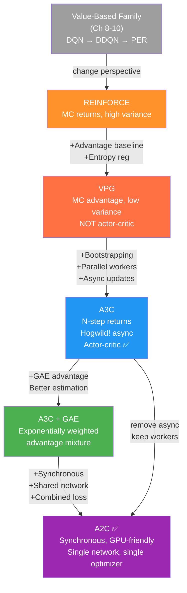

---

## ₁₁.₁₃ — နိဂုံးချုပ်

ဒီ Chapter မှာ **policy-gradient** နှင့် **actor-critic** methods ကို deep dive ပြုလုပ်ခဲ့ပါတယ်:

**REINFORCE (Williams, 1992):**
- Policy directly optimize ပြုလုပ်သော simplest algorithm
- MC returns ကို gradient weight အဖြစ်သုံး
- High variance — practical use ၌ too unstable

**VPG (REINFORCE with Baseline):**
- Value function ကို MC baseline အဖြစ်သုံး → variance ↓
- Entropy regularization → exploration maintain
- NOT actor-critic (no bootstrapping!) — policy-gradient only

**A3C (Mnih et al., 2016):**
- N-step bootstrapping → actor-critic ဖြစ်ပါသည်
- Multiple parallel workers → data decorrelation
- Hogwild! async updates → lock-free per paper

**GAE (Schulman et al., 2015):**
- $\lambda$-return ကဲ့သို့ advantages ကို exponentially mix
- Single τ (λ) parameter ဖြင့် bias-variance tradeoff ကို tune နိုင်

**A2C:**
- A3C ၏ synchronous version — comparable performance
- Workers ကို environment level ၌ → single network → GPU-friendly
- Combined loss function → single optimizer

> 💡 **Chapter 12 Preview:** DDPG, TD3, SAC, PPO — **continuous action spaces** + state-of-the-art methods! Policy-gradient ၏ next frontier!

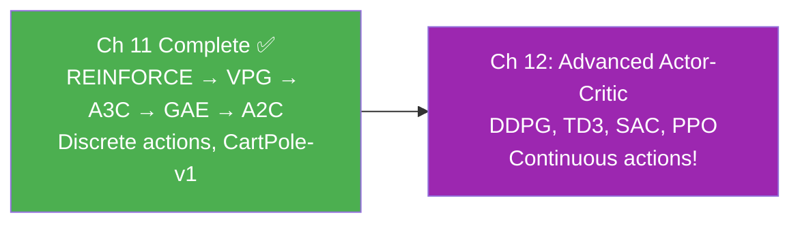
