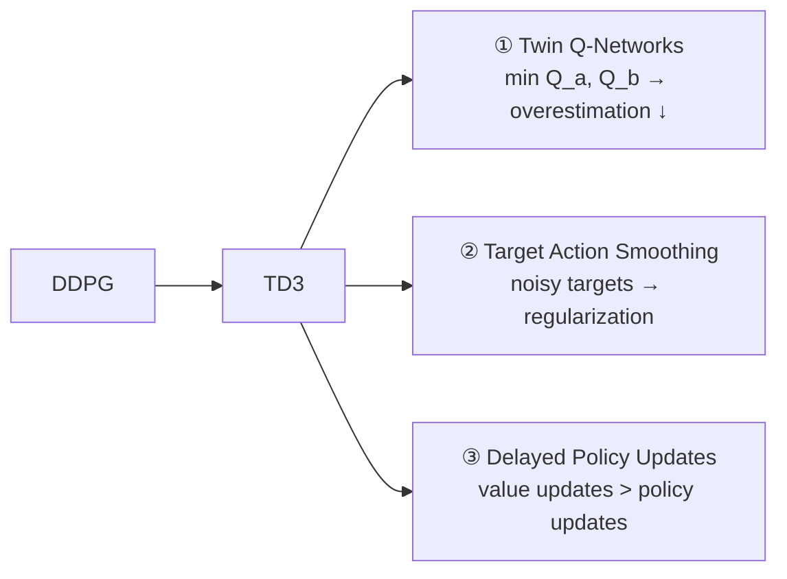
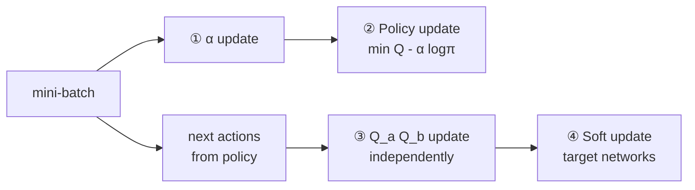
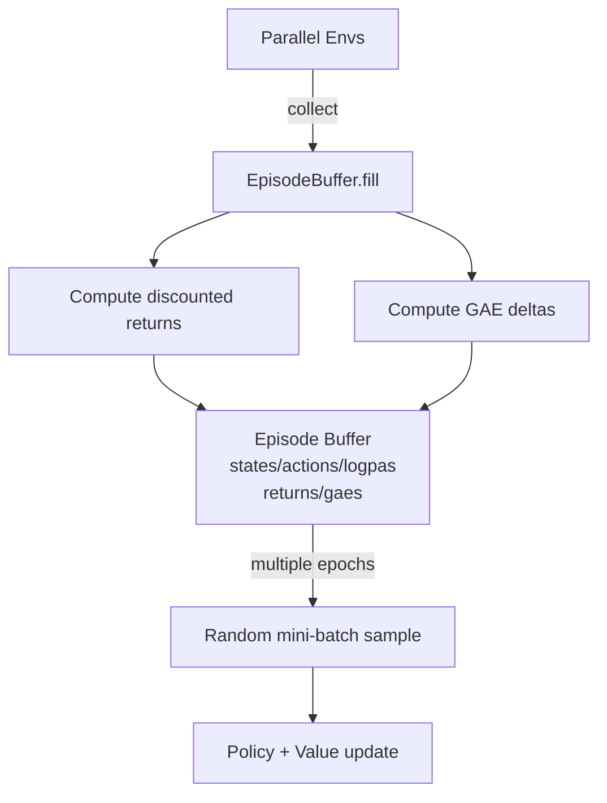
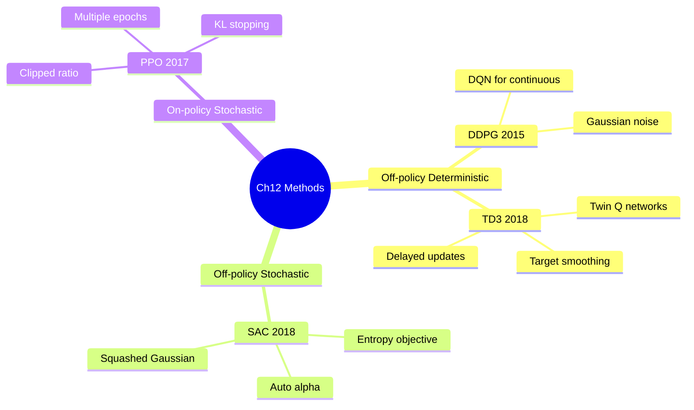

# အခန်း ၁၂ — အနှစ်ချုပ် | Advanced Actor-Critic Methods

---

## ခြုံငုံသုံးသပ်ချက်

| Algorithm | Policy Type | On/Off Policy | Action Space | Key Innovation |
|---|---|---|---|---|
| **DDPG** | Deterministic | Off-policy | Continuous | DQN + deterministic policy |
| **TD3** | Deterministic | Off-policy | Continuous | Twin Q + noisy targets + delayed updates |
| **SAC** | Stochastic | Off-policy | Continuous | Entropy in value function + auto α |
| **PPO** | Stochastic | On-policy | Any | Clipped objective + experience reuse |

---

## ၁။ DDPG (Deep Deterministic Policy Gradient)

### အဓိကအကြောင်းအရာ

DQN ကို continuous action space သို့ တိုးချဲ့သော algorithm:
- DQN ၏ `argmax_a Q(s,a)` → DDPG ၏ `μ(s)` (deterministic policy)
- Replay buffer + target networks (DQN မှ) ကို ရယူ

### Value Function Objective

$$\mathcal{L}(\theta) = \mathbb{E}\left[\left(r + \gamma Q_{\theta^-}\!\left(s', \mu_{\phi^-}(s')\right) - Q_\theta(s,a)\right)^2\right]$$

### Policy Objective

$$J(\phi) = \mathbb{E}_{s \sim D}\left[Q_\theta(s, \mu_\phi(s))\right]$$

### Key Code Points

```python
# FCQV — action ကို first hidden layer တွင် concatenate
if i == 0:
    x = torch.cat((x, u), dim=1)

# FCDP — tanh output ပြီး rescale
x = self.out_activation_fc(self.output_layer(x))  # tanh → (-1,1)
return self.rescale_fn(x)                           # → env range

# Exploration — Gaussian noise injection
noise = np.random.normal(loc=0, scale=noise_scale, size=len(self.high))
action = np.clip(greedy_action + noise, self.low, self.high)
```

### Soft Update (Target Networks)

$$\theta^- \leftarrow \tau\,\theta + (1-\tau)\,\theta^-$$

---

## ၂။ TD3 (Twin Delayed DDPG)

### DDPG မှ တိုးတက်မှု ၃ ချက်



### Twin Q Target

$$y = r + \gamma \min\!\left(Q_{\theta_a^-}(s', \tilde{a}'),\ Q_{\theta_b^-}(s', \tilde{a}')\right)$$

$$\tilde{a}' = \operatorname{clip}\!\left(\mu_{\phi^-}(s') + \operatorname{clip}(\epsilon,-c,c),\ a_{low}, a_{high}\right),\quad \epsilon \sim \mathcal{N}(0,\sigma)$$

### Twin Value Loss

$$\mathcal{L} = \frac{1}{2}\mathbb{E}\!\left[(Q_a - y)^2\right] + \frac{1}{2}\mathbb{E}\!\left[(Q_b - y)^2\right]$$

### Key Code Points

```python
# Twin min target
max_a_q_sp_a, max_a_q_sp_b = target_value_model(next_states, noisy_argmax)
max_a_q_sp = torch.min(max_a_q_sp_a, max_a_q_sp_b)

# Delayed policy update
if timestep % train_policy_every_steps == 0:
    policy_loss = -online_value_model.Qa(states, online_policy_model(states)).mean()

# Qa stream only for policy gradient
def Qa(self, state, action):  # stream A တစ်ခုတည်း
    ...
    return self.output_layer_a(xa)
```

### DDPG vs TD3 နှိုင်းယှဉ်

| Feature | DDPG | TD3 |
|---|---|---|
| Q-networks | 1 | 2 (twin) |
| Target noise | ❌ | ✅ |
| Policy delay | ❌ | ✅ every 2 steps |
| Overestimation | High | Low |

---

## ၃။ SAC (Soft Actor-Critic)

### SAC ၏ Hybrid သဘောသဘာဝ

```
DDPG/TD3:  Off-policy + Deterministic
A2C/GAE:   On-policy  + Stochastic
─────────────────────────────────────
SAC:       Off-policy + Stochastic  ← best of both
```

### Entropy-Augmented Objective

$$Q(s_t, a_t) = \mathbb{E}\!\left[\sum_{t'=t}^{\infty}\gamma^{t'-t}\Bigl(r_{t'} + \alpha\,\mathcal{H}\!\left(\pi(\cdot|s_{t'})\right)\Bigr)\right]$$

- $\alpha$ — entropy temperature (auto-tuned)
- $\mathcal{H}(\pi) = \mathbb{E}_{a\sim\pi}[-\log\pi(a|s)]$ — policy entropy

### SAC Targets

**Value target:**
$$y = r + \gamma\!\left(\min_{i=a,b} Q_{\theta_i^-}(s',a') - \alpha\log\pi_\phi(a'|s')\right),\quad a'\sim\pi_\phi$$

**Policy objective:**
$$J(\phi) = \mathbb{E}\!\left[Q(s,a) - \alpha\log\pi_\phi(a|s)\right]$$

**Alpha objective:**
$$J(\alpha) = \mathbb{E}\!\left[-\alpha\log\pi_\phi(a|s) - \alpha\mathcal{H}^*\right],\quad \mathcal{H}^* = -\dim(\mathcal{A})$$

### Squashed Gaussian Policy (Reparameterization Trick)

$$a = f_\phi(s, \epsilon) = \tanh\!\left(\mu_\phi(s) + \sigma_\phi(s)\cdot\epsilon\right),\quad \epsilon\sim\mathcal{N}(0,I)$$

```python
# FCGP forward — mean + log_std output
x_mean = self.output_layer_mean(x)
x_log_std = self.output_layer_log_std(x)
x_log_std = torch.clamp(x_log_std, -20, 2)

# full_pass — reparameterization + tanh squash
pi_s = Normal(mean, log_std.exp())
pre_tanh_action = pi_s.rsample()            # ε trick
tanh_action = torch.tanh(pre_tanh_action)
action = rescale_fn(tanh_action)

# Log-prob correction for tanh squashing
log_prob = pi_s.log_prob(pre_tanh_action) - \
           torch.log((1 - tanh_action.pow(2)).clamp(0, 1) + ε)
```

### SAC Update Order



---

## ၄။ PPO (Proximal Policy Optimization)

### PPO ၏ သဘောသဘာဝ

A2C ၏ direct improvement — on-policy ဖြစ်သော်လည်း **clipped objective** ကြောင့် mini-batch ကို ထပ်ကာ optimize နိုင်:

| | A2C | PPO |
|---|---|---|
| Architecture | Parallel envs + GAE | Same |
| Experience reuse | ❌ (discard immediately) | ✅ (clipped) |
| Updates per batch | 1 | Multiple epochs |
| Variance control | ❌ | ✅ (clipping) |

### Clipped Policy Objective

$$r_t(\theta) = \frac{\pi_\theta(a_t|s_t)}{\pi_{\theta_{old}}(a_t|s_t)}$$

$$L^{CLIP}(\theta) = \mathbb{E}_t\!\left[\min\!\left(r_t\hat{A}_t,\;\operatorname{clip}(r_t, 1-\varepsilon, 1+\varepsilon)\hat{A}_t\right)\right]$$

### Clipped Value Loss

$$L^{VF} = \mathbb{E}_t\!\left[\max\!\left((V_\theta - G_t)^2,\;\left(V_{\theta_{old}} + \operatorname{clip}(V_\theta - V_{\theta_{old}}, -\varepsilon, \varepsilon) - G_t\right)^2\right)\right]$$

### Key Code Points

```python
# Ratio computation
ratios = (logpas_pred - logpas_batch).exp()   # log →  ratio

# Clipped objective
pi_obj        = gaes_batch * ratios
pi_obj_clipped = gaes_batch * ratios.clamp(1 - clip_range, 1 + clip_range)
policy_loss = -torch.min(pi_obj, pi_obj_clipped).mean()

# KL early stopping
kl = (logpas - logpas_pred_all).mean()
if kl.item() > policy_stopping_kl:
    break

# Value clipping
values_pred_clipped = values_batch + (values_pred - values_batch).clamp(-ε, ε)
value_loss = torch.max(v_loss, v_loss_clipped).mul(0.5).mean()

# MSE early stopping (value)
mse = (values - values_pred_all).pow(2).mul(0.5).mean()
if mse.item() > value_stopping_mse:
    break
```

### EpisodeBuffer Flow



---

## ၅။ Algorithm များ — Networks နှင့် Hyperparameters

### Network Architectures

| Algorithm | Network Class | Architecture | Output |
|---|---|---|---|
| DDPG | FCQV | `state → 32 → (32+action_dim) → 32 → 1` | Q(s,a) scalar |
| DDPG | FCDP | `state → 32 → 32 → action` (tanh) | Deterministic action |
| TD3 | FCTQV | Two parallel streams, shared optimizer | Q_a, Q_b pair |
| SAC | FCGP | `state → 256 → 256 → mean, log_std` | Stochastic action |
| PPO | FCAC (shared) | A2C-style shared base | logits + value |

### Environments

| Algorithm | Environment | Obs dim | Act dim | Solved ≥ |
|---|---|---|---|---|
| DDPG | Pendulum-v0 | 3 | 1 (cont.) | -150 |
| TD3 | HopperBulletEnv-v0 | 15 | 3 (cont.) | 1,500 |
| SAC | HalfCheetahBulletEnv-v0 | 26 | 6 (cont.) | 2,000 |
| PPO | LunarLander-v2 | 8 | 4 (discrete) | 200 |

---

## ၆။ အဓိကသဘောတရားများ

### 1. Deterministic vs Stochastic Policy

```
Deterministic: μ(s) → a            (same action every time)
Stochastic:    π(a|s) → p(a)       (distribution over actions)
```

**Deterministic** → off-policy exploration လိုသည် (noise injection)  
**Stochastic** → on-policy exploration ပါဝင် (policy ၏ randomness)

### 2. Off-policy Stochastic (SAC ၏ ထူးခြားချက်)

SAC သည် stochastic policy ဆိုင်ရာ off-policy learning ပြုလုပ်မည်ဆိုပါက replay buffer မှ experience များကို reuse ပြုလုပ်နိုင်ပြီး entropy ကိုလည်း policy ၏ objective ထဲ တိုက်ရိုက်ထည့်သည်。

### 3. Reparameterization Trick

$$a = \tanh(\mu + \sigma\cdot\epsilon) \quad \text{vs} \quad a \sim \mathcal{N}(\mu, \sigma^2)$$

Stochasticity ကို **input** $\epsilon$ သို့ ရွှေ့ → network ကိုယ်တိုင် deterministic → gradient ကောင်းစွာ flow ဖြစ်

### 4. PPO Clipping Intuition

>"Coach ကဲ့သို့ — နောက်ဆုံး game မှာ တactic တစ်ခု ကောင်းချည့် ဆိုတာ season တစ်ခုလုံး ကို အဲ့တatic ဖြင့် မပြောင်းနဲ့ — တဖြည်းဖြည်း တိုးတက်ပါ"

$\varepsilon = 0.2$ ဆိုပါက ratio ကို $[0.8, 1.2]$ ပိုင်းထဲသာ ခွင့်ပြု

---

## ၇။ ဤအခန်းမှ ပြီးမြောက်ချက်

- ✅ Continuous action space environments (Pendulum, Hopper, Cheetah) ကို DDPG, TD3, SAC ဖြင့် ဖြေရှင်းနိုင်
- ✅ Discrete action space (LunarLander) ကို PPO ဖြင့် ဖြေရှင်းနိုင်
- ✅ State-of-the-art DRL algorithms ကို အစမှ implement ပြုလုပ်နိုင်
- ✅ Algorithm တစ်ခုနှင့်တစ်ခု ဆက်စပ်မှု (DDPG→TD3, A2C→PPO) နားလည်

---

## ၈။ ဆက်စပ်မူဝါဒများ


