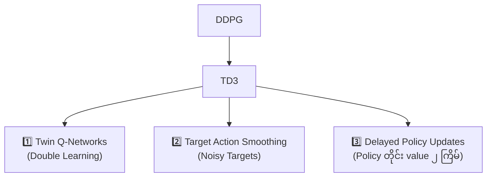
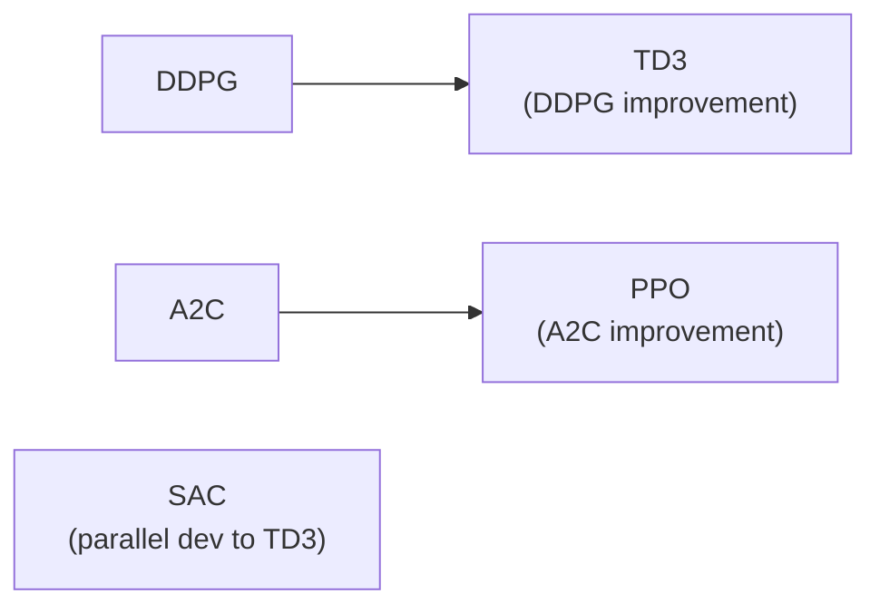
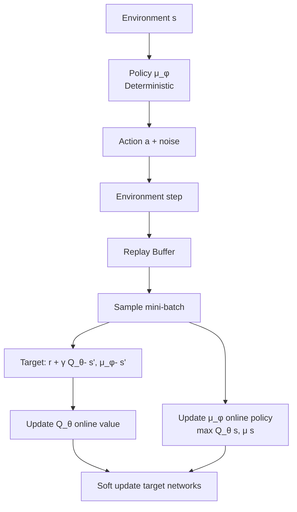
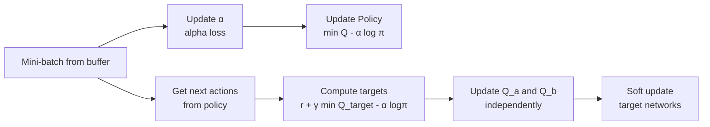
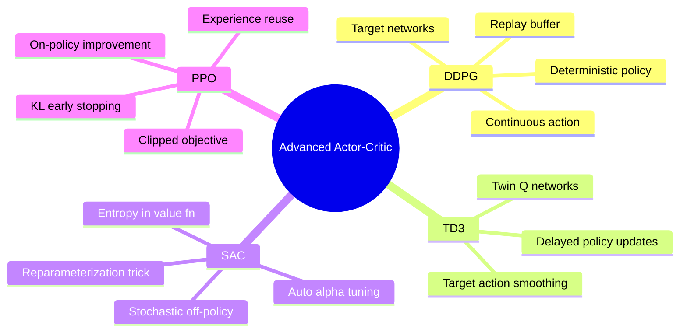

# အခန်း ၁၂ — အဆင့်မြင့် Actor-Critic နည်းလမ်းများ
**Advanced Actor-Critic Methods**

---

> *"Criticism may not be agreeable, but it is necessary.  
> It fulfills the same function as pain in the human body.  
> It calls attention to an unhealthy state of things."*  
> — Winston Churchill

---

## ဤအခန်းတွင် သင်သင်ယူမည့်အရာများ

- Deep reinforcement learning ၏ **state-of-the-art** နည်းလမ်းများ အကြောင်း သင်ယူမည်
- **Continuous action space** (ဆက်သွယ်မှု action space) ပြဿနာများ ဖြေရှင်းနည်း
- **DDPG**, **TD3**, **SAC**, **PPO** တို့ကို အစမှ တည်ဆောက်နည်း
- Pendulum, Hopper, HalfCheetah, LunarLander environment များတွင် စမ်းသပ်နည်း

---

## နိဒါန်း

ယခင်အခန်းတွင် policy-gradient methods များကို လေ့လာခဲ့သည် — **REINFORCE**, **VPG**, **A3C**, **GAE**, **A2C** တို့ဖြစ်သည်။ ဤနည်းများသည် **stochastic policies** (တစ်ခုထက်ပိုသော action ကို ဖြစ်နိုင်ချေများဖြင့် ရွေးချယ်သော policy) ကို သင်ယူသည်။

ဤအခန်းတွင် actor-critic paradigm ကို ပိုမိုနက်ရှိုင်းစွာ လေ့လာကြမည်။ **Deterministic policy** (တစ်ခုသာ action ပေးသော) နှင့် **Stochastic policy** (random action ရှိသော) နှစ်မျိုးလုံးကို ကိုင်တွယ်မည်:

| Algorithm | Policy Type | Learning Type | Action Space |
|---|---|---|---|
| DDPG | Deterministic | Off-policy | Continuous |
| TD3 | Deterministic | Off-policy | Continuous |
| SAC | Stochastic | Off-policy | Continuous |
| PPO | Stochastic | On-policy | Any |

---

## ၁။ DDPG — Deterministic Policy ကို တွက်ချက်ခြင်း

### DDPG ဆိုတာ ဘာလဲ?

**Deep Deterministic Policy Gradient (DDPG)** သည် continuous action space ကို ဖြေရှင်းသော **DQN ၏ approximate version** ဟု မြင်နိုင်သည်။ DDPG သည် DQN ၏ tricks များ အများကြီး အသုံးပြုသည်:

- **Replay buffer** — experiences သိမ်းဆည်း off-policy training ပြုလုပ်
- **Target networks** — training stabilize ပြုလုပ်
- **Policy network** — greedy action ကို approximate ပြုလုပ်

```
DQN:  argmax_a Q(s, a)  → discrete action
DDPG: μ(s)              → continuous action
```

### DQN vs DDPG Value Function Objective

$$\mathcal{L}_{DQN}(\theta) = \mathbb{E}_{(s,a,r,s') \sim D}\left[\left(r + \gamma \max_{a'} Q_{\theta^-}(s', a') - Q_\theta(s,a)\right)^2\right]$$

$$= \mathbb{E}_{(s,a,r,s') \sim D}\left[\left(r + \gamma Q_{\theta^-}\left(s', \arg\max_{a'} Q_{\theta^-}(s', a')\right) - Q_\theta(s,a)\right)^2\right]$$

**DDPG တွင် argmax ကို policy μ ဖြင့် ဖြေကြည့်သည်:**

$$\mathcal{L}_{DDPG}(\theta) = \mathbb{E}_{(s,a,r,s') \sim D}\left[\left(r + \gamma Q_{\theta^-}\left(s', \mu_{\phi^-}(s')\right) - Q_\theta(s,a)\right)^2\right]$$

- $Q_{\theta^-}$ — target Q-network
- $\mu_{\phi^-}$ — target policy network  
- $\phi^-$ — target policy parameters (– notation = target network)

### DDPG Architecture

```
မြင်ကွင်း (State s)
      │
      ▼
┌─────────────────┐
│   Q-Network     │  → Q(s, a) scalar
│ FCQV            │
│ input: s concat a│
└─────────────────┘
      
      ┌─────────────────┐
      │  Policy Network │  → a = μ(s)
      │  FCDP           │
      │  output: action │
      └─────────────────┘
```

### Code: DDPG Q-Function Network (FCQV)

```python
class FCQV(nn.Module):
    def __init__(self,
                 input_dim,
                 output_dim,
                 hidden_dims=(32,32),
                 activation_fc=F.relu):
        super(FCQV, self).__init__()
        self.activation_fc = activation_fc
        self.input_layer = nn.Linear(input_dim, hidden_dims[0])
        self.hidden_layers = nn.ModuleList()
        for i in range(len(hidden_dims)-1):
            in_dim = hidden_dims[i]
            if i == 0:
                in_dim += output_dim   # ← action dimension ပေါင်းထည့်
            hidden_layer = nn.Linear(in_dim, hidden_dims[i+1])
            self.hidden_layers.append(hidden_layer)
        self.output_layer = nn.Linear(hidden_dims[-1], 1)

    def forward(self, state, action):
        x, u = self._format(state, action)
        x = self.activation_fc(self.input_layer(x))
        for i, hidden_layer in enumerate(self.hidden_layers):
            if i == 0:
                x = torch.cat((x, u), dim=1)  # ← 1st hidden layer တွင် action ပေါင်း
            x = self.activation_fc(hidden_layer(x))
        return self.output_layer(x)
```

**အဓိကအချက်:** Action ကို input layer တွင် မထည့်ဘဲ **first hidden layer** တွင် concatenate ပြုလုပ်သည်။ Output တစ်ခုတည်းဖြင့် Q(s,a) scalar တစ်ခု ထုတ်သည်။

---

### DDPG Policy Objective

$$J(\phi) = \mathbb{E}_{s \sim D}\left[Q_\theta(s, \mu_\phi(s))\right]$$

Training တွင် negative ကို minimize ပြုလုပ်သည်:

$$\phi^* = \arg\min_\phi \left(-\mathbb{E}_{s \sim D}\left[Q_\theta(s, \mu_\phi(s))\right]\right)$$

**Target networks အသုံးမပြုဘဲ** online networks နှစ်ခု (policy + value) ကိုသာ policy training တွင် အသုံးပြုသည်။

---

### Code: DDPG Deterministic Policy Network (FCDP)

```python
class FCDP(nn.Module):
    def __init__(self,
                 input_dim,
                 action_bounds,
                 hidden_dims=(32,32),
                 activation_fc=F.relu,
                 out_activation_fc=F.tanh):   # ← tanh output
        super(FCDP, self).__init__()
        self.activation_fc = activation_fc
        self.out_activation_fc = out_activation_fc
        self.env_min, self.env_max = action_bounds
        self.input_layer = nn.Linear(input_dim, hidden_dims[0])
        self.hidden_layers = nn.ModuleList()
        for i in range(len(hidden_dims)-1):
            hidden_layer = nn.Linear(hidden_dims[i], hidden_dims[i+1])
            self.hidden_layers.append(hidden_layer)
        self.output_layer = nn.Linear(hidden_dims[-1], len(self.env_max))

    def forward(self, state):
        x = self._format(state)
        x = self.activation_fc(self.input_layer(x))
        for hidden_layer in self.hidden_layers:
            x = self.activation_fc(hidden_layer(x))
        x = self.output_layer(x)
        x = self.out_activation_fc(x)       # tanh → (-1, 1)
        return self.rescale_fn(x)            # → environment range
```

**Output Activation:** `tanh` ဖြင့် output ကို $(-1, 1)$ ပိုင်းသတ်မှတ်ပြီး environment ၏ action range သို့ rescale သည်။

---

### Code: DDPG optimize_model

```python
def optimize_model(self, experiences):
    states, actions, rewards, next_states, is_terminals = experiences

    # ---- Value Network Update ----
    argmax_a_q_sp = self.target_policy_model(next_states)
    max_a_q_sp = self.target_value_model(next_states, argmax_a_q_sp)
    target_q_sa = rewards + self.gamma * max_a_q_sp * (1 - is_terminals)
    
    q_sa = self.online_value_model(states, actions)
    td_error = q_sa - target_q_sa.detach()
    value_loss = td_error.pow(2).mul(0.5).mean()
    
    self.value_optimizer.zero_grad()
    value_loss.backward()
    torch.nn.utils.clip_grad_norm_(self.online_value_model.parameters(),
                                   self.value_max_grad_norm)
    self.value_optimizer.step()
    
    # ---- Policy Network Update ----
    argmax_a_q_s = self.online_policy_model(states)
    max_a_q_s = self.online_value_model(states, argmax_a_q_s)
    policy_loss = -max_a_q_s.mean()   # maximize Q → minimize negative Q
    
    self.policy_optimizer.zero_grad()
    policy_loss.backward()
    torch.nn.utils.clip_grad_norm_(self.online_policy_model.parameters(),
                                   self.policy_max_grad_norm)
    self.policy_optimizer.step()
```

---

### Exploration with Deterministic Policies

Deterministic policy သည် per se exploration မပြုနိုင်၍ **Gaussian noise** ထည့်သည်:

```python
class NormalNoiseDecayStrategy():
    def select_action(self, model, state, max_exploration=False):
        if max_exploration:
            noise_scale = self.high
        else:
            noise_scale = self.noise_ratio * self.high

        with torch.no_grad():
            greedy_action = model(state).cpu().detach().data.numpy().squeeze()

        noise = np.random.normal(loc=0, scale=noise_scale, size=len(self.high))
        noisy_action = greedy_action + noise
        action = np.clip(noisy_action, self.low, self.high)
        self.noise_ratio = self._noise_ratio_update()
        return action
```

| Exploration Strategy | Algorithm | Method |
|---|---|---|
| ε-greedy / Q-values | DQN, NFQ | Q-value based |
| On-policy (stochastic) | REINFORCE, A2C | Policy ၏ randomness |
| Gaussian noise | DDPG, TD3 | External noise injection |

---

### Pendulum Environment

**Pendulum-v0** — inverted pendulum အar swing up ပြုလုပ်ပြီး upright ထားရ

| Feature | Details |
|---|---|
| State space | `[cos(θ), sin(θ), θ̇]` — 3 variables |
| Action space | `[-2, 2]` — torque (1 continuous variable) |
| Reward | $-(θ^2 + 0.1\dot{θ}^2 + 0.001 a^2)$ |
| Best reward | 0 per step (balanced, no effort) |
| Worst reward | ≈ -16 per step |
| Threshold | -150 (reasonable) |

---

## ၂။ TD3 — DDPG ကို အဆင့်မြင့်တင်ခြင်း

### TD3 ၏ မူဝါဒ သုံးချက်

**Twin Delayed DDPG (TD3)** သည် DDPG ကို improvements သုံးမျိုးဖြင့် ပိုကောင်းအောင် ပြုလုပ်သည်:



---

### TD3 Improvement 1: Twin Q-Networks (Double Learning)

DQN → DDQN တွင် လေ့လာခဲ့သော double learning concept ကို DDPG တွင် ထည့်သည်။ Twin Q-network နှစ်ခု ဖြင့် cross-validate:

$$\mathcal{L}_{TD3} = \mathcal{L}_{MSE}(Q_{\theta_a}, y) + \mathcal{L}_{MSE}(Q_{\theta_b}, y)$$

$$y = r + \gamma \min\left(Q_{\theta_a^-}(s', \mu_{\phi^-}(s')),\ Q_{\theta_b^-}(s', \mu_{\phi^-}(s'))\right)$$

**Target တွက်ချက်ရာတွင် minimum ကိုသာ ယူ** → overestimation bias နည်းသည်

---

### Code: Twin Q-Network (FCTQV)

```python
class FCTQV(nn.Module):
    def __init__(self, input_dim, output_dim, hidden_dims=(32,32), activation_fc=F.relu):
        super(FCTQV, self).__init__()
        self.activation_fc = activation_fc
        # Stream A နှင့် Stream B — သီးခြားဆုံးချက်ပြုစုသော networks
        self.input_layer_a = nn.Linear(input_dim + output_dim, hidden_dims[0])
        self.input_layer_b = nn.Linear(input_dim + output_dim, hidden_dims[0])
        self.hidden_layers_a = nn.ModuleList()
        self.hidden_layers_b = nn.ModuleList()
        for i in range(len(hidden_dims)-1):
            self.hidden_layers_a.append(nn.Linear(hidden_dims[i], hidden_dims[i+1]))
            self.hidden_layers_b.append(nn.Linear(hidden_dims[i], hidden_dims[i+1]))
        self.output_layer_a = nn.Linear(hidden_dims[-1], 1)
        self.output_layer_b = nn.Linear(hidden_dims[-1], 1)

    def forward(self, state, action):
        x, u = self._format(state, action)
        x = torch.cat((x, u), dim=1)
        xa = self.activation_fc(self.input_layer_a(x))
        xb = self.activation_fc(self.input_layer_b(x))
        for hidden_layer_a, hidden_layer_b in zip(self.hidden_layers_a, self.hidden_layers_b):
            xa = self.activation_fc(hidden_layer_a(xa))
            xb = self.activation_fc(hidden_layer_b(xb))
        return self.output_layer_a(xa), self.output_layer_b(xb)

    def Qa(self, state, action):
        # Stream A တစ်ခုတည်း ဖြတ်သန်းခြင်း (policy update အတွက်)
        x, u = self._format(state, action)
        x = torch.cat((x, u), dim=1)
        xa = self.activation_fc(self.input_layer_a(x))
        for hidden_layer_a in self.hidden_layers_a:
            xa = self.activation_fc(hidden_layer_a(xa))
        return self.output_layer_a(xa)
```

---

### TD3 Improvement 2: Target Action Smoothing

Target actions တွင်လည်း noise ထည့်သည် → policy regularization:

$$\tilde{a}' = \text{clip}\left(\mu_{\phi^-}(s') + \text{clip}(\epsilon, -c, c),\ a_{min}, a_{max}\right)$$

```python
# Target smoothing procedure (optimize_model ထဲမှ)
a_noise = torch.randn_like(actions) * self.policy_noise_ratio * a_ran
n_min = env_min * self.policy_noise_clip_ratio
n_max = env_max * self.policy_noise_clip_ratio
a_noise = torch.max(torch.min(a_noise, n_max), n_min)  # noise clip

argmax_a_q_sp = self.target_policy_model(next_states)
noisy_argmax_a_q_sp = argmax_a_q_sp + a_noise
noisy_argmax_a_q_sp = torch.max(torch.min(noisy_argmax_a_q_sp, env_max), env_min)  # action clip
```

---

### TD3 Improvement 3: Delayed Policy Updates

Policy network ကို value network ထက် **နည်းသောကြိမ်** update ပြုလုပ်သည်:

```python
# Policy update ကို delay ပြုလုပ်
if np.sum(self.episode_timestep) % self.train_policy_every_steps == 0:
    argmax_a_q_s = self.online_policy_model(states)
    max_a_q_s = self.online_value_model.Qa(states, argmax_a_q_s)  # Qa stream သာ
    policy_loss = -max_a_q_s.mean()
    # ... optimize policy
```

**Value network: every step | Policy network: every 2 steps** (recommended)

---

### TD3 optimize_model (complete)

```python
def optimize_model(self, experiences):
    states, actions, rewards, next_states, is_terminals = experiences

    with torch.no_grad():
        env_min = self.target_policy_model.env_min
        env_max = self.target_policy_model.env_max
        a_ran = env_max - env_min

        # Target smoothing
        a_noise = torch.randn_like(actions) * self.policy_noise_ratio * a_ran
        n_min = env_min * self.policy_noise_clip_ratio
        n_max = env_max * self.policy_noise_clip_ratio
        a_noise = torch.max(torch.min(a_noise, n_max), n_min)
        argmax_a_q_sp = self.target_policy_model(next_states)
        noisy_argmax_a_q_sp = argmax_a_q_sp + a_noise
        noisy_argmax_a_q_sp = torch.max(torch.min(noisy_argmax_a_q_sp, env_max), env_min)

        # Twin min target
        max_a_q_sp_a, max_a_q_sp_b = self.target_value_model(next_states, noisy_argmax_a_q_sp)
        max_a_q_sp = torch.min(max_a_q_sp_a, max_a_q_sp_b)
        target_q_sa = rewards + self.gamma * max_a_q_sp * (1 - is_terminals)

    # Twin value loss
    q_sa_a, q_sa_b = self.online_value_model(states, actions)
    td_error_a = q_sa_a - target_q_sa
    td_error_b = q_sa_b - target_q_sa
    value_loss = td_error_a.pow(2).mul(0.5).mean() + td_error_b.pow(2).mul(0.5).mean()
    self.value_optimizer.zero_grad()
    value_loss.backward()
    torch.nn.utils.clip_grad_norm_(self.online_value_model.parameters(), self.value_max_grad_norm)
    self.value_optimizer.step()

    # Delayed policy update
    if np.sum(self.episode_timestep) % self.train_policy_every_steps == 0:
        argmax_a_q_s = self.online_policy_model(states)
        max_a_q_s = self.online_value_model.Qa(states, argmax_a_q_s)
        policy_loss = -max_a_q_s.mean()
        self.policy_optimizer.zero_grad()
        policy_loss.backward()
        torch.nn.utils.clip_grad_norm_(self.online_policy_model.parameters(), self.policy_max_grad_norm)
        self.policy_optimizer.step()
```

---

### Hopper Environment

**HopperBulletEnv-v0** — Bullet Physics engine အသုံးပြုသော open-source environment

| Feature | Details |
|---|---|
| Observation | 15 continuous variables (joints) |
| Action | 3 continuous variables in $[-1, 1]$ (thigh, leg, foot) |
| Goal | Move forward with minimal energy |
| Target reward | 2,500 (book: 1,500 for speed) |

---

## ၃။ SAC — Expected Return နှင့် Entropy ကို တပြိုင်နက် Maximize ပြုလုပ်ခြင်း

### SAC ၏ မူဝါဒ

**Soft Actor-Critic (SAC)** သည် DDPG/TD3 (off-policy, deterministic) နှင့် A2C (on-policy, stochastic) ၏ hybrid ဖြစ်သည်:

- **Off-policy** (replay buffer) — DDPG/TD3 ကဲ့သို့
- **Stochastic policy** — A2C/REINFORCE ကဲ့သို့
- **Entropy maximization** — value function ထဲသို့ entropy တိုက်ရိုက်ထည့်

### Entropy-Augmented Value Function

$$Q(s_t, a_t) = \mathbb{E}\left[\sum_{t'=t}^{\infty} \gamma^{t'-t}\left(r_{t'} + \alpha \mathcal{H}\left(\pi(\cdot | s_{t'})\right)\right)\right]$$

- $\mathcal{H}(\pi(\cdot|s)) = \mathbb{E}_{a \sim \pi}\left[-\log \pi(a|s)\right]$ — entropy of policy at state $s$
- $\alpha$ — entropy coefficient (temperature)

ဤ formulation ၏ အဓိပ္ပာယ်: **Reward ကောင်းရင်ကောင်းမယ်၊ ဒါ့အပြင် policy ဟာ diverse ဖြစ်အောင်ကြိုးစားပါ**

---

### SAC Value Function Target

$$y = r + \gamma \left(\min_{i=a,b} Q_{\theta_i^-}(s', a') - \alpha \log \pi_\phi(a'|s')\right)$$

$$a' \sim \pi_\phi(\cdot|s')$$

### SAC Policy Objective

$$J(\phi) = \mathbb{E}_{s \sim D,\ a \sim \pi_\phi}\left[Q(s, a) - \alpha \log \pi_\phi(a|s)\right]$$

### SAC Alpha Objective (Auto-tuning)

$$J(\alpha) = \mathbb{E}_{s \sim D,\ a \sim \pi_\phi}\left[-\alpha \log \pi_\phi(a|s) - \alpha \mathcal{H}^*\right]$$

$$\mathcal{H}^* = -\dim(\mathcal{A})$$  ← action dimension ၏ negative

**No hyperparameter tuning required for alpha!** Gradient-based optimization ဖြင့် auto-tune ဖြစ်သည်။

---

### Code: SAC Gaussian Policy (FCGP)

```python
class FCGP(nn.Module):
    def __init__(self, ...):
        # Architecture: input → hidden → mean_output + log_std_output
        self.output_layer_mean = nn.Linear(hidden_dims[-1], len(self.env_max))
        self.output_layer_log_std = nn.Linear(hidden_dims[-1], len(self.env_max))

        # Auto-tuning alpha
        self.target_entropy = -np.prod(self.env_max.shape)   # H* = -dim(A)
        self.logalpha = torch.zeros(1, requires_grad=True, device=self.device)
        self.alpha_optimizer = optim.Adam([self.logalpha], lr=entropy_lr)

    def forward(self, state):
        x = self._format(state)
        x = self.activation_fc(self.input_layer(x))
        for hidden_layer in self.hidden_layers:
            x = self.activation_fc(hidden_layer(x))
        x_mean = self.output_layer_mean(x)
        x_log_std = self.output_layer_log_std(x)
        x_log_std = torch.clamp(x_log_std, self.log_std_min, self.log_std_max)  # (-20, 2)
        return x_mean, x_log_std

    def full_pass(self, state, epsilon=1e-6):
        mean, log_std = self.forward(state)
        pi_s = Normal(mean, log_std.exp())
        pre_tanh_action = pi_s.rsample()          # reparameterization trick!
        tanh_action = torch.tanh(pre_tanh_action) # squash to (-1, 1)
        action = self.rescale_fn(tanh_action)      # rescale to env range

        # Log probability (tanh transformation 이 필요)
        log_prob = pi_s.log_prob(pre_tanh_action) - \
                   torch.log((1 - tanh_action.pow(2)).clamp(0, 1) + epsilon)
        log_prob = log_prob.sum(dim=1, keepdim=True)
        return action, log_prob, self.rescale_fn(torch.tanh(mean))
```

**Reparameterization trick:** Stochasticity ကို network ၏ input သို့ ရွှေ့ပြောင်း → network deterministic ဖြစ်သွား → gradient flow ကောင်းသည်

$$a = \tanh(\mu_\phi(s) + \epsilon \cdot \sigma_\phi(s)),\quad \epsilon \sim \mathcal{N}(0, I)$$

---

### Code: SAC optimize_model

```python
def optimize_model(self, experiences):
    states, actions, rewards, next_states, is_terminals = experiences

    # ---- Alpha update ----
    current_actions, logpi_s, _ = self.policy_model.full_pass(states)
    target_alpha = (logpi_s + self.policy_model.target_entropy).detach()
    alpha_loss = -(self.policy_model.logalpha * target_alpha).mean()
    self.policy_model.alpha_optimizer.zero_grad()
    alpha_loss.backward()
    self.policy_model.alpha_optimizer.step()
    alpha = self.policy_model.logalpha.exp()

    # ---- Policy update ----
    current_q_sa_a = self.online_value_model_a(states, current_actions)
    current_q_sa_b = self.online_value_model_b(states, current_actions)
    current_q_sa = torch.min(current_q_sa_a, current_q_sa_b)
    policy_loss = (alpha * logpi_s - current_q_sa).mean()

    # ---- Value update ----
    ap, logpi_sp, _ = self.policy_model.full_pass(next_states)
    q_spap_a = self.target_value_model_a(next_states, ap)
    q_spap_b = self.target_value_model_b(next_states, ap)
    q_spap = torch.min(q_spap_a, q_spap_b) - alpha * logpi_sp
    target_q_sa = (rewards + self.gamma * q_spap * (1 - is_terminals)).detach()

    q_sa_a = self.online_value_model_a(states, actions)
    q_sa_b = self.online_value_model_b(states, actions)
    qa_loss = (q_sa_a - target_q_sa).pow(2).mul(0.5).mean()
    qb_loss = (q_sa_b - target_q_sa).pow(2).mul(0.5).mean()

    # Optimize Q_a
    self.value_optimizer_a.zero_grad()
    qa_loss.backward()
    torch.nn.utils.clip_grad_norm_(self.online_value_model_a.parameters(), self.value_max_grad_norm)
    self.value_optimizer_a.step()

    # Optimize Q_b
    self.value_optimizer_b.zero_grad()
    qb_loss.backward()
    torch.nn.utils.clip_grad_norm_(self.online_value_model_b.parameters(), self.value_max_grad_norm)
    self.value_optimizer_b.step()

    # Optimize policy
    self.policy_optimizer.zero_grad()
    policy_loss.backward()
    torch.nn.utils.clip_grad_norm_(self.policy_model.parameters(), self.policy_max_grad_norm)
    self.policy_optimizer.step()
```

---

### HalfCheetah Environment

**HalfCheetahBulletEnv-v0**

| Feature | Details |
|---|---|
| Observation | 26 continuous variables (joints) |
| Action | 6 continuous variables in $[-1, 1]$ |
| Goal | Move forward with minimal energy |
| Target reward | 3,000 (book: 2,000) |

SAC သည် ~300-600 episodes ထဲတွင် ထိရောက်စွာ သင်ယူနိုင်သည်။

---

## ၄။ PPO — Policy Update ကို ကန့်သတ်ခြင်း

### PPO ဆိုတာ ဘာလဲ?

**Proximal Policy Optimization (PPO)** သည် A2C ကို တိုက်ရိုက် တိုးတက်စေသော on-policy algorithm ဖြစ်သည်:

- A2C ၏ architecture (parallel environments, GAE) ကို ပြန်သုံး
- **Clipped objective function** — policy ကို တစ်ကြိမ် update ရာတွင် များစွာ မပြောင်းဘဲ ထိန်းသည်
- **Experience reuse** — on-policy method ဖြစ်သော်လည်း mini-batch ကို ထပ်ကာထပ်ကာ optimize ပြုလုပ်နိုင်

### PPO vs A2C vs DDPG/TD3



### Clipped Policy Objective

$$r_t(\theta) = \frac{\pi_\theta(a_t|s_t)}{\pi_{\theta_{old}}(a_t|s_t)} = \exp\left(\log\pi_\theta(a_t|s_t) - \log\pi_{\theta_{old}}(a_t|s_t)\right)$$

$$J^{CLIP}(\theta) = \mathbb{E}_t\left[\min\left(r_t(\theta) \hat{A}_t,\ \text{clip}\left(r_t(\theta), 1-\epsilon, 1+\epsilon\right)\hat{A}_t\right)\right]$$

ဤ objective ၏ အဓိပ္ပာယ်: $r_t(\theta)$ ကို $(1-\epsilon, 1+\epsilon)$ ပိုင်းအတွင်းသာ ထား → policy များစွာ မပြောင်းဘဲ stable improvement

### Clipped Value Loss

$$L^{VF}(\theta) = \mathbb{E}_t\left[\max\left(\left(V_\theta(s_t) - G_t\right)^2,\ \left(V_{\theta_{old}}(s_t) + \text{clip}\left(V_\theta(s_t) - V_{\theta_{old}}(s_t), -\epsilon, \epsilon\right) - G_t\right)^2\right)\right]$$

---

### Code: EpisodeBuffer (PPO)

PPO သည် experiences များကို Episode Buffer တွင် သိမ်းဆည်းပြီး mini-batch ၀ ကြိမ်ပြုလုပ် sample ယူသည်:

```python
class EpisodeBuffer():
    def fill(self, envs, policy_model, value_model):
        states = envs.reset()
        # Initialize worker tracking arrays
        worker_rewards = np.zeros(shape=(n_workers, self.max_episode_steps), dtype=np.float32)
        worker_steps = np.zeros(shape=(n_workers), dtype=np.uint16)
        buffer_full = False

        while not buffer_full and ...:
            with torch.no_grad():
                actions, logpas, are_exploratory = policy_model.np_pass(states)
                values = value_model(states)

            next_states, rewards, terminals, infos = envs.step(actions)

            # Store experiences
            self.states_mem[self.current_ep_idxs, worker_steps] = states
            self.actions_mem[self.current_ep_idxs, worker_steps] = actions
            self.logpas_mem[self.current_ep_idxs, worker_steps] = logpas

            # Episode termination processing
            if terminals.sum():
                for w_idx in terminal_workers:
                    T = worker_steps[w_idx]
                    ep_rewards = np.concatenate((worker_rewards[w_idx, :T], [next_values[w_idx]]))

                    # Discounted returns
                    ep_returns = [np.sum(ep_discounts[:T+1-t] * ep_rewards[t:]) for t in range(T)]
                    self.returns_mem[e_idx, :T] = ep_returns

                    # GAE calculation
                    deltas = ep_rewards[:-1] + self.gamma * np_ep_values[1:] - np_ep_values[:-1]
                    gaes = [np.sum(self.tau_discounts[:T-t] * deltas[t:]) for t in range(T)]
                    self.gaes_mem[e_idx, :T] = gaes
```

---

### Code: PPO optimize_model

```python
def optimize_model(self):
    states, actions, returns, gaes, logpas = self.episode_buffer.get_stacks()
    values = self.value_model(states).detach()
    gaes = (gaes - gaes.mean()) / (gaes.std() + EPS)  # normalize GAEs
    n_samples = len(actions)

    # ---- Policy optimization (multiple epochs) ----
    for i in range(self.policy_optimization_epochs):
        batch_size = int(self.policy_sample_ratio * n_samples)
        batch_idxs = np.random.choice(n_samples, batch_size, replace=False)  # random mini-batch

        states_batch = states[batch_idxs]
        actions_batch = actions[batch_idxs]
        gaes_batch = gaes[batch_idxs]
        logpas_batch = logpas[batch_idxs]

        logpas_pred, entropies_pred = self.policy_model.get_predictions(states_batch, actions_batch)
        ratios = (logpas_pred - logpas_batch).exp()   # π_new / π_old

        # Clipped objective
        pi_obj = gaes_batch * ratios
        pi_obj_clipped = gaes_batch * ratios.clamp(1.0 - self.policy_clip_range,
                                                   1.0 + self.policy_clip_range)
        policy_loss = -torch.min(pi_obj, pi_obj_clipped).mean()
        entropy_loss = -entropies_pred.mean() * self.entropy_loss_weight

        self.policy_optimizer.zero_grad()
        (policy_loss + entropy_loss).backward()
        torch.nn.utils.clip_grad_norm_(self.policy_model.parameters(), self.policy_model_max_grad_norm)
        self.policy_optimizer.step()

        # Early stopping with KL divergence
        with torch.no_grad():
            logpas_pred_all, _ = self.policy_model.get_predictions(states, actions)
            kl = (logpas - logpas_pred_all).mean()
            if kl.item() > self.policy_stopping_kl:
                break

    # ---- Value optimization (multiple epochs) ----
    for i in range(self.value_optimization_epochs):
        batch_idxs = np.random.choice(n_samples, int(self.value_sample_ratio * n_samples), replace=False)
        states_batch = states[batch_idxs]
        returns_batch = returns[batch_idxs]
        values_batch = values[batch_idxs]

        values_pred = self.value_model(states_batch)
        v_loss = (values_pred - returns_batch).pow(2)

        # Value clipping
        values_pred_clipped = values_batch + (values_pred - values_batch).clamp(-self.value_clip_range,
                                                                                 self.value_clip_range)
        v_loss_clipped = (values_pred_clipped - returns_batch).pow(2)
        value_loss = torch.max(v_loss, v_loss_clipped).mul(0.5).mean()

        self.value_optimizer.zero_grad()
        value_loss.backward()
        torch.nn.utils.clip_grad_norm_(self.value_model.parameters(), self.value_model_max_grad_norm)
        self.value_optimizer.step()

        # Early stopping with MSE
        with torch.no_grad():
            values_pred_all = self.value_model(states)
            mse = (values - values_pred_all).pow(2).mul(0.5).mean()
            if mse.item() > self.value_stopping_mse:
                break
```

---

### LunarLander Environment

**LunarLanderContinuous-v2** (PPO chapter တွင် discrete version)

| Feature | Details |
|---|---|
| Observation | 8 elements (coords, angles, velocities, leg contact) |
| Action | 4 discrete actions (nothing, left engine, main, right engine) |
| Reward threshold | 200 |
| Time limit | 1,000 steps |

PPO သည် ~10 minutes ထဲတွင် LunarLander ကို ဖြေရှင်းနိုင်သည်။

**PPO ၏ ကောင်းသောအချက်:** Discrete နှင့် Continuous action space နှစ်မျိုးလုံး compatible ဖြစ်သည်

---

## ၅။ Algorithm များ နှိုင်းယှဉ်ခြင်း

### အဓိကကွာခြားချက်

| Feature | DDPG | TD3 | SAC | PPO |
|---|---|---|---|---|
| Policy type | Deterministic | Deterministic | Stochastic | Stochastic |
| Learning type | Off-policy | Off-policy | Off-policy | On-policy |
| Action space | Continuous | Continuous | Continuous | Any |
| Replay buffer | ✅ | ✅ | ✅ | Episode buffer |
| Target networks | ✅ | ✅ | ✅ | ❌ |
| Double Q | ❌ | ✅ Twin | ✅ Twin | ❌ |
| Entropy in loss | ❌ | ❌ | ✅ (value fn) | ✅ (loss) |
| Experience reuse | ✅ | ✅ | ✅ | ✅ (clipped) |

### Exploration Methods

| Algorithm | Exploration Strategy |
|---|---|
| DDPG | Gaussian noise injection (off-policy) |
| TD3 | Gaussian noise + target smoothing |
| SAC | Stochastic policy (on-policy embedded) |
| PPO | Stochastic policy (on-policy embedded) |

---

## ၆။ Algorithm Flow Diagrams

### DDPG Flow



### SAC Update Order



---

## ၇။ Key Mathematical Formulas

### DDPG/TD3 Target

$$y = r + \gamma (1 - d) \cdot Q_{\theta^-}(s', \mu_{\phi^-}(s'))$$

### TD3 Twin Target (with noise)

$$y = r + \gamma (1 - d) \cdot \min_{i=a,b} Q_{\theta_i^-}\left(s', \tilde{a}'\right)$$

$$\tilde{a}' = \text{clip}\left(\mu_{\phi^-}(s') + \epsilon, a_{low}, a_{high}\right),\quad \epsilon = \text{clip}(\mathcal{N}(0, \sigma), -c, c)$$

### SAC Target (with entropy)

$$y = r + \gamma \left(\min_{i=a,b} Q_{\theta_i^-}(s', a') - \alpha \log \pi_\phi(a'|s')\right)$$

### PPO Clipped Ratio

$$r_t(\theta) = \frac{\pi_\theta(a_t|s_t)}{\pi_{\theta_{old}}(a_t|s_t)},\quad r_t \in [1-\epsilon, 1+\epsilon]$$

$$L^{CLIP}(\theta) = \mathbb{E}_t\left[\min\left(r_t \hat{A}_t, \text{clip}(r_t, 1-\epsilon, 1+\epsilon)\hat{A}_t\right)\right]$$

---

## ၈။ Implementation Details

### Hyperparameters

| Algorithm | Environment | Network | Key HP |
|---|---|---|---|
| DDPG | Pendulum | state→32→32→action | τ=0.005 (soft update) |
| TD3 | Hopper | state+action→32→32→1 | policy_delay=2 |
| SAC | HalfCheetah | state→256→256→μ,σ | auto α, H*=-dim(A) |
| PPO | LunarLander | state→256→256 (shared base) | ε=0.2, epochs=80 |

### Soft Update (Target Networks)

$$\theta^- \leftarrow \tau \theta + (1-\tau)\theta^-$$

```python
for target, online in zip(target_model.parameters(), online_model.parameters()):
    target.data.copy_(tau * online.data + (1 - tau) * target.data)
```

---

## ၉။ အခန်း ၁၂ အနှစ်ချုပ်

ဤအခန်းတွင် state-of-the-art actor-critic methods လေးမျိုး သင်ယူခဲ့သည်:



### ပြီးမြောက်ချက်များ

- ✅ **Continuous action spaces** ကို deterministic policies (DDPG, TD3) ဖြင့် ဖြေရှင်းနိုင်သည်
- ✅ **Off-policy stochastic training** (SAC) ဖြင့် exploration ကို embedding ပြုလုပ်နိုင်သည်
- ✅ **On-policy methods** ကို experience reuse ပြုလုပ်ရသော PPO ဖြင့် ပိုထိရောက်အောင် ပြုလုပ်နိုင်သည်
- ✅ DDPG → TD3 → SAC ၏ development path နှင့် A2C → PPO ၏ development path ကို နားလည်သည်

---

## ၁၀။ ရာဇဝင်မှတ်တမ်း

| Algorithm | Year | Author | Institution | Key Paper |
|---|---|---|---|---|
| DDPG | 2015 | Timothy Lillicrap et al. | Google DeepMind | "Continuous control with deep RL" |
| TD3 | 2018 | Scott Fujimoto et al. | McGill University | "Addressing Function Approximation Error in Actor-Critic Methods" |
| SAC | 2018 | Tuomas Haarnoja et al. | UC Berkeley / Google | "Soft Actor-Critic: Off-Policy Maximum Entropy Deep RL" |
| PPO | 2017 | John Schulman et al. | OpenAI | "Proximal Policy Optimization Algorithms" |
