# Chapter 8: Introduction to Value-Based Deep Reinforcement Learning - အကျဉ်းချုပ်

## 1. Chapter ရဲ့ ရည်ရွယ်ချက်

ဒီ Chapter မှာ **tabular RL** ကနေ **deep RL** ဆီ ကူးပြောင်းပါတယ်။ Continuous/high-dimensional state spaces ရှိတဲ့ problems ကို neural networks (function approximation) ဖြင့် ဖြေရှင်းနိုင်အောင် **Neural Fitted Q-iteration (NFQ)** algorithm ကို introduce လုပ်ပါတယ်။

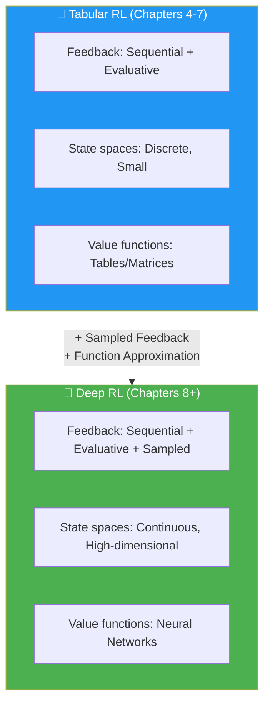

အဓိက အကြောင်းအရာများ:
1. **Sampled feedback** — exhaustive sampling မဖြစ်နိုင်တော့ခြင်း
2. **Function approximation** — tables အစား neural networks
3. **NFQ algorithm** — first value-based DRL method
4. **Decision points** — architecture, targets, loss, optimizer choices
5. **IID assumption** နှင့် **non-stationary targets** problems

---

## 2. Three Types of Feedback in DRL

### Sequential + Evaluative + Sampled

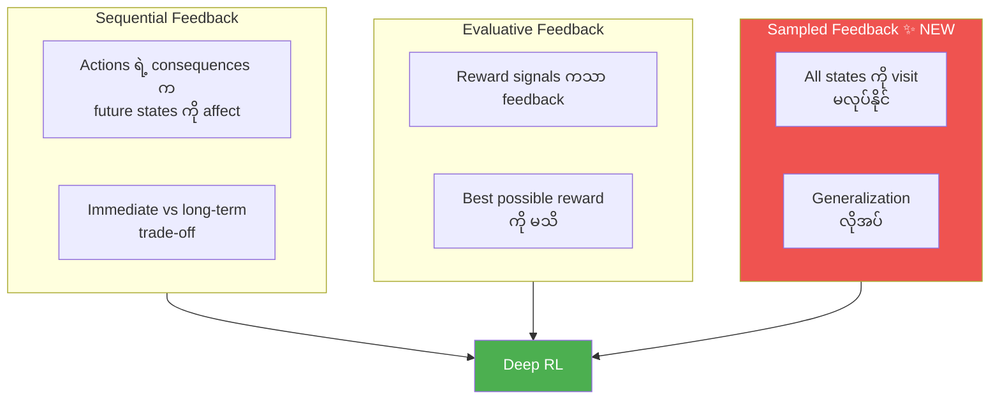

| Feedback Type | Tabular RL | Deep RL |
|---|---|---|
| **Sequential** | ✅ | ✅ |
| **Evaluative** | ✅ | ✅ |
| **Exhaustive** | ✅ (all states visitable) | ❌ |
| **Sampled** | ❌ | ✅ (cannot visit all states) |

### Why Exhaustive Sampling is Impossible

- Atari game states: $(255^3)^{210 \times 160}$ = 242,580-digit number
- Go board: $10^{170}$ possible states
- Robotic arms: Continuous joint angles (infinitesimal precision)

> 💡 Observable universe ရဲ့ atoms အရေအတွက်က $10^{78}$ to $10^{82}$ (83-digit number at most) ဖြစ်ပြီး Atari state space က ဒီထက် **အဆပေါင်းများစွာ** ကြီးပါတယ်။

---

## 3. Function Approximation ဘာကြောင့်လိုတာလဲ

### High-dimensional vs Continuous State Spaces

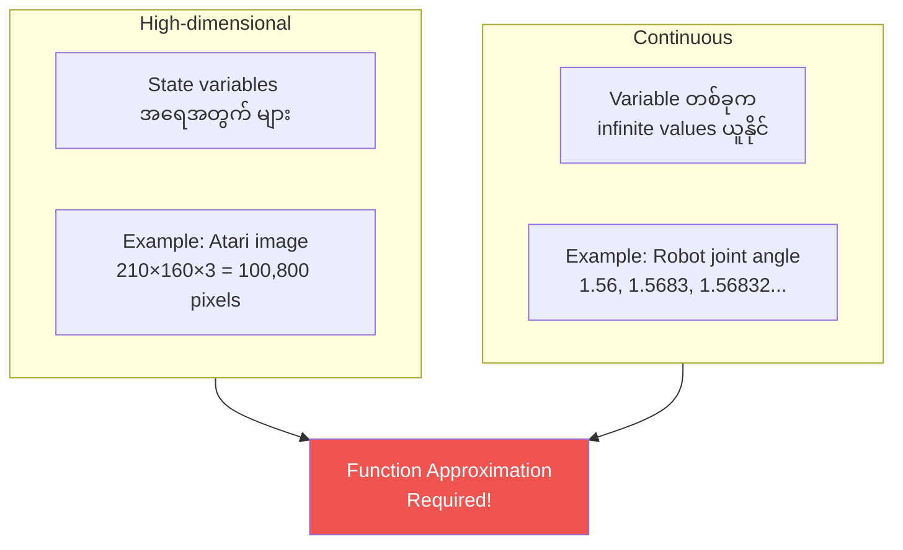

### Benefits of Function Approximation

1. **Solve otherwise unsolvable problems** — continuous state spaces ရှိတဲ့ problems
2. **Generalization** — visited ဖူးတဲ့ states ကနေ unvisited states ကို generalize
3. **Efficiency** — underlying relationships ကို discover ပြီး fewer samples ဖြင့် learn

$$\text{Single update to } V(s) \xrightarrow{\text{with FA}} \text{Updates to similar states } V(s'), V(s''), ...$$

> 💡 Function approximation မရှိဘဲ state 2.35 ရဲ့ value ကို သိဖို့ exactly state 2.35 ကို visit ရမယ်။ Function approximation ရှိရင် state 2.3 နဲ့ 2.4 ကနေ **generalize** လုပ်နိုင်ပါတယ်။

---

## 4. Cart-Pole Environment

### Environment Description

Cart-Pole ဆိုတာ classic RL environment ဖြစ်ပြီး low-dimensional but continuous state space ရှိပါတယ်။

| Property | Value |
|---|---|
| **State variables** | 4 (cart position, cart velocity, pole angle, pole tip velocity) |
| **Actions** | 2 (push left, push right) |
| **Reward** | +1 per time step |
| **Terminal conditions** | Pole angle > 12°, Cart > 2.4 units from center, 500 steps |

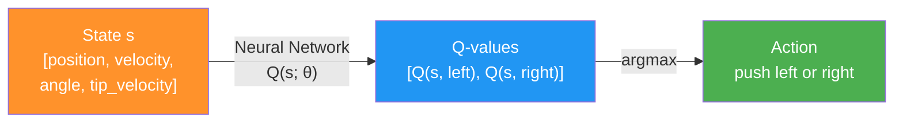

---

## 5. NFQ Algorithm — Decision Points

### NFQ ရဲ့ Decision Points 7 ခု

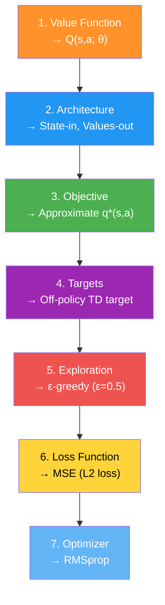

### Decision 1: Value Function to Approximate

$$Q(s, a; \theta) \approx q^*(s, a)$$

- $\theta$ — neural network weights
- Q-function ကို approximate (V-function မဟုတ်) — MDP မလိုဘဲ policy improvement လုပ်နိုင်

### Decision 2: Neural Network Architecture

**State-in, Values-out** architecture (ပိုကောင်းတဲ့ choice):

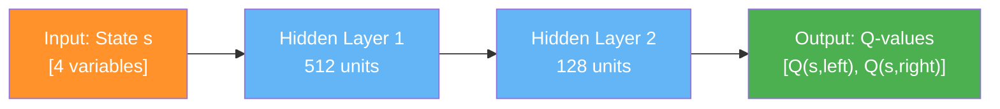

### Decision 3: Objective — Ideal vs Practical

**Ideal objective (impossible):**

$$\mathcal{L}(\theta) = \mathbb{E}\Big[ \big( q^*(s, a) - Q(s, a; \theta) \big)^2 \Big]$$

**Practical (GPI approach):** Start with random Q, evaluate with TD targets, improve with ε-greedy, iterate.

### Decision 4: TD Target (Off-policy)

$$y_t = R_{t+1} + \gamma \max_{a'} Q(S_{t+1}, a'; \theta)$$

```python
# Q-learning target implementation
q_sp = self.online_model(next_states).detach()  # MUST detach!
max_a_q_sp = q_sp.max(1)[0].unsqueeze(1)
max_a_q_sp *= (1 - is_terminals)  # terminal states → 0
target_q_s = rewards + self.gamma * max_a_q_sp
```

> ⚠️ **Critical**: `detach()` ကို target calculation မှာ **မဖြစ်မနေ** သုံးရပါမယ်။ Gradient ကို target ကနေ backpropagate လုပ်ခွင့်မပြုရပါ။

### Decision 5: Exploration Strategy

ε-greedy with ε = 0.5 (50% random, 50% greedy)

### Decision 6: Loss Function — MSE (L2)

$$\mathcal{L}(\theta) = \frac{1}{N} \sum_{i=1}^{N} \Big( Q(s_i, a_i; \theta) - y_i \Big)^2$$

### Decision 7: Optimizer — RMSprop

- Learning rate: 0.0005
- RMSprop: gradient magnitude ရဲ့ moving average ဖြင့် scale
- Adam ထက် stable, hyperparameters sensitivity နည်း

---

## 6. Optimization Methods Overview

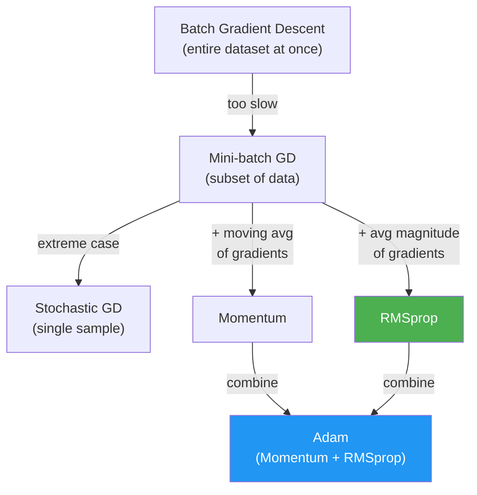

| Optimizer | Description | DRL Suitability |
|---|---|---|
| **Batch GD** | Full dataset at once | ❌ Impractical (no dataset in advance) |
| **SGD** | Single sample per step | ⚠️ High variance |
| **Mini-batch GD** | Small batch per step | ✅ Common |
| **Momentum** | Moving avg of gradients | ✅ Fast but aggressive |
| **RMSprop** | Scale by gradient magnitude | ✅ **Preferred** for value-based |
| **Adam** | Momentum + RMSprop | ✅ Good but more aggressive |

---

## 7. NFQ Full Algorithm

### NFQ Three Steps (Nested Loop)

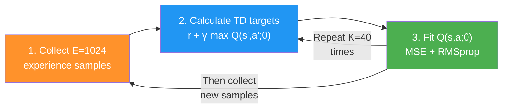

### FCQ Network Implementation

```python
class FCQ(nn.Module):
    def __init__(self, input_dim, output_dim,
                 hidden_dims=(32,32), activation_fc=F.relu):
        super().__init__()
        self.input_layer = nn.Linear(input_dim, hidden_dims[0])
        self.hidden_layers = nn.ModuleList()
        for i in range(len(hidden_dims)-1):
            self.hidden_layers.append(
                nn.Linear(hidden_dims[i], hidden_dims[i+1]))
        self.output_layer = nn.Linear(hidden_dims[-1], output_dim)
    
    def forward(self, state):
        x = self.activation_fc(self.input_layer(x))
        for hidden_layer in self.hidden_layers:
            x = self.activation_fc(hidden_layer(x))
        return self.output_layer(x)  # no activation on output!
```

> 💡 Output layer မှာ activation function **မသုံးပါ** — Q-values တွေက positive/negative ဖြစ်နိုင်တာမို့ unbounded output လိုပါတယ်။

---

## 8. Terminal State Handling

### Time Limit Trap

CartPole-v1 မှာ 500 steps limit ရှိပါတယ်။ Pole straight up ဖြစ်နေတဲ့ state 500 မှာ timeout ဖြစ်ရင် terminal flag ရမယ် — ဒါပေမယ့် ဒီ state ရဲ့ value ကတကယ်တမ်း **infinite** ဖြစ်ပါတယ်! Zero ပေါ်မှာ bootstrap ရင် မှားပါမယ်။

```python
# Proper terminal state handling
new_state, reward, is_terminal, info = env.step(action)
is_truncated = 'TimeLimit.truncated' in info and info['TimeLimit.truncated']
is_failure = is_terminal and not is_truncated
experience = (state, action, reward, new_state, float(is_failure))
```

> ⚠️ `is_failure` ကိုသာ terminal flag အဖြစ်သုံးပါ။ Time limit ကြောင့် terminate ဖြစ်ခြင်းကို real failure ဟု မမှတ်ယူပါနှင့်။

---

## 9. Things That Go Wrong — IID နှင့် Non-stationary Targets

### Problem 1: Data is NOT IID

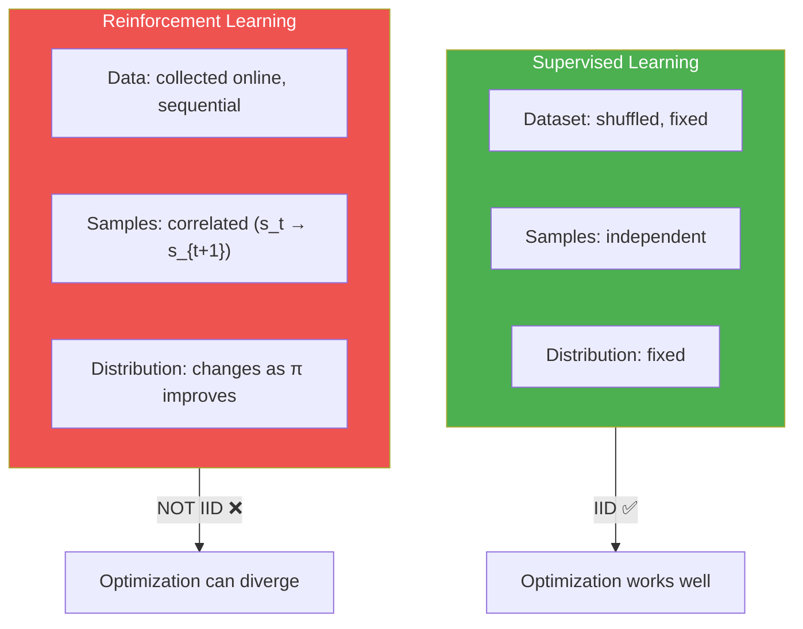

### Problem 2: Non-stationary Targets

$$\text{target} = R_{t+1} + \gamma \max_{a'} Q(S_{t+1}, a'; \theta)$$

Target ကိုယ်တိုင် network $\theta$ ပေါ်မှာ depend ပါတယ်။ $\theta$ update ရင် target ပါပြောင်းသွားပါတယ်:

$$\theta \text{ changes} \Rightarrow Q(S_{t+1}, a'; \theta) \text{ changes} \Rightarrow \text{target changes} \Rightarrow \text{chasing moving target!}$$

### Circular Dependency

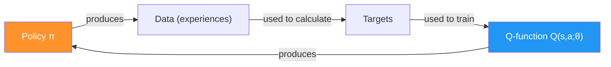

> 💡 ဒီ two problems ကို Chapter 9 မှာ target networks နဲ့ experience replay ဖြင့် ဖြေရှင်းပါမယ်။

---

## 10. Key Equations Summary

| Equation | Formula |
|---|---|
| **Q-function approximation** | $Q(s, a; \theta) \approx q^*(s, a)$ |
| **TD target (off-policy)** | $y_t = R_{t+1} + \gamma \max_{a'} Q(S_{t+1}, a'; \theta)$ |
| **MSE Loss** | $\mathcal{L}(\theta) = \frac{1}{N}\sum_i (Q(s_i,a_i;\theta) - y_i)^2$ |
| **Gradient update** | $\theta \leftarrow \theta - \alpha \nabla_\theta \mathcal{L}(\theta)$ |
| **Atari state space** | $(255^3)^{210 \times 160}$ (242,580-digit number) |

---

## 11. နိဂုံးချုပ် (Conclusion)

ဒီ Chapter မှာ သင်ယူခဲ့တဲ့ အဓိက takeaways:

1. **Sampled feedback** — deep RL ရဲ့ third dimension, exhaustive sampling မဖြစ်နိုင်
2. **High-dimensional vs Continuous** — state space complexity ရဲ့ two axis
3. **Function approximation** — generalization ဖြင့် unseen states ကိုလည်း handle
4. **NFQ algorithm** — first value-based DRL method, batch + fitting approach
5. **7 Decision points** — value function, architecture, objective, targets, exploration, loss, optimizer
6. **IID violation** — online data is correlated and non-identically distributed
7. **Non-stationary targets** — targets change as network updates
8. **Terminal state handling** — time limits vs real failures ခွဲခြားရန် အရေးကြီး

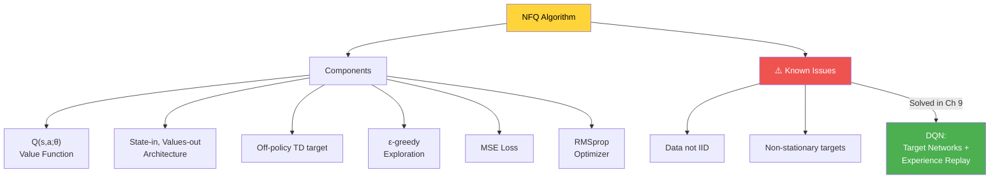

> 💡 NFQ သည် deep RL ရဲ့ foundation ဖြစ်ပေမယ့် sample efficiency နည်းပြီး stability issues ရှိပါတယ်။ Chapter 9 မှာ DQN ဖြင့် ဒီ issues တွေကို address လုပ်ပါမယ်။
