# အခန်း ၈ — Value-based Deep Reinforcement Learning နိဒါန်း (Introduction to Value-Based Deep Reinforcement Learning)

> *"လူသား၏ အပြုအမူသည် အဓိက source ၃ ခုမှ စီးဆင်းသည် — desire (ဆန္ဒ)၊ emotion (စိတ်ခံစားမှု)၊ နှင့် knowledge (ဗဟုသုတ)။"*
> — Plato (Classical Greece ၏ philosopher၊ Academy ၏ တည်ထောင်သူ)

## ဒီအခန်းမှာ သင်ယူရမည့်အချက်များ

- Non-linear function approximators ဖြင့် RL agents train ရာတွင် ရှိနေသော challenges များကို နားလည်ရမည်
- Minimal hyperparameter adjustments ဖြင့် different kinds of problems ကို solve နိုင်တဲ့ deep RL agent တစ်ခုကို ဖန်တီးရမည်
- Value-based methods ကို RL problems ဖြေရှင်းရာတွင် အသုံးပြုခြင်း၏ advantages နှင့် disadvantages ကို identify လုပ်ရမည်

---

## ၈.၁ — TP မှ DRL ဆီ: ကြီးမားသော ခြေလှမ်း (From Tabular RL to Deep RL)

ဒီအချိန်ထိ မြင်သာထင်သာ တိုးတက်မှုများ ဖြစ်ခဲ့ပါတယ်:

- **Chapter 2** — MDP ဖြင့် problems represent လုပ်ခြင်း
- **Chapter 3** — VI/PI ဖြင့် MDPs solve လုပ်ခြင်း
- **Chapter 4** — MDP မသိဘဲ one-step MDPs (bandits) ဖြေရှင်းခြင်း
- **Chapter 5** — Sequential + uncertain feedback ကို combine လုပ်ပြီး policies evaluate လုပ်ခြင်း
- **Chapter 6** — Sequential decision-making under uncertainty ကို optimal policies ဖြင့် ဖြေရှင်းခြင်း
- **Chapter 7** — ပိုထိရောက်ပြီး ပိုအကျိုးရှိ agents develop လုပ်ခြင်း

Chapter 2 သည် ဒီစာအုပ်ရှိ chapters အားလုံး၏ foundation ဖြစ်ပါတယ်။ Chapter 3 = sequential feedback, Chapter 4 = evaluative feedback, Chapters 5-7 = sequential + evaluative feedback (tabular RL)。

**ဒီအခန်းကနေစပြီး deep RL ၏ details ကို explore လုပ်ပါမယ်!** Neural networks (highly non-linear function approximators) ကို RL problems ဖြေရှင်းရာတွင် leverage လုပ်ပုံကို depth ဖြင့် ဆွေးနွေးပါမယ်။ Deep RL methods မျိုးစုံ ရှိသော်လည်း ဒီ chapter သည် **value-based deep RL methods** ကို အာရုံစိုက်ပါတယ်။

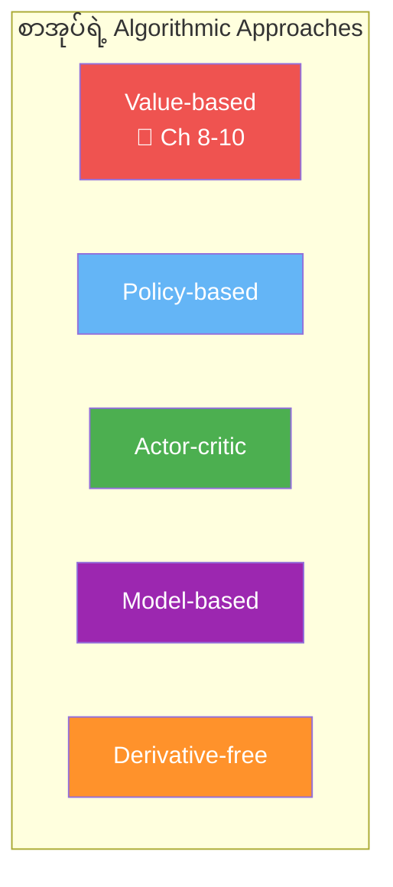

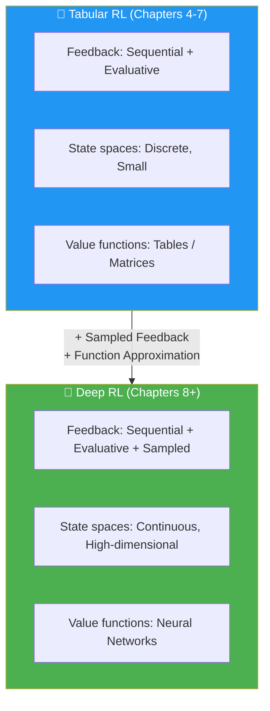

---

## ၈.၂ — Deep RL Agents ၏ Feedback အမျိုးအစားများ

Deep RL မှာ agents တွေက **sequential, evaluative, နှင့် sampled** feedback ၃ ခုကို တစ်ပြိုင်နက် deal ရပါတယ်။ ဒီ point ကို chapter တစ်ခုလုံး emphasis ပေးနေတာ — ဒါ၏ အဓိပ္ပါယ်ကို နားလည်ဖို့ လိုပါတယ်။

**Feedback အမျိုးအစားများ နှင့် method comparison:**

| Method | Sequential | Evaluative | Sampled |
|---|---|---|---|
| **Supervised Learning** | ❌ | ❌ | ✅ |
| **Planning (Ch 3)** | ✅ | ❌ | ❌ |
| **Bandits (Ch 4)** | ❌ | ✅ | ❌ |
| **Tabular RL (Ch 5-7)** | ✅ | ✅ | ❌ |
| **Deep RL (Ch 8-12)** | ✅ | ✅ | ✅ |

---

### ၈.၂.၁ — Sequential Feedback

Deep RL agents တွေ sequential feedback ကို deal ရပါတယ်။ Sequential feedback ၏ အဓိက challenge ကတော့ agents တွေ delayed information ကို receive တတ်ခြင်းဖြစ်ပါတယ်။ Chess game တွင် စကြောင် early moves မှားပေမယ့် consequences က game ending မှာမှ ပေါ်ပြင်တတ်ပါတယ်။

Delayed feedback ကြောင့် feedback ၏ source ကို interpret ရ ခက်ပါတယ်။ Sequential feedback သည် **temporal credit assignment problem** ကို ဖြစ်ပေါ်စေပါတယ် — temporal component ရှိပြီး actions ၏ consequences delayed ဖြစ်ရင် rewards အတွက် credit assign ရန် ခက်ပါတယ်။

**ဥပမာ — Sequential feedback ၏ challenge:**

```
State: [–10 path] ← ဒီ path ကောင်းပုံရမည်
           ↓
[more –10 states] ← ဒါပေမယ့် ဆက်သွားရင်…
           ↓
  [–100 penalty!] ← ဒီ high penalty ကိုမှ တွေ့ရမည်
```

Agent က "short-term ကောင်းပုံရ" တဲ့ path ကို ရှောင်ဖို့ value functions ကိုသုံးပြီး decide ရပါတယ် — rewards ကို direct ကြည့်ပြီး decide လုပ်ရင် မလုံပါ။

**Sequential feedback ၏ ဆန့်ကျင်ဖက် = one-shot feedback:**
Classification problem ကဲ့သို့ supervised learning မှာ image ကို မှန်/မမှန် predict ပေမယ့် next image presentation ကို affect မုပါ — long-term consequences မရှိပါ။

---

### ၈.၂.၂ — Evaluative Feedback

Evaluative feedback ၏ အဓိပ္ပါယ်ကတော့ feedback ၏ goodness သည် **relative** ဖြစ်ခြင်းပဲဖြစ်ပါတယ်၊ ဘာကြောင့်ဆိုသော environment သည် uncertain ဖြစ်တဲ့အတွက်ပါ။ Transition function နှင့် reward signal ကို access မရပါ။

Explore လုပ်ခြင်းဖြင့် current knowledge ကို capitalize မလုပ်နိုင်ဘဲ regret accumulate ဖြစ်ပါတယ် — **exploration-exploitation trade-off** ဖြစ်ပေါ်လာပါတယ်။

**ဥပမာ — Evaluative feedback challenge:**

> Agent က state တစ်ခုမှ –10 reward ရပါတယ်။ ဒါ bad လားလည်း ဆုံးဖြတ်ရ ခက်ပါတယ်! Environment ၏ map ကို agent မမြင်ရတဲ့အတွက်ဖြစ်ပါတယ်။ –100 penalty state ကလည်း ရှိကောင်းရှိမယ်...

**Evaluative feedback ၏ ဆန့်ကျင်ဖက် = supervised feedback:**
Classification problem မှာ model ကို correct labels (ဖြေမှန်) ချက်ချင်းပေးတယ် — "cheating!" ဆိုသလိုပါ။ Supervised learning agent က mistakes ပြုလုပ်ရင် correct answer ကို ချက်ချင်းပေးတယ်။ Real life မှာ "right answer" မရပါ!

---

### ၈.၂.၃ — Sampled Feedback (Deep RL ၏ တတိယ Dimension ✨)

Deep RL ကို tabular RL ကနေ ခွဲခြားပေးတဲ့ အဓိက feature ဖြစ်ပါတယ်။ Deep RL မှာ agents တွေ possible feedback 
 အားလုံးကို exhaustively sample မလုပ်နိုင်ပါ။ Gathered feedback ကိုသုံးပြီး generalize ပြုလုပ်ကာ ဉာဏ်ကောင်းသော decisions ချမည် ဖြစ်ပါတယ်။

**Atari state space ၏ ကြီးမားမှု:**

- Image: $210 \times 160$ pixels × 3 channels
- Each pixel: 0–255 (8-bit image)
- Possible states: $(255^3)^{210 \times 160} = (16{,}581{,}375)^{33{,}600}$

$$\text{Atari states} = (255^3)^{210 \times 160} \approx 10^{242{,}580\text{-digit number!}}$$

> 💡 Observable universe ၏ atoms အရေအတွက်က $10^{78}$ မှ $10^{82}$ (83-digit number at most) ဖြစ်ပါတယ်။ Atari state space ကား **ဒီထက် အဆပေါင်းများစွာ** ကြီးပါတယ်!

**Sampled feedback ၏ ဆန့်ကျင်ဖက် = exhaustive feedback:**

Tabular RL မှာ agents တွေ long enough sample လုပ်ရင် necessary information အားလုံးကို gather နိုင်ပါတယ်။ RL convergence guarantees တွေ ဖြစ်ပေါ်တဲ့ reason ကလည်း exhaustive feedback collect နိုင်ခြင်း ကြောင့်ပဲဖြစ်ပါတယ်။ ဒါပေမယ့် **complex problems** (Go: $10^{170}$ states, Atari: $10^{242{,}580}$ states, Robotics: continuous state space) မှာ exhaustive sampling impossible ဖြစ်ပါတယ်!

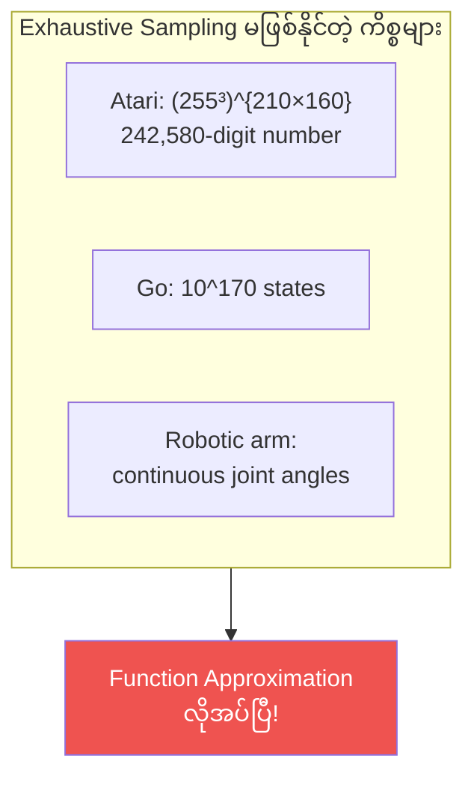

---

## ၈.၃ — Function Approximation ဘာကြောင့်လိုတာလဲ

### High-dimensional vs. Continuous State Spaces

> **High-dimensional:** Single state ကိုဖွဲ့စည်းတဲ့ variables အရေအတွက် များ
> (Atari: $210 \times 160 \times 3 = 100{,}800$ pixels)

> **Continuous:** Variable တစ်ခုက infinite number of values ယူနိုင်
> (Robot position: 1.56, 1.5683, 1.5683256, ...)

State space တွေ high-dimensional ရော continuous ရော ဖြစ်နိုင် — ဒါသည် deep RL ၏ existence ရဲ့ reason ဖြစ်ပါတယ်!

### Function Approximation ၏ Advantages

1. **Solve otherwise unsolvable problems** — continuous state spaces ရှိတဲ့ problems
2. **Generalization** — visited states ကနေ unvisited states ဆီ generalize
3. **Efficiency** — underlying relationships ကို discover ပြီး fewer samples ဖြင့် learn

**ဥပမာ — Function Approximation ၏ generalization:**

```
Without FA:  Update V(state=2.35) → Only state 2.35 changes
With FA:     Update V(state=2.35) → Similar states V(2.3), V(2.4)... all update!
```

$$\underbrace{V(s)}_{\text{Table}} \xrightarrow{\text{update}} \text{Only } V(s) \text{ changes}$$

$$\underbrace{Q(s, a; \theta)}_{\text{Neural Network}} \xrightarrow{\text{update}} \text{All similar } Q(s', a'; \theta) \text{ also change}$$

> 💡 Value Iteration နှင့် Q-learning တို့ tables/matrices ဖြင့် value functions represent လုပ်ပါတယ်:
> - Value Iteration: State-value function = **vector** indexed by states
> - Q-learning: Action-value function = **matrix** indexed by states × actions
>
> Cart-pole မှာ FA မသုံးဘဲ state 2.35 ၏ value ကို သိဖို့ exactly 2.35 ကို visit ရမယ်။ FA ရှိရင် 2.3 နှင့် 2.4 ကနေ **generalize** နိုင်ပါတယ်!

---

## ၈.၄ — Cart-Pole Environment

### Environment ၏ ဖွဲ့စည်းပုံ

Cart-Pole သည် reinforcement learning ၏ **classic environment** ဖြစ်ပါတယ်။ Low-dimensional ပေမယ့် continuous state space ရှိပြီး algorithms develop ရာတွင် excellent environment ဖြစ်ပါတယ်:

```
    [pole]
      |
   [cart] ←→
─────────────
      track
```

| Property | Value |
|---|---|
| **State variables** | 4 ခု (cart position, cart velocity, pole angle, pole tip velocity) |
| **State dimension** | Low-dimensional ပေမယ့် **continuous** |
| **Actions** | 2 ခု — Action 0 (push left, –1 force), Action 1 (push right, +1 force) |
| **Reward** | Step တိုင်း **+1** |
| **Terminal conditions** | Pole angle > 12°, Cart > 2.4 units center ကနေ, 500 steps ပြည့် |

**Cart-Pole ၏ State Variables:**

| Variable | Range |
|---|---|
| Cart position (x-axis) | –2.4 to 2.4 |
| Cart velocity (x-axis) | –∞ to +∞ |
| Pole angle | ~–40° to ~40° |
| Pole tip velocity | –∞ to +∞ |

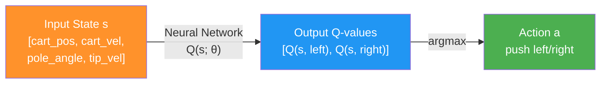

---

## ၈.၅ — NFQ: Value-Based Deep RL ၏ ပထမဆုံး ကြိုးစားမှု

### NFQ (Neural Fitted Q-Iteration) ဆိုတာ ဘာလဲ

**Neural Fitted Q (NFQ) iteration** ကတော့ neural networks ကို function approximation အဖြစ် RL problems ဖြေရှင်းရာတွင် successfully အသုံးပြုသော ပထမဆုံး algorithm ထဲကတစ်ခု ဖြစ်ပါတယ်။

NFQ ကို 2005 ခုနှစ်တွင် **Martin Riedmiller** က "Neural Fitted Q Iteration — First Experiences with a Data Efficient Neural Reinforcement Learning Method" paper တွင် introduce လုပ်ခဲ့ပါတယ်။ European universities အများအပြားတွင် professor အဖြစ် 13 နှစ် လုပ်ဆောင်ပြီး Martin သည် Google DeepMind ၏ research scientist ဘဝကို ဆက်လက်လျှောက်ပါတယ်။

ဒီ chapter ၏ ကျန်တဲ့ section တွေမှာ value-based deep RL algorithms အများစု ပါဝင်တဲ့ components များကို ဆွေးနွေးပါမယ်။ **Decision points 7 ခု** ကို ထောက်ကာ components ကို ရွေးချယ်ပုံကို လေ့လာပါမယ်:

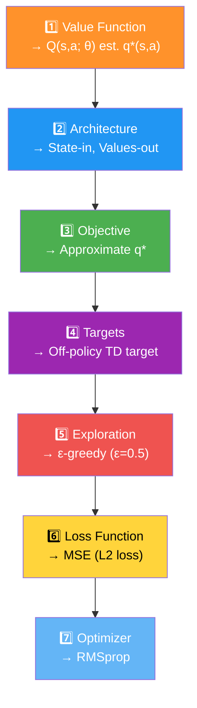

---

### Decision Point 1 — Approximate လုပ်မည့် Value Function ကို ရွေးချယ်ခြင်း

Neural networks ဖြင့် value functions approximate လုပ်ရာတွင် မတူညီသည့် ways များ ရှိပါတယ်:

- **$v(s)$** — State-value function (control problem ကို တစ်ခုတည်းဖြင့် solve မရ — MDP ပါ လိုတယ်)
- **$q(s,a)$** — Action-value function ✅ — MDP မလိုဘဲ control problem solve နိုင်
- **$a(s,a)$** — Action-advantage function (later chapters)

NFQ မှာ **action-value function $q(s,a)$** ကို Q-learning style နှင့်ဆင်တူစွာ approximate လုပ်ပါတယ်:

$$Q(s, a; \theta) \approx q^*(s, a)$$

- $\theta$ = neural network ၏ weights
- $Q(s,a;\theta)$ = approximate action-value function *estimates*
- $q^*(s,a)$ = true optimal action-value function (ရှာဖွေနေသည်)

> **ဘာကြောင့် $Q$-function ကို ရွေးချယ်ရသလဲ?** Cart-pole မှာ pole balance ဖြစ်ရန် actions ၏ values ကို state အားလုံးမှာ သိဖို့ လိုပါတယ်။ State-action pairs ၏ values ကို သိရင် exploratory action (information gather) ဒါမှမဟုတ် greedy action (expected return maximize) ကို ကွဲပြားနိုင်ပါတယ်။

---

### Decision Point 2 — Neural Network Architecture ရွေးချယ်ခြင်း

Architecture ၂ မျိုး possible ဖြစ်ပါတယ်:

**Option A: State-action-in, value-out (less efficient):**

```
Input: [cart_pos, cart_vel, pole_angle, tip_vel, action] → Output: Q(s,a)
```

**Option B: State-in, values-out (more efficient — NFQ ရွေးချယ်):**

```
Input: [cart_pos, cart_vel, pole_angle, tip_vel] → Output: [Q(s,left), Q(s,right)]
```

**ဘာကြောင့် state-in, values-out ပိုကောင်းသလဲ?**
- ε-greedy ဒါမှမဟုတ် softmax exploration ကို action values တွေ **single forward pass** ဖြင့်ရ
- Actions အများအပြားရှိတဲ့ environments မှာ **high-performance implementation** ဖြစ်
- State တစ်ခုကို neural network မှ pass တစ်ကြိမ်ဖြင့် all actions' Q-values ရ

**NFQ architecture (cart-pole): 4 → 512 → 128 → 2**

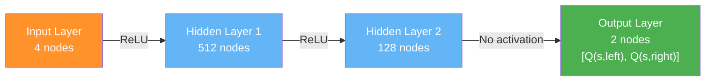

> ⚠️ **Output layer မှာ activation function မသုံးပါ** — Q-values တွေ positive/negative ဖြစ်နိုင်တဲ့အတွက် unbounded output လိုပါတယ်!

---

### Python Code — Fully Connected Q-function (FCQ)

```python
import torch
import torch.nn as nn
import torch.nn.functional as F

class FCQ(nn.Module):
    def __init__(self, 
                 input_dim,          # State variables အရေအတွက် (cart-pole: 4)
                 output_dim,         # Actions အရေအတွက် (cart-pole: 2)
                 hidden_dims=(32,32),        # Hidden layers sizes (tuple)
                 activation_fc=F.relu):      # Activation function
        super(FCQ, self).__init__()
        self.activation_fc = activation_fc
        
        # Input layer: input_dim → first hidden layer
        self.input_layer = nn.Linear(input_dim, hidden_dims[0])
        
        # Hidden layers: flexible (any number, any size)
        self.hidden_layers = nn.ModuleList()
        for i in range(len(hidden_dims) - 1):
            hidden_layer = nn.Linear(hidden_dims[i], hidden_dims[i+1])
            self.hidden_layers.append(hidden_layer)
        
        # Output layer: last hidden → output_dim
        self.output_layer = nn.Linear(hidden_dims[-1], output_dim)
    
    def _format(self, state):
        """State ကို tensor format ဖြစ်အောင် convert"""
        x = state
        if not isinstance(x, torch.Tensor):
            x = torch.tensor(x, device=self.device, dtype=torch.float32)
            x = x.unsqueeze(0)  # batch dimension ထည့်
        return x
    
    def forward(self, state):
        x = self._format(state)
        
        # Input layer + ReLU
        x = self.activation_fc(self.input_layer(x))
        
        # Hidden layers + ReLU
        for hidden_layer in self.hidden_layers:
            x = self.activation_fc(hidden_layer(x))
        
        # Output layer — activation မသုံး! (unbounded Q-values)
        x = self.output_layer(x)
        return x
```

**Code ရှင်းလင်းချက်:**
1. `hidden_dims=(32,32)` → hidden layers ၂ ခု (32, 32 units) ဖြင့် initialize။ `(64, 32, 16)` ဆိုရင် layers ၃ ခု ဖြစ်မည်
2. Input layer ကို `input_dim → hidden_dims[0]` ဖြင့် define
3. Loop ဖြင့် flexible number of hidden layers ဖန်တီး
4. Output layer ကို `hidden_dims[-1] → output_dim` ဖြင့် connect
5. `forward()` — state ကို raw input အဖြစ်ယူပြီး tensor ဖြစ်အောင် convert
6. Input + hidden layers ကနေ activation function pass ပြုလုပ်
7. Output layer မှာ activation မသုံး — Q-values က range မကန့်သတ်ပါ

---

### Decision Point 3 — Optimize လုပ်မည့် Objective ရွေးချယ်ခြင်း

**Ideal objective (impossible):**
RL ကို supervised learning problem ဟု ယူဆပြီး optimal Q-values ကို labels အဖြစ်ထားနိုင်ရင် ကောင်းပေမည်:

$$\mathcal{L}(\theta) = \mathbb{E}\left[ \left( q^*(s, a) - Q(s, a; \theta) \right)^2 \right]$$

**ဘာကြောင့် impossible လဲ?**
- Optimal action-value function $q^*(s,a)$ မသိပါ
- Optimal policy ကိုမသိသောကြောင့် $q^*$ ကို sample လုပ်လည်း မဖြစ်ပါ

**Practical approach — GPI pattern:**
Randomly initialized Q-function ကနေ start ပြီး、policy evaluation + policy improvement ကို alternate ပြုလုပ်ကာ repeat ပါတယ်:

1. Randomly initialized action-value function + implicit policy
2. Sample actions from it (policy evaluation)
3. ε-greedy strategy ဖြင့် improve (policy improvement)
4. Desired performance ရတဲ့ထိ iterate

> ⚠️ **Warning:** Non-linear function approximation သုံးတဲ့အတွက်ကြောင့် convergence guarantees ရှိတော့မပါ! ဒါဟာ "deep RL ၏ Wild West" ဖြစ်ပါတယ်!

---

### Decision Point 4 — Policy Evaluation ၏ Targets ရွေးချယ်ခြင်း

Policy evaluate လုပ်ရာတွင် target မျိုးစုံ ရှိပါတယ်:

```
MC target     → Full trajectory reward
TD target     → r + γ V(s')       ← NFQ သုံး
N-step target → r + r' + ... + γⁿV(sⁿ)
Lambda target → weighted combination of N-step targets
```

NFQ မှာ simplicity ရှိစေဖို့ **off-policy TD target (Q-learning target)** ကို သုံးပါတယ်:

$$y_t = R_{t+1} + \gamma \max_{a'} Q(S_{t+1}, a'; \theta)$$

**On-policy vs. Off-policy targets:**

| Target Type | ဘာကို approximate လုပ်သလဲ |
|---|---|
| **On-policy (SARSA target)** | Behavioral policy (ε-greedy ရဲ့ value function) |
| **Off-policy (Q-learning target)** | Greedy policy (behavior policy ဘာပဲဖြစ်ဖြစ်) |

> 💡 Off-policy method ဖြစ်တဲ့အတွက် behavior policy က virtually anything ဖြစ်နိုင်ပါတယ် (broad support ရှိသရွေ့)!

---

### Python Code — Q-learning Target

```python
# Q-learning target implementation
# next_states: batch of next states s'
q_sp = self.online_model(next_states).detach()  # ← CRITICAL: detach() မဖြစ်မနေ!
max_a_q_sp = q_sp.max(1)[0].unsqueeze(1)       # max action value for each s'
max_a_q_sp *= (1 - is_terminals)                # terminal states → 0
target_q_s = rewards + self.gamma * max_a_q_sp  # Q-learning target

q_sa = self.online_model(states).gather(1, actions)  # current Q(s,a) prediction
```

**Code ရှင်းလင်းချက်:**
1. `online_model(next_states)` — Q-values ကို s' (next state batch) အတွက် ရယူ
2. **`.detach()` — CRITICAL!** Target calculation အတွက် gradient propagate လုပ်ခွင့် မပေးရ
3. `.max(1)[0]` — action dimension ဖြင့် max Q-value ရယူ (greedy action ၏ value)
4. `.unsqueeze(1)` — dimension add ။
5. `(1 - is_terminals)` — terminal states ၏ value ကို 0 ဖြစ်အောင် ground ပြုလုပ် ← **Important!**
6. Q-learning target ကို တွက်
7. `gather(1, actions)` — current Q(s,a) prediction ကို action indices ဖြင့် gather

> ⚠️ **RL implementation ၏ common error 1:** Predicted values ကနေသာ backpropagate လုပ်ရပါမည်! Target calculation ကနေ gradient ကို propagate လုပ်ခွင့် မပေးရ — targets ကို **constants** အဖြစ် treat ရပါမည်!

---

### Terminal State Handling — Time Limit Trap

OpenAI Gym ၏ cart-pole environment တွင် **time limit wrapper** ရှိပါတယ်:
- CartPole-v0: 200 steps
- CartPole-v1: 500 steps

**Problem:** Pole straight up ဖြစ်နေပြီး step 500 မှာ timeout ဖြစ်ရင် terminal flag ကို pass ပြုလုပ်ပါတယ်! ဒါပေမယ့် ဒီ state ၏ true value ကတော့ **infinite** ဖြစ်ပါတယ်! Careful မဖြစ်ရင် zero ပေါ်မှာ bootstrap ပြုလုပ်မိမည်ဟု ဆိုလိုပါသည်!

**Solution:**

```python
# Proper terminal state handling — Time limit trap ကို ရှောင်ရှားရန်
new_state, reward, is_terminal, info = env.step(action)

# Time limit ကြောင့် terminated ဖြစ်ခြင်းလား စစ်ဆေး
is_truncated = 'TimeLimit.truncated' in info and info['TimeLimit.truncated']

# Real failure = terminate + NOT truncated
is_failure = is_terminal and not is_truncated

# Only is_failure ကိုသာ terminal flag အဖြစ် use ပါ!
experience = (state, action, reward, new_state, float(is_failure))
```

**Code ရှင်းလင်းချက်:**
1. Experience tuple ကို ပုံမှန်အတိုင်း collect
2. `TimeLimit.truncated` key ကို info dict ထဲ စစ်ဆေး
3. Real failure = terminal ဖြစ်ပြီး time limit ကြောင့် မဟုတ်ဘဲ ဖြစ်တာ
4. `is_failure` ကိုသာ terminal flag အဖြစ်ထည့်သွင်းပါ — time limit ကြောင့် ဖြစ်ပါက value of new_state ပေါ်မှာ bootstrap ပြုလုပ်မည်

> 💡 **Pole straight up ဖြစ်နေတဲ့ state 500 ၏ value ကဘာလဲ?** Pole straight up ဖြစ်ပြီး step တိုင်း +1 ရနေပါက ဒီ state ၏ true value ကတော့ **infinite** ဖြစ်ပါတယ်! Zero ပေါ်မှာ bootstrap ဆိုရင် algorithm ကို mislead ပေးပါမည်!

---

### Decision Point 5 — Exploration Strategy ရွေးချယ်ခြင်း

GPI ၏ policy improvement step အတွက် exploration strategy ကို ရွေးချယ်ရပါမည်။ Chapter 4 မှာ exploration-exploitation trade-off balance လုပ်တဲ့ techniques များ survey လုပ်ခဲ့ပြီး ဒီအခန်းတွင် simplicity ရှိဖို့ **ε-greedy strategy** ကို သုံးပါမည်။

**Off-policy learning ၏ implication:**
NFQ သည် off-policy learning algorithm ဖြစ်ပြီး **policies ၂ ခု** ရှိပါတယ်:
- **Behavior policy** — behavior generate ပြုလုပ်တဲ့ policy (ε-greedy with ε=0.5)
- **Target policy** — learn နေသော policy (greedy/optimal)

Off-policy learning ၏ interesting fact: Behavior policy က virtually anything ဖြစ်နိုင်ပါတယ် (state-action pairs အားလုံးကို sufficient exploration ရှိသရွေ့)!

NFQ training မှာ: **ε = 0.5** (50% random, 50% greedy)
NFQ evaluation မှာ: **greedy policy** (learned Q-function အပေါ် greedy)

---

### Python Code — ε-greedy Exploration Strategy

```python
class EGreedyStrategy:
    def __init__(self, epsilon=0.1):
        self.epsilon = epsilon
    
    def select_action(self, model, state):
        with torch.no_grad():
            # State ၏ Q-values ကို model ကနေ ရယူ
            q_values = model(state).cpu().detach()
            q_values = q_values.data.numpy().squeeze()  # NumPy-friendly
        
        if np.random.rand() > self.epsilon:
            # Exploit: greedy action (highest Q-value)
            action = np.argmax(q_values)
        else:
            # Explore: random action
            action = np.random.randint(len(q_values))
        
        return action
```

**Code ရှင်းလင်းချက်:**
1. `select_action` — state s အတွက် Q-values ကို ရယူပြီး action ရွေးချယ်
2. `torch.no_grad()` — inference ဖြစ်တဲ့အတွက် gradient computation မလိုဘူး
3. Q-values ကို NumPy-friendly ဖြစ်အောင် convert ပြုလုပ်
4. `rand() > epsilon` — ε probability ဖြင့် exploit (greedy)
5. Otherwise → explore (random)

> 💡 Performance goal ဆိုရင် model ကို query မလုပ်ပါနဲ့! Stats calculation နှင့် training ကိုသာ query ပြုလုပ်ပါ!

---

### Decision Point 6 — Loss Function ရွေးချယ်ခြင်း

Loss function ကတော့ neural network predictions ၏ accuracy ကို measure ပြုလုပ်ပါတယ်။ Supervised learning မှာ true values ကို ကြိုတင်သိပြီး loss calculate ပြုလုပ်ရတာ ပိုရိုးရှင်းပါတယ်။

**NFQ မှာ MSE (Mean Squared Error / L2 loss) ကို အသုံးပြုပါတယ်:**

$$\mathcal{L}(\theta) = \frac{1}{N} \sum_{i=1}^{N} \Big( Q(s_i, a_i; \theta) - y_i \Big)^2$$

- $Q(s_i, a_i; \theta)$ = predicted values (neural network ကနေ directly — good!)
- $y_i$ = TD targets (network prediction ပေါ်မှာ depend — problematic!)

**Circular Dependency Problem:**

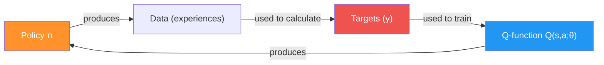

> ⚠️ "True values" တွေဟာ network ၏ predictions ကိုယ်တိုင် ပေါ်မှာ depend ပါတယ်! ဒါသည် supervised learning ၏ assumptions ချိုးဖောက်ပြီး **problems ဖြစ်ပေါ် တတ်ပါတယ်**!

---

### Decision Point 7 — Optimization Method ရွေးချယ်ခြင်း

Gradient descent သည် data **IID (independent and identically distributed)** ဖြစ်ပြီး targets **stationary** ဖြစ်မှ stable optimization method ဖြစ်ပါတယ်။ RL မှာ ဒီ assumptions နှစ်ခုလုံး violated ဖြစ်ပါတယ်!

**Optimization Methods Comparison:**

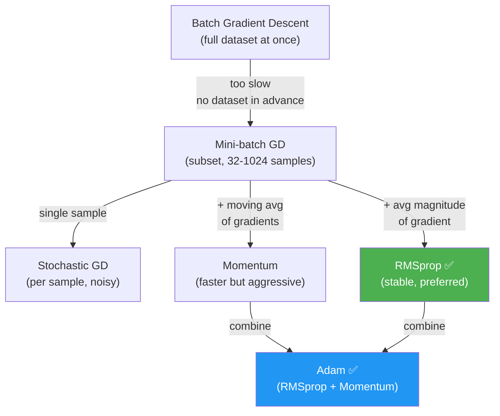

| Optimizer | ရှင်းလင်းချက် | DRL Suitability |
|---|---|---|
| **Batch GD** | Dataset တစ်ခုလုံးကို တစ်ကြိမ်တည်း | ❌ RL မှာ dataset ကြိုတင်မရှိ |
| **Mini-batch GD** | Small batch per step | ✅ Common (batch size 32-1024) |
| **SGD** | Single sample per step | ⚠️ High variance |
| **Momentum** | Moving average of gradients ဖြင့် step လှမ်း | ✅ Fast but aggressive |
| **RMSprop** | Gradient magnitude ၏ moving avg ဖြင့် scale | ✅ **Preferred** for value-based |
| **Adam** | Momentum + RMSprop ပေါင်းစပ် | ✅ Good but more aggressive |

**NFQ တွင် RMSprop ကို ရွေးချယ်သည့် အကြောင်း:**
- Stable, hyperparameters sensitivity နည်း
- Value-based deep RL methods မှာ ထိထိရောက်ရောက် work ပါတယ်

---

### Miguel ၏ Analogy — Optimization Methods ကို Visualize ပြုလုပ်ခြင်း

> **RMSprop ကို landscape analogy ဖြင့် နားလည်ကြပါမည်:**
>
> Loss function ကို hills, valleys, flat plains ပါတဲ့ landscape ဟု imagine ပါ။
>
> - **Downhill ကို သွားနေရင်** (high gradients) → steep surface မှ flat valley ဆီ change ဖြစ်လာပါက gradients' moving average magnitude သည် most recent gradient ထက် ကြီးပါမည် → step size ကို **reduce** ပြုလုပ်ပြီး oscillations/overshoot ကို prevent ပါတယ်
>
> - **Near-flat surface မှာ ရှိရင်** (small gradients) → significant gradient ဆီ change ဖြစ်လာပါက average magnitude က small ဖြစ်ပြီး new gradient က large ဖြစ်မည် → step size ကို **increase** ပြုလုပ်ပြီး learning ကို speed up ပါတယ်
>
> **Adam** ကတော့ gradient velocity direction ဖြင့် step ပြုလုပ်ပြီး gradient magnitude moving avg ဖြင့် scale ပြုလုပ်တဲ့ combo ဖြစ်ပါတယ် — RMSprop ထက် aggressive ဖြစ်ပေမယ့် Momentum ထက် conservative ဖြစ်ပါတယ်။

---

## ၈.၆ — NFQ ၏ Full Algorithm

### NFQ ၏ Selections Summary

NFQ algorithm ၏ final components:

| Component | Selection |
|---|---|
| **Value function** | $Q(s, a; \theta)$ — approximate optimal action-value function |
| **Architecture** | State-in, values-out: 4 → 512 → 128 → 2 |
| **Objective** | Optimize to approximate $q^*(s,a)$ |
| **Targets** | Off-policy TD: $r + \gamma \max_{a'} Q(s', a'; \theta)$ |
| **Exploration** | ε-greedy with ε = 0.5 |
| **Loss** | MSE (Mean Squared Error) |
| **Optimizer** | RMSprop, learning rate = 0.0005 |

### NFQ ၏ 3 Main Steps (Nested Loop)

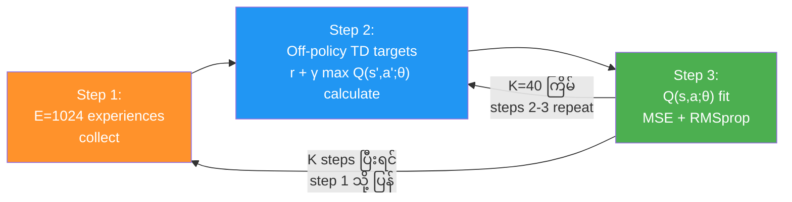

**NFQ Algorithm ၏ Key:**
- **"Fitted"** ဆိုတာ nested loop ပါတဲ့ structure ကြောင့် ဖြစ်ပါတယ်
- Step 1 မှ experiences collect ပြီးရင် → Step 2-3 ကို K=40 ကြိမ် repeat
- K fitting steps အပြည့်ပြည့်ပြီးမှ → Step 1 သို့ ပြန်ကာ new experiences collect

---

### Python Code — NFQ Agent Core

```python
import torch
import torch.nn as nn
import torch.optim as optim
import numpy as np
from collections import deque

class NFQ:
    def __init__(self, 
                 env,
                 value_model_fn,       # Neural network factory (FCQ)
                 value_optimizer_fn,   # Optimizer factory (RMSprop)
                 value_optimizer_lr,   # Learning rate
                 training_strategy_fn, # Exploration strategy (ε-greedy)
                 evaluation_strategy_fn,
                 n_warmup_batches,     # Initial random exploration
                 max_gradient_norm):   # Gradient clipping
        
        self.env = env
        self.gamma = 0.99
        
        nS, nA = env.observation_space.shape[0], env.action_space.n
        
        # Neural network: state → Q-values for all actions
        self.online_model = value_model_fn(nS, nA)
        self.optimizer = value_optimizer_fn(
            self.online_model.parameters(), lr=value_optimizer_lr)
        
        self.training_strategy = training_strategy_fn()
        self.evaluation_strategy = evaluation_strategy_fn()
        
        self.max_gradient_norm = max_gradient_norm
        self.n_warmup_batches = n_warmup_batches
    
    def optimize_model(self, experiences):
        """Experience batch ကနေ neural network ကို update လုပ်ခြင်း"""
        states, actions, rewards, next_states, is_terminals = experiences
        
        # === TD Target calculation ===
        q_sp = self.online_model(next_states).detach()      # gradient ကို cut
        max_a_q_sp = q_sp.max(1)[0].unsqueeze(1)
        max_a_q_sp *= (1 - is_terminals)                    # terminal → 0
        target_q_s = rewards + self.gamma * max_a_q_sp
        
        # === Predicted values ===
        q_sa = self.online_model(states).gather(1, actions)
        
        # === Loss calculation (MSE) ===
        loss = nn.MSELoss()(q_sa, target_q_s)
        
        # === Backpropagation ===
        self.optimizer.zero_grad()
        loss.backward()
        
        # Gradient clipping (optional — explosion ကို prevent)
        nn.utils.clip_grad_norm_(
            self.online_model.parameters(), self.max_gradient_norm)
        
        self.optimizer.step()
        return loss.item()
    
    def interaction_step(self, state, env):
        """Environment နှင့် interact ပြုလုပ်ပြီး experience ကို return"""
        action = self.training_strategy.select_action(
            self.online_model, state)
        
        new_state, reward, is_terminal, info = env.step(action)
        
        # Time limit trap handling
        is_truncated = 'TimeLimit.truncated' in info and info['TimeLimit.truncated']
        is_failure = is_terminal and not is_truncated
        
        experience = (state, action, reward, new_state, float(is_failure))
        return new_state, is_terminal, experience
```

**Code ရှင်းလင်းချက်:**
1. `online_model` — FCQ neural network (state → Q-values)
2. `optimize_model()` — experience batch ကနေ network update
3. `.detach()` — target computation မှာ gradient ကို cut (**critical!**)
4. `(1 - is_terminals)` — terminal states ကို zero ဖြစ်အောင် ground
5. MSE loss ဖြင့် predicted Q(s,a) နှင့် target ကြား loss compute
6. `clip_grad_norm_` — gradient explosion ကို prevent (**important for stability!**)
7. `interaction_step()` — single environment step ဆောင်ရွက်

---

### Python Code — NFQ Training Loop

```python
def train(self, make_envs_fn, make_env_fn, seed, gamma,
          max_minutes, max_episodes, goal_mean_100_reward):
    """Main NFQ training loop"""
    
    training_start = time.time()
    last_debug_time = float('-inf')
    
    self.seed = seed
    torch.manual_seed(self.seed)
    np.random.seed(self.seed)
    
    env = make_env_fn(CARTPOLE_ID, seed=self.seed)
    eval_env = make_env_fn(CARTPOLE_ID, seed=self.seed + 1)
    
    nS, nA = env.observation_space.shape[0], env.action_space.n
    
    # NFQ ၏ 3 steps
    training_experiences = []  # Step 1: experience buffer
    
    for episode in range(1, max_episodes + 1):
        # === Step 1: Collect E=1024 experiences ===
        state, is_terminal = env.reset(), False
        episode_reward = 0
        
        while not is_terminal:
            new_state, is_terminal, experience = \
                self.interaction_step(state, env)
            training_experiences.append(experience)
            state = new_state
        
        # Enough experiences gathered? Start training
        if len(training_experiences) >= self.n_warmup_batches * BATCH_SIZE:
            
            # === Steps 2 & 3: K=40 fitting iterations ===
            for _ in range(K_FITTING_STEPS):
                # Random mini-batch from collected experiences
                idxs = np.random.choice(
                    len(training_experiences), BATCH_SIZE, replace=False)
                batch = [training_experiences[i] for i in idxs]
                
                # Experience batch format
                states = torch.FloatTensor([e[0] for e in batch])
                actions = torch.LongTensor([e[1] for e in batch]).unsqueeze(1)
                rewards = torch.FloatTensor([e[2] for e in batch]).unsqueeze(1)
                next_states = torch.FloatTensor([e[3] for e in batch])
                is_terminals = torch.FloatTensor([e[4] for e in batch]).unsqueeze(1)
                
                experiences = (states, actions, rewards, next_states, is_terminals)
                self.optimize_model(experiences)
            
            # Next episode ၌ training experiences ကို clear
            training_experiences = []
    
    return self.online_model
```

---

## ၈.၇ — NFQ ၏ Result

### Cart-Pole Environment ၌ NFQ ၏ Performance

NFQ သည် state-of-the-art method မဟုတ်ပေမယ့် cart-pole ကဲ့သို့ simple environment တွင် decent performance ပြသနိုင်ပါတယ်:

**Observations:**
1. **Training reward** သည် max 500 ကို ဘယ်တော့မှ မရောက်ပါ — ε=0.5 exploration rate ကြောင့်ဖြစ်ပါတယ်! High exploration ကြောင့် more accurate value functions ရနိုင်ပေမယ့် training ↓↓
2. **Evaluation reward** (greedy) — agent ၏ best possible performance
3. **Main issue** — NFQ သည် decent performance ရရှိရန် samples **ပိုများလွန်း** ပါတယ် — sample efficiency ညံ့တဲ့ method
4. **Time** — Average ~80 seconds ခန့် environment pass ဖြစ်ပါတယ်

---

## ၈.၈ — ဖြစ်ပေါ်နိုင်သော (ဖြစ်ပေါ်သည့်) ပြဿနာများ

### Problem 1 — Non-stationary Targets

**ပြဿနာ:** Non-linear function approximator ဖြစ်သည့် neural network ကို သုံးတဲ့အတွက်ကြောင့် **similar states တွေဟာ value တွေကို တစ်ပြိုင်နက် adjust ဖြစ်ပါတယ်**。

**Target values တွေဟာ next state ၏ values ပေါ်မှာ depend ပါတယ်** — ဒီ states တွေကို adjust နေသော states တွေနှင့် similar ဖြစ်မည်ဟု ယူဆနိုင်ပါတယ်?


Q-function ၏ weights update ဖြစ်တဿ target တွေလည်း ပြောင်းသွားပြီး most recent update ကို outdated ဖြစ်စေပါတယ်! **Moving target ကို ရှစ်နေသလိုပဲ**-ဖြစ်ပါတယ်!

$$\theta \text{ changes} \Rightarrow Q(S_{t+1}, a'; \theta) \text{ changes} \Rightarrow y_t = R_{t+1} + \gamma \max_{a'} Q(S_{t+1}, a'; \theta) \text{ changes!}$$

### Problem 2 — Data is NOT IID (Correlated Data)

**ပြဿနာ:** NFQ မှာ **online collected 1024 experience samples** ဖြင့် network ကို batch update ပြုလုပ်ပါတယ်။ ဒီ samples တဿ same trajectory နှင့် policy ကနေ ဖြစ်ပါတယ် — **highly correlated!**

Optimization methods တဿ training samples တဿ $\text{IID}$ (independent and identically distributed) ဖြစ်သသည်ဟု assume ပါတယ်:
- **Independent:** State $s_{t+1}$ ၏ outcome သည် current state $s_t$ ပေါ် depend ပါတယ် ← violated!
- **Identically distributed:** Policy ကပြောင်းနေတဲ့အတွက် data-generating process ပြောင်းသွားပါတယ် ← violated!

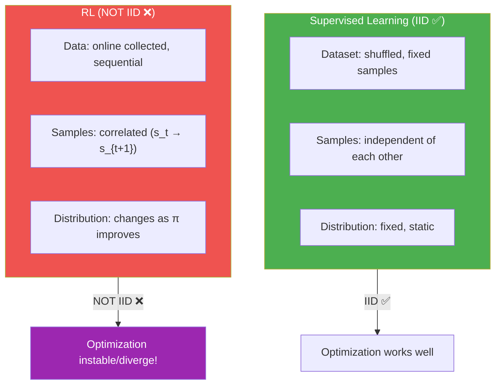

**Data correlated with time:**
> Imagine trajectory တစ်ခုထဲက cart y-position ကို x-axis = time, y-axis = state variable ဖြင့် plot ပြုလုပ်ပါ။ Adjacent time steps ၌ data points တဿ similar ဖြစ်နိုင်မည်ကို မြင်ရပါမည် — function approximator ကို ဒီ local region ဆီ overfit ဖြစ်စေနိုင်ပါတယ်!

> 💡 **ဒီ problems ၂ ခုကို Chapter 9 မှာ ဖြေရှင်းပါမည်:**
> - **Experience Replay** → Data correlation ကို ဖြေရှင်း (IID violation)
> - **Target Network** → Non-stationary targets ကို ဖြေရှင်း
> ဒီ ၂ ခုကို ပေါင်းစပ်ပြီး **DQN (Deep Q-Network)** ဆိုတဲ့ algorithm ဖြစ်လာပါမည်!

---

## ၈.၉ — Key Equations Summary

| Equation | Formula |
|---|---|
| **Q-function approximation** | $Q(s, a; \theta) \approx q^*(s, a)$ |
| **Ideal objective** | $\mathcal{L}(\theta) = \mathbb{E}\left[ (q^*(s,a) - Q(s,a;\theta))^2 \right]$ |
| **TD target (off-policy)** | $y_t = R_{t+1} + \gamma \max_{a'} Q(S_{t+1}, a'; \theta)$ |
| **MSE Loss** | $\mathcal{L}(\theta) = \frac{1}{N}\sum_i (Q(s_i,a_i;\theta) - y_i)^2$ |
| **Gradient update** | $\theta \leftarrow \theta - \alpha \nabla_\theta \mathcal{L}(\theta)$ |
| **Atari state space** | $(255^3)^{210 \times 160}$ (242,580-digit number) |
| **Go states** | $10^{170}$ |
| **Observable universe atoms** | $10^{78}$ to $10^{82}$ |

---

## ၈.၁၀ — နိဂုံးချုပ် (Summary)

ဒီ chapter မှာ sampled feedback သည် sequential နှင့် evaluative feedback တို့နှင့် interact ဖြစ်ပုံကို high-level overview ပေးပြီး simple deep RL agent (FCQ neural network ဖြင့် Q-function approximate) ကို introduce လုပ်ခဲ့ပါတယ်။

**သင်ယူခဲ့သည်များ:**

1. **Sampled feedback** — deep RL ၏ third dimension; exhaustive sampling impossible ဖြစ်ခြင်း
2. **High-dimensional vs Continuous** — state space complexity ၏ ၂ dimensions
3. **Function approximation** — generalization ဖြင့် unseen states ကိုလည်း handle; value function relationships discover
4. **NFQ algorithm** — first value-based DRL method; batch + fitting approach
5. **7 Decision points** — value function, architecture, objective, targets, exploration, loss, optimizer ရွေးချယ်ပုံ
6. **IID violation** — online data is correlated and non-identically distributed
7. **Non-stationary targets** — targets change as network updates
8. **Terminal state handling** — time limits vs real failures ကို distinguish ပြုလုပ်ရမည်

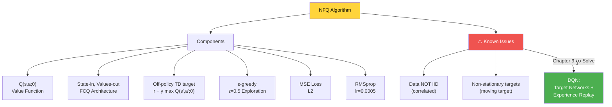

**ဒီ chapter ပြီးနောက်:**
- ✅ Sequential, evaluative, and sampled feedback ကနေ learn တတ်သော agent ဖန်တီးနိုင်
- ✅ Continuous state-space RL problems solve နိုင်
- ✅ Value-based DRL methods ၏ components နှင့် issues နားလည်နိုင်

> 💡 **Chapter 9 Preview:** NFQ သည် DRL ၏ foundation ပေမယ့် sample efficiency နည်းပြီး stability issues ရှိပါတယ်။ Chapter 9 မှာ DQN (<ins>Deep Q-Network</ins>) ဖြင့် ဒီ issues တဿကို address ပြုလုပ်ပါမည် — **experience replay** ဖြင့် IID violation ကို ဖြေရှင်းပြီး **target network** ဖြင့် non-stationary target problem ကို ဖြေရှင်းမည်ဖြစ်ပါတယ်!
