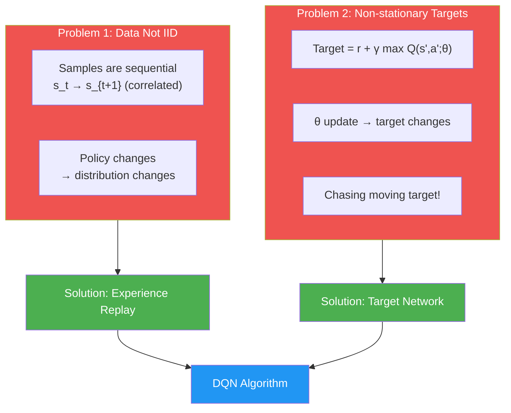
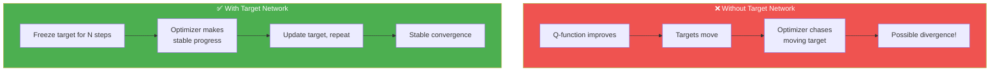
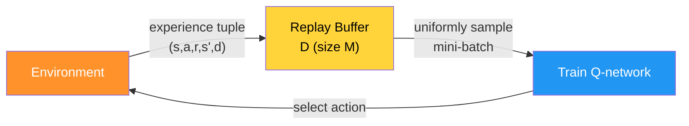
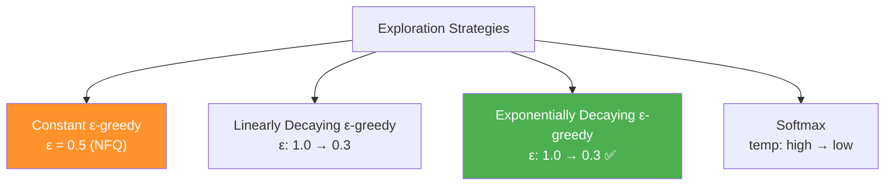
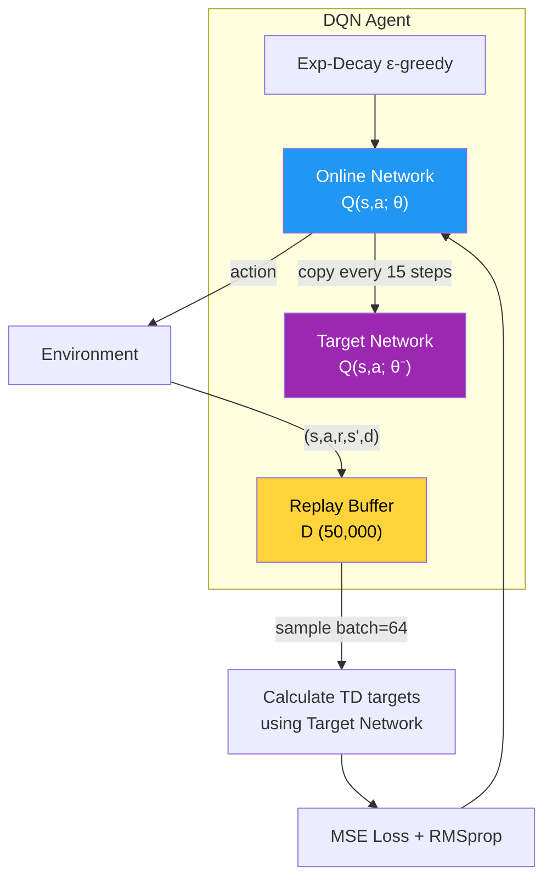
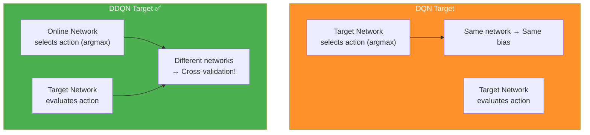
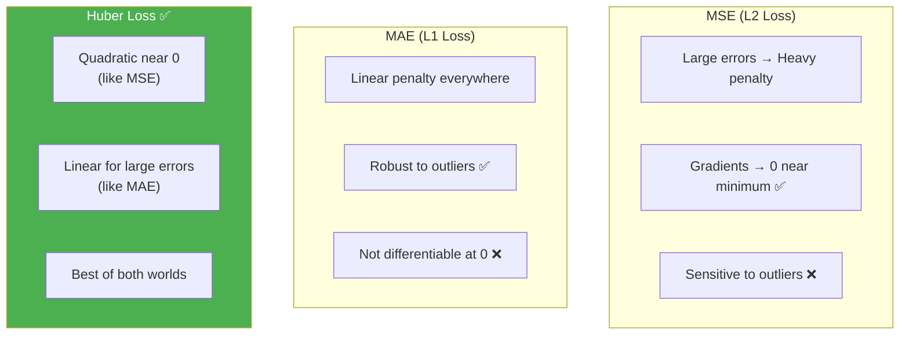
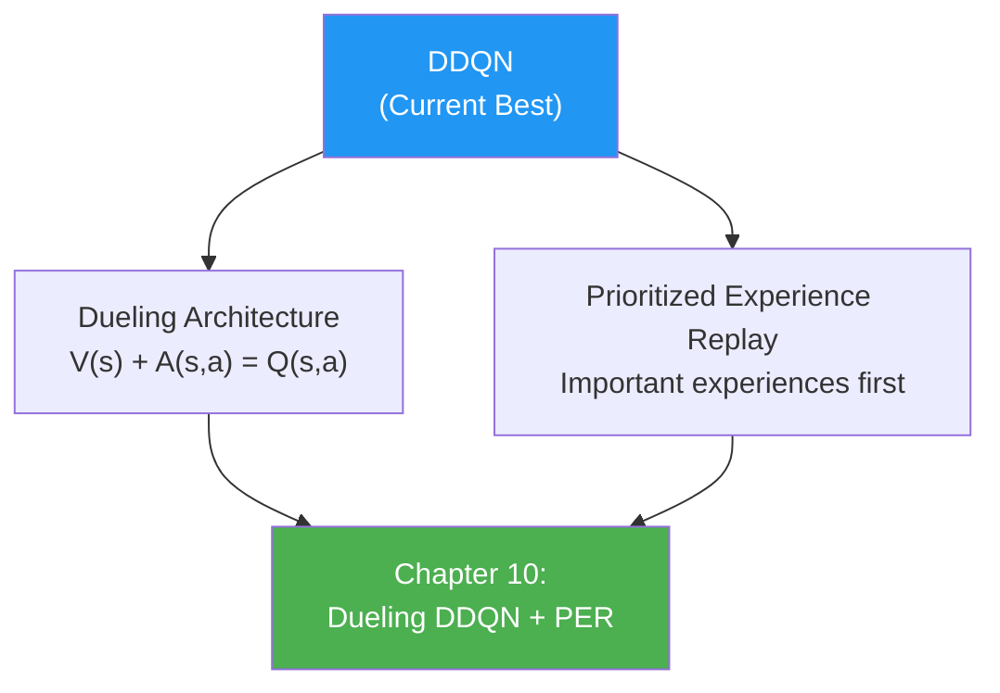
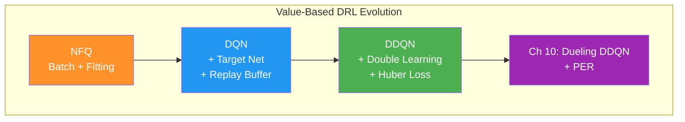

# Chapter 9: More Stable Value-Based Methods - အကျဉ်းချုပ်

## 1. Chapter ရဲ့ ရည်ရွယ်ချက်

Chapter 8 မှာ NFQ ဖြင့် deep RL ကို introduce လုပ်ခဲ့ပြီး IID violation နှင့် non-stationary targets ပြဿနာတွေ ရှိခဲ့ပါတယ်။ ဒီ Chapter မှာ **DQN** (**Deep Q-Network**) နဲ့ **Double DQN (DDQN)** algorithms ဖြင့် ပိုမို stable ဖြစ်အောင်ဖြေရှင်းပါတယ်။


အဓိက အကြောင်းအရာများ:
1. **Target networks** — targets ကို stabilize လုပ်ခြင်း
2. **Experience replay** — data ကို IID ပုံစံ ဖန်တီးခြင်း
3. **Larger networks** — state aliasing လျှော့ချခြင်း
4. **Double DQN** — overestimation bias ကို ဖြေရှင်းခြင်း
5. **Huber loss** — MSE ထက် robust loss function
6. **Exploration strategies** — linear decay, exponential decay, softmax

---

## 2. DQN: RL ကို Supervised Learning ပုံစံ ပြောင်းလဲခြင်း

### Problems ၂ ခု (အဓိကပြဿနာ)



| Issue | Supervised Learning | Reinforcement Learning |
|---|---|---|
| **Data** | Shuffled dataset, IID | Sequential, correlated |
| **Distribution** | Fixed | Changes as π improves |
| **Targets** | Fixed labels | Move with every θ update |
| **Training** | Stable convergence | Can diverge |

---

## 3. Target Network

### Concept

Target network ဆိုတာ online network ရဲ့ **freeze** လုပ်ထားတဲ့ copy တစ်ခုဖြစ်ပြီး target values ကို calculate ဖို့ သုံးပါတယ်။



### Implementation

```python
# Target network ကို online network ရဲ့ weights ဖြင့် update
def update_network(self):
    for target, online in zip(
        self.target_model.parameters(),
        self.online_model.parameters()):
        target.data.copy_(online.data)  # copy online → target
```

### Update Frequency

| Environment | Update Frequency |
|---|---|
| **Cart-Pole** (simple) | Every 10-20 steps |
| **Atari** (image-based) | Every 10,000 steps |

> 💡 Target network ကို freeze လုပ်ခြင်းဖြင့် supervised learning ရဲ့ fixed targets ပုံစံ simulate ဖန်တီးပါတယ်။ Stability ကောင်းပေမယ့် learning speed နှေးနိုင်ပါတယ်။

---

## 4. Experience Replay

### Replay Buffer Concept

Agent ရဲ့ experiences တွေကို buffer ထဲသိမ်းပြီး uniformly at random sample လုပ်ပါတယ်:

$$D = \{e_1, e_2, \ldots, e_M\}, \quad e_t = (S_t, A_t, R_{t+1}, S_{t+1}, D_{t+1})$$



### Benefits
1. **Data looks IID** — multiple trajectories/policies ကနေ random sample ရတာကြောင့် independent ပုံ ပေါ်
2. **Reduced variance** — diverse mini-batches ဖြင့် update
3. **Sample reuse** — experience sample တစ်ခုကို multiple times train ဖို့ သုံးနိုင်
4. **More stable targets** — large buffer ဖြင့် targets slowly change

### Implementation

```python
class ReplayBuffer():
    def __init__(self, m_size=50000, batch_size=64):
        self.ss_mem = np.empty(shape=(m_size), dtype=np.ndarray)
        self.as_mem = np.empty(shape=(m_size), dtype=np.ndarray)
        self.rs_mem = np.empty(shape=(m_size), dtype=np.ndarray)
        self.ps_mem = np.empty(shape=(m_size), dtype=np.ndarray)
        self.ds_mem = np.empty(shape=(m_size), dtype=np.ndarray)
        self.m_size, self.batch_size = m_size, batch_size
        self._idx, self.size = 0, 0
    
    def store(self, sample):
        s, a, r, p, d = sample
        self.ss_mem[self._idx] = s
        self.as_mem[self._idx] = a
        self.rs_mem[self._idx] = r
        self.ps_mem[self._idx] = p
        self.ds_mem[self._idx] = d
        self._idx = (self._idx + 1) % self.m_size  # circular buffer
        self.size = min(self.size + 1, self.m_size)
    
    def sample(self, batch_size=None):
        if batch_size is None:
            batch_size = self.batch_size
        idxs = np.random.choice(self.size, batch_size, replace=False)
        return (np.vstack(self.ss_mem[idxs]),
                np.vstack(self.as_mem[idxs]),
                np.vstack(self.rs_mem[idxs]),
                np.vstack(self.ps_mem[idxs]),
                np.vstack(self.ds_mem[idxs]))
```

| Buffer Parameter | Value |
|---|---|
| **Min samples** | 320 |
| **Max capacity** | 50,000 |
| **Batch size** | 64 |

> 💡 Experience replay ကို 1992 ခုနှစ်ကတည်းက Long-Ji Lin က introduce လုပ်ခဲ့ပါတယ်! DQN (2013/2015) က ဒီ technique ကို deep RL မှာ effectively အသုံးချပြခဲ့ပါတယ်။

---

## 5. Exploration Strategies

### Strategy Comparison



### Linearly Decaying ε-greedy

$$\epsilon_t = (\epsilon_{\text{init}} - \epsilon_{\text{min}}) \cdot \left(1 - \frac{t}{t_{\max}}\right) + \epsilon_{\text{min}}$$

### Exponentially Decaying ε-greedy (DQN Default)

$$\epsilon_t = \max(\epsilon_{\text{min}}, \; \lambda \cdot \epsilon_{t-1})$$

- $\lambda$ = decay rate
- $\epsilon_{\text{init}}$ = 1.0, $\epsilon_{\text{min}}$ = 0.3
- Roughly 20,000 steps ဖြင့် decay

### Softmax Strategy

$$P(a_i \mid s) = \frac{e^{Q(s, a_i) / \tau}}{\sum_j e^{Q(s, a_j) / \tau}}$$

- $\tau$ → 0: greedy ပိုဖြစ်
- $\tau$ = 1: value differences အတိုင်း
- $\tau$ → ∞: uniform random

```python
# Softmax select_action
scaled_qs = q_values / temp
norm_qs = scaled_qs - scaled_qs.max()  # overflow prevention
e = np.exp(norm_qs)
probs = e / np.sum(e)
action = np.random.choice(np.arange(len(probs)), size=1, p=probs)[0]
```

> 💡 DQN နှင့် DDQN experiments မှာ **exponentially decaying ε-greedy** ကို default သုံးပါတယ်။ Exploration strategy ရဲ့ hyperparameters က performance ကို significant သက်ရောက်မှု ရှိပါတယ်။

---

## 6. Full DQN Algorithm

### DQN Architecture Summary



### DQN Hyperparameters

| Parameter | Value |
|---|---|
| Architecture | State-in Values-out (4, 512, 128, 2) |
| Objective | Approximate $q^*(s,a)$ |
| Target | Off-policy TD: $r + \gamma \max_{a'} Q(s', a'; \theta^-)$ |
| Exploration | Exp-decay ε-greedy (1.0 → 0.3, ~20k steps) |
| Loss | MSE |
| Optimizer | RMSprop (lr = 0.0005) |
| Buffer | min=320, max=50,000, batch=64 |
| Target update | Every 15 time steps |

### DQN Steps

1. **Collect**: experience $(S_t, A_t, R_{t+1}, S_{t+1}, D_{t+1})$ → insert into replay buffer
2. **Sample**: mini-batch from buffer → calculate TD targets using **target network**
3. **Fit**: optimize online Q-network with MSE + RMSprop

### DQN vs NFQ Results

| Metric | NFQ | DQN |
|---|---|---|
| **Episodes to solve** | ~2,500 | ~250 |
| **Experience tuples** | ~250,000 | ~50,000 |
| **Sample efficiency** | Low | **10× better** |
| **Stability** | Noisy | More stable |
| **Wall-clock time** | ~5 min | ~5 min |

> 💡 DQN က NFQ ထက် **10 ဆ** sample efficient ဖြစ်ပါတယ်! Target network + experience replay ရဲ့ combined effect ကြောင့်ဖြစ်ပါတယ်။

---

## 7. Double DQN (DDQN)

### Overestimation Problem

Q-learning ရဲ့ max operator က estimated values ထဲက highest ကို ယူတာကြောင့် **positive bias** ရှိပါတယ်:

$$\max_{a'} Q(s', a'; \theta) \geq Q(s', a^*; \theta)$$

အဓိက ပြဿနာ:
- Estimated values အားလုံး imperfect (အချို့ higher, အချို့ lower)
- `max` ကို ယူတာက **always higher values ကို prefer** → positive bias
- ဒါက overoptimistic value estimates ဖြစ်စေ → performance ကျ

### Unwrapping the Max Operator

$$\max_{a'} Q(s', a') = Q\big(s', \arg\max_{a'} Q(s', a')\big)$$

ဒါဆိုရင် questions ၂ ခု ဖြစ်တယ်:
1. **Action selection**: $\arg\max_{a'} Q(s', a')$ — ဘယ် action က best?
2. **Action evaluation**: $Q(s', a^*)$ — ဒီ action ရဲ့ value ဘယ်လောက်?

### DQN vs DDQN Target



### DDQN Target Formula

**DQN target:**
$$y_t^{\text{DQN}} = R_{t+1} + \gamma Q\big(S_{t+1}, \arg\max_{a'} Q(S_{t+1}, a'; \theta^-); \theta^-\big)$$

**DDQN target:**
$$y_t^{\text{DDQN}} = R_{t+1} + \gamma Q\Big(S_{t+1}, \underbrace{\arg\max_{a'} Q(S_{t+1}, a'; \theta)}_{\text{online selects}}\;;\; \underbrace{\theta^-}_{\text{target evaluates}}\Big)$$

### DDQN Implementation

```python
def optimize_model(self, experiences):
    states, actions, rewards, next_states, is_terminals = experiences
    batch_size = len(is_terminals)
    
    # DDQN: online network selects action
    argmax_a_q_sp = self.online_model(next_states).max(1)[1]
    
    # Target network evaluates that action
    q_sp = self.target_model(next_states).detach()
    max_a_q_sp = q_sp[np.arange(batch_size), argmax_a_q_sp]
    max_a_q_sp = max_a_q_sp.unsqueeze(1)
    max_a_q_sp *= (1 - is_terminals)
    
    # TD target
    target_q_sa = rewards + (self.gamma * max_a_q_sp)
    
    # Current estimates (gradients flow through here)
    q_sa = self.online_model(states).gather(1, actions)
    
    # Loss and optimization
    td_error = q_sa - target_q_sa
    value_loss = td_error.pow(2).mul(0.5).mean()
    self.value_optimizer.zero_grad()
    value_loss.backward()
    self.value_optimizer.step()
```

> ⚠️ DQN target network ထဲမှာ action selection နဲ့ evaluation **same network** → same bias direction. DDQN မှာ **online** selects, **target** evaluates → cross-validation effect!

---

## 8. Huber Loss — More Forgiving Loss Function

### MSE vs MAE vs Huber



### Huber Loss Formula

$$L_\delta(\theta) = \begin{cases} \frac{1}{2}(Q(s,a;\theta) - y)^2 & \text{if } |Q(s,a;\theta) - y| \leq \delta \\ \delta \cdot |Q(s,a;\theta) - y| - \frac{1}{2}\delta^2 & \text{otherwise} \end{cases}$$

- $\delta = 0$: MAE ဖြစ်
- $\delta \to \infty$: MSE ဖြစ်
- Typical $\delta = 1$

### Gradient Clipping Implementation

```python
def optimize_model(self, experiences):
    # ... calculate targets using double learning ...
    td_error = q_sa - target_q_sa
    value_loss = td_error.pow(2).mul(0.5).mean()  # MSE
    
    self.value_optimizer.zero_grad()
    value_loss.backward()
    
    # Gradient clipping (Huber loss equivalent)
    torch.nn.utils.clip_grad_norm_(
        self.online_model.parameters(),
        self.max_gradient_norm)  # float('inf') → effectively MSE
    
    self.value_optimizer.step()
```

| Loss Function | Small Errors | Large Errors | RL Suitability |
|---|---|---|---|
| **MSE (L2)** | Quadratic | Quadratic (heavy) | ⚠️ Penalizes early mistakes harshly |
| **MAE (L1)** | Linear | Linear | ⚠️ Not differentiable at 0 |
| **Huber** | Quadratic | Linear | ✅ **Best for RL** |

> 💡 RL မှာ targets ကိုယ်တိုင် inaccurate ဖြစ်တာကြောင့် large errors ကို MSE လို heavily penalize လုပ်ခြင်းက အဓိပ္ပာယ်မရှိပါ။ Huber loss က **outlier-robust** ဖြစ်ပါတယ်။

---

## 9. DDQN Full Algorithm

### DDQN Hyperparameters

| Parameter | DQN | DDQN |
|---|---|---|
| Architecture | 4, 512, 128, 2 | 4, 512, 128, 2 |
| Learning rate | 0.0005 | **0.0007** |
| Exploration | Exp-decay ε-greedy | Exp-decay ε-greedy |
| Buffer | 320 min, 50k max, batch 64 | 320 min, 50k max, batch 64 |
| Target update | Every 15 steps | Every 15 steps |
| Loss | MSE | **Huber (grad clip)** |
| Double learning | ❌ | ✅ |

### DDQN vs DQN Results

| Metric | DQN | DDQN |
|---|---|---|
| **Performance** | Similar episodes | Similar episodes |
| **Stability** | Wider bounds | **Narrower bounds** |
| **Consistency across seeds** | Variable | **More consistent** |
| **Learning rate tolerance** | lr=0.0005 only | lr=0.0007 works |

> 💡 Cart-Pole environment တွင် mean performance ကတူနီးပါးဖြစ်ပေမယ့် DDQN က **all seeds** မှာ consistent ဖြစ်ပါတယ်။ Complex environments (Atari) မှာ DDQN significantly ပိုကောင်းပါတယ်။

---

## 10. Things We Can Still Improve (Preview of Ch 10)



1. **Dueling Architecture**: Q-function ကို V(s) နဲ့ A(s,a) ခွဲပြီး learn → data efficiency ပိုကောင်း
2. **Prioritized Experience Replay (PER)**: Uniform random sampling အစား TD error ကြီးတဲ့ experiences ကို priority ပေးပြီး sample

---

## 11. Key Equations Summary

| Equation | Formula |
|---|---|
| **DQN target** | $y_t = R_{t+1} + \gamma \max_{a'} Q(S_{t+1}, a'; \theta^-)$ |
| **DDQN target** | $y_t = R_{t+1} + \gamma Q(S_{t+1}, \arg\max_{a'} Q(S_{t+1}, a'; \theta); \theta^-)$ |
| **MSE Loss** | $\mathcal{L} = \frac{1}{N}\sum_i (Q(s_i,a_i;\theta) - y_i)^2$ |
| **Huber Loss** | Quadratic if $|\text{error}| \leq \delta$, Linear otherwise |
| **Exp ε-decay** | $\epsilon_t = \max(\epsilon_{\min}, \lambda \cdot \epsilon_{t-1})$ |
| **Softmax** | $P(a_i|s) = \frac{e^{Q(s,a_i)/\tau}}{\sum_j e^{Q(s,a_j)/\tau}}$ |
| **Target update** | $\theta^- \leftarrow \theta$ (every $N$ steps) |

---

## 12. နိဂုံးချုပ် (Conclusion)

ဒီ Chapter မှာ သင်ယူခဲ့တဲ့ အဓိက takeaways:

1. **Target networks** — targets ကို temporarily freeze ဖြင့် stability ရရှိ
2. **Experience replay** — online data ကို IID ပုံစံ ပြောင်းပြီး diverse mini-batch ဖြင့် train
3. **Larger networks** — state aliasing reduce, subtle differences detect
4. **DQN** — target network + replay buffer ဖြင့် NFQ ထက် 10× sample efficient
5. **Double DQN** — online network (select) + target network (evaluate) ဖြင့် overestimation bias ဖြေရှင်း
6. **Huber loss** — MSE+MAE hybrid, RL ရဲ့ early-stage large errors ကို robust
7. **Exploration strategies** — constant, linear decay, exponential decay, softmax options



> 💡 DQN/DDQN ဟာ Atari benchmarks မှာ **superhuman performance** ရရှိခဲ့ပါတယ်။ ဒီ chapter ရဲ့ techniques တွေသည် modern value-based DRL ရဲ့ foundation ဖြစ်ပါတယ်။
