# အခန်း ၉ — ပိုတည်ငြိမ်သော Value-based Methods (More Stable Value-Based Methods)

> *"သင့်ခြေလှမ်းသည် နှေးပြီး မြဲမြံပါစေ — မမိုက်နိုင်ဖို့ဖြင်သော်"*
> — Tokugawa Ieyasu
> (Tokugawa shogunate ၏ founder ၊ Japan ကို ပြည်ထောင်ကြီး ၃ ဦး ထဲမှ တဦး)

## ဒီအခန်းမှာ သင်ယူရမည့်အချက်များ

- ယခင် chapter မှ methods များကို ပိုတည်ငြိမ်အောင် ဆောင်ရွက်မည် (divergence ဖြစ်ခြင်းကို လျော့ချ)
- Advanced value-based deep RL methods နှင့် value-based methods ကို ပိုကောင်းစေသော components များကို explore ပြုလုပ်မည်
- Cart-pole environment ကို ယခင်ထက် samples နည်းနည်းနှင့် ပိုသေချာပြီး consistent results ဖြင့် solve လုပ်မည်

---

## ၉.၁ — Chapter 8 ကနေ ဒီနေ့ — ဘာတွေ ဖြစ်ပျက်နေသလဲ

Chapter 8 တွင် value-based deep RL ကို introduce ပြုလုပ်ပြီး **NFQ (Neural Fitted Q-Iteration)** algorithm ကို develop ပြုလုပ်ခဲ့ပါတယ်။ NFQ သည် **IID assumption violation** နှင့် **non-stationary targets** တို့ ဖြစ်သော ၂ ကြီးကျပ်ဆုံးသော problems ကို batching ဖြင့် address ပြုလုပ်ပြီး ကောင်းတဲ့ results ပြသနိုင်ခဲ့ပါတယ်—ဒါပေမယ့် **ပိုကောင်းပါသေးတယ်**!

ဒီ chapter မှာ ဒီ problems ကို fundamental ပိုကောင်းသော techniques ဖြင့် address:
1. **Experience Replay** — IID violation ဖြေရှင်း
2. **Target Networks** — Non-stationary targets ဖြေရှင်း
3. **Double Learning** — Overestimation bias ဖြေရှင်း

ဒီ ၃ ခုကို ပေါင်းစပ်ပြီး **DQN (Deep Q-Network)** နှင့် **DDQN (Double DQN)** ဖန်တီးမည်ဖြစ်ပါတယ်!

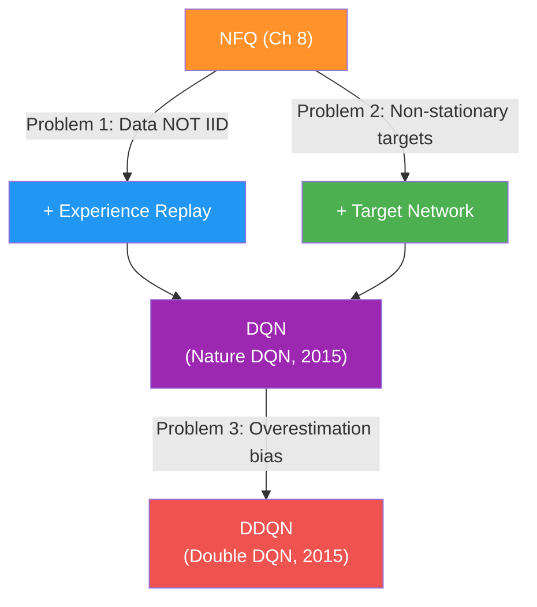

---

## ၉.၂ — Value-based Deep RL ၏ Common Problems (ပြန်သုံးသပ်ခြင်း)

DQN ကို နားလည်ဖို့ ဦးစွာ problems ၂ ခုကို ပြန်ကြည့်ရပါမည်:

### ၉.၂.၁ — Problem 1: Data သည် IID မဟုတ်ပါ

Supervised learning မှာ dataset ကို advance ဆင်ထားပြီး shuffle ပြုလုပ်ပါတယ်:

```
Supervised Learning Dataset:
[sample_5, sample_2, sample_8, sample_1, ...] ← shuffled, IID ✅
```

RL မှာ data ကို **online** collect ပြုလုပ်ပါတယ် — sequential trajectory တစ်ခုမှ ဆက်တိုက်ဖြစ်ပါတယ်:

```
RL online data:
[(s_1, a_1, r_2, s_2), (s_2, a_2, r_3, s_3), ...] ← correlated, NOT IID ❌
```

**IID violation ၏ ၂ ကျပ်ဆုံး ကိစ္စ:**

1. **Not Independent:** $s_{t+1}$ ၏ outcome သည် $s_t$ ပေါ် depend ပါတယ် → samples correlated
2. **Not Identically Distributed:** Policy improving ဖြစ်နေတဲ့အတွက် data distribution ပြောင်းနေပါတယ် → distribution shift

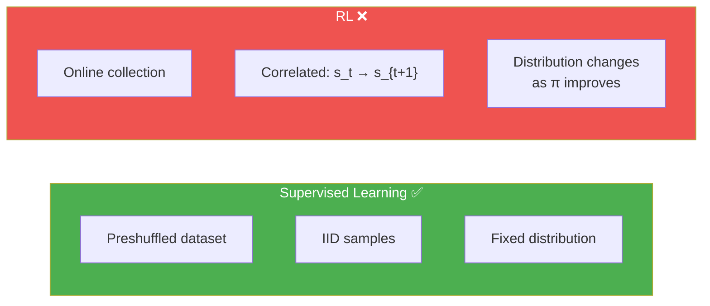

### ၉.၂.၂ — Problem 2: Non-stationary Targets

Supervised learning မှာ labels များသည် **constants** ဖြစ်ပါတယ် — training အတောပတ်လုံး fixed ဖြစ်ပါတယ်:

$$\text{SL Target: } y_i \text{ (label)} = \text{constant — FIXED throughout training}$$

RL TD target မှာ:

$$y_t = R_{t+1} + \gamma \max_{a'} Q(S_{t+1}, a'; \theta)$$

$\theta$ update ဖြစ်ပါတယ် → $Q(S_{t+1}, a'; \theta)$ ပြောင်းပါတယ် → target $y_t$ ပြောင်းပါတယ် → **moving target!**

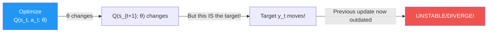

NFQ သည် batching ဖြင့် ဒီ problems ကို somewhat address ပြုလုပ်ပြီး — ဒါပေမယ့် DQN ကတော့ **fundamentally better** ဖြင့် approach ပြုလုပ်ပါတယ်:

> **DQN ၏ ဒဿနသဘော:** "Reinforcement learning ကို supervised learning ဆင်တူလောက်အောင် ဘယ်လို လုပ်မလဲ?"

---

## ၉.၃ — DQN: RL ကို Supervised Learning ဆင်တူလာစေခြင်း

### ၉.၃.၁ — Target Networks ဖြင့် Targets ကို တည်ငြိမ်အောင်ပြုလုပ်ခြင်း

**Idea:** Target values ကို compute ပြုလုပ်ဖို့ **ခွဲပြားသော network** တစ်ခုကို fix ပြုလုပ်ကာ multiple steps ကို သုံးပါမည်!

> **Target Network** = Online network ၏ previous version ဖြစ်ပြီး weights ကို periodically freeze ပြုလုပ်ပြီး targets calculate ရာတွင် သုံးပါတယ်

#### Target Network မပါဘဲ (Non-stationary issue):
```
Step 1: θ optimize → Q changes → target Q(s') changes → update invalid!
Step 2: θ optimize → Q changes → target Q(s') changes → update invalid!
... → spiraling instability!
```

#### Target Network ပါသော (Stable):
```
Step 1-15: θ (online) optimize → targets Q(s'; θ_target) fixed → STABLE! ✅
Step 16: θ_target ← θ (copy weights), restart freeze
Step 17-31: θ optimize again → targets stable again ✅
...
```

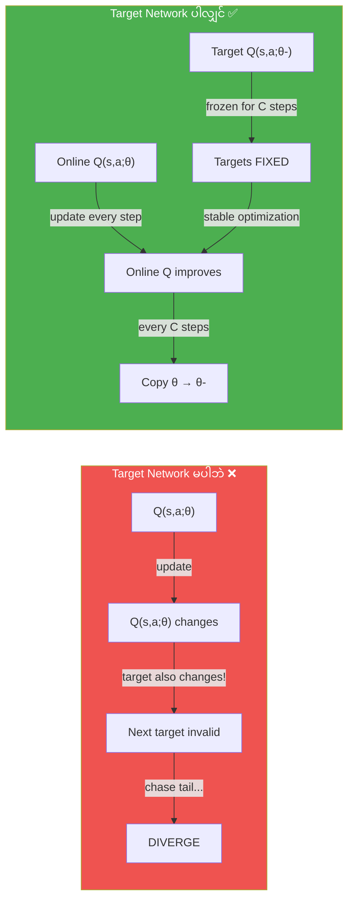

**Target Network ၏ Gradient Update:**

$$\theta \leftarrow \theta + \alpha \nabla_\theta \sum_{(s,a,r,s') \sim U(D)} \left[ \left( r + \gamma \max_{a'} Q(s', a'; \theta^-) - Q(s, a; \theta) \right)^2 \right]$$

- $\theta$ = online network weights (update ဖြစ်တဲ့ weights)
- $\theta^-$ = target network weights (freeze ဖြစ်ပြီး periodically update)
- **ကွာခြားမှု:** Gradient calculation တွင် target computation မှာ older, frozen weights $\theta^-$ ကို သုံးပါတယ်

> ⚠️ **Terms:** Online network = Q(s,a;θ), Target network = Q(s,a;θ-). Single architecture, 2 different weight instances သာ ဖြစ်ပါတယ်

**Target network frequency hyperparameter:**
| Environment | Update frequency |
|---|---|
| Cart-pole (simple) | 10–20 steps |
| Atari (CNN) | 10,000 steps |

Target Networks ၏ **trade-off:**
- **Stability ↑** — frozen targets → optimization converge ပိုရလွယ်
- **Speed ↓** — outdated values ပေါ်မှာ train နေရတဲ့အတွက် learning slower

---

### ၉.၃.၂ — Experience Replay ဖြင့် Data ကို IID ဖြစ်အောင်ပြုလုပ်ခြင်း

**Idea:** Past experiences တွေကို **replay buffer** (memory) ထဲသို့ store ပြုလုပ်ပြီး random mini-batches sample ပြုလုပ်မည်!

**0001 A Bit of History — Experience Replay ၏ မွေးဖွားပုံ:**
Experience replay ကို **Long-Ji Lin** က 1992 ခုနှစ်တွင် "Self-Improving Reactive Agents Based On Reinforcement Learning, Planning and Teaching" paper တွင် introduce ပြုလုပ်ခဲ့ပါတယ်! ဟုတ်ပါတယ် — **1992** — neural networks ကို "connectionism" ဟုသာ ခေါ်နေကြသောကာလ! Dr. Lin က CMU မှ PhD ယူပြီးနောက် companies များတွင် technical roles အများကြိုးပါးလုပ်ဆောင်ပြီး မကြာမီ Signifyd ၏ Chief Scientist ဖြစ်ပါတယ်—online fraud ကို predict/prevent ပြုလုပ်သော team ကို ဦးဆောင်ပါတယ်!

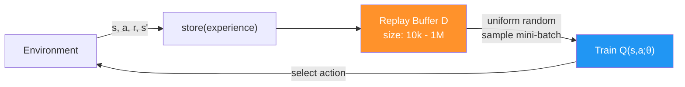

**Experience Replay ၏ Benefits:**

1. **Data IID ဖြစ်လာပြုမူ** — Multiple trajectories နှင့် policies မှ sample ပြုလုပ်ခြင်းကြောင့် independent ဖြစ်ပုံပေါ်
2. **More diverse mini-batches** — ΝFQ မှ single trajectory 1,024 samples မဟုတ်တော့ဘဲ diverse past experiences
3. **One-step + larger effective dataset** — Every step ၌ train ပြုလုပ်နိုင်ပြီး large history ကို leverage ပြုလုပ်
4. **Slower-moving targets** — Large buffer မှ uniformly sample ပြုလုပ်ခြင်း → targets slowly change

**Replay Buffer Design:**

| Parameter | Cart-pole | Atari |
|---|---|---|
| **Buffer size** | 50,000 | 1,000,000 |
| **Min samples (warmup)** | 320 | 50,000 |
| **Batch size** | 64 | 32 |
| **Eviction policy** | FIFO (oldest out) | FIFO |

**Formal notation:**

$$D = \{e_1, e_2, \ldots, e_M\}, \quad e_t = (S_t, A_t, R_{t+1}, S_{t+1})$$

Training: Sample uniformly $e_i \sim U(D)$ → IID data ဆင်တူ!

---

### Python Code — Replay Buffer

```python
import numpy as np

class ReplayBuffer():
    def __init__(self, 
                 m_size=50000,     # Maximum buffer size (50k for cart-pole)
                 batch_size=64):   # Training mini-batch size
        
        # Initialize storage arrays for each component
        self.ss_mem = np.empty(shape=(m_size), dtype=np.ndarray)  # states
        self.as_mem = np.empty(shape=(m_size), dtype=np.ndarray)  # actions
        self.rs_mem = np.empty(shape=(m_size), dtype=np.ndarray)  # rewards
        self.ps_mem = np.empty(shape=(m_size), dtype=np.ndarray)  # next states
        self.ds_mem = np.empty(shape=(m_size), dtype=np.ndarray)  # done flags
        
        self.m_size = m_size
        self.batch_size = batch_size
        self._idx = 0    # Next insertion index (circular)
        self.size = 0    # Current number of experiences stored
    
    def store(self, sample):
        """Experience tuple တစ်ခုကို buffer ထဲသို့ store ပြုလုပ်ခြင်း"""
        s, a, r, p, d = sample
        self.ss_mem[self._idx] = s
        self.as_mem[self._idx] = a
        self.rs_mem[self._idx] = r
        self.ps_mem[self._idx] = p
        self.ds_mem[self._idx] = d
        
        # Circular index — buffer full ဖြစ်ရင် oldest experience ကို overwrite
        self._idx += 1
        self._idx = self._idx % self.m_size   # wrap around (FIFO eviction)
        
        # Size grows until max, then stays at max
        self.size += 1
        self.size = min(self.size, self.m_size)
    
    def sample(self, batch_size=None):
        """Buffer မှ random mini-batch sample ပြုလုပ်ခြင်း"""
        if batch_size is None:
            batch_size = self.batch_size
        
        # Uniform random sampling — IID appearance!
        idxs = np.random.choice(self.size, batch_size, replace=False)
        
        # Extract and return experiences
        experiences = (
            np.vstack(self.ss_mem[idxs]),   # states batch
            np.vstack(self.as_mem[idxs]),   # actions batch
            np.vstack(self.rs_mem[idxs]),   # rewards batch
            np.vstack(self.ps_mem[idxs]),   # next_states batch
            np.vstack(self.ds_mem[idxs])    # done_flags batch
        )
        return experiences
    
    def __len__(self):
        return self.size
```

**Code ရှင်းလင်းချက်:**
1. `m_size=50000` — cart-pole အတွက် 50k experiences max store
2. `batch_size=64` — default sampling batch size 64
3. Arrays ၅ ခု (s, a, r, s', d) ကို numpy arrays ဖြင့် initialize
4. `store()` — experience ကို circular buffer ထဲ insert
5. `_idx % m_size` — buffer full ဖြစ်ပါက oldest experience ကို overwrite (FIFO)
6. `size = min(size, m_size)` — size ကို max ထိသာ grow ခွင့်ပြု
7. `sample()` — uniform random sampling → IID ဖြစ်ပုံပေါ်
8. `np.vstack` — batch format ဖြစ်အောင် vertically stack

> 💡 **High-dimensional environments (Atari) ၌ warning:** Images ကို naively store ပြုလုပ်ရင် 1M × 4 frames × 84×84 = **28GB RAM** လိုပါတယ်! Efficient storage techniques (lazy frames, uint8) ကို သုံးဖို့ လိုပါတယ်!

---

### ၉.၃.၃ — DQN ၏ Full Algorithm

**DQN = NFQ + Experience Replay + Target Network**

**DQN ၏ Gradient Update (Nature DQN):**

$$\theta \leftarrow \theta + \alpha \left( r + \gamma \max_{a'} Q(s', a'; \theta^-) - Q(s, a; \theta) \right) \nabla_\theta Q(s, a; \theta)$$

where experiences $(s, a, r, s')$ are sampled uniformly from replay buffer $D$, and $\theta^-$ are the **frozen target network weights**.

**DQN Algorithm Steps:**

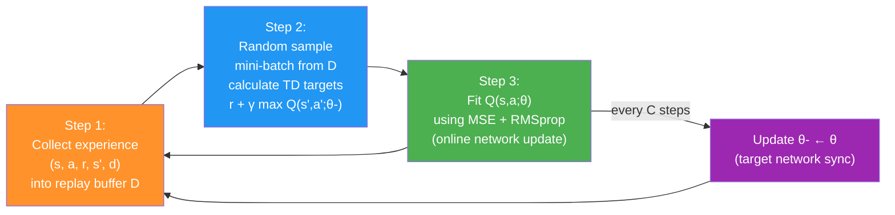

**DQN vs NFQ Comparison:**

| Component | NFQ | DQN |
|---|---|---|
| Network | Single network | Online + Target networks |
| Targets | Same network (non-stationary) | Frozen target network (stationary ↑) |
| Data | Mini-batch 1024 (correlated) | Replay buffer 50k (IID ↑) |
| Training | Batch then K=40 fits | Every step, 1 gradient update |
| Exploration | ε=0.5 constant | Exponentially decaying (1.0→0.3) |
| LR | 0.0005 | 0.0005 |

---

### Python Code — DQN (Online + Target Networks)

```python
class DQN:
    def __init__(self, env, value_model_fn, value_optimizer_fn,
                 value_optimizer_lr, training_strategy_fn,
                 evaluation_strategy_fn, n_warmup_batches,
                 update_target_every_steps, max_gradient_norm):
        
        self.env = env
        self.gamma = 0.99
        
        nS = env.observation_space.shape[0]
        nA = env.action_space.n
        
        # TWO networks: online (trains every step) + target (periodically updated)
        self.online_model = value_model_fn(nS, nA)
        self.target_model = value_model_fn(nS, nA)
        
        self.optimizer = value_optimizer_fn(
            self.online_model.parameters(), lr=value_optimizer_lr)
        
        self.training_strategy = training_strategy_fn()
        self.evaluation_strategy = evaluation_strategy_fn()
        
        self.n_warmup_batches = n_warmup_batches
        self.update_target_every_steps = update_target_every_steps
        self.max_gradient_norm = max_gradient_norm
    
    def optimize_model(self, experiences):
        states, actions, rewards, next_states, is_terminals = experiences
        
        # === Target calculation using FROZEN target network! ===
        q_sp = self.target_model(next_states).detach()  # target network ← KEY!
        max_a_q_sp = q_sp.max(1)[0].unsqueeze(1)
        max_a_q_sp *= (1 - is_terminals)
        target_q_sa = rewards + self.gamma * max_a_q_sp
        
        # === Current Q-values from ONLINE network (gradient flows here) ===
        q_sa = self.online_model(states).gather(1, actions)
        
        # === Loss: TD error squared (MSE) ===
        td_error = q_sa - target_q_sa
        value_loss = td_error.pow(2).mul(0.5).mean()
        
        # === Backpropagation through ONLINE network only ===
        self.optimizer.zero_grad()
        value_loss.backward()
        self.optimizer.step()
    
    def interaction_step(self, state, env):
        """Act using ONLINE network for exploration"""
        action = self.training_strategy.select_action(
            self.online_model, state)  # online network → action selection
        new_state, reward, is_terminal, _ = env.step(action)
        return new_state, is_terminal
    
    def update_network(self):
        """Target network ကို online network ၏ weights ဖြင့် update ပြုလုပ်ခြင်း"""
        for target, online in zip(
                self.target_model.parameters(),
                self.online_model.parameters()):
            target.data.copy_(online.data)  # θ- ← θ (full copy)
```

**Code ရှင်းလင်းချက်:**
1. **Online + Target**: `online_model` နှင့် `target_model` — same architecture, different weights
2. `target_model(next_states).detach()` — target network ကနေ Q(s') ရယူ → **frozen, no gradient**
3. `online_model(states)` — current Q(s,a) ← **gradient flows here** (online network update)
4. `td_error.pow(2).mul(0.5)` — MSE loss = $\frac{1}{2}(Q(s,a;\theta) - y)^2$
5. `interaction_step` — action selection ကို **online network** ဖြင့် ပြုလုပ် (latest policy)
6. `update_network()` — every C steps ၌ weights ကို hard copy ပြုလုပ် → `θ- ← θ`

---

### DQN ၏ History

**0001 A Bit of History:**
- **2013:** Volodymyr "Vlad" Mnih က "Playing Atari with Deep Reinforcement Learning" paper တွင် DQN **with experience replay** ကို introduce ပြုလုပ်
- **2015:** "Human-level control through deep reinforcement learning" paper တွင် DQN **with target networks** ကို add → **Nature DQN** (Full DQN version)
- Vlad သည် Geoffrey Hinton (deep learning ၏ founding fathers ထဲမှ တဦး) ကျောင်းသား
- Google DeepMind research scientist ဖြစ်ပြီး 2017 MIT Technology Review **35 Innovators Under 35** list တွင် ပါဝင်

**DQN ၏ Performance (Cart-pole):**
- **NFQ:** ~2,500 episodes နှင့် ~250,000 steps လိုပါတယ်
- **DQN:** ~250 episodes နှင့် ~50,000 steps သာ လိုပါတယ်
- → **10x sample efficiency improvement!**

---

## ၉.၄ — Exploration Strategies

DQN တွင် exploration strategies မှာ Chapter 4 မှ မိတ်ဆက်ထားသော strategies ကို neural networks ဖြင့် adapt ပြုလုပ်ပြီး use ပါတယ်:

### ၉.၄.၁ — Linearly Decaying ε-greedy

```python
class EGreedyLinearStrategy:
    """ε ကို linear curve ဖြင့် decay ပြုလုပ်ခြင်း"""
    
    def __init__(self, init_epsilon=1.0, min_epsilon=0.1, max_steps=20000):
        self.init_epsilon = init_epsilon
        self.min_epsilon = min_epsilon
        self.max_steps = max_steps
        self.epsilon = init_epsilon
        self.t = 0
    
    def _epsilon_update(self):
        # Linear decay formula
        self.epsilon = 1 - self.t / self.max_steps
        self.epsilon = (self.init_epsilon - self.min_epsilon) * \
                       self.epsilon + self.min_epsilon
        # Clip to valid range
        self.epsilon = np.clip(self.epsilon, 
                               self.min_epsilon, self.init_epsilon)
        self.t += 1
        return self.epsilon
    
    def select_action(self, model, state):
        self.exploratory_action = False
        
        with torch.no_grad():
            q_values = model(state).cpu().detach()
            q_values = q_values.data.numpy().squeeze()
        
        if np.random.rand() > self.epsilon:
            action = np.argmax(q_values)    # exploit
        else:
            action = np.random.randint(len(q_values))  # explore
        
        self._epsilon_update()
        self.exploratory_action = action != np.argmax(q_values)
        return action
```

**Code ရှင်းလင်းချက်:**
1. ε ကို `init_epsilon=1.0` မှ `min_epsilon=0.1` ထိ linear ဖြင့် decay
2. `t / max_steps` ratio ဖြင့် step by step τ decrease
3. `clip` ဖြင့် valid range ဖြစ်အောင် ensure
4. `exploratory_action` variable — logging ရည်ရွယ်ချက် (% of exploratory actions per episode)

### ₉.၄.၂ — Exponentially Decaying ε-greedy (DQN မှာ သုံးသော)

```python
class EGreedyExpStrategy:
    """ε ကို exponential curve ဖြင့် decay ပြုလုပ်ခြင်း"""
    
    def __init__(self, init_epsilon=1.0, min_epsilon=0.3, 
                 decay_rate=0.9995):
        self.init_epsilon = init_epsilon
        self.min_epsilon = min_epsilon
        self.decay_rate = decay_rate
        self.epsilon = init_epsilon
    
    def _epsilon_update(self):
        # Exponential decay: ε = max(min_ε, decay_rate × ε)
        self.epsilon = max(self.min_epsilon, 
                          self.decay_rate * self.epsilon)
        return self.epsilon
    
    def select_action(self, model, state):
        self.exploratory_action = False
        
        with torch.no_grad():
            q_values = model(state).cpu().detach()
            q_values = q_values.data.numpy().squeeze()
        
        if np.random.rand() > self.epsilon:
            action = np.argmax(q_values)
        else:
            action = np.random.randint(len(q_values))
        
        self._epsilon_update()
        self.exploratory_action = action != np.argmax(q_values)
        return action
```

**Code ရှင်းလင်းချက်:**
1. `decay_rate × ε` ဖြင့် exponential decrease (curve faster than linear)
2. `max(min_epsilon, ...)` — minimum floor ကို ensure
3. DQN မှာ: ε = 1.0 → 0.3 in ~20,000 steps

### ၉.၄.၃ — Softmax Exploration Strategy

```python
class SoftMaxStrategy:
    """Temperature parameter ဖြင့် softmax ကို action selection ၌ သုံးခြင်း"""
    
    def __init__(self, init_temp=1.0, min_temp=0.01, 
                 explore_ratio=0.8, max_steps=20000):
        self.init_temp = init_temp
        self.min_temp = min_temp
        self.explore_ratio = explore_ratio
        self.max_steps = max_steps
        self.t = 0
    
    def _update_temp(self):
        temp = 1 - self.t / (self.max_steps * self.explore_ratio)
        temp = (self.init_temp - self.min_temp) * temp + self.min_temp
        temp = np.clip(temp, self.min_temp, self.init_temp)
        self.t += 1
        return temp
    
    def select_action(self, model, state):
        temp = self._update_temp()  # Get current temperature
        
        with torch.no_grad():
            q_values = model(state).cpu().detach()
            q_values = q_values.data.numpy().squeeze()
            
            # Softmax with temperature scaling
            scaled_qs = q_values / temp      # scale by temperature
            norm_qs = scaled_qs - scaled_qs.max()  # subtract max (numerical stability)
            e = np.exp(norm_qs)
            probs = e / np.sum(e)            # normalize to probabilities
            assert np.isclose(probs.sum(), 1.0)
        
        # Sample action proportional to Q-values
        action = np.random.choice(np.arange(len(probs)), size=1, p=probs)[0]
        return action
```

**Code ရှင်းလင်းချက်:**
1. Temperature parameter `τ`:
   - `τ → 0`: Q-values ကြားခြားနားချက် magnify → more greedy
   - `τ = 1`: Original Q-values distribution → balanced
   - `τ → ∞`: All actions equal probability → full random
2. `q_values / temp` — temperature scaling
3. `norm_qs - max` — overflow prevent (numerical stability)
4. `np.exp(norm_qs) / sum(exp)` — softmax formula

$$P(a|s) = \frac{e^{Q(s,a)/\tau}}{\sum_{a'} e^{Q(s,a')/\tau}}$$

**NFQ vs DQN Exploration:**
| Method | Exploration Strategy | ε value |
|---|---|---|
| **NFQ** | Constant ε-greedy | ε = 0.5 (constant) |
| **DQN** | Exponentially decaying | ε: 1.0 → 0.3 (~20k steps) |

> 💡 **Effective greedy probability (Cart-pole, 2 actions):**
> - ε = 0.5 → Greedy probability = 75%, Exploratory = 25%
> - ε = 0.3 → Greedy probability = 85%, Exploratory = 15%
> - Large action space မှာ non-greedy action probability increases significantly!

---

## ၉.၅ — DDQN: Overestimation Bias ကို ဖြေရှင်းခြင်း

DQN ကောင်းပေမယ့် **overestimation bias** problem တစ်မျိုး ရှိသေးပါတယ်! Chapter 6 မှ Q-learning ၏ same problem ပဲဖြစ်ပါတယ်!

### ₉.₅.1 — Overestimation ၏ ပြဿနာ

**ပြဿနာ:** TD target ထဲ $\max_{a'} Q(s', a'; \theta)$ ကိုသုံးတဲ့အတွက်ကြောင့် estimated values မှာ **positive bias** ရှိပါတယ်!

Estimated values တဿ true values ကနေ off-center ဖြစ်ပြီး above/below ဖြစ်ကြပါတယ်။ **max**ကိုသာ ရွေးချယ်တဲ့အတွက် overestimated values ကို prefer ပြုလုပ်မည်ဖြစ်ပြီး performance ကျဆင်းပါတယ်!

**Miguel ၏ Casino Analogy:**

> DQN agent ဟာ extremely optimistic ဖြစ်တဲ့ DQN ဟုခေါ်သော လူတစ်ယောက်ဟု imagine ပါ: 
>
> DQN casino ကို ပထမဆုံး သွားပြီး **slot machine jackpot** ရပါတယ်! Optimistic ဖြစ်တဲ့ DQN က ချက်ချင်း "casino သွားတာ ကောင်းတယ် (Q(s,a) high!)" ဟု values ကို update ပြုလုပ်ပါတယ်—ဘာကြောင့်ဆိုသော next state မှာ slot machines ကို play ပြီး jackpot ရနိုင်တဲ့ `max_a' Q(s',a')` ကို ကြည့်တဲ့ကြောင့်ဖြစ်ပါတယ်!
>
> **Problems:**
> - DQN သည် casino ကို သွားတိုင်း slot machine မသွားသေးခင် — roulette/poker/blackjack ကို explore တတ်ပါတယ်
> - Slot machine area သည် sometimes maintenance ဖြင့် ပိတ်ထားနိုင်ပါတယ် (environment is stochastic)
> - Slot machines ကို play တဿတဿမှာ jackpot ရတဲ့ probability သည် very small ပါ!
>
> → **Overoptimistic estimation = bad strategy planning!**

### ₉.₅.₂ — Argmax Unwrapping

Max operator ကို unwrap ပြုလုပ်ပြီး bias ၏ source ကို identify ပြုလုပ်ရပါမည်:

**Standard DQN target:**

$$y = r + \gamma \max_{a'} Q(s', a'; \theta^-)$$

**Unwrapped form (equivalent):**

$$y = r + \gamma Q\left(s', \underbrace{\arg\max_{a'} Q(s', a'; \theta^-)}_{\text{action selection}};\ \underbrace{\theta^-}_{\text{action evaluation}}\right)$$

**ပြဿနာ:** Action selection နှင့် action evaluation ကို **same network** ကနေ ပြုလုပ်ပါတယ် → same direction ၌ bias ရှိ → two questions ကို biased source တစ်ခုတည်းကနေ ဖြေမည့်ပုံ!

```python
# DQN target (original)
q_sp = self.target_model(next_states).detach()
max_a_q_sp = q_sp.max(1)[0].unsqueeze(1)
max_a_q_sp *= (1 - is_terminals)
target_q_sa = rewards + self.gamma * max_a_q_sp

# DQN target (unwrapped - mathematically equivalent)
argmax_a_q_sp = self.target_model(next_states).max(1)[1]  # SELECT action
q_sp = self.target_model(next_states).detach()
max_a_q_sp = q_sp[np.arange(batch_size), argmax_a_q_sp]   # EVALUATE action
max_a_q_sp = max_a_q_sp.unsqueeze(1)
max_a_q_sp *= (1 - is_terminals)
target_q_sa = rewards + self.gamma * max_a_q_sp
```

**Code ရှင်းလင်းချက်:**
1. Top block: Standard DQN — `.max(1)[0]` ဖြင့် max value ကို directly ရယူ
2. Bottom block: Unwrapped — `.max(1)[1]` ဖြင့် argmax index ကို ရယူပြီး value ကို separately ရယူ
3. Both blocks: **Mathematically identical** (same Q-function ကနေ select + evaluate)
4. Unwrapping သည် DDQN improvement ကို နားလည်ရလွယ်တဲ့ stepping stone ဖြစ်ပါတယ်

### ₉.₅.₃ — DDQN Solution: Network ၂ ခုဖြင့် Cross-validate

**Key insight:** Action **selection** နှင့် action **evaluation** ကို **ကွဲပြားသော networks ၂ ခု** ဖြင့် split ပြုလုပ်ပါမည်!

**Practical DDQN solution:**
- **Online network θ** → Action SELECTION (argmax) — "Which action is best?"
- **Target network θ-** → Action EVALUATION (Q-value) — "How good is that action?"

$$y = r + \gamma Q\left(s', \underbrace{\arg\max_{a'} Q(s', a'; \theta)}_{\text{online: SELECT}};\ \underbrace{\theta^-}_{\text{target: EVALUATE}}\right)$$

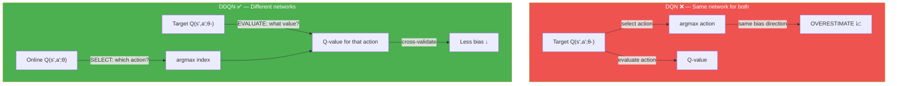

**ဘာကြောင့် online → select, target → evaluate ဆိုတဲ့ ordering ပိုကောင်းသလဲ?**
- Online network ဖြင့် select: Latest knowledge ဖြင့် best action ကို identify
- Target network ဖြင့် evaluate: Frozen, stable values ဖြင့် estimate → stability ✅
- Reversed (target select, online evaluate) ဆိုရင် values are from online (changing every step) → unstable!

---

### Python Code — DDQN

```python
class DDQN:
    def optimize_model(self, experiences):
        states, actions, rewards, next_states, is_terminals = experiences
        batch_size = len(is_terminals)
        
        # === DDQN: Action SELECTION from ONLINE network ===
        # Online network → "Which action is best in s'?"
        argmax_a_q_sp = self.online_model(next_states).max(1)[1]
        # Note: .max(1)[1] returns indices (argmax), not values. No need to detach.
        
        # === DDQN: Action EVALUATION from TARGET network ===
        # Target network → "What is the value of that action?"
        q_sp = self.target_model(next_states).detach()  # frozen target
        max_a_q_sp = q_sp[np.arange(batch_size), argmax_a_q_sp]  # index by online's choice
        max_a_q_sp = max_a_q_sp.unsqueeze(1)
        max_a_q_sp *= (1 - is_terminals)   # terminal states → 0
        
        # === TD target using cross-validated values ===
        target_q_sa = rewards + (self.gamma * max_a_q_sp)
        
        # === Current Q-values from ONLINE network (gradient here) ===
        q_sa = self.online_model(states).gather(1, actions)
        td_error = q_sa - target_q_sa
        value_loss = td_error.pow(2).mul(0.5).mean()
        
        # === Optimize ONLINE network ===
        self.optimizer.zero_grad()
        value_loss.backward()        
        self.optimizer.step()
    
    def interaction_step(self, state, env):
        """Online network ဖြင့် action select (same as DQN)"""
        action = self.training_strategy.select_action(
            self.online_model, state)  # online network
        new_state, reward, is_terminal, _ = env.step(action)
        return new_state, is_terminal
    
    def update_network(self):
        """Target network ကို periodically sync (same as DQN)"""
        for target, online in zip(
                self.target_model.parameters(),
                self.online_model.parameters()):
            target.data.copy_(online.data)  # θ- ← θ
```

**Code ရှင်းလင်းချက်:**
1. `online_model(next_states).max(1)[1]` — online network ကနေ argmax action INDEX ကို ရယူ (no detach needed — indices not differentiable)
2. `target_model(next_states).detach()` — target network ကနေ Q-values ကို frozen ဖြင့် ရယူ
3. `q_sp[np.arange(batch_size), argmax_a_q_sp]` — online's recommended action index ဖြင့် target's Q-value ကို index
4. Remaining steps: DQN နှင့် identical (TD target → loss → optimize → update)
5. **Key difference from DQN:** Line 1 = `online_model` not `target_model` for argmax!

**DDQN ၏ History:**

**0001 A Bit of History:**
Double DQN ကို 2015 ခုနှစ်တွင် **Hado van Hasselt** က introduce ပြုလုပ်ပါတယ် (Nature DQN ၏ shortly after)!

- **2010:** Hado သည် tabular RL ၌ **double Q-learning** algorithm ကို author ပြုလုပ် (Chapter 6 မှ algorithm!)
- **2015:** DQN ကို function approximation ဖြင့် double learning extend = **DDQN**
- 2015 တွင် Atari domain ၌ **state-of-the-art** results ရရှိ
- Hado = University of Utrecht (Netherlands) PhD in AI/RL → Google DeepMind research scientist

---

## ₉.₆ — Loss Functions: MSE မှ Huber ဆီ

### ₉.₆.₁ — Loss Function Types

RL တွင် loss function ရွေးချယ်မှုသည် important ဖြစ်ပါတယ် — targets uncertain ဖြစ်ပြီး agents incorrect early ဖြစ်မည်ဟု expect ပြုလုပ်ပါတယ်:

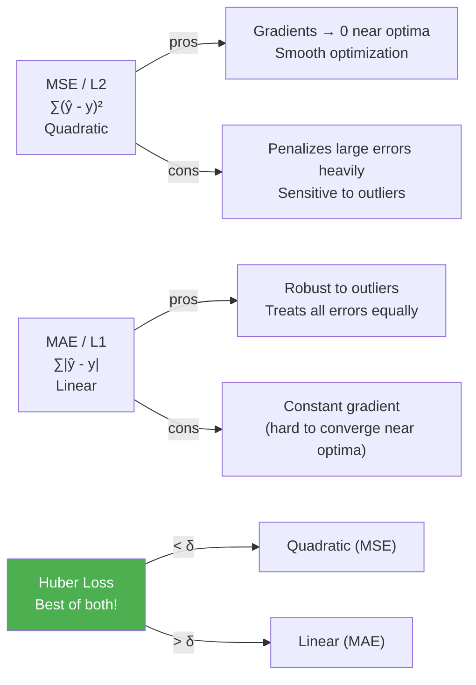

**Loss function formal definitions:**

$$\mathcal{L}_{MSE}(\theta) = \frac{1}{N}\sum_i (Q(s_i,a_i;\theta) - y_i)^2$$

$$\mathcal{L}_{MAE}(\theta) = \frac{1}{N}\sum_i |Q(s_i,a_i;\theta) - y_i|$$

$$\mathcal{L}_{Huber}(\theta) = \frac{1}{N}\sum_i \begin{cases} \frac{1}{2}(Q - y)^2 & \text{if } |Q - y| \leq \delta \\ \delta \cdot (|Q - y| - \frac{1}{2}\delta) & \text{if } |Q - y| > \delta \end{cases}$$

**RL တွင် Huber Loss ပိုကောင်းသည့် အကြောင်း:**

| Aspect | RL ၌ Impact |
|---|---|
| **Large errors early in training** | Expected! Agent မသိတဲ့ states များ ← Robust to outliers (MAE behavior) လိုပါတယ် |
| **Near-optimal late in training** | Fine-grained updates လိုပါတယ် ← Quadratic gradients (MSE behavior) ကောင်း |
| **Moving targets** | Aggressive gradient ကို avoid ဖို့ outlier robustness လိုပါတယ် |

**δ hyperparameter:**
- δ → 0: MAE ဖြစ်သွားပါတယ်
- δ → ∞: MSE ဖြစ်သွားပါတယ်
- Typical: δ = 1

### ₉.₆.₂ — Gradient Clipping Implementation

**Practical approach:** MSE loss ကို calculate ပြီး gradients ကို clip ပြုလုပ်ပါတယ်:

```python
def optimize_model(self, experiences):
    states, actions, rewards, next_states, is_terminals = experiences
    batch_size = len(is_terminals)
    
    # === DDQN targets (same as before) ===
    argmax_a_q_sp = self.online_model(next_states).max(1)[1]
    q_sp = self.target_model(next_states).detach()
    max_a_q_sp = q_sp[np.arange(batch_size), argmax_a_q_sp]
    max_a_q_sp = max_a_q_sp.unsqueeze(1)
    max_a_q_sp *= (1 - is_terminals)
    target_q_sa = rewards + (self.gamma * max_a_q_sp)
    q_sa = self.online_model(states).gather(1, actions)
    
    # === Calculate MSE loss ===
    td_error = q_sa - target_q_sa
    value_loss = td_error.pow(2).mul(0.5).mean()
    
    # === Backpropagation ===
    self.optimizer.zero_grad()
    value_loss.backward()
    
    # === Gradient Clipping (Huber loss equivalent) ===
    # max_gradient_norm = float('inf') → effectively MSE (no clipping)
    # max_gradient_norm = 1.0 → clip gradients above magnitude 1
    torch.nn.utils.clip_grad_norm_(
        self.online_model.parameters(),
        self.max_gradient_norm)   # ← hyperparameter: how aggressively to clip
    
    self.optimizer.step()
```

**Code ရှင်းလင်းချက်:**
1. MSE loss ကို calculate (`td_error.pow(2).mul(0.5).mean()`)
2. `.backward()` ဖြင့် gradients compute
3. `clip_grad_norm_` — gradient magnitude ကို `max_gradient_norm` ကျော်ပါက clip
4. DDQN experiments မှာ: `max_gradient_norm = float('inf')` → effectively MSE (no clipping)
5. Challenging environments မှာ: `max_gradient_norm = 1.0` → gradient clipping active

> ⚠️ **Reward Clipping vs Gradient Clipping vs Q-value Clipping:**
> - **Reward clipping:** Rewards ကို clip (e.g., [-1, 1] range) — different!
> - **Gradient clipping:** Gradient magnitudes ကို clip ← ဒါကို DDQN သုံး
> - **Q-value clipping:** Q-values ကို clip — **mistake!** မပြုလုပ်ပါနှင့်

---

## ₉.₇ — Full DDQN Algorithm Summary

### DDQN ၏ Components

| Component | DQN | DDQN |
|---|---|---|
| **Value function** | $Q(s, a; \theta)$ | $Q(s, a; \theta)$ |
| **Architecture** | 4 → 512 → 128 → 2 | 4 → 512 → 128 → 2 |
| **Target** | Off-policy TD (same network) | Off-policy TD (cross-validated) |
| **Action selection** | Target network | **Online network** |
| **Action evaluation** | Target network | Target network |
| **Loss** | MSE | Adjustable Huber (effectively MSE) |
| **Optimizer** | RMSprop, lr=0.0005 | RMSprop, **lr=0.0007** |
| **Exploration** | Exp decay ε (1.0→0.3) | Exp decay ε (1.0→0.3) |
| **Replay buffer** | 50k, batch=64 | 50k, batch=64 |
| **Target update** | Every 15 steps | Every 15 steps |

> ⚠️ **LR difference:** DDQN မှာ higher LR (0.0007) work ပါတယ် — double learning ကြောင့် more stable ဖြစ်တဲ့အတွက်! DQN မှာ 0.0007 ဖြင့် test ပြုလုပ်ရင် some seeds fail။

**DDQN Gradient Update (Math):**

$$\theta \leftarrow \theta + \alpha \nabla_\theta \mathbb{E}_{(s,a,r,s') \sim U(D)} \left[ \left( r + \gamma Q\!\left(s', \arg\max_{a'} Q(s',a';\theta);\ \theta^- \right) - Q(s,a;\theta) \right)^2 \right]$$

- Experienes sampled uniformly from buffer $D$
- Online weights $\theta$ → action selection
- Target weights $\theta^-$ → action evaluation

---

## ₉.₈ — ဆက်လက်တိုးတက်နိုင်သောနေရာများ (What's Next)

DDQN သည် strong algorithm ဖြစ်ပြီး Atari games များတွင် superhuman performance ရနိုင်ပါတယ်! ဒါပေမယ့် still improvements ရနိုင်ပါသေးတယ်:

### ₉.₈.₁ — Network Architecture Improvement

Current: State-in, values-out (naive Q-function representation)

**Observation:** Q-values ္ state $s$ ၌ actions အားလုံးသည် **same state** ကနေ indexed ဖြစ်ပါတယ်:

$$Q(s, 0) \text{ နှင့် } Q(s, 1) \text{ သည် same } V(s) \text{ ပေါ်မှာ depend ပါတယ်!}$$

**Question:** Q(s, 0) ကနေ Q(s, 1) အကြောင်း learn နိုင်မည်လား?

**Answer:** Chapter 10 ၌ **Dueling Network Architecture** — $V(s)$ နှင့် $A(s,a)$ ကို separately learn ပြုလုပ်ပြီး $Q(s,a) = V(s) + A(s,a)$ ဟု decompose ပြုလုပ်မည်!

### ₉.₈.₂ — Experience Replay Sampling Improvement

Current: Uniform random sampling from replay buffer

**Observation:** Humans replay **important experiences** more — unexpected successes/failures!

**Question:** All samples equal importance ဖြင့် treat ပြုလုပ်တာ optimal ဖြစ်မည်လား?

**Answer:** Chapter 10 ၌ **Prioritized Experience Replay (PER)** — larger TD errors ရှိသော experiences ကို more frequently sample ပြုလုပ်မည်!

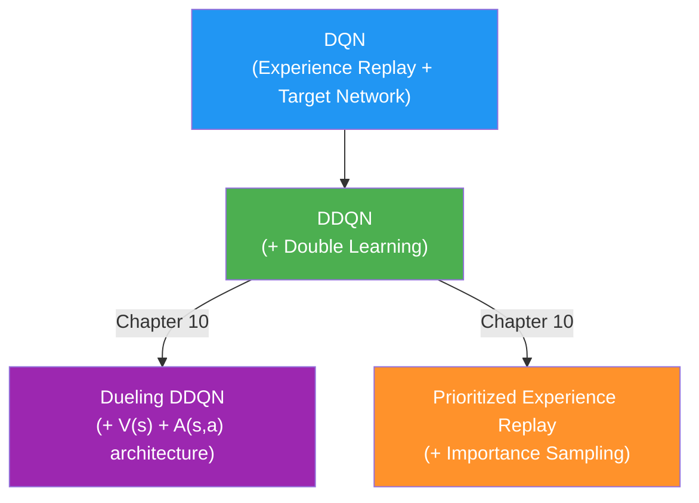

---

## ₉.₉ — Key Equations Summary

| Equation | Formula |
|---|---|
| **DQN TD target** | $y = r + \gamma \max_{a'} Q(s', a'; \theta^-)$ |
| **DDQN TD target** | $y = r + \gamma Q(s', \arg\max_{a'} Q(s',a';\theta); \theta^-)$ |
| **MSE Loss** | $\mathcal{L} = \frac{1}{N}\sum_i (Q(s_i,a_i;\theta) - y_i)^2$ |
| **Huber Loss** | $= \frac{1}{2}(Q-y)^2$ if $\|Q-y\|\leq\delta$ else $\delta(\|Q-y\|-\frac{\delta}{2})$ |
| **Target update** | $\theta^- \leftarrow \theta$ (every C steps, hard copy) |
| **Softmax action** | $P(a\|s) = \frac{e^{Q(s,a)/\tau}}{\sum_{a'} e^{Q(s,a')/\tau}}$ |
| **Replay buffer** | $D = \{e_1, \ldots, e_M\}$, sample $e_i \sim U(D)$ |

---

## ₉.၁၀ — Algorithm Performance Comparison

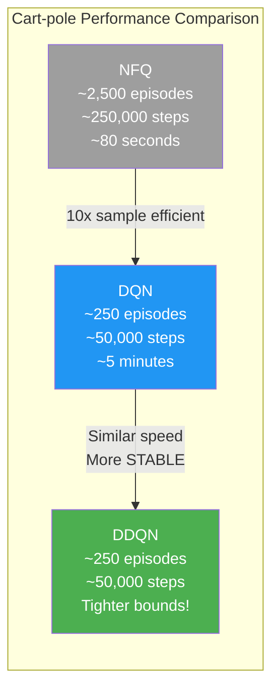

**Performance Summary:**
- **Sample Efficiency:** DDQN ≈ DQN > NFQ (10x improvement)
- **Stability:** DDQN > DQN > NFQ (tighter performance bounds)
- **Speed:** DQN ≈ DDQN ≈ 5 minutes (similar wall-clock time)
- **Consistency across seeds:** DDQN best (narrowest min-max bounds)

---

## ₉.11 — နိဂုံးချုပ်

ဒီ chapter မှာ value-based deep RL methods ကို significantly ပိုတည်ငြိမ်အောင် ဆောင်ရွက်ရာ techniques မျိုးစုံကို learn ပြုလုပ်ခဲ့ပါတယ်:

**သင်ယူခဲ့သည်များ:**

| Technique | Problem Solved | Method |
|---|---|---|
| **Experience Replay** | Data NOT IID | Store & uniformly sample from buffer |
| **Target Network** | Non-stationary targets | Freeze weights for C steps |
| **Double Learning** | Overestimation bias | Separate action select/evaluation |
| **Huber/Grad Clipping** | Large early errors | Linear loss for outliers, quadratic near-zero |
| **Decaying ε-greedy** | Exploration balance | High ε early (explore), low ε later (exploit) |

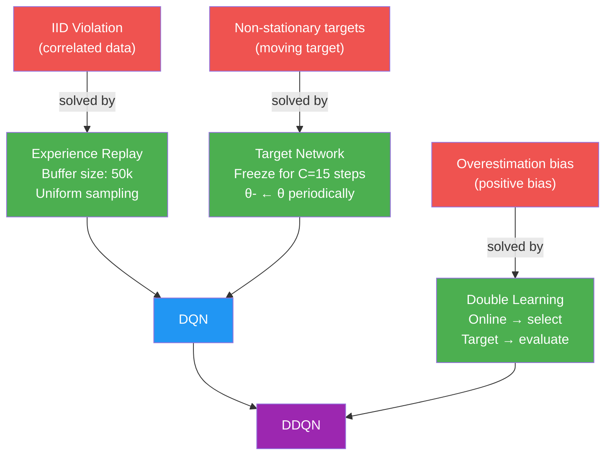

**Chapter 10 Preview:**
- **Dueling DDQN** — $Q(s,a) = V(s) + A(s,a)$ ကို explicitly model ပြုလုပ်တဲ့ smarter architecture
- **Prioritized Experience Replay (PER)** — Important experiences ကို more frequently sample ပြုလုပ် → sample efficiency ↑
- → **Sample-efficient value-based methods!**

> 💡 **Deadly Triad ကို သတိပြုပါ:**
> Neural networks + Bootstrapping (TD) + Off-policy learning = **potentially unstable combination**!
> DQN/DDQN ၏ techniques တွေက ဒီ instability ကို practical ဖြစ်အောင် mitigate ပြုလုပ်တဲ့ engineering solutions ဖြစ်ပါတယ်။
>
