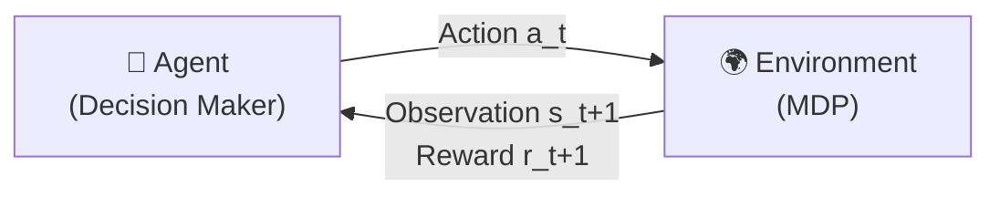
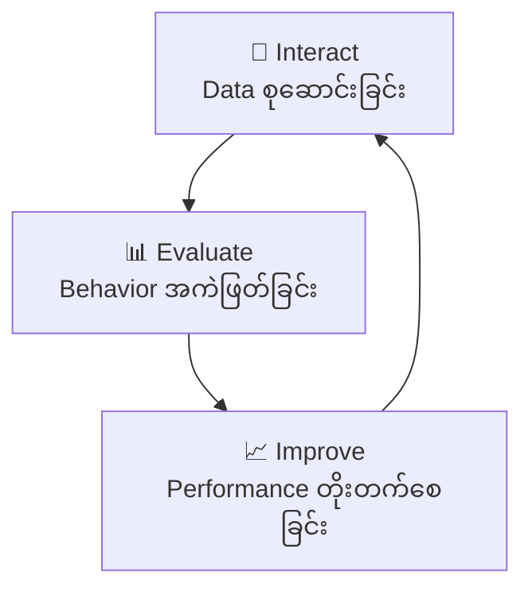
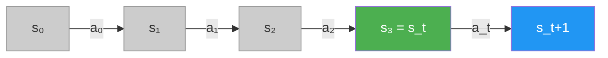
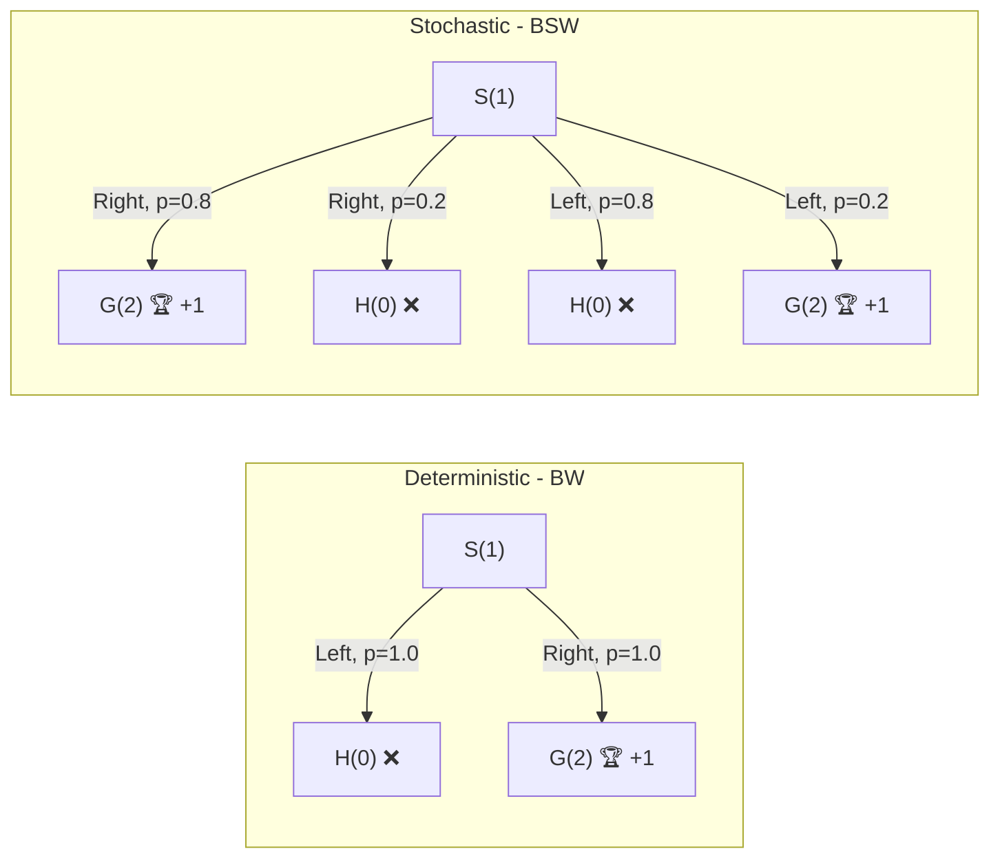
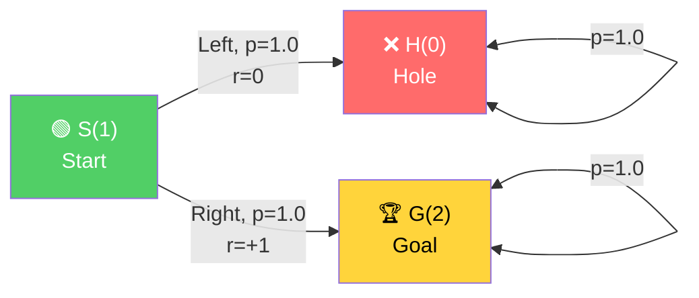
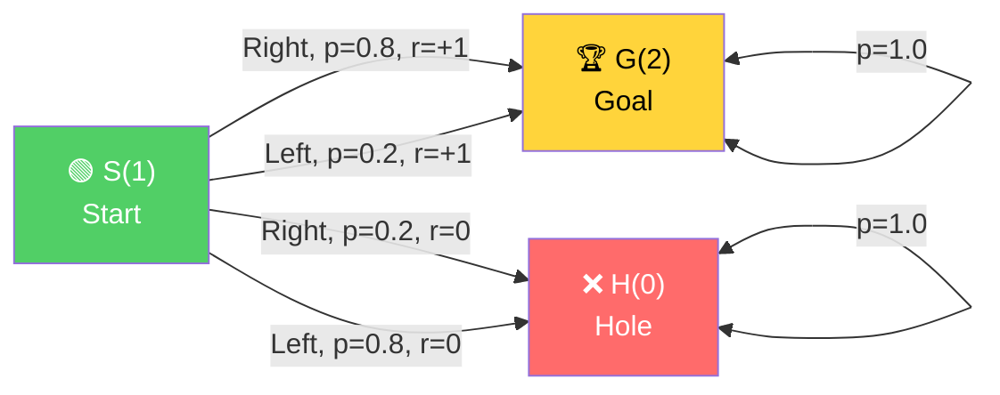
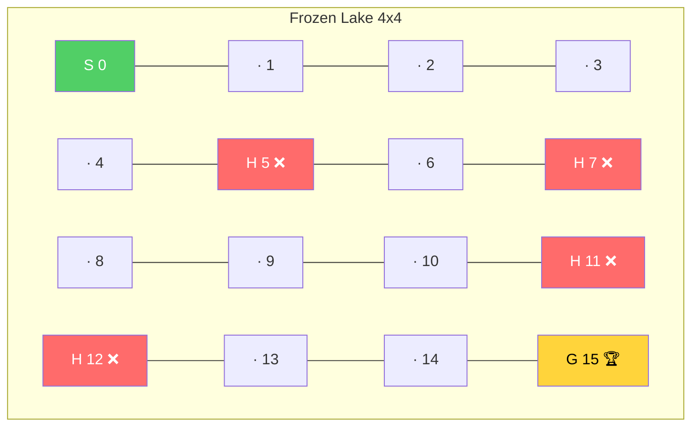
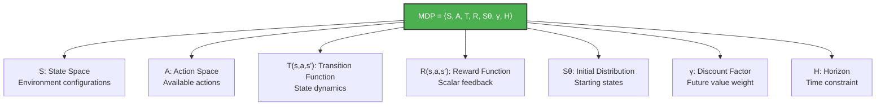

# Chapter 2: Mathematical Foundations of Reinforcement Learning - အကျဉ်းချုပ်

## 1. Complex Sequential Decision-Making Under Uncertainty

RL ပြဿနာတွေကို နားလည်ဖို့ စကားလုံး (၃) လုံးကို သိထားရပါမယ်:

- **Complex** — Agent တွေက vast state/action spaces ထဲမှာ သင်ယူရပါတယ်။ **Sampled feedback** ကနေ generalize လုပ်ရတာ စိန်ခေါ်မှုဖြစ်ပါတယ်။
- **Sequential** — Action တွေရဲ့ consequences တွေက delayed ဖြစ်နိုင်ပါတယ်။ Credit assignment ကို **sequential feedback** ကနေ လုပ်ရတာ ခက်ခဲပါတယ်။
- **Uncertainty** — World ရဲ့ inner workings ကို မသိတဲ့အတွက် exploration လိုအပ်ပါတယ်။ Exploration-exploitation balance ကို **evaluative feedback** ကနေ ရှာရပါတယ်။

ဒီပြဿနာတွေကို **Markov Decision Processes (MDPs)** ဆိုတဲ့ mathematical framework နဲ့ model လုပ်ပါတယ်။

---

## 2. RL ရဲ့ အဓိက Components (၂) ခု

### Agent (Decision Maker)
- Agent ဆိုတာ decision-making code ကို ဆိုလိုပါတယ်။ Robot arm ကိုယ်တိုင် agent မဟုတ်ပါ — decision ချတဲ့ code ပဲ agent ဖြစ်ပါတယ်။
- Agent တိုင်းမှာ step (၃) ခု ရှိပါတယ်:
  1. **Interact** — Environment နဲ့ interact လုပ်ပြီး data စုဆောင်းခြင်း
  2. **Evaluate** — လက်ရှိ behavior ကို အကဲဖြတ်ခြင်း
  3. **Improve** — Inner components တွေကို ပြုပြင်ပြီး performance တိုးတက်စေခြင်း

### Environment (Everything Else)
- Agent ပြင်ပက အရာအားလုံးက environment ဖြစ်ပါတယ် — robot arm, network latency, motor noise အားလုံး environment ထဲပါပါတယ်။
- Environment ကို **MDP** framework နဲ့ represent လုပ်ပါတယ်။

### RL Interaction Cycle

$$\text{Agent} \xrightarrow{\text{Action}} \text{Environment} \xrightarrow{\text{Observation, Reward}} \text{Agent} \xrightarrow{\text{Action}} \cdots$$



### Agent ရဲ့ Internal Process



---

## 3. Markov Decision Process (MDP) ရဲ့ Components များ

MDP ကို အောက်ပါ components တွေနဲ့ ဖွဲ့စည်းပါတယ်:

$$\text{MDP} = \langle S, A, T, R, S_\theta, \gamma, H \rangle$$

| Component | အဓိပ္ပာယ် |
|---|---|
| $S$ | **State Space** — ဖြစ်နိုင်တဲ့ state အားလုံးရဲ့ set |
| $A$ | **Action Space** — ဖြစ်နိုင်တဲ့ action အားလုံးရဲ့ set |
| $T$ | **Transition Function** — State-action pair ကနေ next state ကို probability mapping |
| $R$ | **Reward Function** — Transition ကို scalar reward mapping |
| $S_\theta$ | **Initial State Distribution** — Starting state probability |
| $\gamma$ | **Discount Factor** — Future reward ရဲ့ present value ကို ချိန်ညှိတဲ့ factor |
| $H$ | **Horizon** — Task ရဲ့ time step limit |

---

## 4. State Space: Environment ရဲ့ Configuration

- **State** ဆိုတာ environment ရဲ့ unique configuration တစ်ခုဖြစ်ပါတယ်။
- **State space** $S^+$ ကို finite (FrozenLake: 16 states) သို့မဟုတ် infinite (continuous variables) ဖြစ်နိုင်ပါတယ်။
- State ကို ဖွဲ့စည်းတဲ့ variables set ကတော့ finite ဖြစ်ရပါမယ်။
- **State vs Observation** — State က environment ရဲ့ true configuration ဖြစ်ပြီး observation က agent မြင်ရတာဖြစ်ပါတယ်။ MDP မှာ state = observation ဖြစ်ပြီး POMDP မှာ observation ≠ state ဖြစ်နိုင်ပါတယ်။

### Terminal States
- Terminal state ဆိုတာ episode ပြီးဆုံးတဲ့ state ဖြစ်ပါတယ်။
- Terminal state ရဲ့ action အားလုံးက probability 1 နဲ့ သူ့ကိုယ်သူ ပြန် transition လုပ်ပြီး reward 0 ပေးရပါတယ်။

### Markov Property

$$P(s_{t+1} | s_t, a_t) = P(s_{t+1} | s_0, a_0, s_1, a_1, \ldots, s_t, a_t)$$

Next state ရဲ့ probability ကို current state နဲ့ action ကနေပဲ ဆုံးဖြတ်နိုင်ပါတယ်။ History (အရင် states/actions) မလိုအပ်ပါ။ ဒါကို **Markov property** (memoryless property) လို့ ခေါ်ပါတယ်။



> 💡 $s_{t+1}$ ကို ဆုံးဖြတ်ဖို့ $s_t$ နဲ့ $a_t$ ပဲ လိုပါတယ်။ $s_0, a_0, \ldots$ history မလိုပါ။

---

## 5. Action Space: Environment ကို Influence လုပ်တဲ့ Mechanism

- Action space $A(s)$ ဆိုတာ state $s$ မှာ ရှိတဲ့ actions set ဖြစ်ပါတယ်။
- **Discrete actions** — FrozenLake: Left(0), Down(1), Right(2), Up(3)
- **Continuous actions** — ဥပမာ steering angle, acceleration force
- Agent က action ကို deterministic (lookup table) သို့မဟုတ် stochastic (probability distribution) နဲ့ ရွေးချယ်နိုင်ပါတယ်။

---

## 6. Transition Function: Action ရဲ့ Consequences

$$T(s, a, s') = P(s_{t} = s' | s_{t-1} = s, a_{t-1} = a)$$

- State $s$ မှာ action $a$ ယူပြီးရင် state $s'$ ကို ရောက်မယ့် probability ကို ပေးပါတယ်။
- **Deterministic** — BW environment: Left action $\rightarrow$ 100% left ကို သွားမယ်
- **Stochastic** — FrozenLake: 33.3% ချီ intended direction + 33.3% ချီ orthogonal directions ၂ ခု
- Probability distribution ဖြစ်တဲ့အတွက်: $\sum_{s' \in S^+} T(s, a, s') = 1$
- **Stationarity assumption** — Transition probabilities သည် training/evaluation တစ်လျှောက် ပြောင်းလဲခြင်း မရှိသင့်ပါ။

### Deterministic vs Stochastic Transition ပုံ



---

## 7. Reward Function: Carrots and Sticks

$$R(s, a, s') \rightarrow \mathbb{R}$$

- Transition tuple $(s, a, s')$ ကို scalar reward value mapping ပေးပါတယ်။
- **Positive reward** — Income/reward (goal ရောက်ရင် +1)
- **Negative reward** — Cost/penalty (time step cost: -1)
- Reward function ကို explicit form $R(s,a,s')$, $R(s,a)$ သို့မဟုတ် $R(s)$ အဖြစ် ရေးနိုင်ပါတယ်။
- FrozenLake: State 15 (Goal) ကို ရောက်ရင် +1, ကျန်အားလုံး 0

---

## 8. Horizon နှင့် Episode

| Task အမျိုးအစား | ဖော်ပြချက် |
|---|---|
| **Episodic task** | Terminal state ရှိတဲ့ finite time step task |
| **Continuing task** | Terminal state မရှိဘဲ forever ဆက်လုပ်ရတဲ့ task |
| **Greedy horizon** | Planning horizon = 1 (Bandit environments) |
| **Finite horizon** | ကြိုတင်သတ်မှတ်ထားတဲ့ time step limit |
| **Infinite horizon** | Time limit မရှိ (ဒါပေမယ့် terminal state ရောက်ရင် ရပ်နိုင်) |
| **Indefinite horizon** | Infinite horizon + episodic (most common in RL) |

- **Episode** ဆိုတာ initial state ကနေ terminal state ထိ consecutive time steps sequence ဖြစ်ပါတယ်။

---

## 9. Discount Factor ($\gamma$): Future ကို အဘယ်မှာ တန်ဖိုးထားမလဲ

$$G_t = R_{t+1} + \gamma R_{t+2} + \gamma^2 R_{t+3} + \cdots = \sum_{k=0}^{\infty} \gamma^k R_{t+k+1}$$

| Gamma တန်ဖိုး | Behavior | ဥပမာ |
|---|---|---|
| $\gamma = 0$ | Myopic/Greedy — immediate reward ပဲ ဂရုစိုက် | $G_t = R_{t+1}$ |
| $\gamma = 0.5$ | Future reward ကို 50% ချီ discount | $G_t = R_{t+1} + 0.5R_{t+2} + 0.25R_{t+3} + \cdots$ |
| $\gamma = 0.99$ | Future reward ကို almost equal တန်ဖိုးထား | BW, FL environments |
| $\gamma = 1$ | No discounting (finite horizon only) | $G_t = R_{t+1} + R_{t+2} + R_{t+3} + \cdots$ |

Discount factor ရဲ့ ရည်ရွယ်ချက်များ:
1. Infinite sums converge ဖြစ်စေခြင်း
2. Future uncertainty ကို ထည့်သွင်းစဉ်းစားခြင်း
3. Variance reduction
4. Agent ကို urgency ခံစားစေခြင်း

### Discount Effect Visualization

$$\text{Value of +1 reward at time } k = \gamma^k \cdot (+1)$$

| Time step $k$ | $\gamma = 0.5$ | $\gamma = 0.9$ | $\gamma = 0.99$ |
|---|---|---|---|
| 0 | 1.000 | 1.000 | 1.000 |
| 5 | 0.031 | 0.590 | 0.951 |
| 10 | 0.001 | 0.349 | 0.904 |
| 50 | ≈ 0 | 0.005 | 0.605 |
| 100 | ≈ 0 | ≈ 0 | 0.366 |

### Recursive Definition of Return

$$G_t = R_{t+1} + \gamma G_{t+1}$$

---

## 10. Concrete Environment Examples

### Bandit Walk (BW) — Deterministic



- States: 3 ($|S^+| = 3$), Actions: $A = \{\text{Left}(0), \text{Right}(1)\}$
- Transition: Deterministic — $T(1, \text{Right}, 2) = 1.0$
- Reward: $R(1, \text{Right}, 2) = +1$, ကျန်အားလုံး $0$

### Bandit Slippery Walk (BSW) — Stochastic



- BW နဲ့ တူတယ်, ဒါပေမယ့် **slippery surface** ရှိပါတယ်
- $T(1, \text{Right}, 2) = 0.8$, $T(1, \text{Right}, 0) = 0.2$

### Frozen Lake (FL) — 4x4 Grid



- States: $|S^+| = 16$ (4×4 grid), Actions: $A = \{\text{Left}, \text{Down}, \text{Right}, \text{Up}\}$
- Stochastic transitions: $T(s, a, s_{\text{intended}}) = \frac{1}{3}$, $T(s, a, s_{\text{orthogonal}}) = \frac{1}{3}$ each
- Terminal states: $S_{\text{terminal}} = \{5, 7, 11, 12, 15\}$
- Reward: $R(\cdot, \cdot, 15) = +1$, ကျန်အားလုံး $0$

---

## 11. MDP Extensions

| Extension | ဖော်ပြချက် |
|---|---|
| **POMDP** | Agent က environment state ကို partially observe ပဲ လုပ်နိုင်ခြင်း |
| **FMDP** | Transition/reward function ကို compact ဖော်ပြခြင်း |
| **Continuous MDP** | Time, action, state တွေ continuous ဖြစ်ခြင်း |
| **RMDP** | Probabilistic + relational knowledge ပေါင်းစပ်ခြင်း |
| **SMDP** | Multiple time steps ကြာတဲ့ abstract actions |
| **MMDP** | Multiple agents တစ်ပြိုင်နက် interact ခြင်း |
| **Dec-MDP** | Multiple agents collaborate ပြီး common reward maximize ခြင်း |

### MDP vs POMDP

$$\text{MDP} = \langle S, A, T, R, S_\theta, \gamma, H \rangle$$

$$\text{POMDP} = \langle S, A, T, R, S_\theta, \gamma, H, O, E \rangle$$

POMDP မှာ observation space $O$ နဲ့ emission probability $E$ (state ပေါ်မူတည်ပြီး observation ပေးတဲ့ probability) ထပ်ပါပါတယ်။

---

## 12. Python MDP Representation

MDP ကို Python dictionary အဖြစ် ဖော်ပြပါတယ်:

```python
P = {
    state: {
        action: [(probability, next_state, reward, done), ...]
    }
}
```

- **probability** — Transition probability
- **next_state** — ရောက်မယ့် state
- **reward** — ရမယ့် reward
- **done** — Next state က terminal ဟုတ်/မဟုတ် (Boolean)

OpenAI Gym framework က initial state distribution, discount factor, horizon စတာတွေကို internally handle ပါတယ်။

---

## 13. နိဂုံးချုပ်

> RL ပြဿနာက agent နဲ့ environment ရဲ့ interaction ဖြစ်ပြီး MDP framework ကို အသုံးပြု၍ virtually any complex sequential decision-making problem ကို model လုပ်နိုင်ပါတယ်။

### MDP Components Overview



### Chapter 2 Key Equations

| Equation | Formula |
|---|---|
| MDP Definition | $\langle S, A, T, R, S_\theta, \gamma, H \rangle$ |
| Transition Function | $T(s,a,s') = P(s_t = s' \mid s_{t-1} = s, a_{t-1} = a)$ |
| Probability Constraint | $\sum_{s'} T(s, a, s') = 1, \; \forall s, a$ |
| Reward Function | $R(s, a, s') \rightarrow \mathbb{R}$ |
| Markov Property | $P(s_{t+1} \mid s_t, a_t) = P(s_{t+1} \mid h_t, s_t, a_t)$ |
| Discounted Return | $G_t = \sum_{k=0}^{\infty} \gamma^k R_{t+k+1}$ |
| Recursive Return | $G_t = R_{t+1} + \gamma G_{t+1}$ |
| POMDP Extension | $\langle S, A, T, R, S_\theta, \gamma, H, O, E \rangle$ |

Chapter 3 ကနေစပြီး agent ရဲ့ inner workings (policy, value functions, planning algorithms) တွေကို လေ့လာသွားပါမယ်။
